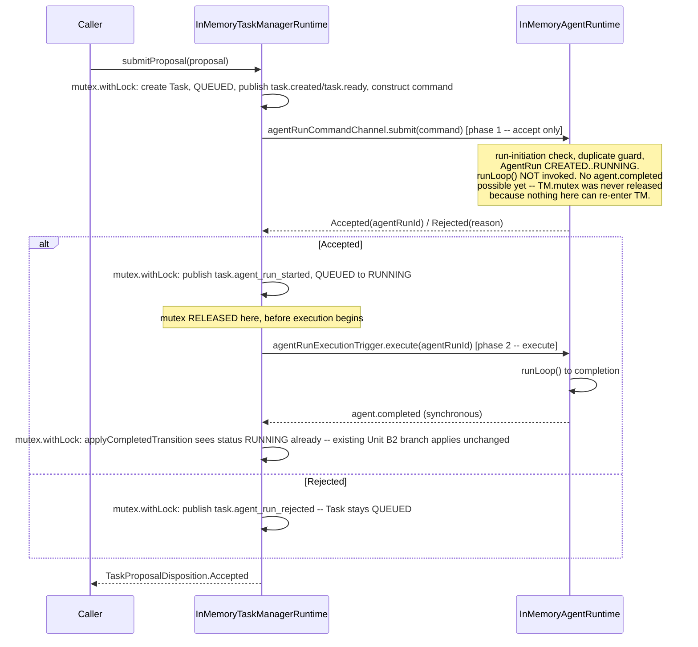
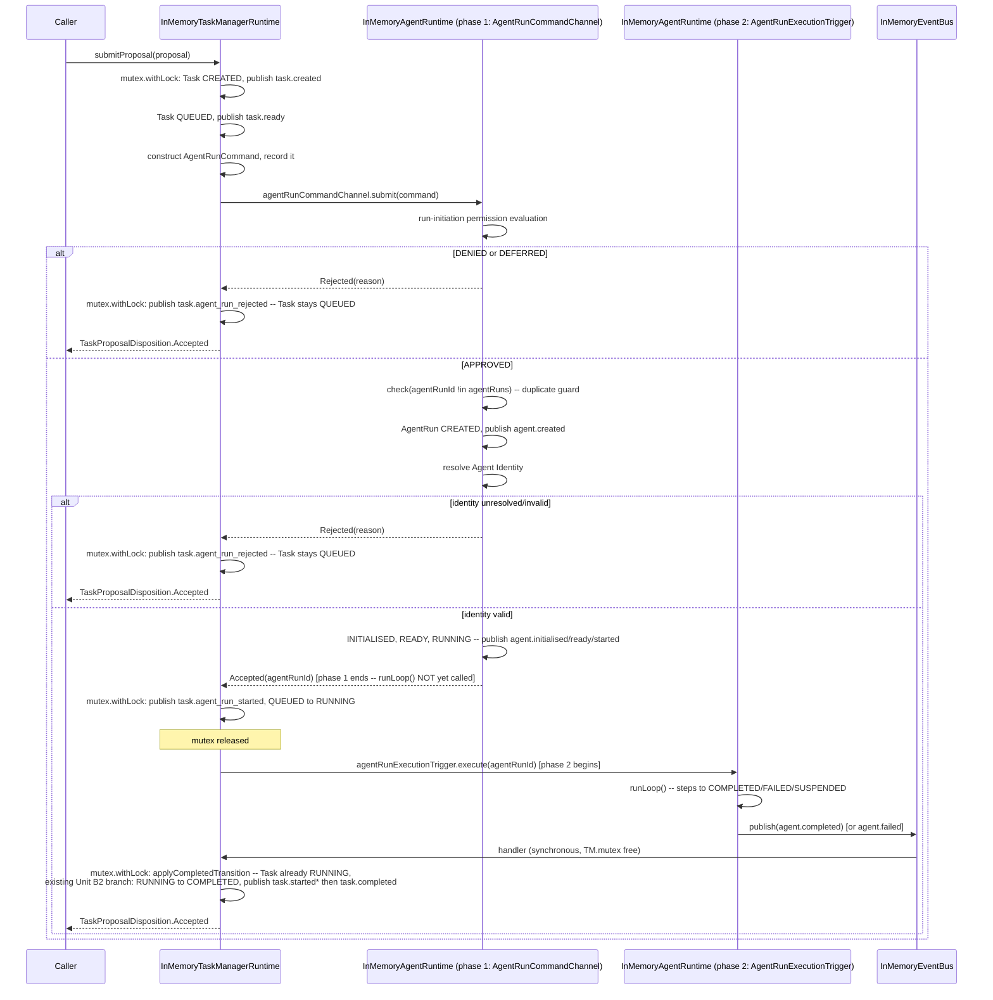

# Controlled Agent Run Submission — Acceptance/Execution Separation Reconciliation

**Status:** Second, narrowly scoped read-only design reconciliation. No
source file modified. No Governance Review, Contract Design, or Scope Lock
edited. Nothing staged, committed, or pushed.

**Supersedes, on the ordering question only:** the recommendation in
`docs/architecture/CONTROLLED_AGENT_RUN_SUBMISSION_DEADLOCK_DESIGN_RECONCILIATION.md`
("Option A"). That document's root-cause analysis (§1 of that document) is
unaffected and is treated here as established fact. Its Option A is rejected
here on the specific ground that it lets `task.agent_run_started` observably
follow `task.completed`/`agent.completed`, which turns the event from a
start notification into a retrospective acknowledgement — an externally
observable semantics change, not a documentation nuance.

---

## 1. The invariant that rules Option A out

```
task.agent_run_started
```

must be published only after START has genuinely been accepted, but
strictly **before** `agent.completed`/`task.completed` for that same run.

No amount of relocating *when inside `submitProposal()` the mutex is held*
can satisfy this, because the single call
`agentRunCommandChannel.submit(command)` **is** `InMemoryAgentRuntime.start()`
running the entire multi-step loop to a terminal or suspended state before
returning (established in the first reconciliation, §1). Whatever
`submitProposal()` does with its own locking, it cannot learn "Accepted" —
and therefore cannot correctly publish `task.agent_run_started` — until that
entire loop has already finished. Any fix that keeps `submit()` as a single,
atomic, all-or-nothing call inherits this ordering problem unconditionally.
This is why this reconciliation asks the harder question directly: **does
Controlled Agent Run Submission require separating acceptance from
execution as two distinct moments, not just two differently-locked sections
of one method?**

---

## 2. Non-negotiable invariants, restated as a checklist used below

| # | Invariant |
|---|---|
| 1 | No `AgentRun` record before run-initiation permission acceptance |
| 2 | Duplicate START protection remains authoritative (owned by `InMemoryAgentRuntime`) |
| 3 | Rejected START leaves the Task `QUEUED` |
| 4 | No terminal Task can regress to `RUNNING` |
| 5 | No mutex held across a synchronous callback that reacquires it |
| 6 | `task.agent_run_started` precedes the corresponding terminal Agent and Task events |
| 7 | Event order is deterministic in tests |
| 8 | Shutdown cannot leave uncontrolled background work |
| 9 | No `task.agent_run_started` for a rejected START |

---

## 3. Option 1 — Two-phase Agent Runtime operation

Split `InMemoryAgentRuntime.start()` at the point immediately after `RUNNING`
is reached (`agent.started` published) and immediately before `runLoop()` is
invoked (`InMemoryAgentRuntime.kt:274-280`, current code). Everything before
that point — run-initiation evaluation, the `check(agentRunId !in agentRuns)`
duplicate guard, `AgentRun` creation, `CREATED → INITIALISED → READY →
RUNNING` — becomes **phase 1 (accept)**. `runLoop()` itself becomes
**phase 2 (execute)**.

### 3.1 What this requires

- **`AgentRunCommandChannel.submit()`'s documented meaning changes for
  `START`.** `Accepted` no longer means "the run was authorized and has
  finished" (its current, frozen, KDoc'd meaning) — it means "the run was
  authorized, the `AgentRun` record exists, and it is at `RUNNING`; the step
  loop has not yet executed." The method's *signature* need not change, but
  its *contract* does — this is a real semantic change to a frozen contract,
  not an internal implementation detail.
- **A second, narrow, additional interface is needed** — e.g.
  `AgentRunExecutionTrigger` with one method,
  `suspend fun execute(agentRunId: AgentRunId)` — implemented by
  `InMemoryAgentRuntime` alongside `AgentRunCommandChannel`, injected into
  `InMemoryTaskManagerRuntime` as a second constructor dependency. This is
  the "separate executor responsibility" the task explicitly asked to be
  assessed, chosen over (a) changing `AgentRunCommandChannel`'s own method
  signature — which would force every hypothetical future implementer of
  that interface to model both phases even if they never need to — and over
  (b) a callback threaded through `AgentRunCommand` — see §4's rejection of
  that shape.
- `InMemoryTaskManagerRuntime.submitProposal()`'s flow becomes:



### 3.2 Assessment against every invariant

| # | Result |
|---|---|
| 1 | Unchanged — permission evaluation and the check-and-insert into `agentRuns` still happen entirely inside phase 1, before any record exists |
| 2 | Unchanged — `check(agentRunId !in agentRuns)` still lives entirely inside phase 1, still owned by `InMemoryAgentRuntime` |
| 3 | Unchanged — Rejected is returned entirely within phase 1; phase 2 is never invoked on this branch, so no `agent.*`/`task.*` event beyond `task.agent_run_rejected` can fire |
| 4 | Satisfied by construction, not by a defensive re-read: by the time `agent.completed` can possibly fire, the Task Manager has *already* transitioned the Task to `RUNNING` in phase 1's own follow-up. `applyCompletedTransition`'s pre-existing `TaskStatus.RUNNING` branch (Unit B2, unchanged) applies exactly as designed — no new idempotency guard is needed, because the ordering is now real, not merely assumed |
| 5 | Satisfied — `TM.mutex` is released before phase 2 is invoked; phase 1 alone can never trigger `agent.completed` (it never reaches `runLoop()`), so holding `TM.mutex` across phase 1 is safe with zero reentrancy risk |
| 6 | **Satisfied genuinely, not by disclosure** — `task.agent_run_started` is published between phase 1 returning and phase 2 being invoked, unconditionally before any terminal event can exist |
| 7 | Satisfied — phase 2 is still a plain, direct suspend call on the same coroutine; nothing is backgrounded, no scheduler-dependent interleaving is introduced |
| 8 | Satisfied — no new coroutine scope, no new background work; shutdown semantics are untouched because nothing outlives the calling coroutine |
| 9 | Satisfied — `task.agent_run_started` is published only in the `Accepted` branch, exactly as today |

**Every invariant is satisfied by construction**, not by documentation or a
defensive check. This is the only option analysed here with that property.

### 3.3 Cost

- `InMemoryAgentRuntime.kt`: `start()` split into two methods; a new
  interface implemented.
- `InMemoryTaskManagerRuntime.kt`: second constructor dependency; restructured
  `submitProposal()`.
- `ParkerRuntime.kt`: wire the second dependency (same object,
  `InMemoryAgentRuntime`, implementing both interfaces — one extra
  constructor argument at one call site).
- **Test ripple, and this is the real cost:** every existing test that calls
  `InMemoryAgentRuntime.submit(startCommand())` directly and asserts
  completion immediately afterward —
  `InMemoryAgentRuntimeTest.kt` (the bulk of the file, predating this
  milestone), `EventCollectorTest.kt`, `RuntimeLifecycleEventPublicationTest.kt`,
  `VerticalSliceEndToEndTest.kt` — would need a second call
  (`.execute(agentRunId)`) added wherever they currently rely on `submit()`
  alone to reach a terminal state. This is materially larger than the first
  reconciliation's Option A, which touched exactly one production file and
  one test's assertion.
- An unavoidable duplication risk: `submit()`'s own KDoc and Contract
  Design's existing "accepted and rejected submission flows" section both
  currently describe `Accepted` as "the run finished." Both need correction,
  and that correction is substantive, not editorial — it changes what a
  reader of either document would expect to observe.

---

## 4. Option 2 — Acceptance callback before execution

A callback (e.g. `onAccepted: suspend (AgentRunId) -> Unit`, threaded
through `submit()`'s signature or `AgentRunCommand` itself) invoked by
`start()` after reaching `RUNNING` but before calling `runLoop()`. The
Task Manager's callback would publish `task.agent_run_started` and
transition the Task from inside that hook.

### 4.1 Assessment

- **Mutex ownership / re-entrancy:** the callback is invoked while
  `InMemoryAgentRuntime`'s own `mutex` is *not* held (each of its
  `withLock` blocks is already short-lived and released) — so no `AR.mutex`
  risk. But for the callback to safely acquire `TM.mutex`, `submitProposal()`
  must *not* still be holding `TM.mutex` when it calls `submit()` — which
  means Option 2 only works at all if it is layered on top of Option A's
  "release before calling submit()" restructuring in the first place. It is
  not a standalone alternative to Option 1; it is Option A plus an extra
  hook.
- **Does the callback itself create re-entrancy risk?** Only if implemented
  carelessly (e.g., if `TM.mutex` were still held at the call site) —
  avoidable, but fragile: correctness now depends on a caller-supplied
  closure being invoked at exactly the right, undocumented moment inside
  someone else's suspend function, with no type-level guarantee it will only
  ever be called once, in the right place, with the right state visible.
- **Contract cleanliness:** poor. `AgentRunCommandChannel` is a general
  "submit a command, get a result" abstraction (Contract Design's own
  framing). Threading a function-typed hook through it (or through the
  otherwise-plain-data `AgentRunCommand`) to solve one specific caller's
  internal lock-management problem leaks an implementation detail into a
  contract every future implementer of that interface would have to know
  about and honor correctly, even if they have no locking concern of their
  own. This is a worse contract shape than Option 1's separate, narrow,
  optional second interface.
- **Callback failure / inconsistency risk — the concrete new hazard Option 1
  does not have:** if the callback throws (for any reason — a bug, an
  unexpected exception in Task Manager's own bookkeeping), the exception
  propagates out of `start()` *before* `runLoop()` ever runs. The result: an
  `AgentRun` record already exists at `RUNNING`, permanently, with no step
  ever attempted and no path back to `COMPLETED`/`FAILED` — an orphaned
  record — while `submit()` itself throws instead of returning cleanly,
  meaning `submitProposal()` also throws instead of returning a disposition.
  Option 1 has no equivalent failure mode: phase 1 and phase 2 are two
  ordinary suspend calls with ordinary, independent failure handling: if the
  second call is never reached, the caller unambiguously knows a run was
  accepted but never triggered, from Task Manager's own explicit code, not
  from an exception escaping someone else's internal callback invocation.

**Verdict: not recommended.** It reaches the same place as Option 1 for
strictly worse contract hygiene and a new, real failure mode Option 1 does
not have. The task specified not to recommend it merely for being small;
having assessed it, it is not even the smaller of the two once the "must be
layered on Option A anyway" cost and the failure-mode risk are counted.

---

## 5. Option 3 — Explicit, structured asynchronous submission

Distinguished from the first reconciliation's Option B (fire-and-forget) by
requiring `InMemoryAgentRuntime` to own a genuine, structured
`CoroutineScope` — a `SupervisorJob`-backed scope, injected or owned at
construction, explicitly cancelled and joined by `ParkerRuntime.shutdown()`
— and to return a completion handle (e.g. a `Deferred<AgentRun>`) rather
than either blocking until done (today) or discarding the handle entirely
(Option B).

### 5.1 Assessment

- **Exact lifecycle:** `start()` would launch `runLoop()` on the owned scope
  and return `Accepted(agentRunId)` immediately after reaching `RUNNING`,
  handing back (or making separately retrievable) a `Deferred` the caller
  *may* await. `ParkerRuntime.shutdown()` would need to cancel the scope's
  `Job` and `join()` it before declaring itself `STOPPED` — new lifecycle
  logic `ParkerRuntime.kt` does not have today for any component.
- **Testing implications:** better than Option B's naive fire-and-forget —
  `kotlinx-coroutines-test` provides `TestScope.backgroundScope` precisely
  for launching child work that the test's own `runTest` can still track and
  drain deterministically via `advanceUntilIdle()`. Determinism is
  achievable, but only by threading a `TestScope`/`TestDispatcher` through
  `InMemoryAgentRuntime`'s construction in every test — a real, non-trivial
  rewrite of the same test files Option 1 touches, *plus* the scope
  machinery itself.
- **Shutdown safety:** achievable, but requires designing and implementing
  drain-on-shutdown semantics `ParkerRuntime.kt` has never needed before for
  any other component — this milestone's Scope Lock authorizes wiring
  changes to `ParkerRuntime.kt`, not lifecycle redesign.
- This is, honestly, the architecturally "correct" long-run shape for a
  Runtime whose name is Agent *Runtime* — a real agent run should not block
  its own acceptance on its own completion. But it is strictly larger than
  Option 1 (adds scope ownership and shutdown-lifecycle work on top of the
  same interface/contract change Option 1 already requires) for no
  additional invariant satisfied that Option 1 does not already satisfy.

**Verdict: not recommended for this reconciliation.** Recorded as the
legitimate long-term direction, same status as the first reconciliation's
Option C — a future Governance Review's decision, not this one's.

---

## 6. Option 4 — Milestone boundary correction

Stop Controlled Agent Run Submission at controlled **acceptance**: Task
Manager submits `START`, receives `Accepted`/`Rejected` from a
permission-gated, duplicate-protected, record-creating phase-1-only
operation, publishes `task.agent_run_started`/`task.agent_run_rejected` and
transitions the Task accordingly — and stops there. Actually **executing**
the accepted run (triggering `runLoop()`) is treated as out of this
milestone's scope, deferred to a separate, subsequently governed unit.

### 6.1 Assessment

- **Did the original milestone improperly combine two concerns?** Yes — on
  reflection this is the clearest way to state what §1 and §3 above already
  demonstrate structurally. "Cognition proposes, Trust authorises, Runtime
  executes" names three distinct actors and, implicitly, three distinct
  moments. The original Scope Lock treated `InMemoryAgentRuntime.start()`'s
  pre-existing, Sprint-3-inherited "authorize *and* run to completion, as
  one atomic call" behavior as a given rather than as a decision this
  milestone needed to examine — because until this milestone, nothing ever
  called it from inside another component's own lock. The moment something
  did, the conflation became load-bearing and wrong.
- **What ships if Option 4 is chosen:** a real, correctly-ordered,
  correctly-authorized "proposal becomes an accepted, `RUNNING` Agent Run
  Task record" — but the Agent Run itself never actually executes a step
  under the production, Task-Manager-driven path until a follow-up unit adds
  the trigger. This is a genuine, disclosed functional gap, not a silent
  regression — no code path today executes an Agent Run via
  `InMemoryTaskManagerRuntime` at all (that is this milestone's entire
  reason for existing), so nothing regresses; the vertical slice simply
  stops one step short of where it was originally scoped to reach.
- **Cost relative to Option 1:** smaller in one sense (no
  `AgentRunExecutionTrigger` interface, no phase-2 call site in
  `submitProposal()`, no test updates for execution-triggering behavior this
  cycle) and identical in another (the phase-1/phase-2 split inside
  `InMemoryAgentRuntime.start()` still has to happen — you cannot stop at
  "acceptance" without first defining where acceptance ends, which is
  exactly §3's split). Option 4 is really "implement Option 1's phase 1
  only, and govern phase 2's triggering mechanism separately" — it does not
  avoid the Contract Design-level change; it only avoids also deciding, in
  this cycle, whether phase 2 is triggered synchronously (Option 1's
  approach) or asynchronously (Option 3's).

**Verdict: a legitimate, more conservative alternative to Option 1** — same
phase-1 implementation, but with phase 2's trigger explicitly deferred
rather than decided now. Whether to take this over completing Option 1's
synchronous phase-2 trigger in the same cycle is a scope-tolerance judgment
call, not a correctness one — both are correct; they differ in how much
change this cycle absorbs.

---

## 7. Required conclusion

**Yes — the original Scope Lock's assumption that
`AgentRunCommandChannel.submit()` could mean both "accept START" and "run
synchronously to completion" was architecturally invalid.** Not merely
inconvenient: it makes invariant 6 impossible to satisfy for any correction
that leaves `submit()` as a single, atomic, non-decomposable call, no matter
how its caller manages locking around it (§1). The deadlock and the ordering
defect are two symptoms of the same conflation, not two unrelated bugs. This
was latent in the pre-existing `InMemoryAgentRuntime.start()` contract
(Sprint 3, Track C, Unit C2) and became load-bearing, for the first time,
only because this milestone is the first thing that ever called `submit()`
from inside another component's own held lock and relied on its return value
to sequence an externally observable event.

---

## 8. Recommendation

**Option 1** (two-phase split via a new, narrow `AgentRunExecutionTrigger`
interface, phase 2 triggered synchronously and immediately by
`InMemoryTaskManagerRuntime` right after publishing `task.agent_run_started`
and transitioning the Task) is the recommended correction. It is the only
option that satisfies every invariant in §2 by construction rather than by
disclosure or a defensive re-check, without introducing coroutine-scope
ownership, shutdown-lifecycle redesign, or a leaky callback contract.

**Option 4 is offered as the explicit fallback** if the reviewer judges even
Option 1's contract-semantics change too large to absorb in this
reconciliation cycle. It requires the identical phase-1 implementation and
differs only in whether phase 2's trigger ships now (Option 1) or is
deferred to its own governed unit (Option 4).

Option 2 is not recommended (worse contract hygiene and a new failure mode
than Option 1, for no invariant gained). Option 3 is not recommended for
this reconciliation (strictly larger than Option 1, no invariant gained
beyond what Option 1 already satisfies) but is recorded as the legitimate
long-run direction.

### 8.1 Recommended corrected lifecycle — full sequence



\* `task.started` is published by the pre-existing `RUNNING` branch only if
the Task's stored status equals exactly `QUEUED` at that moment (Unit B2's
`when` on `task.status`); since phase 1's own follow-up has already moved it
to `RUNNING`, only the `TaskStatus.RUNNING` branch fires, which publishes
`task.completed` alone — matching Unit B2's own pre-existing, unchanged
distinction between a Task reached via direct `agentRuntime.submit()` (which
still uses the two-edge `QUEUED` branch, unaffected by anything in this
document) and one reached via the new, Task-Manager-driven path.

### 8.2 Affected contracts, files, tests, and governance documents

**Contracts (Contract-Design level):**
- `AgentRunCommandChannel`'s documented meaning of `Accepted` for `START`,
  in the interface's own KDoc and in Contract Design's "accepted and
  rejected submission flows" section: redefined from "authorized and
  finished" to "authorized, record created, `RUNNING`."
- New interface: `AgentRunExecutionTrigger` (name indicative, not final) —
  one method, `suspend fun execute(agentRunId: AgentRunId)`.

**Production files:**
- `src/runtime/InMemoryAgentRuntime.kt` — split `start()` at the
  `RUNNING`/`runLoop()` boundary; implement the new interface.
- `src/runtime/InMemoryTaskManagerRuntime.kt` — second constructor
  dependency; `submitProposal()` restructured per §8.1.
- `src/composition/ParkerRuntime.kt` — wire the second dependency (same
  `InMemoryAgentRuntime` instance, one extra constructor argument).

**Tests requiring behavioral (not just signature) updates:**
- `tests/runtime/InMemoryAgentRuntimeTest.kt` — every test currently
  calling `submit(startCommand())` and asserting terminal state immediately
  needs an added `.execute(agentRunId)` call.
- `tests/runtime/EventCollectorTest.kt`,
  `tests/runtime/RuntimeLifecycleEventPublicationTest.kt`,
  `tests/runtime/VerticalSliceEndToEndTest.kt` — same pattern, plus (already
  separately agreed) the `SPRINT_1_EVENT_TYPES` fixture fix.
- `tests/runtime/TaskManagerAgentRunSubmissionIntegrationTest.kt` — accepted
  flow's event-order assertion now has a genuine, invariant-6-satisfying
  order to assert, not a disclosed anomaly.
- `tests/runtime/InMemoryTaskManagerRuntimeTest.kt` — its fake
  `AgentRunCommandChannel`-based tests are unaffected in structure but will
  need a corresponding fake for the new second interface.

**Governance documents:**
- Contract Design: new section (or amendment) defining the two-phase
  operation, the new interface, and the corrected meaning of `Accepted`.
- Scope Lock: Section 1 (sequence), Section 4 (constructor dependencies —
  now needs the second interface named), Section 6 (event ordering — no
  longer needs a disclosed-anomaly footnote; states the true, invariant-6-
  satisfying order instead), Section 8 (file boundary — add the two test
  files' behavioral-update scope explicitly), Section 11 (test obligations
  — add the new interface's own test coverage).

### 8.3 Honest classification

**Contract Design Amendment.** Not a clarification (the meaning of a
frozen result value changes, and a new interface is introduced — nothing
here was "already implied" by the approved documents). Not a mere Scope
Lock amendment (Scope Lock amendments correct or extend *implementation*
detail within an unchanged contract; this changes the contract itself: what
`AgentRunCommandResult.Accepted` means for `START`, and the shape of what
`InMemoryTaskManagerRuntime` depends on). Not a new governed implementation
unit in the full sense of a fresh Governance Review from first principles —
the constitutional analysis, the permission model, the duplicate-protection
ownership, and the sole-submitter decision are all unchanged and remain
correct; only the shape of "accept vs. execute" needs a decision, which a
Contract Design Amendment is the right-sized instrument for.

If Option 4 is chosen instead of completing phase 2's trigger in this same
cycle, the same Contract Design Amendment is still required for phase 1
alone; only the "trigger phase 2 synchronously, now" clause is deferred, to
be decided by whatever governs the follow-up unit.

---

## 9. What this document does not do

No source file has been modified. No existing governance document has been
edited. Nothing has been staged, committed, or pushed. Implementation awaits
an explicit choice between completing Option 1's phase-2 trigger in this
cycle or taking Option 4's more conservative boundary, followed by the
Contract Design Amendment both require.
