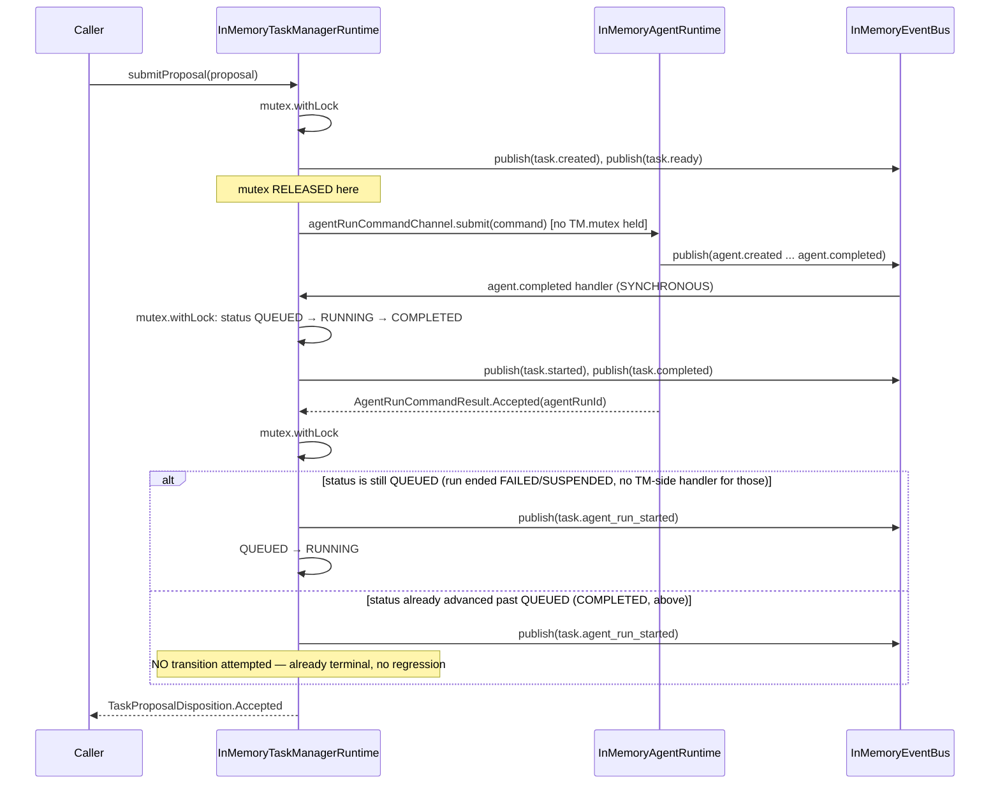
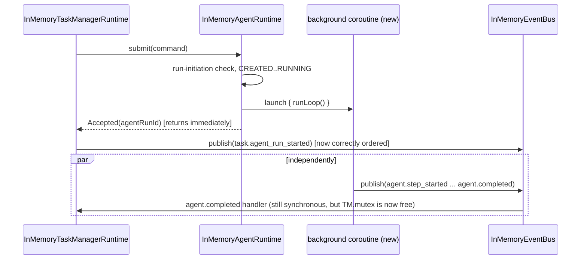
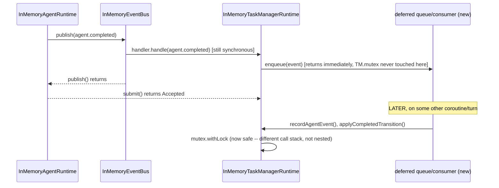

# Controlled Agent Run Submission — Deadlock Design Reconciliation

**Status:** Read-only analysis. No source file modified. No governance document
amended. Nothing staged, committed, or pushed.

> **SUPERSEDED — Option A (§7) is REJECTED, not approved.** Reviewed and
> rejected: Option A lets `task.agent_run_started` observably follow
> `agent.completed`/`task.completed` for a run that completes synchronously,
> which changes the event's effective meaning from a start notification to a
> retrospective acknowledgement — an externally observable semantics change,
> not an acceptable documentation nuance. **§1–§6 (root-cause analysis and
> the four-option survey) remain accurate and are carried forward as
> established fact.** The recommendation in §7 and the amendment sketch in
> §7.1 do not apply. The authoritative continuation of this analysis, and the
> source of the approved correction, is
> `docs/architecture/CONTROLLED_AGENT_RUN_SUBMISSION_ACCEPTANCE_EXECUTION_SEPARATION_RECONCILIATION.md`,
> whose Option 1 (two-phase acceptance/execution separation) is approved and
> is being implemented via a Contract Design Amendment.

**Trigger:** Native Verification (`.\gradlew.bat test`) surfaced a genuine
production defect —
`kotlinx.coroutines.test.UncompletedCoroutinesError` in
`TaskManagerAgentRunSubmissionIntegrationTest.kt`'s "accepted flow" test —
under the approved rollback discipline (Scope Lock Section 14). This document
performs the required design reconciliation before any correction is made.

**Authoritative inputs (read, not modified):**
`docs/architecture/CONTROLLED_AGENT_RUN_SUBMISSION_GOVERNANCE_REVIEW.md`,
`docs/architecture/CONTROLLED_AGENT_RUN_SUBMISSION_CONTRACT_DESIGN.md`,
`docs/implementation/CONTROLLED_AGENT_RUN_SUBMISSION_SCOPE_LOCK.md`,
`src/runtime/InMemoryTaskManagerRuntime.kt`, `src/runtime/InMemoryAgentRuntime.kt`,
`src/runtime/InMemoryEventBus.kt`.

---

## 1. Root cause, precisely

Two facts, each independently correct and each already true of this codebase
**before** this milestone, combine for the first time because this milestone
is the first thing that ever nests one inside the other on the same call
stack:

1. `InMemoryTaskManagerRuntime.submitProposal()` is a single
   `mutex.withLock { ... }` block, start to finish
   (`InMemoryTaskManagerRuntime.kt:269`). This milestone added
   `agentRunCommandChannel.submit(command)` (`:329`) inside that block.
2. `InMemoryAgentRuntime.start()` (Sprint 3, Track C, Unit C2 — unchanged by
   this milestone) runs its entire multi-step loop to a terminal or suspended
   state **before returning**, on the caller's own coroutine — it does not
   launch a background coroutine. `AgentRunCommandResult.Accepted` is
   constructed only after `runLoop()` returns (`InMemoryAgentRuntime.kt:280-281`).
3. `InMemoryEventBus.publish()` delivers to every subscriber synchronously,
   inline, in a `for` loop (`InMemoryEventBus.kt:110-118`) — it does not
   dispatch to a new coroutine either.
4. `InMemoryTaskManagerRuntime`'s own `init` block subscribes to
   `agent.completed` (`:260`), and that handler (`recordAgentEvent`,
   `applyCompletedTransition`) each do `mutex.withLock { ... }`
   (`:385`, `:406`) against the **same** `Mutex` instance `submitProposal()`
   is still holding.

Kotlin's `Mutex` is not reentrant. A coroutine that already holds a `Mutex`
and calls `withLock` on it again suspends waiting for a release that can only
happen when the outer block completes — which cannot happen, because
execution is nested inside it. This is a true self-deadlock, not a timing
race; it will reproduce on every run, every time, deterministically, whenever
a real (non-faked) `InMemoryAgentRuntime` completes a run synchronously
inside `submitProposal()`.

**This was always latent** in the approved design; it was invisible until now
because every other test uses a fake `AgentRunCommandChannel` that never
calls back into `InMemoryTaskManagerRuntime`'s own subscriptions. The one
integration test Scope Lock itself required (Section 11, item 4 — real
wiring, not fakes) is the only test capable of exposing it, and it did.

### 1.1 Current deadlock — sequence

```mermaid
sequenceDiagram
    participant Caller
    participant TM as InMemoryTaskManagerRuntime
    participant AR as InMemoryAgentRuntime
    participant Bus as InMemoryEventBus

    Caller->>TM: submitProposal(proposal)
    activate TM
    TM->>TM: mutex.withLock { ... } BEGINS
    TM->>Bus: publish(task.created)
    TM->>Bus: publish(task.ready)
    TM->>AR: agentRunCommandChannel.submit(command)
    activate AR
    AR->>AR: run-initiation check, CREATED, INITIALISED, READY, RUNNING
    AR->>Bus: publish(agent.created / initialised / ready / started)
    AR->>AR: runLoop() — steps to completion
    AR->>Bus: publish(agent.completed)
    activate Bus
    Bus->>TM: handler.handle(agent.completed)  [SYNCHRONOUS, same coroutine]
    activate TM
    TM->>TM: recordAgentEvent() → mutex.withLock { ... }
    Note over TM: mutex already held by the outer<br/>submitProposal() call on THIS coroutine.<br/>Mutex is non-reentrant → suspends forever.
    TM--xTM: DEADLOCK
    deactivate TM
    deactivate Bus
    Note over AR,Bus: publish() never returns to AR;<br/>AR.submit() never returns to TM;<br/>TM.submitProposal() never returns to Caller.
    deactivate AR
    deactivate TM
```

---

## 2. Constitutional requirements — restated as constraints on any fix

| # | Requirement | Currently satisfied by |
|---|---|---|
| 1 | No `AgentRun` record before run-initiation permission is accepted | `InMemoryAgentRuntime.start()`, lines 199-248 — untouched by any option below |
| 2 | Duplicate START protection owned by `InMemoryAgentRuntime` | `check(agentRunId !in agentRuns)`, `:241` — untouched by any option below |
| 3 | Task Manager is sole production START submitter | Composition wiring in `ParkerRuntime.kt` — untouched |
| 4 | START permission separate from per-action permission | Two independent `PermissionEngine` call sites — untouched |
| 5 | Rejected submission leaves Task `QUEUED` | Must be re-verified per option (see below) |
| 6 | Accepted submission must not regress a terminal Task to `RUNNING` | **Currently unverified — this is the new risk the deadlock was masking** |
| 7 | No mutex held across a synchronous callback that re-enters the same mutex | **Currently violated — this is the defect** |
| 8 | Event ordering explicitly defined, not accidental | **Currently undefined for the synchronous-completion case — see §3.1** |

---

## 3. Option A — Release the Task Manager mutex before `submit()`

Restructure `submitProposal()` into two lock sections: everything through
constructing and recording the `AgentRunCommand` stays under the first
`mutex.withLock`; `agentRunCommandChannel.submit(command)` runs **outside**
any `TM.mutex` acquisition; a second, short `mutex.withLock` re-reads the
Task's current status and applies the `Accepted`/`Rejected` consequences.



### 3.1 Assessment

- **Race conditions / duplicate proposal submission:** none introduced. The
  existing `check(taskId !in tasks)` guard, and the `tasks[taskId] = created`
  write that makes it effective, both happen inside the *first*, still-atomic
  lock section, before release. A second identical `TaskProposal` still fails
  fast, exactly as today.
- **Can `agent.completed` occur before `submit()` returns?** Yes — this is
  not new risk, it is `InMemoryAgentRuntime.start()`'s existing, unchanged,
  already-approved contract (§1 above). Option A's job is only to make sure
  `TM.mutex` is not held when that happens, which it now is not.
- **Would `task.agent_run_started` be published too late?** For a run that
  completes synchronously within its own `submit()` call, yes: it is
  published *after* `task.started`/`task.completed`, because `submit()`
  cannot return `Accepted` — and `submitProposal()` cannot know it was
  accepted, or learn the `agentRunId` the event's payload needs — until the
  run has already finished. **This is not introduced by Option A.** It was
  already true of the pre-deadlock code (which also waited for `submit()` to
  return before publishing `task.agent_run_started`); the deadlock simply
  prevented anyone from ever observing it. Requirement 8 asks that ordering
  be *explicitly defined*, not that it be chronologically intuitive — Option
  A satisfies the letter of that requirement only if this ordering is written
  down as a deliberate, disclosed consequence rather than left implicit. See
  §6.
- **Could `COMPLETED → RUNNING` regression occur?** Only if the
  `Accepted`-branch code blindly applies `QUEUED → RUNNING` without
  re-reading current status. The corrected design reads `tasks[taskId]`
  fresh under the second lock and only transitions if it is still `QUEUED`;
  a Task the synchronous `agent.completed` handler already advanced to
  `COMPLETED` is left untouched. `task.agent_run_started` is still published
  either way (Scope Lock Section 10 ties it to `Accepted`, not to a
  particular Task status), since the run genuinely was accepted and did
  start — only the *status transition* is guarded.
- **What state or reservation marker is needed?** None beyond what already
  exists. The presence of `tasks[taskId]` is already an effective
  reservation against a second identical proposal. The only new logic needed
  is the current-status-aware (rather than unconditional) transition in the
  `Accepted` branch — an idempotency check, not a new field or marker.
- **Rejected path:** unaffected. A `Rejected` result is returned by
  `InMemoryAgentRuntime.start()` either before any `AgentRun` record exists
  (permission denied/deferred) or after `agent.created` but before `RUNNING`
  (Agent Identity failure) — neither path ever publishes `agent.completed`
  or `agent.failed`, so the nested-reentrancy scenario never arises on this
  branch at all. The Task is provably still `QUEUED` when the second lock
  section reads it.

**Verdict: all named risks are resolved**, with one disclosed (not
eliminated) ordering characteristic that requires a documentation update,
not a design change.

---

## 4. Option B — `InMemoryAgentRuntime.submit()` acknowledges START before executing the run

`start()` would perform run-initiation approval, create the `AgentRun`
record, resolve identity, advance to `RUNNING`, return
`AgentRunCommandResult.Accepted` immediately — then continue `runLoop()`
separately (necessarily on a **new, backgrounded coroutine**, since nothing
else can make `runLoop()` keep progressing after the suspend function that
was driving it returns).



### 4.1 Assessment

- **Coroutine ownership:** `InMemoryAgentRuntime` currently owns no
  `CoroutineScope` — every suspension happens on the caller's own coroutine,
  by design (its class KDoc: "mutex... never held while
  `executionPipeline.submit` is in flight," but still on the calling
  coroutine, never a launched one). Backgrounding `runLoop()` requires
  injecting and owning a scope, with real questions this milestone has no
  answer for: who cancels it, what happens to an in-flight run when
  `ParkerRuntime.shutdown()` is called, how an unhandled exception inside the
  launched coroutine is surfaced instead of silently lost.
- **Lifecycle and shutdown consequences:** `ParkerRuntime` currently has no
  concept of "wait for in-flight Agent Runs to drain." A backgrounded
  `runLoop()` can outlive the runtime's own claimed `STOPPED` state, or throw
  into a cancelled scope, unless shutdown is redesigned to track and join
  these tasks — a change well outside `src/composition/ParkerRuntime.kt`'s
  approved touch points for this milestone.
- **Deterministic testing implications:** severe. Essentially every existing
  assertion of the shape "call `submit()`, then immediately assert
  `getAgentRun(id).status == COMPLETED`" — the bulk of
  `InMemoryAgentRuntimeTest.kt`, `RuntimeLifecycleEventPublicationTest.kt`,
  `EventCollectorTest.kt` — would stop being valid the instant `submit()`
  returns before the run finishes. Every one of those tests would need a new
  synchronization primitive (a join handle, `advanceUntilIdle()`, a
  completion `Deferred`) to keep working. None of those files are in this
  milestone's Scope Lock Section 8.
- **Duplicate protection:** unaffected in principle — the `check` still runs
  before `Accepted` is returned — but is no longer a guarantee about the
  *whole run*, only about acceptance, which is itself a semantic change to
  what "duplicate protection" has always meant in this codebase.
- **Too broad for this milestone:** yes. This changes
  `InMemoryAgentRuntime`'s fundamental execution model from
  "deterministic, synchronous stand-in" (an explicit, load-bearing property
  this whole Sprint's test suite relies on) to "fire-and-continue." That is
  a new architectural capability, not a corrective fix to a locking bug.

**Verdict: not recommended for this reconciliation.** A legitimate future
direction, but it is a new Governance Review's worth of decisions, not a
rollback correction.

---

## 5. Option C — Separate START acceptance from run execution at the contract level

A three-state split (`START accepted` / `execution begun` /
`execution completed`) as first-class, distinguishable outcomes on
`AgentRunCommandChannel`/`AgentRunCommandResult`.

### 5.1 Assessment

- This requires exactly the same backgrounded-execution machinery as Option
  B (a three-state split is meaningless if execution still runs to
  completion inside a single suspend call) — it inherits every coroutine
  ownership, shutdown, and test-determinism risk in §4 and adds a **contract
  change** on top: `AgentRunCommandResult` would need new variants (or a
  richer shape), and the event taxonomy would likely need a new
  `agent_run.execution_begun`-style event.
- `AgentRunCommandResult` is explicitly named in Scope Lock Section 14
  (Rollback Conditions) as a frozen contract whose modification means "this
  Scope Lock's own assumptions were wrong and must be revisited, not
  implemented around." Option C modifies it directly.
- **Constitutionally cleaner?** In the abstract, yes — a real, eventually-async
  Agent Runtime naturally has these three separable moments, and reporting
  Trust-gated authorization independently of how long execution takes is the
  architecturally "correct" long-run shape. But "cleaner in the limit" is not
  the test here; the test is whether it is the smallest correction that
  resolves a rollback-triggering defect within the current, frozen Scope
  Lock. It is not.
- **Requires a contract amendment:** yes, unambiguously — this is a new
  design decision, not a clarification or a narrow amendment.

**Verdict: correct direction, wrong milestone.** Recorded here as an
observation for a future Governance Review, not implemented.

---

## 6. Option D — Defer Task Manager lifecycle handling outside the synchronous event-delivery stack

`InMemoryTaskManagerRuntime`'s own `agent.completed`/`agent.failed`
subscription handlers would enqueue the event and return immediately,
with a separate consumer processing `recordAgentEvent`/
`applyCompletedTransition` later, off the nested call stack.



### 6.1 Assessment

- **Ordering effects:** `task.started`/`task.completed` would no longer be
  published at the same logical instant as `agent.completed` — they'd land
  at some later, scheduler-dependent point. `EventCollector`'s own KDoc
  documents the current, relied-upon property that `InMemoryEventBus`
  delivers "synchronous/sequential per publish call." Option D would make
  that true for every subscriber *except* `InMemoryTaskManagerRuntime`'s own
  two handlers — an asymmetric, subscriber-specific exception to an
  otherwise-uniform bus semantic.
- **Lifecycle ownership:** the same "who owns and drains this" question as
  Option B, just scoped to two event types instead of the whole run loop —
  smaller, but not zero.
- **Test determinism:** every test asserting `task.completed` fires
  immediately after `agentRuntime.submit()` returns would need an explicit
  drain/await step added.
- **Does this improperly change EventBus semantics?** Not the bus itself —
  the bus's own `publish()` stays synchronous for every subscriber — but it
  introduces a new, bus-adjacent "defer my own handling" pattern that has no
  precedent elsewhere in this codebase and would need its own justification
  independent of this reconciliation.
- Structurally, this **does** resolve the deadlock (the reentrant
  acquisition no longer happens on the same call stack), but it does so by
  moving the "narrow the critical section" work to the subscriber side
  instead of the caller side, for strictly more machinery and a new
  asymmetric-delivery semantic, to reach the same place Option A reaches
  with a same-file, same-method restructuring.

**Verdict: dominated by Option A** — same result, more invasive, new
semantic surface.

---

## 7. Recommendation

**Option A.** It is the only option that resolves the deadlock without
touching a frozen contract, without introducing backgrounded execution or
new coroutine-lifecycle ownership, without changing `InMemoryEventBus`
semantics, and without rippling into files outside Scope Lock Section 8's
already-permitted list. Every constitutional requirement in §2 is satisfied,
with one disclosed (not hidden) event-ordering characteristic that
already existed in the approved design and was merely never observed before
the deadlock masked it.

### 7.1 Smallest required amendments

- **Contract Design:** no change required. Its abstraction level does not
  specify mutex-holding scope or precise event interleaving.
- **Scope Lock:**
  - Section 1 ("exact revised sequence"): add that
    `InMemoryTaskManagerRuntime.submitProposal()` must not hold its own
    mutex while `agentRunCommandChannel.submit()` is in flight, and that the
    post-`submit()` status transition must re-read current Task status
    rather than assume `QUEUED` (idempotent/no-regression).
  - Section 6 ("exact accepted flow ordering"): correct the stated ordering
    to disclose that, for a run that completes within its own `submit()`
    call, `task.agent_run_started` is observed *after*
    `agent.*`/`execution.*`/`permission.*`/`task.started`/`task.completed`,
    not before — an already-true consequence of `InMemoryAgentRuntime`'s
    pre-existing synchronous contract, not a new behavior.
  - Section 10 (event payloads): a one-line note cross-referencing the same
    disclosure, so a future reader of the payload table isn't misled by
    table order into assuming publish order.
- **Production files:** `src/runtime/InMemoryTaskManagerRuntime.kt` only —
  restructure `submitProposal()`'s locking into the two sections described
  in §3. No other production file changes.
- **Tests:**
  - `tests/runtime/TaskManagerAgentRunSubmissionIntegrationTest.kt`'s
    "accepted flow" test: its event-order assertion (currently absent,
    since it never completed) will need to assert the real, now-observable
    order, matching the corrected Section 6 language.
  - `tests/runtime/InMemoryTaskManagerRuntimeTest.kt`'s existing
    `Accepted`-branch tests: unaffected — they use a fake
    `AgentRunCommandChannel` that never calls back into
    `agent.completed`, so they never exercised the nested path and need no
    change.
  - The two, already-agreed, separately-tracked `EventCollector.kt`
    fixture fixes (adding `task.agent_run_started`/`task.agent_run_rejected`
    to `SPRINT_1_EVENT_TYPES`) remain necessary regardless of which option is
    chosen here, and are unaffected by this reconciliation.

### 7.2 Classification

**A Scope Lock Amendment, not a mere clarification and not a new design
decision.** It does not add new capability, does not touch any frozen
contract, and does not change any externally-observable event's meaning or
payload — every event Scope Lock Section 10 defines is still published,
with the same payload, for the same reason. But it does add two genuinely
new pieces of frozen text that Section 1/6 did not previously state: the
mutex-scope rule for `submitProposal()`, and the idempotent/no-regression
rule for the post-`submit()` transition. Neither existed in any form before;
both are now load-bearing correctness rules. That crosses the line from
"the existing text already implied this" into "this needs to be written
down and approved," which is what a Scope Lock Amendment is for.

---

## 8. What this document does not do

No source file has been modified. No existing governance document has been
edited. Nothing has been staged, committed, or pushed. Implementation of
Option A — the `InMemoryTaskManagerRuntime.kt` restructuring, the Scope Lock
Section 1/6/10 amendment text, and the corrected integration-test assertion —
awaits explicit approval.
