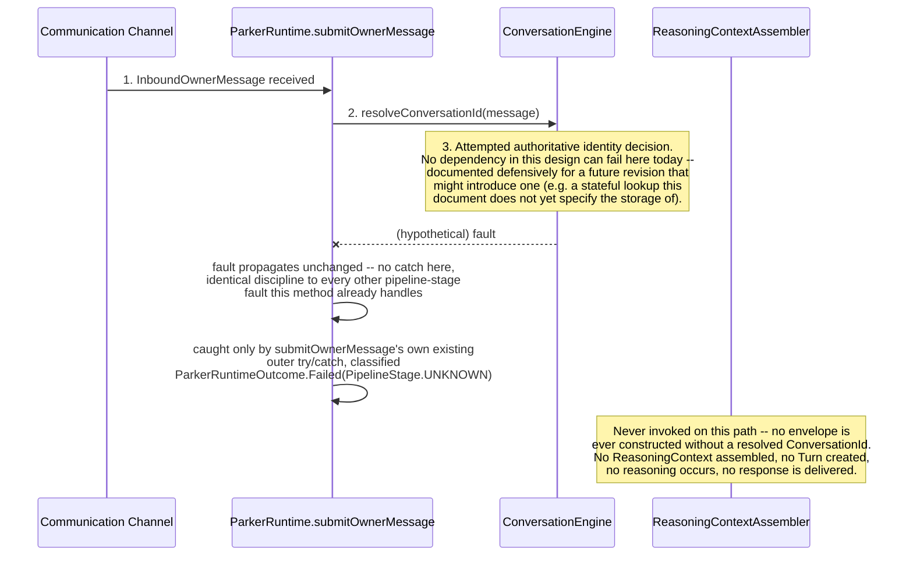
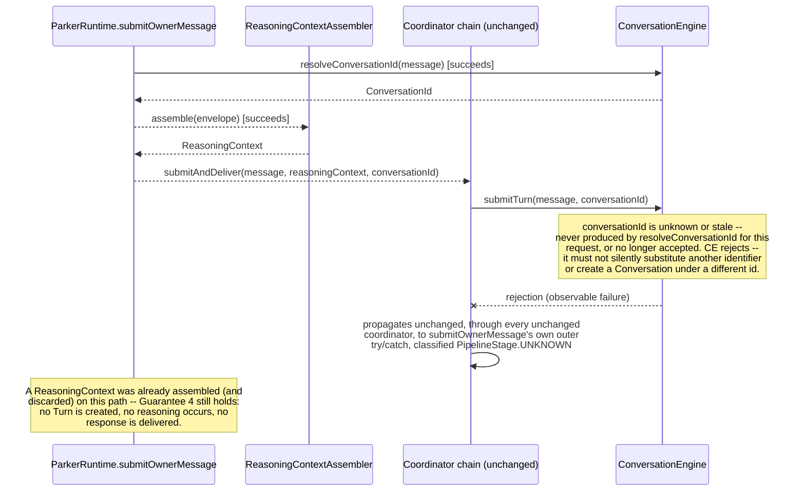

# Conversation Continuity and Pre-Turn Identity — Authoritative Sequence

## Status

**Revised following architectural review (Contract Authority and
Propagation Correction).** Companion to
`CONVERSATION_CONTINUITY_CONTRACT_DESIGN.md`, which this document does not
restate in full. The prior version of this document showed
`ConversationEngine.submitTurn` performing its own, internal recognition,
alongside an earlier, separate formula evaluation inside `ParkerRuntime` —
two evaluations of the same rule, trusted to agree. This revision shows
exactly one evaluation: `ConversationEngine.resolveConversationId`, called
once, early, with its result propagated unchanged through every later
step, including `ConversationEngine`'s own later `submitTurn` call. No
sequence below contains a second derivation or a second identity decision.
Prose and Mermaid only; no implementation pseudocode.

---

## 1. Legend

- **Solid arrow**: an existing, unchanged call.
- **Dashed arrow**: a call or parameter this Contract Design introduces or
  changes: `ParkerRuntime`'s call to `conversationEngine.resolveConversationId`;
  the `conversationId` parameter threaded through
  `ConversationReplyCoordinator`, `CommunicationConversationCoordinator`,
  and `ConversationTurnReasoningCoordinator`; and `submitTurn`'s own
  additive `conversationId` parameter.
- **One authoritative identity decision**: marks the single point, in
  every sequence, where continuity is recognised and a `ConversationId` is
  either reused or minted. This point exists exactly once per sequence.
- **Turn created here**: marks where `ConversationEngine.submitTurn`
  constructs a `Turn`, always using the identifier already decided above —
  never re-deciding it.

---

## 2. Continuing-Conversation Sequence

```mermaid
sequenceDiagram
    participant Channel as Communication Channel
    participant Runtime as ParkerRuntime.submitOwnerMessage
    participant CE as ConversationEngine
    participant Assembler as ReasoningContextAssembler
    participant CRC as ConversationReplyCoordinator
    participant CCC as CommunicationConversationCoordinator
    participant CTRC as ConversationTurnReasoningCoordinator
    participant RP as ReasoningProvider

    Channel->>Runtime: 1. InboundOwnerMessage received
    Runtime->>CE: 2. resolveConversationId(message) [continuity key: channelId, senderPrincipalId]
    Note over CE: 3. ONE AUTHORITATIVE IDENTITY DECISION.<br/>CE's own state already has an open Conversation<br/>for this key -> returns that existing ConversationId, unchanged.
    CE-->>Runtime: ConversationId (existing)
    Runtime->>Runtime: 4. construct Resolved Inbound Envelope (message, conversationId);<br/>ConversationId propagated from here on, never re-derived.
    Runtime-->>Assembler: 5. assemble(envelope)
    Assembler-->>Runtime: ReasoningContext
    Runtime-->>CRC: submitAndDeliver(message, reasoningContext, conversationId)
    CRC-->>CCC: submitAndReason(message, reasoningContext, conversationId)
    CCC->>CCC: communicationIntake.submitInboundMessage(message)
    CCC-->>CTRC: submitTurnAndReason(disposition.message, reasoningContext, conversationId)
    CTRC->>CE: submitTurn(message, conversationId)
    Note over CE: 6. TURN CREATED HERE, under the exact<br/>ConversationId decided in step 3.<br/>7. CE finds an existing Conversation record<br/>for this exact identifier -> isNewConversation = false;<br/>appends Turn to turnIds. CE accepts and<br/>records membership -- no re-derivation.
    CE-->>CTRC: ConversationDisposition (isNewConversation = false, turn.conversationId == step-3 value)
    CTRC->>RP: 8. reason(ReasoningProviderRequest(turn, reasoningContext))
    RP-->>CTRC: ReasoningProviderResponse
```

---

## 3. New-Conversation Sequence

```mermaid
sequenceDiagram
    participant Channel as Communication Channel
    participant Runtime as ParkerRuntime.submitOwnerMessage
    participant CE as ConversationEngine
    participant Assembler as ReasoningContextAssembler
    participant CRC as ConversationReplyCoordinator
    participant CCC as CommunicationConversationCoordinator
    participant CTRC as ConversationTurnReasoningCoordinator
    participant RP as ReasoningProvider

    Channel->>Runtime: 1. InboundOwnerMessage received (first for this continuity key,<br/>or key previously closed)
    Runtime->>CE: 2. resolveConversationId(message) [continuity key: channelId, senderPrincipalId]
    Note over CE: 3. ONE AUTHORITATIVE IDENTITY DECISION.<br/>CE's own state has no open Conversation for this<br/>key -> mints a new ConversationId, records the<br/>key as now open against it.
    CE-->>Runtime: ConversationId (newly minted)
    Runtime->>Runtime: 4. construct Resolved Inbound Envelope (message, conversationId)
    Runtime-->>Assembler: 5. assemble(envelope)
    Assembler-->>Runtime: ReasoningContext
    Runtime-->>CRC: submitAndDeliver(message, reasoningContext, conversationId)
    CRC-->>CCC: submitAndReason(message, reasoningContext, conversationId)
    CCC->>CCC: communicationIntake.submitInboundMessage(message)
    CCC-->>CTRC: submitTurnAndReason(disposition.message, reasoningContext, conversationId)
    CTRC->>CE: submitTurn(message, conversationId)
    Note over CE: 6. TURN CREATED HERE, under the exact<br/>ConversationId minted in step 3.<br/>7. CE finds no existing Conversation record for<br/>this identifier -> constructs one, isNewConversation<br/>= true; CE accepts and records membership.
    CE-->>CTRC: ConversationDisposition (isNewConversation = true, turn.conversationId == step-3 value)
    CTRC->>RP: 8. reason(ReasoningProviderRequest(turn, reasoningContext))
    RP-->>CTRC: ReasoningProviderResponse
```

---

## 4. Continuity-Resolution Failure Sequence

Two distinct failure points exist, both governed by Contract Design
Section 5.1 Guarantee 4 ("resolution failure stops the entire pipeline"):
a failure inside `resolveConversationId` itself (Section 4a), and a
rejection raised by `submitTurn` on an unknown or stale supplied
identifier (Section 4b, Guarantee 3). In both, no `ReasoningContext`
survives to be used, no `Turn` is created, no reasoning occurs, and no
response is delivered.

### 4a. Failure at resolution



### 4b. Rejection at Turn submission (Guarantee 3)



---

## 5. Cross-Sequence Summary

| Event | Continuing | New | Failure |
|---|---|---|---|
| Continuity key established | Step 2, `ParkerRuntime` calls `CE.resolveConversationId` | Same | Same |
| One authoritative identity decision | Step 3, inside `ConversationEngine`, reusing an existing identifier | Step 3, inside `ConversationEngine`, minting a new identifier | Attempted at step 3; does not complete |
| `ConversationId` propagated | From step 3 onward, unchanged, through envelope and pass-through parameters | Same | Never propagated |
| `ReasoningContext` assembled | Step 5, from the envelope carrying the step-3 value | Same | Never reached |
| Turn created | Step 6, inside `ConversationEngine.submitTurn`, using the step-3 value verbatim | Same | Never reached |
| `ConversationEngine` accepts and records membership | Step 7, appends to existing `Conversation` | Step 7, constructs new `Conversation` | Never reached |
| Reasoning and delivery continue | Step 8 onward | Same | Never reached |
| Second derivation or second identity decision | **None** | **None** | **None** |

Exactly one component (`ConversationEngine`) ever decides continuity or
mints an identifier, at exactly one point (`resolveConversationId`) per
inbound message. Every later consumer — the Assembler, the coordinator
chain, and `ConversationEngine`'s own later `submitTurn` call — receives
that same value as data, never re-deriving or re-deciding it.

## 6. Guarantees Applied Across These Sequences

- **Atomicity (Contract Design Section 5.1, Guarantee 1).** In the
  continuing sequence (Section 2), if two inbound messages for the same
  continuity key arrive concurrently, step 3 must serialise them so at
  most one `ConversationId` is ever active for that key — never two
  messages each independently minting a distinct identifier for what
  should be one Conversation.
- **Idempotence while active (Guarantee 2).** In the continuing sequence,
  step 3 returns the identical `ConversationId` every time the same,
  still-active continuity key is resolved — this is what makes the
  "continuing" sequence's own identifier match every earlier message's own
  resolution for that key.
- **No re-resolution (Guarantee 3).** In both the continuing and new
  sequences, step 6 (`submitTurn`) never repeats step 2/3's own work — it
  only accepts the value handed to it, or rejects it (Section 4b).
- **Failure stops the pipeline (Guarantee 4).** Demonstrated fully in
  Section 4a and 4b above: on either failure point, no step past the
  failure is ever reached.
