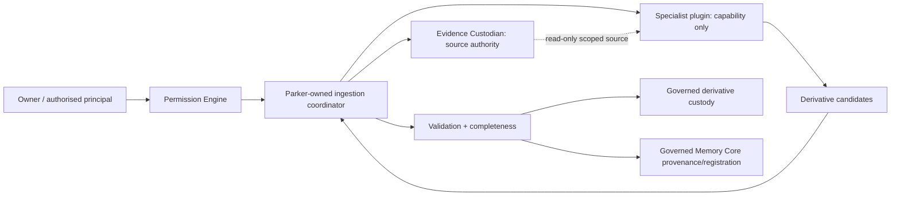
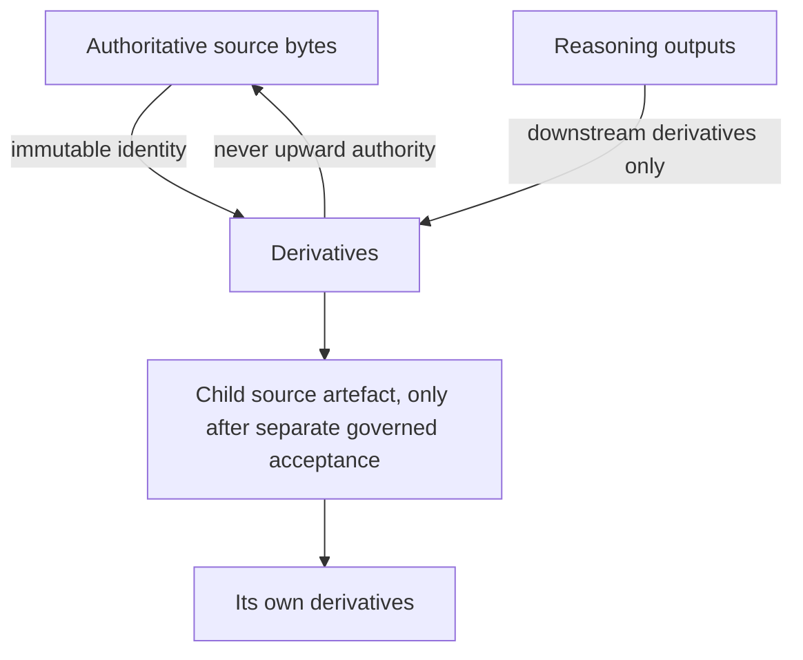
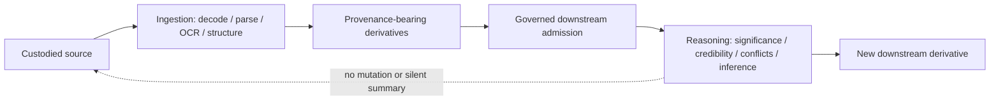

# Document Ingestion Plugin Contract

## Status

**Draft for human review. Governance Unit 1. Not accepted, canonical, or
implementation-authorising.** This document defines a proposed format-neutral
boundary. It does not reopen the frozen Evidence Custodian, Evidence Processing,
OCR Mechanism, Evidence Intelligence, Memory Core, Knowledge Memory, or RKS/QMD
contracts. No production contract or runtime wiring may be inferred from it.

## 1. Purpose and constitutional rule

No ingestion plugin may modify, replace, normalise, or redefine an authoritative
source artefact. Every extraction, OCR result, structural interpretation,
decoded representation, and convenience form is a provenance-linked derivative.

This proposal extends the constitutional rule that Parker owns authority while
modules provide capability. A plugin reports what it can mechanically produce;
Parker authorises access, owns custody and provenance, evaluates completeness,
and decides whether any output proceeds downstream.

## 2. Relationship to implemented Parker boundaries

- `EvidenceCustodian` alone accepts and retrieves immutable bytes. Its
  `AcceptedEvidenceArtifact` deliberately carries only identity and acceptance
  time. This proposal does not add fields to it.
- `EvidenceExtractor` is the implemented, dependency-free searchable-PDF port.
  `TikaEvidenceExtractor` is its current implementation. It remains valid and
  narrower than the proposed general plugin boundary.
- `OcrMechanism` and `OcrProviderAdapter` are separately governed OCR ports.
  They do not select providers, gate themselves, or create governed records.
- `EvidenceExtractionCoordinator` performs retrieval, pre/post digest checks,
  derivative acceptance, Memory Core provenance/Document registration, and
  review-state creation. A future general coordinator should preserve that
  sequencing and authority allocation rather than bypass it.
- Evidence Intelligence may analyse retrieved evidence and propose governed
  candidates. This document grants plugins no Evidence Intelligence authority.
- The existing generic `Plugin` lifecycle (`manifest`, `initialise`, `shutdown`)
  is not an ingestion contract and conveys no evidence access or write authority.

## 3. Proposed conceptual surface

Names below are descriptive governance vocabulary, not approved Kotlin names.
The minimum future surface is one invocation operation plus a static capability
description. A separate `supports` call is not required: routing must evaluate
the capability description and source observations centrally. A free-running
`inspect` call is also avoided because it could become an ungated second read.

```text
DocumentIngestionCapability
  descriptor() -> IngestionCapabilityDescription
  ingest(GovernedSourceInput, IngestionRequest) -> IngestionAttemptOutcome
```

`GovernedSourceInput` is a scoped, read-only view created only after custody and
authorisation. It contains the source artefact identifier, independently
established digest and length, received and detected media observations, and a
bounded means of reading the exact bytes. It is not a path supplied by a plugin,
a mutable byte store, a custody handle, or deletion capability. Implementations
may pass a defensive byte copy, read-only stream, or isolated file descriptor,
provided the source remains independently protected.

`IngestionRequest` states the authorised requested extraction kinds, resource
limits, configuration identity, and correlation/audit identity. It never grants
more capability than its scoped source input.

`IngestionAttemptOutcome` contains an operational outcome, explicit warnings,
completeness assessment inputs, material transformation disclosures, and zero or
more derivative candidates. These are proposals. A plugin does not custody,
register, promote, index, or declare them authoritative.

Each derivative candidate must carry enough content and metadata for Parker to
mint identity, hash content, establish lineage, validate it, and—only through a
later authorised coordinator—accept it. A plugin must not mint or assert a
custodied `EvidenceArtifactId`.

## 4. Capability description

Every plugin version/configuration declares, before selection:

- stable plugin and adapter identities and versions;
- supported media types and signatures; extensions are hints only;
- output/derivative kinds (literal text, MIME tree, decoded attachment,
  records/fields, OOXML structure, layout, OCR, render, metadata, and so on);
- whether it can enumerate attachments, embedded objects, pages, records,
  fields, package parts, coordinates, and confidence;
- deterministic-under-fixed-conditions or non-deterministic classification;
- inherent transformation classes it may perform;
- external process, model, network, cache and temporary-storage requirements;
- resource profile and enforceable limits it supports;
- completeness observations and accounting checks it can supply.

Capability is a claim for routing and validation, not authority. Parker must
reject an invocation when requirements exceed policy even if the plugin claims
support. Network and external reasoning/model access are prohibited by default
and require a separately governed, explicit authorisation path.

Declaring OCR or other model-backed capability in a descriptor is a claim only;
it does not itself authorise invocation. CDR-007 assigns OCR, transcription and
extraction to Evidence Intelligence's own analytical functions, narrowed only for
deterministic reading of an already-encoded text layer (Evidence Processing
Searchable-PDF Boundary Clarification, Determination 1). A plugin's OCR or
model-backed capability therefore routes through the existing `OcrMechanism` /
`OcrProviderAdapter` / Evidence Intelligence authorisation boundary, not through
a new gate this contract invents or a plugin-side bypass of it. See Section 9.

## 5. Transformation disclosure

Every material transformation is recorded in ordered application order. The
closed minimum governance vocabulary is:

| Class | Meaning |
|---|---|
| `CHARACTER_DECODING` | bytes decoded using a named or inferred character set |
| `MIME_TRANSFER_DECODING` | quoted-printable/base64/etc. decoded to bytes |
| `DECOMPRESSION` | compressed content expanded |
| `OCR` | image content recognised as text |
| `STRUCTURAL_PARSING` | native syntax interpreted as fields, parts, runs, blocks, etc. |
| `WHITESPACE_NORMALISATION` | whitespace altered |
| `LINE_ENDING_NORMALISATION` | line endings altered |
| `DATE_PARSING` | lexical date interpreted semantically |
| `NUMERIC_INTERPRETATION` | lexical value interpreted as a number |
| `FIELD_UNQUOTING` | syntax quotes/escapes removed to yield field value |
| `ENTITY_DECODING` | character/entity reference decoded |
| `IMAGE_RASTERISATION` | source representation converted to pixels |
| `PAGE_RENDERING` | a page rendered into another representation |
| `TABLE_RECONSTRUCTION` | cells/relationships inferred or reconstructed |
| `READING_ORDER_INFERENCE` | reading sequence inferred |
| `MODEL_INFERENCE` | learned model used to infer output |
| `METADATA_INTERPRETATION` | raw metadata interpreted or canonicalised |

Each disclosure records class, affected output or scope, relevant algorithm or
profile, and whether the operation is reversible. Additional names require a
governed vocabulary amendment; plugins may also provide non-authoritative detail.
CSV unquoting and MIME transfer decoding are legitimate transformations, but the
result is a derivative and remains distinguishable from the original syntax.

## 6. Authority never possessed by a plugin

An ingestion plugin has no authority to mutate, delete, replace, re-identify, or
rehash source evidence; alter custody or audit records; promote an interpretation
to source fact; write to Evidence Custodian, Memory Core, Knowledge Store,
Knowledge Items, RKS/QMD, or a derivative review registry; invoke reasoning or a
network/model service without separate authorisation; choose itself; or translate
failure, omission, partial output, or uncertainty into unqualified success.

The dependency graph must make these absences structural. A plugin receives only
its scoped input/request and allowed mechanical dependencies. Parker-owned
coordination owns permission checks, retrieval, digest verification, routing,
validation, acceptance, provenance, audit, review and downstream admission.

This is not a novel restriction invented for ingestion: it restates, for the
document-ingestion case, the general module boundary already fixed by
ADR-024 — a module is never a fourth trust category, receives no implicit
trust, and never writes directly to Memory, World Model, or equivalent
platform state. An ingestion plugin is an ordinary `Principal`/module under
that rule, not an exception to it.

## 7. Flow and authority hierarchy





The dotted logical relationship from derivatives back to source is lineage, not
authority transfer. No arrow authorises a candidate to overwrite its parent.

## 8. Security and resource boundary

Future implementation planning must cover parser isolation, untrusted input,
archive/decompression expansion limits, attachment and embedded-object size/count
limits, CPU/wall-clock/memory/process limits, no network by default, controlled
Docling model/cache provisioning, non-executable temporary storage and assured
cleanup, filename-as-metadata only (never a path), path traversal prevention,
safe handling of links/macros/embedded objects, and fail-closed source digest
reverification. These are mandatory design concerns, not controls implemented by
this draft.

## 9. Ingestion and reasoning separation



Parsing may express declared format semantics. It may not decide legal
significance, credibility, intent, truth, factual conflict, or rewrite/summarise
content for clarity. Any later summary or analysis is separately governed and
provenance-bearing.

### 9.1 Three governed tiers, not two

Ingestion is not one undifferentiated activity. This contract distinguishes three
tiers, and no capability description or routing decision may collapse them:

| Tier | Examples | Governance |
|---|---|---|
| A. Deterministic/mechanical parsing | MIME decoding, CSV field parsing, OOXML part reading, literal PDF text-layer reading | No interpretation, no pattern recognition, no judgement (Boundary Clarification, Determination 1). Ordinary ingestion capability; no additional gate beyond this contract's own routing/audit/completeness rules. |
| B. Recognition / model-backed structural interpretation | OCR, layout inference, model-backed table reconstruction (e.g. Docling) | Requires interpreting a representation of content, not reading content already encoded as text. CDR-007 assigns this to Evidence Intelligence's analytical functions; it is not narrowed by the Boundary Clarification. Requires the existing `OcrMechanism`/Evidence Intelligence authorisation boundary — this is Owner Decision 6 (Section 10) and Table §2's "only when justified" caveat, not a plugin self-gate. |
| C. Evidential/legal reasoning | Credibility, meaning, legal significance, conflict resolution, inference about truth or intent | Never ingestion. Always downstream, separately governed, provenance-bearing (Section 9's own diagram). |

Tier A requires no gate beyond ordinary capability/routing/audit. Tier B requires
the additional governed gate because its transformation characteristics,
reproducibility, resource requirements and model/version dependencies differ
materially from Tier A, even though — like Tier A and unlike Tier C — it never
performs evidential reasoning. Collapsing Tier B into Tier A would let a plugin
claim OCR or Docling output as ordinary mechanical output; collapsing Tier B into
Tier C would misclassify routine recognition as legal/evidential judgement. Both
misclassifications are prohibited.

## 10. Review and implementation gate

Owner Decisions 1-6 recorded in
`DOCUMENT_INGESTION_ROUTING_AND_COMPLETENESS_POLICY.md` Section 8 and the
resolutions in `SOURCE_DERIVATIVE_PROVENANCE_MODEL.md` Section 7 settle this
draft's open policy questions. They do not themselves amend any frozen
canonical document. Before code: accept or amend this draft; carry out the
narrow amendments enumerated in
`DOCUMENT_INGESTION_GOVERNANCE_AMENDMENT_MAP.md` (Evidence Artifact contract
extension for source/derivative/child-source identity and lineage; a
broadened review-target identity so the searchable-PDF contract's
`DerivativeReviewRegistry` can key non-byte structural derivatives without
forcing them into `EvidenceArtifactId`; a durable ingestion-audit persistence
port); define a scope lock; then produce an implementation plan. This
document alone authorises none of those changes.
