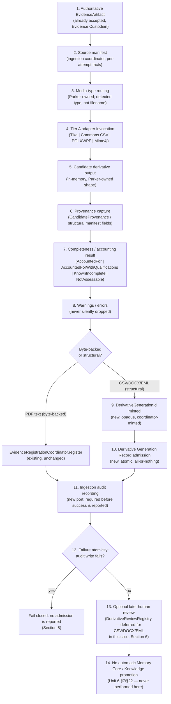

# Document Ingestion — Tier A Mechanical Ingestion Architecture and Evidence Plan

## 1. Status

**Implementation planning only. Draft for owner review. Not yet accepted.**
Programme: Document Ingestion — **Implementation Planning Unit 1**. This
document plans, but does not perform, the first bounded implementation of
Tier A (mechanical/deterministic) Document Ingestion for four initial
formats: searchable-PDF text-layer extraction, CSV, DOCX/OOXML, and
EML/MIME structural decoding.

**No production code was written. No test was modified. No dependency was
added. No parser was installed. No ingestion was invoked. No real evidence
was ingested. No OCR/Tier B work was begun.** Every Kotlin signature in
this document is a *proposed* shape for a future implementation unit, not
an implemented artefact.

## 2. Authoritative governance baseline

Verified fresh, this unit: branch `main`; `HEAD` and `origin/main` both
`1142a9f38bca32e7ddcc72b0b4a3c81f567ee3b2`; working tree clean before this
document was written.

Document Ingestion governance/alignment is closed
(`docs/architecture/DOCUMENT_INGESTION_PROGRAMME_GOVERNANCE_CLOSURE.md`,
adopted at that same commit), classified **READY FOR IMPLEMENTATION
PLANNING WITH EXPLICIT DEFERRALS**. This plan treats Units 1–6 and the
closure record as authoritative and does not modify, reopen, or restate
their conclusions except to translate an already-frozen conclusion into a
proposed implementation shape. Where this document cites a Unit/section,
that Unit remains the source of truth; a conflict between this document
and any adopted Unit is resolved in the adopted Unit's favour.

Central frozen conclusions this plan builds on directly (see closure
document Section 7 for the full index): `AcceptedEvidenceArtifact` remains
exactly 2 fields (#1); a Derivative Generation Record never becomes an
`EvidenceArtifact` (#2); `DerivativeGenerationId` is opaque,
non-semantic, coordinator-minted (#3); admission is atomic (#4); same-root
multi-parent generations only, no cross-source combination (#5); Tier A
requires no additional gate (#11); a new, narrow ingestion audit port is
required, distinct from `AuditService` and `EvidenceDeletionAudit` (#14);
no admitted Derivative Generation Record without durable audit (#16); no
direct Document Ingestion write authority into Memory Core (#19);
reference-only Memory Core relationship, existing fields sufficient (#20).

## 3. Repository implementation baseline

Fresh inspection this unit, direct file reads and `grep`, not README:

**Evidence Custodian (`src/interfaces/EvidenceCustodian.kt`,
`src/runtime/DefaultEvidenceCustodian.kt`,
`src/runtime/FileSystemEvidenceArtifactStorage.kt`).** Implemented,
tested. `EvidenceArtifactId` (non-blank value class). `AcceptedEvidenceArtifact`
exactly 2 fields (`evidenceArtifactId`, `acceptedAt`), matching frozen
conclusion #1. `accept`/`retrieve` gated through `PermissionEngine` with
fixed, disclosed, **unregistered** resource/action names
(`evidence-custodian-intake`/`evidence.accept`,
`evidence-custodian-retrieval`/`evidence.retrieve`). Storage: local
filesystem, temp-file-then-atomic-move write, `FileChannel.force`
durability, one file per artifact (`.evidence` extension), no overwrite.

**`EvidenceRegistrationCoordinator` (`src/runtime/EvidenceRegistrationCoordinator.kt`).**
Implemented, tested, **wired into production composition**
(`src/composition/ParkerRuntime.kt:787`, with its resource/action names
registered at lines 462–463 and 517/523). Sequences `EvidenceCustodian.accept`
→ (gated) `MemoryCore.createProvenance` → (gated) `MemoryCore.registerDocument`.
Three dependencies only (`EvidenceCustodian`, `MemoryCore`,
`PermissionEngine`); no `try`/`catch`; a denied permission decision is a
typed outcome, never thrown.

**`EvidenceExtractor`/`TikaEvidenceExtractor`/`EvidenceExtractionCoordinator`
(`src/interfaces/EvidenceExtractor.kt`, `src/runtime/TikaEvidenceExtractor.kt`,
`src/runtime/EvidenceExtractionCoordinator.kt`).** Implemented, tested.
`EvidenceExtractor.extract(ByteArray): ExtractionOutcome` is a narrow,
dependency-free, single-operation interface producing exactly one flat
`extractedText: String` per call — shaped for PDF text-layer reading, not
for structured multi-part content. `TikaEvidenceExtractor` is **the only
file in the repository permitted to import `org.apache.tika.*`**; it
invokes `PDFParser` directly (never `AutoDetectParser`), records a fixed
`CONFIGURATION_PROFILE` string, classifies sub-20-character extracted text
as `RequiresOcr`, and never sets an OCR strategy (`tika-parser-ocr-module`
is not on the classpath). `EvidenceExtractionCoordinator` sequences
Document lookup → identity match → retrieve → SHA-256 integrity
verification (fail-closed on mismatch or unverifiable) → extract → build
`CandidateEvidenceArtifact`/`CandidateProvenance` (`contentNature =
EXTRACTED`, `extractedFrom` set) → `EvidenceRegistrationCoordinator.register`
→ on `Registered`, record initial `PENDING_REVIEW` via
`DerivativeReviewRegistry`. Five dependencies, no `try`/`catch`.

**`DerivativeReview` (`src/interfaces/DerivativeReview.kt`,
`src/runtime/InMemoryDerivativeReviewRegistry.kt`).** Implemented, tested.
`DerivativeReviewRecord` currently keys on `evidenceArtifactId:
EvidenceArtifactId` plus a mandatory `documentId: DocumentId` — **not**
Unit 3's governed closed two-case union (`EvidenceArtifactId` |
`DerivativeGenerationId`). Widening this target has not been implemented.
`DerivativeReviewState` is the frozen four-value enum
(`PENDING_REVIEW`/`APPROVED`/`REJECTED`/`NEEDS_CORRECTION`); transition
validation lives in the registry implementation, not the enum.

**`EvidenceDeletionAudit`/`FileSystemEvidenceDeletionAudit`
(`src/interfaces/EvidenceDeletionAudit.kt`,
`src/runtime/FileSystemEvidenceDeletionAudit.kt`).** Implemented, tested.
Exact precedent shape for the new ingestion audit port: one record type,
a closed two-value stage enum, `deletionRequestId: String` — "a
correlation value only, never a domain identity type" — append-only,
tab-separated one-line-per-record format, `FileChannel` open-append-write-force,
in-process `Mutex`, **no query operation**, no new dependency introduced
for this format choice ("This repository has exactly one runtime
dependency... Introducing a JSON or other structured-serialisation
library for one small, fixed-shape record is not warranted").

**`AuditService` (`src/interfaces/AuditService.kt`).** Confirmed still
unimplemented anywhere in the repository (`grep` for implementing
classes: none). Confirmed, again, this Programme is not authorised to
write its first implementation (Unit 5 §6, restated at closure §7 #14).

**Memory Core `Provenance` (`src/interfaces/MemoryCore.kt:212-227`,
`CandidateProvenance` at line 724).** Exact fields confirmed by direct
read: `provenanceId`, `sourceIdentifier`, `sourceType`, `acquisitionTime`,
`ingestionTime`, `contentNature` (mandatory); `creator`,
`creatorPrincipalId`, `claimedCreationTime`, `derivedFrom: List<ProvenanceId>`,
`extractedFrom: DocumentId?`, `processingHistory: List<String>`,
`integrityInformation`, `confidence`, `sensitivity` (optional). Matches
Unit 6 §9's field-selection exactly — no new field exists or is proposed.
`ContentNature` is the frozen 5-value enum
(`ORIGINAL`/`EXTRACTED`/`SUMMARISED`/`INFERRED`/`UNKNOWN`).

**Runtime composition (`src/composition/ParkerRuntime.kt`).** Confirmed
by direct `grep`: `EvidenceRegistrationCoordinator` **is** wired into
production composition. `EvidenceExtractionCoordinator`,
`TikaEvidenceExtractor`, `DerivativeReviewRegistry`/
`InMemoryDerivativeReviewRegistry`, and `OcrMechanism`/`OcrProviderAdapter`/
`OcrExecutionSequencer` are **not referenced anywhere in
`ParkerRuntime.kt`** — none is wired into the production runtime today,
despite each being fully implemented and tested. This is an existing gap
independent of Document Ingestion; Tier A planning inherits it rather
than creates it (Section 4, Section 5, Section 13).

**Identities (`src/contracts/Identifiers.kt`).** Existing convention
confirmed: every identifier is a `@JvmInline value class Xxx(val value:
String)` with a `require(value.isNotBlank())` guard — the pattern any new
`DerivativeGenerationId` must follow (closure document deferral,
Section 8: "Must follow the established `value class XxxId(String)`
pattern").

**Persistence patterns.** Two established, precedented shapes: (a)
`FileSystemEvidenceArtifactStorage` — one immutable file per identity,
write-once via temp-file-then-atomic-move, no overwrite, no query beyond
identifier lookup; (b) `FileSystemEvidenceDeletionAudit` — one durable,
append-only, tab-separated log, no query. No database, object store, or
third-party serialisation library exists anywhere in this repository's
runtime dependency set.

**Gradle dependencies (`build.gradle.kts`).** Exactly: `kotlinx-coroutines-core`
(runtime), `tika-core` + `tika-parser-pdf-module` version `3.3.1`
(runtime). **No Apache Commons CSV, no Apache POI, no Apache James
Mime4j, no PDFBox direct dependency, no full `tika-parsers-standard-package`.**
Test dependencies: `kotlin-test-junit5`, `kotlin-reflect`,
`kotlinx-coroutines-test`, `junit-jupiter`.

**Existing tests around evidence extraction/registration.**
`TikaEvidenceExtractorTest.kt` (165 lines) uses `tests/fixtures/synthetic-searchable.pdf`
and an *uncommitted* `tests/fixtures/local/` directory for extra manual
fixtures — **not** the new bake-off corpus. `EvidenceExtractionCoordinatorTest.kt`
(724 lines) and `EvidenceRegistrationCoordinatorTest.kt` (386 lines) both
exist and pass against fakes. None references the bake-off corpus.

**The immutable seven-fixture document-ingestion bake-off corpus**
(`tests/fixtures/document-ingestion-bakeoff/`, added at commit `1cbe8ea`,
this session's own starting commit — pre-existing, not created by this
programme). `manifest.json` fixes SHA-256, byte length, expected media
type, and exhaustive literal/structural/table/attachment expectations per
fixture (read in full, Section 11). `README.md`: "the exact source bytes
under `fixtures/` are immutable test evidence... Never edit or regenerate
an accepted fixture in place." No canonical plain-text serialisation is
prescribed for any format.

**Accepted Document Ingestion governance and the bake-off findings
already recorded in it.** `DOCUMENT_INGESTION_ROUTING_AND_COMPLETENESS_POLICY.md`
§2 already carries an evidence-backed, provisional specialist table (read
in full, Section 4 below) naming Tika (searchable-PDF text), Mime4j
(EML), Commons CSV (CSV), and Apache POI XWPF (DOCX native text/structure)
as Tier A, and Docling (OCR, layout, DOCX secondary view) as Tier B —
confirming the task's candidate list rather than merely repeating it.
§3–§5 fix the outcome vocabulary, completeness vocabulary, and required
audit facts this plan reuses verbatim (Sections 5, 7, 9 below).

## 4. Selected Tier A mechanisms

| Format | A. Preferred mechanism | B. Why | C. Dependency present? | D. Adapter required? | E. Known limitations | F. Conformance evidence |
|---|---|---|---|---|---|---|
| Searchable PDF | **Apache Tika, existing `TikaEvidenceExtractor`, unchanged** | Already invokes `PDFParser` directly (not `AutoDetectParser`) — deterministic parser identity; Routing Policy §2 row 1 already records it "preserved the tested em dash"; no concrete Tier A requirement identified that it fails to satisfy (Section 4.1 below) | Yes (`tika-parser-pdf-module:3.3.1`) | No — reuse existing `EvidenceExtractor`/`EvidenceExtractionCoordinator` unchanged | Fixed 20-character searchable-vs-scanned threshold (a compiled constant, not yet validated against fixture 01/02's real bytes); no page-level text association beyond whole-document `BodyContentHandler` output | Fixtures 01, 02 (Section 11) |
| CSV | **Apache Commons CSV** | Mature RFC-4180-compatible parser; preserves lexical strings/whitespace/empty fields with no numeric/date coercion, matching Routing Policy §2 row 5 exactly; small, narrowly-scoped dependency | No | Yes — new, narrow `CsvStructuralExtractor` (Section 6) | Raw quoting/byte spans not directly exposed by the record-level API (Routing Policy §2 row 5, disclosed, not fabricated around) | Fixture 06 |
| DOCX | **Apache POI XWPF** | Preserves paragraphs/runs/formatting/tables/lists/page breaks at the OOXML structural level; Routing Policy §2 row 6 already records the round-trip finding motivating "extract only, never reconstruct" | No | Yes — new, narrow `DocxStructuralExtractor` (Section 6) | Source package must never be regenerated/replaced — round-trip changed package bytes and 13/19 part hashes (already-recorded finding); XWPF is a heavier dependency (POI + XMLBeans + Curves API transitively) | Fixture 04 |
| EML | **Apache James Mime4j** | Full MIME structure, Cc/Message-ID, original and semantic Date, exact body, exact decoded attachment bytes and metadata (Routing Policy §2 row 4, already-recorded finding) | No | Yes — new, narrow `EmlStructuralExtractor` (Section 6) | Byte authority retained when charset is absent/ambiguous (disclosed, not silently resolved) | Fixture 05 |

**4.1 Searchable PDF — fresh inspection of the existing Tika path.**
`TikaEvidenceExtractor` was read in full (Section 3). It already:
detects media type before parsing (non-PDF → `Unsupported`); invokes
`PDFParser` directly, so `ExtractionIdentity.parserIdentity` is a
structural fact, never metadata-derived; applies one fixed, tagged
configuration profile (`tika-pdf-only-v1;embeddedResources=recordOnly;ocrStrategy=none`);
classifies sub-threshold text as `RequiresOcr`, never a false success;
records embedded-resource presence/name/type without ever parsing
embedded content; performs no network I/O. **Determination: the current
Tika path is adequate for Tier A searchable-PDF literal extraction.**
Direct PDFBox invocation would remove one layer of indirection (Tika's
own detector plus `PDFParser` wrapper) but was not found to improve
source/provenance fidelity for any literal-fidelity obligation this
programme's fixtures test — `PDFParser` is itself a PDFBox-backed parser
class already; Tika supplies the deterministic-parser-identity guarantee
PDFBox alone would not additionally strengthen. **Tika remains the
initial mechanism; direct PDFBox is not adopted for this first Tier A
path.** This is not a permanent rejection of PDFBox — no concrete Tier A
requirement currently motivates it, and the question may be revisited if
a future, specific literal-fidelity gap in the Tika path is found; it is
simply not a planned item today because no such gap has been identified.
Docling/Unstructured are not reopened: no Tier A requirement in this
document's scope requires model-backed interpretation, and both remain
Tier B/out-of-scope per Routing Policy §2.

## 5. Architecture / runtime flow

Minimum governed flow from an already-custodied `EvidenceArtifact` to an
admitted derivative, deliberately kept identical in shape for all four
formats even though the derivative's own governed identity differs
(byte-backed `EvidenceArtifact` for PDF text extraction vs. non-byte
`DerivativeGenerationId` for CSV/DOCX/EML):

No step assumes OCR or Tier B. Step 3 (routing) and step 4 (adapter
selection) are Parker-owned per Routing Policy §1 — a plugin never
self-selects.

## 6. Minimum implementation surface

| Concept | Classification | Rationale |
|---|---|---|
| `EvidenceCustodian`, `AcceptedEvidenceArtifact`, `EvidenceArtifactStorage` | **REUSE UNCHANGED** | Already implements frozen conclusion #1; no Tier A requirement touches it |
| `EvidenceExtractor`, `TikaEvidenceExtractor`, `EvidenceExtractionCoordinator` | **REUSE UNCHANGED** | Already correct for PDF text-layer extraction (Section 4.1); only its *composition wiring* is new work (below) |
| `EvidenceRegistrationCoordinator` | **REUSE UNCHANGED** | Already wired, tested, sufficient for the byte-backed PDF-text path |
| `DerivativeReviewRegistry`/`DerivativeReviewRecord` | **DEFER (widening)** | Unit 3's closed two-case union target is governed but not implemented; Step 3 of this task classifies human review as optional/later — no Tier A vertical slice in this plan requires review of a `DerivativeGenerationId` target yet. Existing `EvidenceArtifactId`-only shape continues to serve the PDF-text path unchanged |
| `DerivativeGenerationId` | **NEW** | No existing type expresses an opaque, non-semantic, coordinator-minted identity for a non-byte structural derivative (frozen conclusion #3); existing `EvidenceArtifactId` is explicitly reserved for byte-backed custody (Unit 2 §2, closure #2) and must not be reused for this purpose |
| `CandidateDerivativeGeneration` / `DerivativeGenerationRecord` | **NEW** | No existing type captures a non-byte structural derivative's provenance, completeness, and warnings as a single admitted, immutable governance record — mirrors the `CandidateEvidenceArtifact` → `AcceptedEvidenceArtifact` split precedent exactly, applied to the new identity |
| `CsvStructuralExtractor` / `DocxStructuralExtractor` / `EmlStructuralExtractor` | **NEW (three narrow interfaces)** | `EvidenceExtractor`'s existing shape (`extractedText: String`, one flat string) cannot losslessly represent CSV records/fields, DOCX paragraphs/runs/tables, or an EML MIME tree/attachments — forcing these into `ExtractionResult` would either fabricate a serialisation the governance explicitly does not prescribe (bake-off `README.md`: "No single canonical plain-text serialization is prescribed") or silently discard structure this task's own literal-fidelity obligations require preserved. Three narrow interfaces, one per format, mirror `EvidenceExtractor`'s own "narrow, dependency-free, one file, sealed outcome" shape rather than inventing one generalised abstraction across three structurally unrelated formats |
| `ApacheCommonsCsvExtractor` / `ApachePoiXwpfExtractor` / `Mime4jEmlExtractor` | **NEW** | The production implementations of the three interfaces above, mirroring `TikaEvidenceExtractor`'s own "sole file permitted to import the third-party library" isolation discipline |
| `DerivativeGenerationCoordinator` | **NEW (the "ingestion coordinator" role for structural derivatives)** | No existing coordinator sequences a structural extractor → completeness assessment → `DerivativeGenerationId` minting → audit → admission; `EvidenceExtractionCoordinator` is shaped specifically for the byte-backed `EvidenceCustodian`/`MemoryCore` path and cannot admit a non-byte record |
| `DerivativeGenerationStorage` (interface) + filesystem implementation | **NEW** | No existing storage primitive persists a `DerivativeGenerationRecord`; mirrors `FileSystemEvidenceArtifactStorage`'s own write-once, atomic-move, no-overwrite pattern, applied to the new identity, not reusing evidence-artifact storage itself (a `DerivativeGenerationRecord` is explicitly never an `EvidenceArtifact`, closure #2) |
| Ingestion audit port (interface) + filesystem implementation | **NEW** | Frozen conclusion #14: distinct from `AuditService` (unimplemented, unauthorised) and from `EvidenceDeletionAudit` (a different governed event). Mirrors `FileSystemEvidenceDeletionAudit`'s exact precedent shape (Section 8) |
| Tier A router (media-type → mechanism) | **NEW, minimal** | Routing Policy §1 requires Parker-owned routing (detected type, signature, not filename); no existing component performs this for Document Ingestion. Kept deliberately small — a lookup, not a policy engine |
| Runtime composition wiring for the above, plus `EvidenceExtractionCoordinator`/`TikaEvidenceExtractor`/`DerivativeReviewRegistry` | **NEW (composition only, no new interface)** | None of the existing Evidence Processing (searchable-PDF) classes is wired into `ParkerRuntime.kt` today (Section 3) — this is pre-existing, independent of Document Ingestion, but Tier A's own acceptance evidence (Section 11) requires it to exercise the real coordinator, not only fakes |
| Any Kotlin type for Memory Core registration, promotion, or a second coordinator performing it | **DEFER** | Unit 6 §20–21/§25; closure deferral row — coordinator identity for Memory Core registration is explicitly left open, not required for any Tier A vertical slice in this plan |
| Retry/rollback technology for any failure case | **DEFER** | Unit 5 §15 explicitly declines to design retry/transaction mechanics; Section 8 below states only the required observable outcome |

No artifact is proposed for symmetry alone: the ingestion coordinator
role is split into two concrete classes (`EvidenceExtractionCoordinator`,
reused, for byte-backed PDF text; `DerivativeGenerationCoordinator`, new,
for non-byte structural derivatives) rather than one generalised
coordinator, because the two paths terminate in genuinely different
governed identities (`EvidenceArtifactId` via `EvidenceCustodian`/`MemoryCore`
vs. `DerivativeGenerationId` via the new storage/audit pair) and forcing
one shared coordinator would either weaken the byte-backed path's already-tested
five-dependency shape or smuggle non-byte-derivative concepts into it.

## 7. Format-specific plans

### 7.1 Searchable PDF

- **Input:** already-custodied PDF bytes, retrieved via `EvidenceCustodian.retrieve`.
- **Mechanism:** existing `TikaEvidenceExtractor` (`PDFParser`, direct invocation), unchanged.
- **Output derivative shape:** `CandidateEvidenceArtifact` (extracted text, UTF-8 bytes) + `CandidateProvenance` (`contentNature = EXTRACTED`, `extractedFrom` set) — byte-backed, admitted as a new `EvidenceArtifact` via `EvidenceRegistrationCoordinator`, exactly as today.
- **Structural provenance available:** parser identity (`PDFParser`'s FQCN), configuration profile, normalisation profile ("none"), page count (when Tika's `xmpTPg:NPages` key populates), producer/title metadata, embedded-resource presence/name/type.
- **Completeness checks (Routing Policy §4):** page count accounted for where determinable; extraction status recorded per page (currently whole-document only — a known limitation, Section 4 table); embedded/attached content reported where detectable.
- **Expected warnings:** none for fixture 01/02 (both are genuinely searchable); `RequiresOcr` is not a warning but a distinct terminal outcome.
- **Literal-fidelity obligations:** exact text-layer characters including em dash and Unicode macrons (already recorded as preserved, Routing Policy §2 row 1); no OCR; no invented layout interpretation beyond `BodyContentHandler`'s own linear text extraction — multi-column reading order (fixture 02) is **not** guaranteed by this mechanism and must not be asserted as correct (Section 9).
- **Unsupported/ambiguous cases:** non-PDF media type → `Unsupported`; sub-threshold text → `RequiresOcr` (fixture 03 must land here, never `Extracted`); corrupt bytes → `Malformed`.
- **Failure behaviour:** any dependency exception propagates unchanged (no `try`/`catch` in `EvidenceExtractionCoordinator`); a denied permission decision is a typed, non-thrown outcome.
- **Evidence fixtures/tests:** fixtures 01, 02 (Section 11).

### 7.2 CSV

- **Input:** already-custodied CSV bytes.
- **Mechanism:** new `ApacheCommonsCsvExtractor` implementing new `CsvStructuralExtractor`.
- **Output derivative shape:** proposed `CsvExtractionResult` — header row (if present), an ordered list of records, each an ordered list of raw field strings (`List<List<String>>` or a small `CsvRecord` wrapper carrying the raw fields plus a record index), dialect facts (delimiter, quote character, line-ending observed), and a `CandidateDerivativeGeneration` built from it for admission.
- **Structural provenance available:** parser identity/version, dialect/configuration profile, record and field counts, encoding as detected/declared.
- **Completeness checks (Routing Policy §4):** record structure accounted for; field structure accounted for (field count per record, dialect/encoding decisions, empty fields); parse failures disclosed; raw quoting/span absence disclosed (a known, disclosed limitation — Commons CSV's record-level API does not expose raw byte spans).
- **Expected warnings:** none for fixture 06 under RFC-4180-compatible parsing; a field-count mismatch across records would be a warning, not a silent renormalisation.
- **Literal-fidelity obligations, explicit:** string values only, never coerced to numeric/date types; leading zeros preserved (`"001"`, `"00001234"`); empty fields preserved as empty strings, not `null` or omitted; quoted commas preserved as literal commas inside one field (`"Alpha, Limited"`); escaped/embedded quotes preserved literally (`He said "literal".`); repeated internal spaces preserved (`Line with  repeated spaces`); Unicode preserved (`Māori Test`) — all directly checkable against fixture 06's `tableCellExpectations`.
- **Unsupported/ambiguous cases:** non-CSV/undetected media type → `Unsupported`; ragged rows (inconsistent field counts) → `KnownIncomplete` or `AccountedForWithQualifications`, never silently padded/truncated; unparseable byte sequence → `Malformed`.
- **Failure behaviour:** mirrors the PDF path — no swallowed exceptions; a parse failure is a typed outcome, not a thrown fault reaching the caller as an opaque error.
- **Evidence fixtures/tests:** fixture 06.

### 7.3 DOCX

- **Input:** already-custodied DOCX (OOXML package) bytes.
- **Mechanism:** new `ApachePoiXwpfExtractor` implementing new `DocxStructuralExtractor`.
- **Output derivative shape:** proposed `DocxExtractionResult` — ordered paragraphs, each an ordered list of runs with literal adjacent text and bold/italic flags; list/numbering identity where XWPF exposes it; tables as ordered rows of cells; explicit page-break markers where present in the package; headers/footers as separate text collections; document metadata (title/author/subject from core properties).
- **Structural provenance available:** parser identity/version (POI XWPF), configuration profile, OOXML part inventory (which parts were read).
- **Completeness checks (Routing Policy §4):** principal OOXML parts inventoried; body accounted for; headers/footers accounted for where present; tables accounted for where present; relationships accounted for where discoverable; declared-support limits disclosed (e.g., a DOCX feature XWPF does not expose).
- **Expected warnings:** any OOXML part XWPF cannot interpret is disclosed as a warning, never silently dropped.
- **Literal-fidelity obligations, explicit:** paragraphs/runs preserved; literal adjacent run text preserved without merging or re-flowing; bold/italic run properties preserved; list semantics preserved as recoverable numbering/style structure (not rendered bullet glyphs); tables/cells preserved (fixture 04's `DOCX-CELL-004` control and 4-row table); explicit page break preserved as a structural marker (fixture 04's page-2-only control `DOCX-PAGE-2-ONLY: STRUCTURE-7721`); headers/footers preserved; metadata preserved; **no rendered-page or coordinate fabrication** — XWPF exposes structure, not a laid-out page image, and this extractor must not synthesise one.
- **Unsupported/ambiguous cases:** a corrupted or non-OOXML-conformant package → `Malformed`; a `.docx`-extension file that is not actually a Word package → `Unsupported`.
- **Failure behaviour:** mirrors the CSV/PDF paths — typed outcomes, no swallowed exceptions. The source `.docx` package is never regenerated or rewritten (Routing Policy §2 row 6's already-recorded round-trip-corruption finding) — this extractor only ever reads the existing package, never writes one.
- **Evidence fixtures/tests:** fixture 04.

### 7.4 EML

- **Input:** already-custodied EML/`message/rfc822` bytes.
- **Mechanism:** new `Mime4jEmlExtractor` implementing new `EmlStructuralExtractor`.
- **Output derivative shape:** proposed `EmlExtractionResult` — full header map (including `Cc`, `Message-ID`, original raw `Date` plus a semantically-parsed `Date` where resolvable); the MIME tree as an ordered structural list, each node's content-type and disposition; body alternatives (e.g. `text/plain`, `text/html`) preserved separately, never merged; an attachment list, each with declared filename, declared media type, decoded byte length, and a SHA-256 of the exact decoded bytes; a disclosed charset caveat where the declared/detected charset is absent or ambiguous.
- **Structural provenance available:** parser identity/version (Mime4j), configuration profile, MIME boundary/part count.
- **Completeness checks (Routing Policy §4):** MIME structure accounted for (tree traversed, every leaf classified); body alternatives accounted for where discoverable; attachment count accounted for, with each decoded/refused/failed disposition explicit; malformed or unreadable entities disclosed.
- **Expected warnings:** an entity Mime4j cannot decode is a warning with an explicit disposition, never a silently dropped attachment (Routing Policy §4's own named example: "Docling returning success for EML while omitting an attachment is... `KnownIncomplete`, not complete ingestion" — the same standard applies to this extractor).
- **Literal-fidelity obligations, explicit:** full header availability where the parser supports it (fixture 05's `From`/`To`/`Cc`/`Date`/`Subject`/`Message-ID`); MIME tree preserved; body alternatives preserved (fixture 05's UTF-8 `text/plain` body, exact control string `EMAIL BODY CONTROL: MAIL-77105`); attachment count preserved (exactly one for fixture 05); attachment metadata preserved (filename `synthetic-control-005.txt`, media type `text/plain`, byte length 95); **exact decoded attachment bytes/hash** — the extractor must compute and disclose the SHA-256 of the decoded attachment bytes, checkable directly against the manifest's own `attachmentExpectations.sha256`; charset caveat disclosed, never silently assumed; child-source candidate semantics — a decoded attachment is disclosed as a **candidate** for separate ingestion (its own, later, separately-authorised attempt), never automatically ingested or custodied by this extractor itself.
- **Unsupported/ambiguous cases:** non-MIME/undetected content → `Unsupported`; a header Mime4j cannot parse → disclosed warning, not a hard failure unless the whole message is unparseable; genuinely corrupt MIME structure → `Malformed`.
- **Failure behaviour:** typed outcomes, no swallowed exceptions, mirroring every other Tier A path.
- **Evidence fixtures/tests:** fixture 05.

## 8. Persistence / storage plan

Inspected first, per instruction: Parker's two existing filesystem-backed
patterns (`FileSystemEvidenceArtifactStorage`, one-file-per-identity,
write-once, atomic move; `FileSystemEvidenceDeletionAudit`, one durable
append-only log). No database, object store, or new serialisation
library is proposed — this repository has exactly one runtime dependency
today, and no requirement in this plan exceeds what a small, fixed-shape
file format already serves (mirroring the exact reasoning
`FileSystemEvidenceDeletionAudit`'s own KDoc already gives for declining
JSON).

| Representation | Classification | Minimum shape |
|---|---|---|
| Source manifest | **NEW, minimal** | Per-attempt facts (source `EvidenceArtifactId`, detected media type, selected mechanism/adapter/version, attempt timestamp) — not a new durable store of its own; folded into the Derivative Generation Record's own provenance fields and the audit record, mirroring Unit 6 §9's "existing fields sufficient" reasoning rather than inventing a fourth store |
| Derivative Generation Record | **NEW** | One file per `DerivativeGenerationId`, filesystem-backed, write-once/atomic-move/no-overwrite — same pattern as `FileSystemEvidenceArtifactStorage`, a new implementation (not the same class: a `DerivativeGenerationRecord` is never an `EvidenceArtifact`, closure #2) |
| Derivative content (CSV/DOCX/EML structural payload) | **NEW** | No canonical plain-text serialisation is prescribed (bake-off `README.md`) — this plan proposes storing a serialised form of each format's own structural result (mechanism deferred to the coding unit; a stable, versioned encoding such as one JSON document per record is a plausible minimum, not fixed here) alongside the record's own provenance/completeness fields, in the same write-once store |
| Warnings/completeness | **NEW (fields, not a new store)** | Carried as fields on the Derivative Generation Record itself, mirroring how `ExtractionResult.warnings` already travels with `ExtractionResult` rather than a separate store |
| Audit history | **NEW** | One durable, append-only, tab-separated log — direct structural reuse of `FileSystemEvidenceDeletionAudit`'s own pattern, a new implementation and a new record shape (Section 9) |

**Authoritative source, governance record, derivative content, audit
record, and index/search material, stated explicitly:**

- **Authoritative source:** the original bytes in Evidence Custodian's
  own storage (`FileSystemEvidenceArtifactStorage`) — unchanged, never
  replaced by any derivative from this plan.
- **Authoritative governance record:** for PDF text, the registered
  `EvidenceArtifact`/`Provenance`/`Document` triple via
  `EvidenceRegistrationCoordinator` (unchanged); for CSV/DOCX/EML, the
  new Derivative Generation Record.
- **Derivative content:** the format-specific structural result
  (`CsvExtractionResult`/`DocxExtractionResult`/`EmlExtractionResult`),
  persisted as part of the Derivative Generation Record's own storage
  entry.
- **Audit record:** the new ingestion audit port's durable log —
  authoritative only that an attempt/admission fact occurred, never
  authoritative over the content itself.
- **Index/search material:** none proposed. RKS/QMD indexing of ingested
  content is explicitly out of scope (Routing Policy §7; CDR-008
  Invariant 12; Unit 6 §16) and not touched anywhere in this plan.

No derivative — byte-backed or structural — may replace, mutate, or
substitute for source bytes anywhere in this design (CDR-006;
Constitutional Optimisation Safeguard).

## 9. Failure-atomicity plan

Governance obligation → planned observable outcome, no rollback
technology chosen (several are possible; that choice is coding-unit
work):

| Failure point | Required observable outcome |
|---|---|
| Parser fails before producing output | No candidate derivative of any kind is constructed; typed `Malformed`/`Unsupported` outcome returned; nothing persisted |
| Parser returns partial output | Surfaced only as an explicit `Partial`/`CompletedWithWarnings` operational outcome (Routing Policy §3) with the specific missing/degraded scope disclosed — never silently treated as full success |
| Provenance capture fails | No admission occurs — mirrors Unit 2 §19's existing rule for the byte-backed path exactly; the same rule is adopted here for the structural path, not invented anew |
| Completeness accounting fails (cannot be computed at all) | `NotAssessable` recorded — itself a valid, honest completeness state, not a barrier to admission and not a silent `AccountedFor` |
| Derivative persistence fails (Derivative Generation Record write) | No `DerivativeGenerationId` is exposed to any caller as admitted; the write is all-or-nothing (mirrors `FileSystemEvidenceArtifactStorage`'s own temp-file-then-atomic-move discipline) |
| Audit pre-admission write fails | Fail-closed: admission must not be reported as successful (frozen conclusion #16; Unit 2 §19's audit fail-closed rule, already incorporated by reference before Unit 5 existed, per closure §5) |
| Admission succeeds but post-admission audit confirmation fails | Same fail-closed principle applies to the structural path as already governs the byte-backed path; the specific two-write-or-one-write shape (mirroring `EvidenceDeletionAuditStage.AUTHORISED`/`COMPLETED`, or a simpler single confirmed write before the coordinator returns success) is coding-unit work, not fixed here — the *outcome* requirement (no success reported without a durable audit fact) is fixed |
| Duplicate/reprocessing request occurs | Never silently deduplicated; produces a new, independent generation (Section 10) |

No `try`/`catch` swallowing is proposed anywhere — every new coordinator
mirrors `EvidenceExtractionCoordinator`'s and
`EvidenceRegistrationCoordinator`'s own "denied/failed outcomes are
typed, genuine faults propagate unchanged" discipline.

## 10. Reprocessing / idempotency plan

| Case | Planning rule |
|---|---|
| Same source, same parser/configuration | Produces a new, independent generation — no implicit deduplication. Multiple runs are "separate attempts and generations with independent audit and completeness assessments" (Routing Policy §1, already adopted) |
| Same source, new parser version | New generation; prior generation's own identity, content, and provenance remain immutable and retained (Unit 2 §6/§16) |
| Same source, changed configuration | New generation, same reasoning |
| Repeated owner request | New generation each time; the coordinator never silently returns a cached prior result as if it were the current request's own outcome |
| Multiple parsers for the same source | Permitted — same-root multi-parent reconciliation only (Unit 2 §7, restated at closure #5); this plan invents no new reconciliation mechanism, reusing the frozen rule unchanged |

Governance explicitly does not authorise silent deduplication of
governed history (Unit 2 §16 multi-parser coexistence; closure #5, #26).
**What remains genuinely undecided, and must be settled before this part
is coded:** whether a *caller-facing* convenience (e.g., "return the
existing generation if content-identical to an immediately prior attempt
with identical configuration, within the same request") is ever
introduced as an operational optimisation distinct from governed history
— no adopted governance authorises or forbids this specifically, and this
plan takes no position. If desired, it requires an explicit owner
decision before coding (Section 15) because it would need to be proven
not to erase or hide a genuine reprocessing history a downstream
consumer might rely on.

## 11. Evidence / acceptance plan

Fixture source of truth: `tests/fixtures/document-ingestion-bakeoff/manifest.json`
(read in full, Section 3). SHA-256 values below are the manifest's own.

**Fixture 01 — `01-searchable-simple.pdf`** (`sha256=7320a99…8a3db`,
2 pages). Acceptance checks: source SHA-256 unchanged after
`EvidenceCustodian.retrieve`; derivative's `Provenance.extractedFrom`
equals the source `DocumentId`; `ExtractionIdentity.parserIdentity`
recorded as `PDFParser`'s FQCN; `processingHistory` entry present with
warnings explicitly `"warnings=none"`; extracted text contains every
`exactControlStrings` literal verbatim, including `€42.00`, `café`,
`naïve`, `Māori`, the em dash in "NZ$1,234.50 — GST included", the
internal double-space in "Alpha     Beta  Gamma", and all listed
punctuation/bracket characters; page-2-only control
`KŌWHAI-SECOND-PAGE-882` present; completeness recorded, not silently
omitted; audit record durable; a second, independent extraction attempt
produces a distinct `EvidenceArtifactId`, never overwriting the first; no
Memory Core/Knowledge record created beyond the single `Document`
`EvidenceRegistrationCoordinator` itself registers — no automatic
promotion.

**Fixture 02 — `02-multicolumn-complex.pdf`** (1 page). Acceptance
checks: all `exactControlStrings` present verbatim, including leading-zero
table cell `"001"` and currency strings `$12.50`/`$1,004.07`/`$0.09`;
**explicitly not asserted:** that extracted reading order matches
`intendedReadingOrder` — `BodyContentHandler`'s own linear extraction is
not proven to preserve two-column reading order, and this plan does not
claim it does; the test asserts literal-content presence only, and
records (does not silently pass over) any observed reading-order
divergence as a disclosed limitation, consistent with Section 4.1's own
"no invented layout interpretation" obligation.

**Fixture 04 — `04-structured.docx`**. Acceptance checks: source bytes
and SHA-256 unchanged; the source `.docx` package is never rewritten;
extracted structure contains `bold evidence` as a run flagged bold and
`italic evidence` flagged italic; table cell `DOCX-CELL-004` and its full
row (`Reference`/`001245`/`DOCX-CELL-004`) preserved with leading zeros
intact; page-2-only control `DOCX-PAGE-2-ONLY: STRUCTURE-7721` associated
with an explicit page-break marker; header/footer text captured
separately from body text; title/author/subject metadata match
`metadataExpectations`; completeness records headers/footers/tables/relationships
as accounted for; audit record durable; reprocessing produces a distinct
`DerivativeGenerationId`.

**Fixture 05 — `05-email-with-attachment.eml`**. Acceptance checks: full
header set present (`From`/`To`/`Cc`/`Date`/`Subject`/`Message-ID` exact
match); body contains `EMAIL BODY CONTROL: MAIL-77105` and
`Unicode: Māori and café` verbatim; exactly one attachment enumerated;
attachment filename `synthetic-control-005.txt`, media type `text/plain`,
decoded byte length `95`, decoded-byte SHA-256 equal to the manifest's
own `attachmentExpectations.sha256`; attachment disclosed as a **candidate**
for separate ingestion, never itself auto-ingested; completeness records
MIME tree fully traversed and the one attachment's disposition as
decoded; audit record durable.

**Fixture 06 — `06-structured.csv`**. Acceptance checks: five columns,
header plus four records; leading zeros preserved (`"001"`, `"00001234"`);
empty field preserved for record 2's `note` column; embedded comma inside
quotes preserved (`Alpha, Limited`); escaped/embedded quote preserved
(`He said "literal".`); repeated internal spaces preserved (`Line with  repeated spaces`);
Unicode preserved (`Māori Test`); no numeric coercion — `"1234.50"` and
`"0.00"` remain strings, not parsed doubles; all four
`tableCellExpectations` rows match exactly; completeness records field
count per record and no parse failures; audit record durable.

**Fixtures 03 (`03-scanned.pdf`) and 07 (`07-text-image.png`) remain
Tier B/OCR** — they must **not** be processed as successful Tier A text
ingestion:

- Fixture 03 must be classified `RequiresOcr` by `TikaEvidenceExtractor`
  (manifest: `ocrRequired: true`, `textLayer: false`) — an acceptance
  test must assert this outcome and must fail if the fixed 20-character
  threshold (Section 4 table) ever misclassifies it as `Extracted`.
- Fixture 07 (a raster PNG) must be classified `Unsupported` by every
  Tier A mechanism in this plan (none claims image support) and must
  never reach any extractor's `Extracted`/success branch.

**Negative tests, beyond the two above:**

- Malformed CSV (ragged row count, unterminated quote) → `Malformed` or
  `KnownIncomplete`/`AccountedForWithQualifications`, never silently
  repaired.
- Malformed EML (truncated MIME boundary) → `Malformed`, never a partial
  message presented as complete.
- Malformed DOCX (corrupted OOXML package, e.g. a non-zip byte stream
  renamed `.docx`) → `Malformed`/`Unsupported`, never a fabricated empty
  structure presented as successfully parsed.
- Malformed PDF (truncated/corrupt bytes) → `Malformed`, mirroring
  `TikaEvidenceExtractor`'s already-implemented behaviour.
- Parser failure of any kind → propagates as a typed outcome or a
  genuine thrown exception, never silently swallowed (Section 9).
- Audit failure → the coordinator must not report admission success
  (Section 9); a test asserts this by injecting a failing audit
  implementation and confirming no `DerivativeGenerationId`/`EvidenceArtifactId`
  is reported admitted.
- Persistence failure (Derivative Generation Record store or Evidence
  Artifact store) → propagates as a genuine fault, mirroring
  `EvidenceArtifactStorageException`'s existing convention; no partial
  record is left silently readable.
- Unresolved source ID → mirrors `EvidenceExtractionCoordinator`'s
  existing `SourceDocumentNotFound`/`SourceIdentityMismatch` handling; an
  equivalent check is required before any new structural coordinator
  invokes its own extractor.

## 12. Implementation sequence

Chosen after inspecting actual code, not assumed. The byte-backed PDF
path is already implemented and only needs composition wiring, so it is
sequenced as a **late, low-risk wiring step**, not a first slice; the
genuinely new architecture (identity, storage, audit) is proven first, on
the structurally simplest new format (CSV), before the more complex
MIME-tree and OOXML-package formats are layered on:

1. **Foundational identities and records** — `DerivativeGenerationId`
   (mirroring `EvidenceArtifactId`'s exact pattern),
   `CandidateDerivativeGeneration`/`DerivativeGenerationRecord` shapes.
   Highest architectural leverage: every later step depends on this being
   right.
2. **Persistence and audit boundary** — `DerivativeGenerationStorage`
   (filesystem, mirroring `FileSystemEvidenceArtifactStorage`) and the
   new ingestion audit port (interface + filesystem implementation,
   mirroring `FileSystemEvidenceDeletionAudit`). Proves the durability/failure-atomicity
   shape (Section 9) before any format adapter exists to exercise it.
3. **CSV vertical slice** — `CsvStructuralExtractor` +
   `ApacheCommonsCsvExtractor` + `DerivativeGenerationCoordinator`
   (first version). Chosen first among the three new formats: no
   multi-part structure (unlike EML), no package-round-trip risk (unlike
   DOCX), smallest fixture (248 bytes), and Commons CSV is the smallest,
   most mature new dependency — proves the full new pipeline end-to-end
   at minimum incidental complexity.
4. **EML vertical slice** — `EmlStructuralExtractor` +
   `Mime4jEmlExtractor`, reusing `DerivativeGenerationCoordinator`
   unchanged (it depends only on the common `CandidateDerivativeGeneration`
   shape, not on any CSV-specific type). Proves the coordinator
   generalises correctly to a structurally different format, plus
   attachment/child-source-candidate handling.
5. **DOCX vertical slice** — `DocxStructuralExtractor` +
   `ApachePoiXwpfExtractor`, same coordinator, same reasoning. Sequenced
   last among the three new formats because Apache POI XWPF is the
   heaviest new dependency and carries the round-trip-corruption caution
   (Section 4 table) that the other two formats do not.
6. **Searchable-PDF composition wiring** — wire the existing, unchanged
   `EvidenceExtractionCoordinator`/`TikaEvidenceExtractor`/`DerivativeReviewRegistry`
   into `ParkerRuntime.kt`, registering `evidence.extract`'s resource/action
   names exactly as `EvidenceRegistrationCoordinator`'s own names are
   already registered (Section 3). Deliberately sequenced after the new
   structural path, not before: it is the lowest-risk step (no new
   interface, only composition) and benefits from the audit port already
   existing so both paths can share the same audit-recording discipline
   from day one rather than the PDF path needing a second retrofit later.
7. **Tier A router** — the minimal media-type-to-mechanism lookup
   (Section 6), wiring all four formats behind one Parker-owned routing
   entry point (Routing Policy §1).
8. **Integrated acceptance** — all five Tier A fixtures (01, 02, 04, 05,
   06) plus the negative-test set (Section 11) run end-to-end against
   real adapters, not fakes.

**First implementation unit to code immediately after this plan is
accepted: Step 1 (foundational identities and records) together with
Step 2 (persistence/audit boundary), as a single small vertical unit.**
Every later step is blocked on this being correct and tested; nothing in
Steps 3–8 can be meaningfully tested without it; and it is the smallest
unit that lets the new architecture be reviewed against governance
(Sections 6, 8, 9 of this plan) before any third-party dependency is
introduced.

## 13. Deferral classification

All 11 deferrals carried forward from the closure document (Section 8
there), classified for Tier A implementation planning:

| # | Deferral | Classification |
|---|---|---|
| 1 | Concrete `DerivativeGenerationId` Kotlin representation | **BLOCKS TIER A** — this plan proposes resolving it as Implementation Sequence Step 1; not yet coded |
| 2 | Historical-generation retention/purge policy | **DOES NOT BLOCK TIER A** — immutability while retained is fixed; purge is a later, separate decision |
| 3 | `documentId`-equivalent field for `DerivativeGenerationId` review targets | **DOES NOT BLOCK TIER A** — already resolved by Unit 6 §9 (no such field needed); moot for this plan since review-target widening itself is deferred (Section 6) |
| 4 | Audit retrieval/query capability | **DOES NOT BLOCK TIER A** — this plan's audit port proposes no query capability, matching the precedent exactly |
| 5 | Audit-record retention/deletion, and by what authority | **DOES NOT BLOCK TIER A** — no deletion is designed or needed for the first implementation slice |
| 6 | Which coordinator performs Memory Core registration | **BLOCKS ONLY LATER OPTIONAL CAPABILITY** — no Tier A vertical slice in this plan performs Memory Core registration for CSV/DOCX/EML derivatives at all (Section 6: DEFER) |
| 7 | Whether every ingested derivative is ever registered in Memory Core | **BLOCKS ONLY LATER OPTIONAL CAPABILITY** — same reasoning |
| 8 | Memory Core deletion's effect on an ingestion-owned reference | **DOES NOT BLOCK TIER A** — no Memory Core reference is created by this plan's own scope |
| 9 | Knowledge deletion's effect on an ingestion-owned reference | **DOES NOT BLOCK TIER A** — same reasoning |
| 10 | Tier B (Evidence-Intelligence-mediated) Memory Core registration's precise mechanics | **BLOCKS ONLY LATER TIER B** — explicitly out of this plan's scope |
| 11 | OCR Mechanism's own Unit 12 (Runtime Composition), including the `PermissionAction`/`ResourceType` pairing question | **BLOCKS ONLY LATER TIER B** — confirmed by fresh repository inspection this unit: no code path in this plan invokes `OcrMechanism`/`OcrProviderAdapter`/`OcrExecutionSequencer`; fixtures 03/07 are routed to `RequiresOcr`/`Unsupported`, never processed through OCR. Repository evidence does not disprove this classification — those classes remain unwired into `ParkerRuntime.kt` regardless of Document Ingestion (Section 3) |

No deferral was found to block the first implementation unit (Section
12, Step 1).

## 14. Owner decisions

Genuine owner decisions required before **this plan's first
implementation unit** (Step 1: identities, storage, audit boundary)
starts:

**None.** Every governing question that first unit depends on is already
resolved by adopted governance (frozen conclusions #1–#5, #14, #16) and
by directly-precedented repository patterns (`EvidenceArtifactId`'s value
class shape, `FileSystemEvidenceArtifactStorage`'s write-once pattern,
`FileSystemEvidenceDeletionAudit`'s append-only pattern). This plan does
not ask the owner to choose between equivalent internal class names or
trivial technical details.

One narrow, genuine question is flagged for before coding **Section 10's
own optional convenience** (a same-request duplicate-suppression
optimisation) if it is ever wanted — see Section 10. It does not block
Step 1 through Step 8 as planned, since this plan does not include that
optimisation.

## 15. First implementation unit

**Foundational identities and records, plus the persistence and audit
boundary** (Implementation Sequence Steps 1–2, Section 12): `DerivativeGenerationId`;
`CandidateDerivativeGeneration`/`DerivativeGenerationRecord`;
`DerivativeGenerationStorage` (filesystem implementation); the new
ingestion audit port (interface + filesystem implementation). No
third-party dependency is required for this unit — only the JDK,
`kotlinx-coroutines-core`, and existing Parker-owned types.

## 16. Implementation readiness recommendation

**READY FOR OWNER ACCEPTANCE.**

The four selected Tier A mechanisms are each independently justified
against actual repository fit and the already-recorded bake-off findings
(Section 4), not assumed from the task's own candidate list alone. The
runtime flow (Section 5) and minimum implementation surface (Section 6)
introduce only what existing architecture cannot already express, with
each new artifact's necessity argued individually. The persistence,
failure-atomicity, and reprocessing plans (Sections 8–10) reuse this
repository's own two established filesystem patterns rather than
choosing new technology, and translate frozen governance into concrete
observable-outcome obligations without inventing rollback mechanics.
Every format-specific plan (Section 7) is checkable directly against the
immutable bake-off manifest's own literal expectations (Section 11), and
Tier B fixtures (03, 07) are explicitly kept out of Tier A's own success
path. No deferral blocks the first implementation unit (Section 13), and
no owner decision is required to begin it (Section 14).

## 17. Non-supersession statement

This document is an implementation plan, not governance. It does not
amend, narrow, widen, or supersede Units 1–6, the closure document, or
any of the five original Unit 1 documents. Every "NEW" classification in
Section 6 is a proposed implementation shape for an already-governed
concept (a `DerivativeGenerationId`, a Derivative Generation Record, a
new audit port) — it creates no new authority and resolves no deferral
Units 1–6 left open, beyond stating which already-open deferrals this
plan's own first implementation unit does and does not depend on
(Section 13). Wherever this document and any adopted governance document
could be read to differ, the governance document governs. **No
implementation has begun. No dependency has been added. No test has been
modified. No real evidence has been ingested.**
