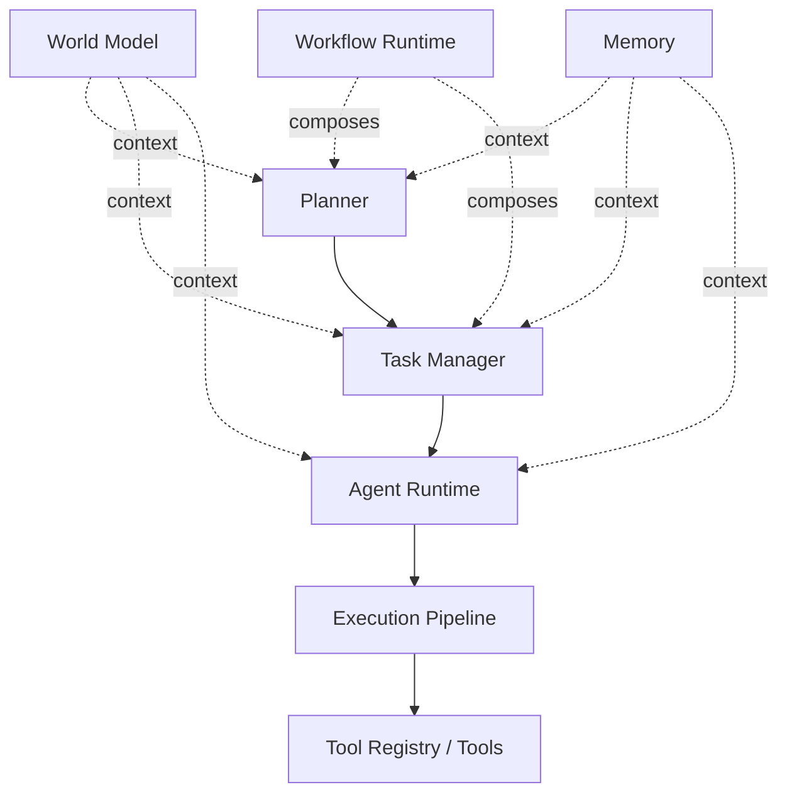

# Parker Implementation Order

## 1. Status

This is an **architecture coordination document**, not a binding
specification and not executable architecture. It records the current
state of the Parker repository as of the corrected Task Manager Runtime
Specification (`docs/specifications/volume-05-task-manager-runtime/TaskManagerRuntimeSpecification.md`)
and the corrected Agent Runtime Specification
(`docs/specifications/volume-04-agent-runtime/AgentRuntimeSpecification.md`),
and recommends an order for the design/specification work that should
follow. Nothing in this document authorises implementation of anything
it lists as "not yet specified" or "next" — each item still requires its
own specification, its own review, and its own correction pass (Section
6) before any Kotlin is written for it. This document does not itself
implement, extend, or reinterpret any existing specification, contract,
or runtime behaviour; it only sequences and explains work that is
already either done or already proposed elsewhere.

Where this document states something is "complete," it means complete
for its own explicitly scoped phase, per that component's own governing
document — it does not mean the platform overall is production-ready, and
this document makes no such claim. Parker today is a runtime and identity
foundation with two approved-at-design-level intelligence-layer
specifications on top of it; it is not yet an agentic system, has no
Planner, Memory, World Model, or Workflow Runtime, and has no Android
integration.

**Sprint 5 status update.** The paragraph above described Parker's
state at the time this document was written, before Sprint 3 and Sprint
4. It is no longer current and is left in place only as a historical
record of the reasoning that follows in Sections 4–7, which remains
architecturally valid even though the status labels attached to it are
now stale. As of Sprint 4: Agent Runtime, Planner Runtime, Memory
Runtime, and World Model Runtime are each specified, contract-designed,
implemented, tested, and reviewed. Parker **does** now have a Planner,
a Memory Runtime, and a World Model Runtime. It does not yet have a
Workflow Runtime or Android integration — those two items, and only
those two, remain accurately described as "not yet specified" anywhere
in this document. See
`docs/reviews/ARCHITECTURE_V2_BASELINE_REVIEW.md` for the current,
authoritative architecture status (Architecture v2.0, achieved with
minor reservations) and
`docs/implementation/IMPLEMENTATION_HISTORY.md` for the current,
unit-by-unit implementation record.

## 2. Current Completed Foundation

The following components are implemented (`src/`), tested
(`tests/`), and specified at Volume 1/3 level. Test result: **101 tests
independently verified in Android Studio, 0 failed** (per
`docs/release/v0.8-runtime-complete-checklist.md` and `README.md`'s
"Known Environment Limitations" note — the Claude Code environment used
to prepare this repository cannot run the Gradle test task directly;
this figure is not something this document or its author verified
directly).

| Component | Role |
|---|---|
| Core Contracts (Volume 1) | The typed data shapes every other component depends on: `ExecutionRequest`, `ExecutionResult`, `PermissionDecision`, `Principal`, `Resource`, and related enums (`RequestOrigin`, `RequestPriority`, `RiskEstimate`, `PermissionAction`, `PermissionDecisionOutcome`, `ExecutionResultStatus`). |
| Runtime contracts | The Kotlin interfaces and lifecycle state machines (`ExecutionLifecycleState`, `ToolLifecycleState`/`ToolLifecycleTransitions`, `PrincipalLifecycleTransitions`) that give the contracts above enforceable, deterministic behaviour. |
| Execution Pipeline | The single, mandatory path (ADR-003) by which any proposed action becomes a tool invocation: `submit → PermissionEngine.evaluate → ToolRegistry.resolve → ToolInvocationBinding.invocableFor → Tool.validate → Tool.execute`. `resolve` yields a descriptor only; `ToolInvocationBinding` (Sprint 1, Unit 11A) is the separate, additive step that binds it to an invocable `Tool`. No component in this repository is specified to bypass it. |
| Tool Registry | The authoritative catalogue of Tools: registration, capability-filtered discovery (`listAll`/`findCandidates`, descriptor-only), and `resolve` (descriptor-only, Execution-Pipeline-only; binding to an invocable `Tool` is `ToolInvocationBinding`'s separate responsibility). |
| EventBus | Structured publish/subscribe communication between Parker services, with authentication, correlation-ID preservation, and (for `execution.*`/`permission.*`) signature requirements. |
| Resource Registry | The authoritative catalogue of Resources: registration, resolution, ownership, and sensitivity classification. |
| Action Mapping | The deterministic translation from free-text `proposedActions` to closed `PermissionAction` vocabulary, owned by the Planner-to-be and consumed identically by the Permission Engine. |
| Identity Service | Principal definition, resolution, and lifecycle (`Created → Active → Suspended → Revoked → Archived`); the "who is requesting this" half of Trust, kept separate from Permission's "are they allowed." |
| Kotlin runtime baseline | The in-memory reference implementations (`InMemoryToolRegistry`, `InMemoryIdentityService`, `DefaultExecutionPipeline`, etc.) built directly from the above specifications, per `docs/architecture/IMPLEMENTATION_GAPS.md`'s tracked, deliberate scope reductions. |

This foundation is the load-bearing layer every design baseline and every
future specification in this document sits on top of. Nothing recommended
in Section 4 proposes changing it.

## 3. Current Approved Design Baselines

Two specifications exist at "corrected draft" status — reviewed
(`docs/reviews/`), corrected in place against their review findings, and
not yet promoted to an implementation phase:

- **Agent Runtime Specification**
  (`docs/specifications/volume-04-agent-runtime/AgentRuntimeSpecification.md`,
  reviewed in `docs/reviews/AgentRuntimeSpecificationReview.md`). Defines
  the Agent Run/Agent Step lifecycle an Agent Instance executes under:
  identity-resolved, permission-mediated, auditable, and explicitly not a
  Task abstraction, a Planner, a Memory system, or a World Model. An
  Agent Instance never executes a tool directly — every proposed action
  becomes an `ExecutionRequest` through the same Execution Pipeline any
  other origin uses.
- **Task Manager Runtime Specification**
  (`docs/specifications/volume-05-task-manager-runtime/TaskManagerRuntimeSpecification.md`,
  reviewed in `docs/reviews/TaskManagerRuntimeSpecificationReview.md`,
  corrected per that review). Defines the Task Manager Runtime as the
  sole owner of the Task Manager Task lifecycle
  (`docs/specifications/volume-02-core-schemas/Task-Schema.md`, ADR-012)
  and the coordination layer that associates zero, one, or many Agent
  Runs with a Task, without itself becoming a second Agent Runtime or
  granting any authority path outside the existing Permission Engine and
  Execution Pipeline.

Together these two documents establish, and only these two documents
establish: a Task Manager Task is the platform's one canonical unit of
tracked work; an Agent Run may execute within a Task Manager Task but
never owns or redefines it; Agent Run state never directly mutates Task
Status — every reflection of one into the other is a deliberate Task
Manager rule, not an automatic mirror.

**Sprint 5 status update.** "Neither document is authorised for
implementation yet," below, described this document's original state
and is no longer true. The Task Manager Runtime Specification was
implemented in Sprint 1 (`src/runtime/InMemoryTaskManagerRuntime.kt`),
and the Agent Runtime Specification was implemented, in bounded
multi-step form, in Sprint 3, Track C
(`src/runtime/InMemoryAgentRuntime.kt`, `docs/architecture/MULTI_STEP_AGENT_RUN_DESIGN.md`).
Both remain accurate as field-level contracts; only their
implementation status has changed since this section was written. The
sentence below is left in place as the historical record it was at the
time.

Neither document is authorised for
implementation yet (see Section 1 and each document's own Status
header).

## 4. Recommended Implementation / Specification Order

"Status" below describes each item's current state in this repository,
not a commitment to build it next. All five items are **not yet
specified** — this table recommends an order to specify them in, which is
a separate question from an order to implement them in (implementation
of any one remains gated on its own future review and correction pass,
per Section 6).

**Sprint 5 status update on the table below.** The "Status" column
describes each item's state at the time this document was written.
Items 1–3 (Planner, World Model, Memory) have since been specified,
contract-designed, implemented, tested, and reviewed — see
`docs/architecture/PLANNER_RUNTIME_PROGRESSION_DESIGN.md`/`PLANNER_RUNTIME_CONTRACT_DESIGN.md`,
`docs/architecture/WORLD_MODEL_RUNTIME_ARCHITECTURE.md`/`WORLD_MODEL_CONTRACT_DESIGN.md`,
and `docs/architecture/MEMORY_RUNTIME_ARCHITECTURE.md`/`MEMORY_CONTRACT_DESIGN.md`
respectively. Items 4–5 (Workflow Runtime, Android Integration) remain
accurately described as "Not yet specified." The original "Status" and
"Reason" text is left unchanged below as the historical record of the
sequencing decision, which remains architecturally valid regardless of
each item's now-updated implementation status.

| Order | Component | Status (at time of writing) | Reason |
|---|---|---|---|
| 1 | Planner Runtime Specification (Chapter 20) | Not yet specified — **now specified and implemented (Sprint 3, Track D)** | The Planner is the one component neither existing baseline defines: both the Agent Runtime Specification (Section 3) and the Task Manager Runtime Specification (Section 3, 13) explicitly assume Goals and proposed actions "arrive already formed." Nothing upstream of Agent Run/Task Manager Task creation is specified today, so it is the most direct gap connecting existing Trust-Framework-grounded work to anything resembling autonomous behaviour. Planner also already has a named seam in `action-mapping.md` ("the Planner is the sole owner of the translation" from intent to Permission Action), so specifying it completes a boundary that already partially exists rather than opening a new one. |
| 2 | World Model Specification (Chapter 16) | Not yet specified — **now specified and implemented (Sprint 4, Track B)** | Both existing baselines already reserve a seam for it (Agent Context/Task Context "may later reference... World Model entries, but does not implement them") without specifying how. A Planner that decomposes Goals into Tasks and Agent Runs plausibly needs to consult current-state beliefs (e.g. "is it within the allowed time window") to do so meaningfully, so specifying World Model early gives Planner something concrete to depend on rather than a placeholder. It is sequenced second, not first, because the Trust Framework, Task Manager, and Agent Runtime do not themselves require it to already exist — only Planner's *decomposition quality* benefits from it, not correctness or safety of the layers below it. |
| 3 | Memory Specification (Chapter 17) | Not yet specified — **now specified and implemented (Sprint 4, Track A)** | Symmetric to World Model: already reserved as a seam by both baselines ("Agent Context is not long-term Memory," "Task Context is not long-term Memory"), and useful to Planner (e.g. "this kind of Task usually takes N minutes") without being required for Task Manager or Agent Runtime correctness. Sequenced after World Model because World Model concerns current-state belief a Planner needs synchronously, whereas Memory concerns historical pattern that improves Planner quality over time but is not a precondition for a first working decomposition. |
| 4 | Workflow Runtime Specification (Chapter 38) | Not yet specified | ADR-012 ("Tasks track work. Workflows define structured multi-step behaviour") and both existing baselines already draw this boundary without filling it in. Workflow Runtime is sequenced after Planner and Task Manager specifically because it composes *them* — multiple Task Manager Tasks, conditions, branching, retries, and rollback — rather than replacing either; specifying it before Planner exists risks inventing orchestration Planner should own, and specifying it before Task Manager was stable would have risked exactly the terminology collision the Task Manager Runtime Specification's own correction pass had to resolve for Agent Runtime. |
| 5 | Android Runtime / Android Integration Specification (Chapter 27) | Not yet specified | Every existing specification (Agent Runtime Section 12, Task Manager Runtime Section 13) already states it "assumes no particular front end." Android integration is sequenced last because it is a consumer of platform semantics, not a source of them: stabilising Planner, World Model, Memory, and Workflow Runtime first means Android integration is specified once against a settled set of Goal/Task/Agent Run/Workflow semantics, rather than needing revision each time one of those four changes underneath it. |

## 5. Dependency Map

```text
Planner
  ↓
Task Manager
  ↓
Agent Runtime
  ↓
Execution Pipeline
  ↓
Tool Registry / Tools
```



The solid path is the only path with any external effect: Planner
proposes, Task Manager tracks, Agent Runtime executes within a Task,
Execution Pipeline mediates permission and enforces the single execution
path, Tool Registry resolves the Tool descriptor and ToolInvocationBinding
binds it to an invocable Tool. World Model and Memory
are read-only *context* inputs to the three orchestration layers above
them — they do not sit in the execution path and do not orchestrate
anything themselves (Agent Runtime Specification, Section 3 and 8; Task
Manager Runtime Specification, Section 3 and 9). Workflow Runtime
*composes* Planner and Task Manager output into structured multi-step
processes; it does not sit below them in the execution path and does not
give Agent Runtime or Execution Pipeline a second entry point.

## 6. Rules for Future Work

- **Do not implement Planner before the Planner Runtime Specification is
  approved.** "Approved" means specified, reviewed, and corrected per
  Section 6's own general rule below — the same process already applied
  to both existing baselines.
- **Do not implement Memory or World Model as orchestration systems.**
  Both are context providers to Planner, Task Manager, and Agent Runtime
  (Section 5); neither owns a Goal, a Task Manager Task, an Agent Run, or
  any lifecycle transition. A specification that gives either the
  ability to trigger execution, mutate Task or Agent Run state, or bypass
  the Permission Engine is out of scope for what this document
  recommends.
- **Do not allow agents to bypass Task Manager or Execution Pipeline.**
  Restating the Agent Runtime Specification's own Section 11 and the
  Task Manager Runtime Specification's own Section 12: an Agent Run's
  only channel for effect is the Execution Pipeline, and its only
  recognised relationship to tracked work is executing within a Task
  Manager Task the Task Manager Runtime itself tracks.
- **Do not allow workflows to bypass Task Manager.** A future Workflow
  Runtime composes Task Manager Tasks; it does not acquire its own
  execution path, its own identity mechanism, or its own permission path
  — the same restriction ADR-012 and both existing baselines already
  place on every component above the Execution Pipeline.
- **Do not add Android integration before platform semantics are
  stable.** "Stable" here means Planner, World Model, Memory, and
  Workflow Runtime have reached at least the same "corrected draft"
  status Agent Runtime and Task Manager Runtime currently have (Section
  3), so Android integration is specified against settled semantics
  rather than a moving target.
- **All new design documents should receive review and correction pass
  before implementation.** The pattern already established for both
  existing baselines — an independent architecture review producing a
  written report, followed by a correction pass addressing that report's
  findings in place — is the expected process for Planner, World Model,
  Memory, and Workflow Runtime as each is drafted, not a one-off applied
  only to Phase 3's first two documents.

## 7. Open Questions

- Should the Planner Runtime Specification or the World Model
  Specification be written first if meaningful Goal decomposition turns
  out to depend heavily on current-state belief (e.g. a Planner cannot
  usefully decompose a Goal like "tidy the house before guests arrive"
  without some notion of current world state)? Section 4 recommends
  Planner first on the grounds that it is the more direct, more clearly
  bounded gap, but this is a judgement call this document does not
  settle.
- Should the Workflow Runtime Specification move ahead of Memory in
  Section 4's order if workflow persistence (surviving a restart,
  resuming a multi-day process) becomes urgent before Memory does? This
  document sequences Workflow Runtime fourth on architectural grounds
  (it composes Planner and Task Manager, both of which should exist
  first), not on urgency, and does not resolve which pressure should win
  if the two conflict.
- When should Android integration realistically begin: strictly after
  Planner alone, or only after Planner, World Model, and Memory are all
  specified? Section 4 places it last of all five items, but does not
  resolve whether a narrower "Planner-only" platform semantics baseline
  would already be sufficient for a first Android integration pass, or
  whether Workflow Runtime specifically must also exist first because
  Android-surfaced work is likely to be long-running.
- Should this document itself be revisited (or superseded) once the
  Planner Runtime Specification exists, given that document will likely
  sharpen or revise some of the reasoning in Section 4 rather than only
  confirming it? **Answered (Sprint 5):** revisited in place, not
  superseded — the Sprint 5 status updates added throughout this
  document correct the now-stale "Status" labels in Sections 1, 3, and
  4 without rewriting the sequencing reasoning itself, which the
  Planner, Memory, and World Model Runtime Contract Design documents
  did not need to revise. `docs/reviews/ARCHITECTURE_V2_BASELINE_REVIEW.md`
  is the current authoritative status document; this one remains the
  historical record of the sequencing decision that got the platform
  there.

## 8. Related Documents

- `docs/specifications/volume-04-agent-runtime/AgentRuntimeSpecification.md`
- `docs/specifications/volume-05-task-manager-runtime/TaskManagerRuntimeSpecification.md`
- `docs/reviews/TaskManagerRuntimeSpecificationReview.md`
- `docs/reviews/AgentRuntimeSpecificationReview.md`
- `docs/specifications/volume-02-core-schemas/Task-Schema.md`
- `docs/adr/ADR-012-task-and-workflow-separation.md`
- `docs/architecture/IdentityService.md`
- `src/contracts/ExecutionRequest.kt`
- `docs/specifications/volume-03-core-interfaces/ToolRegistry.md`
- `docs/specifications/volume-03-core-interfaces/EventType.md`
- `docs/architecture/action-mapping.md`
- `docs/architecture/tool-registry.md`
- `docs/architecture/IMPLEMENTATION_GAPS.md`
- `docs/release/v0.8-runtime-complete-checklist.md`
- `README.md`
- `docs/reviews/ARCHITECTURE_V2_BASELINE_REVIEW.md` (current,
  authoritative architecture status — supersedes this document's
  Section 1/3/4 status claims, not its sequencing reasoning)
- `docs/architecture/PLANNER_RUNTIME_PROGRESSION_DESIGN.md`,
  `docs/architecture/PLANNER_RUNTIME_CONTRACT_DESIGN.md`
- `docs/architecture/MEMORY_RUNTIME_ARCHITECTURE.md`,
  `docs/architecture/MEMORY_CONTRACT_DESIGN.md`
- `docs/architecture/WORLD_MODEL_RUNTIME_ARCHITECTURE.md`,
  `docs/architecture/WORLD_MODEL_CONTRACT_DESIGN.md`
- `docs/implementation/IMPLEMENTATION_HISTORY.md`
