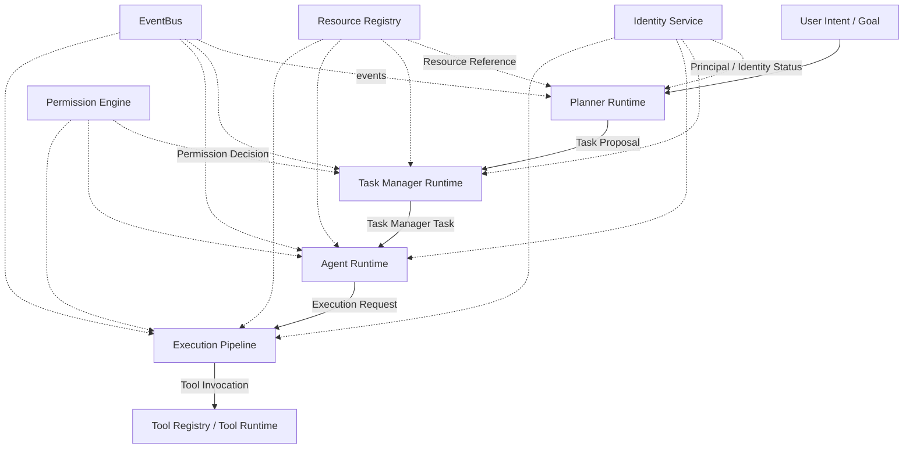

# Parker Inter-Specification Contracts

## 1. Status

This is an **architecture coordination and reference document**, not a
binding runtime specification. It does not define, extend, or change any
contract or behaviour of its own — every row in Section 3 is
sourced from an existing specification, architecture document, schema, or
Kotlin contract, cited in that row. Where this document states a contract
is "not yet closed" or "open," that statement is a description of the
current repository state, not an instruction to close it a particular
way; closing any open contract remains the responsibility of whichever
specification(s) it spans, following the same review-and-correction-pass
process already established for the Agent Runtime Specification and the
Task Manager Runtime Specification (`docs/architecture/IMPLEMENTATION_ORDER.md`,
Section 6). This document introduces no new runtime behaviour and
authorises no implementation.

## 2. Purpose

Parker's architecture is now spread across six specification volumes, a
growing set of Chapter-numbered architecture documents, a dozen ADRs, and
`docs/architecture/IMPLEMENTATION_GAPS.md`'s running log of deliberate
scope reductions. Each specification is deliberately scoped to describe
only the boundary it owns — the Agent Runtime Specification does not
restate the Task Manager Runtime Specification's lifecycle, and the
Planner Runtime Specification does not restate either. This is the right
way to write each document, but it means the *connections* between
documents — which object one specification produces that another
consumes, and whether that connection is already implemented, already
specified, only proposed, or still an open dependency — are only visible
today by reading every specification's own "Related" section and cross-
referencing them by hand.

This document exists so a contributor can answer, in one place and
without reading all six volumes end-to-end: what does the Planner Runtime
actually hand to the Task Manager Runtime, and is that handoff already
real or still an open question? What does the Task Manager Runtime
expect from the Identity Service, and which part of that expectation is
implemented today versus still a recorded gap? It exists to make gaps
*visible* rather than merely *findable* — several of the entries in
Section 6 are gaps that already exist, correctly recorded, in individual
specifications' own Open Questions sections; this document's contribution
is collecting them in one contract-shaped catalogue rather than requiring
a contributor to notice that two separately-written Open Questions, in
two different documents, describe the same seam.

## 3. Contract Map

"Current status" uses the five categories Section 5 defines. Where a
contract spans more than one status (e.g. partially implemented, partially
only specified), the row states the more conservative (least-complete)
status and explains the split in Notes.

| Producer | Contract / Object / Event | Consumer | Current status | Source document | Notes |
|---|---|---|---|---|---|
| User / Front End | Goal / Planning Request | Planner Runtime | Proposed contract | `PlannerRuntimeSpecification.md` §4; `AgentRuntimeSpecification.md` §4 (Goal) | No front end is specified yet (Chapter 27 is future work in every existing document); Goal formation itself remains explicitly out of scope everywhere it is used. |
| Planner Runtime | Task Proposal | Task Manager Runtime | Open dependency | `PlannerRuntimeSpecification.md` §6, §10, Open Questions | `PlannerRuntimeSpecification.md` §6 records this as an explicit, currently-unclosed dependency: the Task Manager Runtime Specification does not yet define a Task Proposal intake operation. See Section 6, Gap 1. |
| Task Manager Runtime | Task Manager Task | Agent Runtime | Approved specification contract | `TaskManagerRuntimeSpecification.md` §6; `AgentRuntimeSpecification.md` §4–5 | Both documents agree, from both sides, that the Task Manager Task is canonical and that an Agent Run may execute within one without ever owning or redefining it. Not yet implemented in Kotlin. |
| Task Manager Runtime | Agent Run Request / Agent Run Reference | Agent Runtime | Proposed contract | `TaskManagerRuntimeSpecification.md` §4 (Agent Run Reference), §7 (sequence diagram: "create Agent Run") | Agent Run Reference is a named, defined concept. A distinct "Agent Run Request" object — the thing the Task Manager Runtime would actually pass to the Agent Runtime to create an Agent Run — is implied by §7's sequence diagram but not separately named or shaped by either document. See Section 6, Gap 7. |
| Agent Runtime | Execution Request (`ExecutionRequest`) | Execution Pipeline | Existing schema-backed contract | `src/contracts/ExecutionRequest.kt`; `AgentRuntimeSpecification.md` §6; `ExecutionPipeline.md` | Implemented and tested. The Agent Runtime is simply another `RequestOrigin` (`AGENT`) submitting through the unchanged `ExecutionPipeline.submit`. |
| Execution Pipeline | Tool Invocation | Tool Registry / Tool Runtime | Existing schema-backed contract | `ExecutionPipeline.md`; `docs/specifications/volume-03-core-interfaces/ToolRegistry.md`; `docs/architecture/tool-registry.md` | Implemented and tested (`DefaultExecutionPipeline`, `InMemoryToolRegistry`). `resolve()` is callable only by the Execution Pipeline and only returns a Tool in `ENABLED` state. |
| Tool Registry | Tool Capability / Tool Metadata | Execution Pipeline / Planner Runtime / Task Manager Runtime | Existing schema-backed contract (Execution Pipeline); Proposed contract (Planner/Task Manager) | `docs/specifications/volume-03-core-interfaces/ToolRegistry.md`; `PlannerRuntimeSpecification.md` §9–10; `TaskManagerRuntimeSpecification.md` §7 | The descriptor-only discovery surface (`listAll`/`findCandidates`) is implemented and already used by the Execution Pipeline path. Its consumption by the Planner Runtime ("required capabilities," a planning-time hint) and the Task Manager Runtime (checking capability exists for a Task Constraint) is specified but not implemented, and never yields anything invocable either way. |
| Identity Service | Principal / Identity Status | Planner Runtime / Task Manager Runtime / Agent Runtime / Execution Pipeline | Existing schema-backed contract (resolution); Open dependency (revocation propagation) | `docs/architecture/IdentityService.md`; `docs/architecture/IMPLEMENTATION_GAPS.md` #37, #39; `AgentRuntimeSpecification.md` §7; `TaskManagerRuntimeSpecification.md` §8; `PlannerRuntimeSpecification.md` §8 | `register`/`resolve`/`updateStatus` are implemented. Two dependencies all three Phase 3 documents rely on remain open: `resolve()` does not yet suppress or flag non-Active Principals (gap #37), and `identity.*` events are not yet published (gap #39). See Section 6, Gap 4. |
| Permission Engine | Permission Decision (`PermissionDecision`) | Task Manager Runtime / Agent Runtime / Execution Pipeline | Existing schema-backed contract | `src/contracts/Permission.kt`; `PermissionEngine.md`; `TaskManagerRuntimeSpecification.md` §7; `AgentRuntimeSpecification.md` §6 | `evaluate()` is called exactly once per `ExecutionRequest`, regardless of origin. Note the related, still-open gap that `PermissionEngine.evaluate` is not yet wired to resolve identity first (`IMPLEMENTATION_GAPS.md` #40) — a caveat on this contract's current reliability, not a different contract. |
| Resource Registry | Resource Reference | Planner Runtime / Task Manager Runtime / Agent Runtime / Execution Pipeline | Existing schema-backed contract (registry itself); Proposed contract (Planning/Task Context usage) | `ResourceRegistry.md`; `PlannerRuntimeSpecification.md` §9; `TaskManagerRuntimeSpecification.md` §9 | `register`/`resolve`/`update`/`listByOwner` are implemented. Planning Context's and Task Context's own "Resource references" categories are specified, reference-only, and not yet implemented. |
| EventBus | Runtime Events (`ParkerEvent`) | Platform observers and audit consumers (Chapter 43) | Existing schema-backed contract (bus mechanism); the audit-consumer side is not confirmed implemented | `src/contracts/EventContracts.kt`; `EventBus.md`; Chapter 43 | `publish`/`subscribe`, authentication, and correlation-ID preservation are implemented for the bus itself. Whether a concrete Chapter 43 Audit subscriber exists and consumes these events is not established by any document reviewed for this catalogue. |
| Task Manager Runtime | Task Events (`task.*`) | EventBus | Approved specification contract | `TaskManagerRuntimeSpecification.md` §10 | 19-event table, each with trigger, payload, and lifecycle relevance. Not yet implemented in Kotlin. |
| Agent Runtime | Agent Events (`agent.*`) | EventBus | Approved specification contract | `AgentRuntimeSpecification.md` §9 | 16-event table, including the corrected `agent.action_denied`/`agent.action_deferred` split. Not yet implemented in Kotlin. |
| Planner Runtime | Planner Events (`planner.*`) | EventBus | Approved specification contract | `PlannerRuntimeSpecification.md` §11 | 13-event table. One known gap: no dedicated event for `SUBMITTED --> REJECTED` (Section 6, Gap 3). Not yet implemented in Kotlin. |

## 4. Key Platform Flow

```text
User Intent / Goal
  ↓
Planner Runtime
  ↓ Task Proposal
Task Manager Runtime
  ↓ Task Manager Task
Agent Runtime
  ↓ Execution Request
Execution Pipeline
  ↓ Tool Invocation
Tool Registry / Tool Runtime
```



The solid path down the left is the same one every existing
specification already describes: Planner proposes, Task Manager tracks
and decides, Agent Runtime executes within a Task, Execution Pipeline
mediates permission and enforces the single execution path, Tool Registry
resolves the invocable Tool. Identity Service, Permission Engine, Resource
Registry, and EventBus are cross-cutting: every orchestration layer
depends on them, none of them depends on any orchestration layer, and
none of them sits in the solid execution path itself.

## 5. Contract Status Categories

- **Existing schema-backed contract.** Implemented in `src/`, defined by
  a Volume 1 schema or Kotlin contract (or both), and exercised by the
  101 independently-verified tests referenced in
  `docs/architecture/IMPLEMENTATION_ORDER.md` Section 2. Example:
  `ExecutionRequest`.
- **Approved specification contract.** Defined in a specification that
  has reached at least "corrected draft" status (reviewed and corrected
  per its own review document) but not yet implemented in Kotlin.
  Example: the Task Manager Runtime's `task.*` event set.
- **Proposed contract.** Named and described within an approved
  specification, but explicitly marked **(proposed)** there rather than
  backed by an existing schema field, and not yet a settled mechanism
  between the two documents it spans. Example: Task Assignee (Task
  Manager Runtime Specification), or the Planner Runtime's consumption of
  Tool Registry capability metadata.
- **Open dependency.** One specification's behaviour depends on a
  mechanism that specification does not itself define, and that is
  recorded as an Open Question in at least one of the documents it spans.
  Example: the Task Proposal intake contract (Section 6, Gap 1).
- **Future integration.** Explicitly out of scope for every current
  specification, reserved as a named seam for a future document —
  Memory, World Model, Workflow Runtime, Android integration, the Plugin
  ecosystem, or external reasoning models. Not shown in Section 3's
  Contract Map, since no current specification defines a contract for it
  yet; see each specification's own "Relationship to Future Systems"
  section instead.

## 6. Open Contract Gaps

Every gap below is already recorded in at least one existing
specification or `IMPLEMENTATION_GAPS.md`; none is introduced by this
document. Numbering is for cross-reference within this document only and
does not correspond to `IMPLEMENTATION_GAPS.md`'s own numbering.

1. **Task Proposal intake contract in Task Manager Runtime.** The Task
   Manager Runtime Specification does not define an operation for
   receiving a Task Proposal. Recorded in `PlannerRuntimeSpecification.md`
   §6 and Open Questions.
2. **Task Manager response contract for accept/defer/split/merge/reject.**
   Even once a Task Proposal can be received, no mechanism (operation,
   event, or otherwise) exists for the Task Manager Runtime to
   communicate its disposition back to the Planner Runtime. Recorded in
   `PlannerRuntimeSpecification.md` §6, §11, and Open Questions.
3. **Planner `SUBMITTED --> REJECTED` event gap.** Because of Gap 2, the
   Planner Runtime Specification's own event table has no dedicated event
   for this transition. Recorded in `PlannerRuntimeSpecification.md` §11
   and Open Questions.
4. **Identity revocation detection and propagation gaps.**
   `IdentityService.resolve()` does not yet suppress or flag non-Active
   Principals (`IMPLEMENTATION_GAPS.md` #37), and `identity.*` audit/
   revocation events are not yet published (`IMPLEMENTATION_GAPS.md` #39).
   All three Phase 3 documents (Agent Runtime §7, Task Manager Runtime
   §8, Planner Runtime §8) depend on one or both of these closing and
   record the identical dependency independently.
5. **Permission gating for cross-Principal Task control.** The Task
   Manager Runtime Specification (§8) states plainly that, as specified
   today, no Permission Engine gate exists for one Principal to cancel,
   reassign, or otherwise mutate another Principal's Task — attribution
   is recorded, but authorisation is not checked. Recorded as an explicit
   statement and an Open Question in `TaskManagerRuntimeSpecification.md`
   §8 and Open Questions.
6. **Deliberation Service versus Planner internal Plan Decision
   boundary.** Chapter 20 names a "Deliberation Service" distinct from the
   Planner; no specification in this repository defines one separately.
   The Planner Runtime Specification's Plan Decision (§4) currently
   absorbs that role, with the question of whether they should split left
   open. Recorded in `PlannerRuntimeSpecification.md` §1 and Open
   Questions.
7. **Agent Run Request has no named, shaped object.** Unlike Agent Run
   Reference (a defined Core Concept), the object the Task Manager
   Runtime would pass to the Agent Runtime to actually create an Agent
   Run is only implied by a sequence diagram
   (`TaskManagerRuntimeSpecification.md` §7: "create Agent Run") and never
   separately named or field-shaped by either document. Not separately
   recorded as an Open Question in either existing specification; surfaced
   here as a gap evidenced directly by the asymmetry between the two
   documents' own Core Concepts sections.
8. **`PermissionEngine.evaluate` not yet wired to resolve identity
   first.** `IdentityService.md` ("Integration with Permission Engine")
   specifies this; `IMPLEMENTATION_GAPS.md` #40 records it as deliberately
   not yet done. This affects the reliability of every Permission Decision
   contract in Section 3 that depends on Principal status being checked
   as part of evaluation, not just the Identity Service row.
9. **Exact cascading-revocation rule undecided.** `IdentityService.md`
   ("Trust Relationships") requires the Identity Service to evaluate
   whether an owned Principal should also transition on revocation, but
   leaves the exact rule (immediate vs. suspend-pending-review) open
   (`IMPLEMENTATION_GAPS.md` #35). The Agent Runtime Specification's Open
   Questions restates this as applying to Agent Instances as owned
   Principals; it is not yet restated in the Task Manager Runtime or
   Planner Runtime Specifications, though the same owned-Principal
   pattern (Task Assignee, Planning Session initiating Principal) would
   plausibly be affected once it is settled.
10. **Proposal-to-proposal Dependency resolution is unspecified.** A Task
    Proposal's Dependency field (`PlannerRuntimeSpecification.md` §4, §10)
    may reference another, not-yet-existing Task Proposal in the same
    Planning Session; how the Task Manager Runtime should resolve
    ordering or atomicity across such a set at acceptance time is
    recorded as an Open Question there, and is directly entangled with
    Gap 1 and Gap 2 above.

## 7. Safety Rules Across Contracts

These restate, without altering, rules already stated independently in
one or more existing specifications. They are collected here because
they are cross-cutting — each spans more than one contract in Section 3
— not because this document is introducing them.

- **Intelligent subsystems propose; deterministic runtime components
  authorise and execute.** The Planner Runtime proposes (Task Proposal);
  the Task Manager Runtime and Agent Runtime coordinate and perform work
  within Tasks; the Permission Engine authorises; the Execution Pipeline
  and Tool Registry execute. No contract in Section 3 lets a proposing
  component skip the authorising or executing ones.
- **The Planner does not create Tasks.** Restated from
  `PlannerRuntimeSpecification.md` §6, §13: its only output is a Task
  Proposal.
- **The Task Manager does not execute tools.** Restated from
  `TaskManagerRuntimeSpecification.md` §3, §7, §12: it holds no invocable
  `Tool` reference and never calls `ToolRegistry.resolve` itself.
- **The Agent Runtime does not bypass Task Manager or Execution
  Pipeline.** Restated from `AgentRuntimeSpecification.md` §11 and
  `TaskManagerRuntimeSpecification.md` §6: an Agent Run's only channel
  for effect is the Execution Pipeline, and its only recognised
  relationship to tracked work is executing within a Task Manager Task
  the Task Manager Runtime itself tracks.
- **The Execution Pipeline remains the only path to tool execution.**
  Restated from ADR-003 and every existing specification's own "No
  execution bypass" design goal: `ExecutionPipeline.submit` is the sole
  entry point, for every origin, with no parallel path.
- **The Permission Engine remains the authority for permission
  decisions.** Restated from `PermissionEngine.md` and every existing
  specification: no component evaluates permission on its own authority,
  labels a proposal as pre-approved, or substitutes its own judgement for
  a `PermissionDecision`.
- **The Identity Service remains the authority for Principal state.**
  Restated from `IdentityService.md` and every existing specification: no
  component maintains its own identity store or writes a `Principal`
  record directly; `updateStatus` is the sole sanctioned mutation path.
- **Memory and World Model must not become orchestration systems.**
  Restated from every existing specification's Non-Goals and Context
  Model sections: Task Context, Agent Context, and Planning Context are
  each explicitly not Memory and not the World Model, and neither Memory
  nor the World Model is specified anywhere in this repository as owning
  a Goal, a Task, an Agent Run, or any lifecycle transition.
- **All meaningful transitions and events must be auditable.** Restated
  from every existing specification's own "No unaudited lifecycle
  transition" / "no hidden background execution" safety boundaries: every
  real lifecycle transition in the Agent Run, Task Manager Task, and
  Planning Session lifecycles has (with the single, disclosed exception
  of Gap 3 above) a corresponding event on the EventBus.

## 8. Future Use

- **Writing new specifications.** Before drafting a new specification
  (Memory, World Model, Workflow Runtime, Android integration, or a
  revision closing one of Section 6's gaps), consult Section 3 for what
  the new document will need to produce or consume, and Section 5 to mark
  each new contract's status honestly (most will start as "Proposed
  contract" or "Open dependency," not "Approved," on first draft).
- **Reviewing specifications.** An independent review (mirroring
  `docs/reviews/AgentRuntimeSpecificationReview.md` and
  `docs/reviews/TaskManagerRuntimeSpecificationReview.md`) can use Section
  3 to check whether a new or revised specification's claims about another
  document's contracts are accurate, and Section 6 to check whether a
  reviewed document has silently resolved a gap this document already
  tracks as open, rather than explicitly closing it.
- **Implementation planning.** Before any specification is promoted to
  an implementation phase (per `docs/architecture/IMPLEMENTATION_ORDER.md`
  §6's rule that implementation requires an approved specification first),
  Section 3's "Current status" column and Section 6's gap list identify
  what else would need to close for that implementation to have anything
  real to integrate with.
- **Contributor onboarding.** A new contributor can read this document
  instead of all six specification volumes to understand how the major
  subsystems fit together, then follow the "Source document" column into
  whichever specification they need full detail from.
- **Resolving architectural gaps.** When a human decision closes one of
  Section 6's gaps (e.g. defining the Task Proposal intake contract),
  this document should be updated to move that row's status forward in
  Section 3 and remove or update the corresponding gap in Section 6 — but
  only as a follow-up act reflecting a decision already made in the
  relevant specification(s), never as the place that decision is made.

## 9. Related Documents

- `docs/architecture/IMPLEMENTATION_ORDER.md`
- `docs/specifications/volume-06-planner-runtime/PlannerRuntimeSpecification.md`
- `docs/specifications/volume-05-task-manager-runtime/TaskManagerRuntimeSpecification.md`
- `docs/specifications/volume-04-agent-runtime/AgentRuntimeSpecification.md`
- `docs/reviews/AgentRuntimeSpecificationReview.md`
- `docs/reviews/TaskManagerRuntimeSpecificationReview.md`
- `docs/architecture/20-planning-and-deliberation-framework.md`
- `docs/architecture/IdentityService.md`
- `docs/specifications/volume-02-core-schemas/Task-Schema.md`
- `docs/adr/ADR-012-task-and-workflow-separation.md`
- `src/contracts/ExecutionRequest.kt`
- `docs/specifications/volume-03-core-interfaces/ToolRegistry.md`
- `docs/architecture/tool-registry.md`
- `docs/specifications/volume-03-core-interfaces/EventType.md`
- `docs/architecture/action-mapping.md`
- `docs/specifications/volume-03-core-interfaces/ResourceRegistry.md`
- `docs/specifications/volume-03-core-interfaces/ExecutionPipeline.md`
- `docs/specifications/volume-03-core-interfaces/PermissionEngine.md`
- `docs/specifications/volume-03-core-interfaces/EventBus.md`
- `docs/specifications/volume-01-core-contracts/Principal.md`
- `docs/schemas/Task.schema.json`
- `src/contracts/Permission.kt`
- `src/contracts/EventContracts.kt`
- `docs/architecture/IMPLEMENTATION_GAPS.md`
