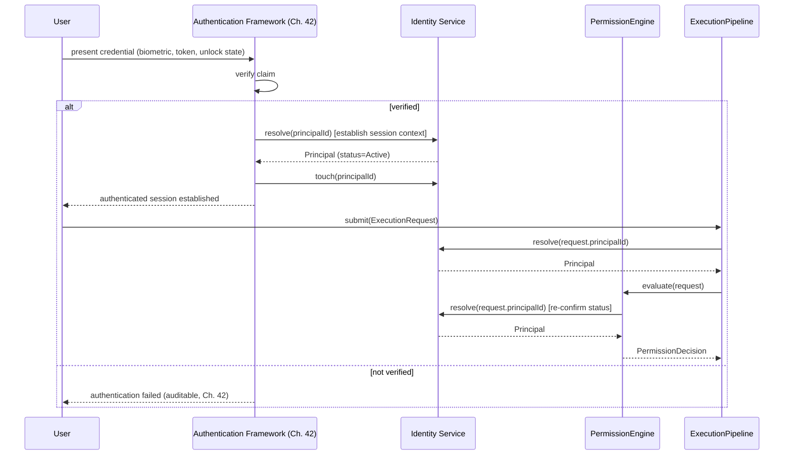

# Identity Service Architecture

## Status

Version: 0.7-alpha
Status: New architecture specification (Priority 4, v0.7 Architecture
Completion Phase). Per this phase's explicit instruction, **no
`IdentityService` interface is implemented in Kotlin here** — this
document is the "reviewable architecture proposal" that
`docs/architecture/IMPLEMENTATION_GAPS.md` #1 said would follow the
original deferral decision. It graduates that deferred item from "no
architecture exists" to "architecture exists, implementation still
deliberately withheld until an implementation phase is declared for it
(per ADR-022)."

## Purpose

Chapter 41 already establishes the Identity Service's purpose: it defines
and manages Principals, and answers "who is requesting this?" as a
question kept strictly separate from Permission's "are they allowed?".
This document completes that chapter with the structural detail
(interfaces, lifecycle ownership, resolution mechanics, trust
relationships, and integration points) needed before an implementation
phase can build it without inventing behaviour.

## Responsibilities

Restating and extending Chapter 41's list with the structural detail this
phase requires:

- Define and store Principal records (all eight `PrincipalType` values
  already specified in `src/contracts/Principal.kt`).
- Resolve a `PrincipalId` to its full `Principal` record, for every other
  core service that needs one (Permission Engine, Execution Pipeline,
  Event Bus, Tool Registry, Audit).
- Maintain each Principal's `owner` relationship (see "Trust
  Relationships").
- Own the `Principal` lifecycle state machine
  (`docs/diagrams/principal-lifecycle-state-machine.mmd`) — the Identity
  Service is the architectural home for the
  `PrincipalLifecycleTransitions` validator that
  `docs/architecture/IMPLEMENTATION_GAPS.md` #5 deferred; this document
  assigns that ownership without yet writing the Kotlin.
- Update `lastSeenAt` (a required `Principal` field) as Principals act.
- Emit audit-relevant events for every registration, status change, and
  resolution failure (see "Interaction with Audit").
- Refuse to resolve, or resolve as inert, any Principal that is
  `Revoked` or `Archived`.

## Interfaces (Proposed)

The following interface shape is **proposed** for Volume 3, following the
same small-surface pattern already used by `ResourceRegistry.md`
(register / resolve / update / listByOwner), per ADR-021 (Core Interface
Boundaries). It is documentation of a proposal, not an addition to
`src/interfaces` or `src/contracts` — promoting it there is implementation
work for a later, explicitly-declared phase.

```kotlin
interface IdentityService {
    suspend fun register(principal: Principal): PrincipalId
    suspend fun resolve(principalId: PrincipalId): Principal?
    suspend fun updateStatus(principalId: PrincipalId, status: PrincipalStatus): Principal
    suspend fun touch(principalId: PrincipalId): Principal
    suspend fun listByOwner(owner: PrincipalId): List<Principal>
}
```

- `register` — creates a new Principal at lifecycle state `Created`.
  Requires an already-established owning context (see "Trust
  Relationships") for any `PrincipalType` other than `USER` or `SYSTEM`.
- `resolve` — the primary read path; returns `null` for an unknown
  `PrincipalId` (not an exception), consistent with `ResourceRegistry.resolve`'s
  established pattern.
- `updateStatus` — the only sanctioned way to move a Principal through its
  lifecycle; MUST enforce `PrincipalLifecycleTransitions` (once
  implemented) rather than allowing an arbitrary status write.
- `touch` — updates `lastSeenAt`; called by the Execution Pipeline and
  Event Bus whenever a Principal successfully acts, not exposed as a
  general-purpose field update.
- `listByOwner` — supports delegation and ownership queries (see "Trust
  Relationships"), mirroring `ResourceRegistry.listByOwner`.

## Lifecycle

The Identity Service owns enforcement of the lifecycle already specified
in `Principal.md` and transcribed in
`docs/diagrams/principal-lifecycle-state-machine.mmd`:
`Created → Active → Suspended → Revoked → Archived`. As already noted
there, no branching (e.g. `Suspended → Active` reactivation) is specified
anywhere in prose, so none is proposed here — extending that diagram with
new edges remains a decision for whoever owns that specific question, not
something this document invents to fill a perceived gap.

`updateStatus` is where the Identity Service becomes the single
enforcement point for this state machine — no other component may write a
Principal's `status` field directly.

## Principal Resolution

- Every core service that needs to act on identity (Permission Engine,
  Execution Pipeline, Event Bus, Tool Registry, Audit) resolves a
  `PrincipalId` through the Identity Service rather than caching or
  re-deriving Principal data itself. This keeps exactly one authoritative
  source for "does this Principal exist, and what state is it in."
- An unresolvable `PrincipalId` (not found, or found but `Revoked`/`Archived`)
  is treated the same way `docs/architecture/action-mapping.md` treats an
  unresolvable proposed action: **invalid, not denied.** An
  `ExecutionRequest` from a Principal that cannot be resolved never
  reaches `PermissionPending` — it fails validation outright, since there
  is no identified actor to evaluate a decision against (`Principal.md`:
  "Parker MUST NOT execute any request without an identified Principal").
- Resolution is expected to be a frequent, low-latency operation (called
  on effectively every Execution Pipeline submission); implementations MAY
  cache resolved Principals, but any cache MUST be invalidated immediately
  on `updateStatus`, especially for transitions into `Revoked` — stale
  cached identity is a trust violation, not a performance nicety.

## Trust Relationships

- Every `Principal` already carries a nullable `owner: PrincipalId` field
  (`src/contracts/Principal.kt`, reconciled during the Phase 1 follow-up).
  This document defines what `owner` means architecturally: it is the
  Identity Service's mechanism for **delegation** — the Principal on
  whose behalf another Principal acts.
- Typical ownership patterns:
  - A `USER` or `SYSTEM` Principal's `owner` is `null` (root identities,
    not delegated from anything).
  - An `INTERNAL_AGENT`'s `owner` is the `USER` (or `SYSTEM`) Principal it
    was created to act on behalf of.
  - A `PLUGIN`'s `owner` is either `null` (platform-installed) or the
    `USER` Principal who installed it.
  - A `TOOL`'s `owner` is whichever Principal registered it (see
    `docs/architecture/tool-registry.md`, "Registration Model") — usually
    `SYSTEM` for core Tools, or the owning `PLUGIN` for plugin-supplied
    Tools.
  - A `SCHEDULED_TASK` or `DEVELOPER_SESSION` Principal's `owner` is the
    `USER` who created the schedule or opened the session.
- **Delegation is single-level in v0.7**: an owned Principal's own actions
  are attributed to itself (its own `principalId` appears in
  `ExecutionRequest.principalId` and audit records), not silently
  rewritten to its owner. `owner` is metadata for accountability and
  cascading lifecycle decisions (see below), not a substitution mechanism.
  Chained delegation (an owned Principal itself owning further Principals
  beyond one level) is not prohibited by the schema, but this document
  does not specify special handling for it — recorded as a future
  extensibility question, not resolved here.
- **Cascading revocation**: when a Principal transitions to `Revoked`,
  the Identity Service MUST evaluate whether any Principal it owns
  (via `listByOwner`) should also transition — at minimum, Principals of
  type `INTERNAL_AGENT`, `TOOL`, or `SCHEDULED_TASK` owned by a Revoked
  `USER` Principal MUST also be suspended or revoked, since they have no
  remaining accountable owner. The exact cascading rule (immediate revoke
  vs. suspend-pending-review) is left as an open question below rather
  than invented outright, since it has real user-facing consequences
  (e.g. a household member's agents/schedules disappearing immediately vs.
  gracefully).

## Authentication Flow

Identity and Authentication remain architecturally separate (Chapter 41:
"Identity Is Not Permission"; Chapter 42 makes the parallel distinction
for Authentication: "Authentication proves identity. Authorisation grants
action."). The Identity Service does not itself verify biometrics, tokens,
or device unlock state — that remains the Authentication Framework's
(Chapter 42) responsibility. The two integrate as follows:



- Authentication establishes *that* a claim is genuine; the Identity
  Service supplies *what* is known about the resulting Principal.
  Neither step grants authority — that remains exclusively the Permission
  Engine's role, preserving Chapter 42's closing line: "Authentication
  establishes identity. Permission still determines authority."
- Sensitive actions requiring step-up/re-authentication (Chapter 42: data
  export, unlocking doors, disabling alarms, changing trust settings,
  viewing credentials) are an Authentication Framework concern layered
  *on top of* a normal Permission Engine evaluation — the Identity Service
  itself has no separate "sensitivity" concept beyond what `Resource.sensitivity`
  already captures for the target Resource.

## Integration with Permission Engine

- `PermissionEngine.evaluate(request)` MUST resolve `request.principalId`
  via the Identity Service as its first step (mirrors "Principal
  Resolution" above), before any action-mapping or Resource-sensitivity
  logic runs (see `docs/architecture/action-mapping.md`).
- A Principal resolved as `Suspended` or `Revoked` MUST short-circuit
  evaluation to `PermissionDecisionOutcome.DENIED` — the Permission Engine
  never needs to consult policy for a Principal that is not in good
  standing.
- `PermissionExplanation` (`docs/specifications/volume-03-core-interfaces/PermissionExplanation.md`)
  responses for a denial caused by Principal status SHOULD say so
  explicitly (e.g. "Principal is Suspended"), rather than a generic
  denial reason — this is a recommendation for that document's still-open
  "policy rule reference" question, not a requirement change to it here.

## Interaction with World Model

- The World Model (Chapter 16) represents Parker's transient, sourced,
  confidence-scored beliefs about reality. **Principal identity is
  authoritative trust data, not a World Model belief** — a Principal's
  existence and status are not "believed with some confidence," they are
  established facts the Identity Service is authoritative for.
- The World Model MAY reference a `PrincipalId` to attribute the source of
  a belief (e.g. "according to `principalId=X`, the front door is
  locked"), but MUST NOT maintain its own competing copy of that
  Principal's identity attributes (status, owner, type). This keeps a
  single source of truth and avoids the World Model's confidence-scoring
  model leaking into what must remain a deterministic trust fact.

## Interaction with Audit

- `Principal.md`'s existing normative requirement ("Principal activity
  MUST be auditable") is satisfied structurally: every `register`,
  `updateStatus`, and resolution failure (unknown or non-Active Principal)
  emits an event through the Event Bus (`docs/specifications/volume-03-core-interfaces/EventBus.md`),
  namespaced under the `identity.*` domain per that document's naming
  convention — e.g. `identity.principal.registered`,
  `identity.principal.status_changed`, `identity.resolution.failed`.
- These events are trust-sensitive (Chapter 13/`EventBus.md`: events that
  influence Trust must be authenticated) and are consumed by the Audit
  framework (Chapter 43) to build the append-only record Chapter 43
  requires. The Identity Service does not write audit records directly —
  it publishes events; Audit is a subscriber, keeping the two systems
  decoupled per the Event Bus's existing publish/subscribe model.

## Open Questions (not resolved by this document)

- Exact cascading-revocation rule for owned Principals (immediate revoke
  vs. suspend-pending-review).
- Whether chained delegation (a Principal owning a Principal that itself
  owns further Principals) needs explicit handling beyond what the
  single-level model above covers.
- Whether `Principal` resolution caching should be a formally specified
  interface capability (e.g. a `PrincipalCache` supporting type) or left
  entirely to implementations, given the invalidation-on-revoke
  requirement above.

## Related

- Chapter 41 – Identity Service
- Chapter 42 – Authentication Framework
- Chapter 16 – World Model
- Chapter 43 – Audit and Observability
- Chapter 44 – Secrets and Credential Management
- ADR-013 – Agents and Services Use Principal Identities
- ADR-021 – Core Interface Boundaries
- ADR-022 – Kotlin Interface Stubs
- `docs/specifications/volume-01-core-contracts/Principal.md`
- `docs/diagrams/principal-lifecycle-state-machine.mmd`
- `docs/specifications/volume-03-core-interfaces/EventBus.md`
- `docs/architecture/action-mapping.md`
- `docs/architecture/tool-registry.md`
- `docs/architecture/IMPLEMENTATION_GAPS.md` #1
