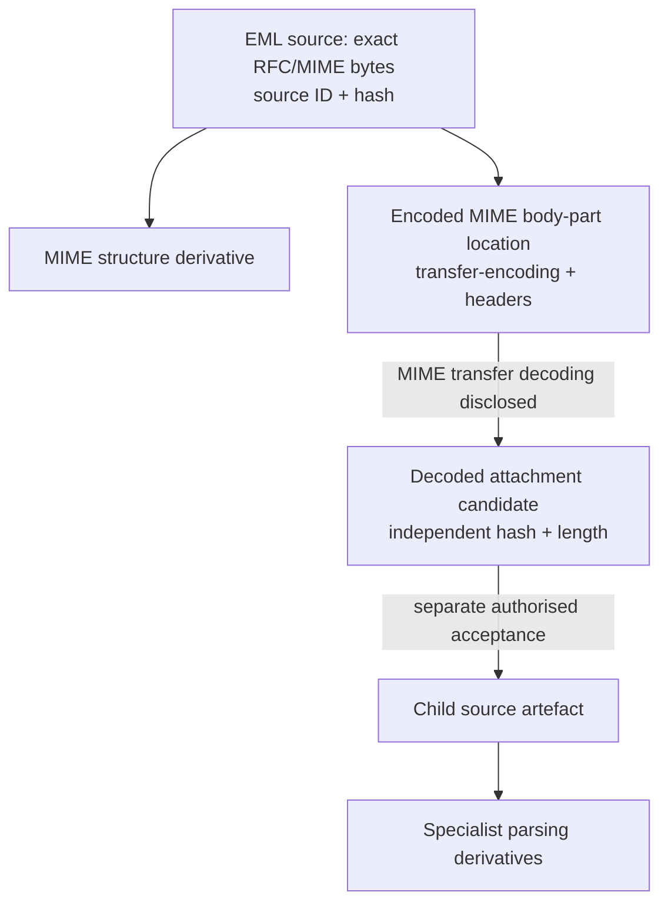
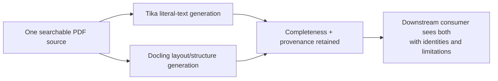

# Source / Derivative Provenance Model

## Status

**Draft for human review. Governance Unit 1.** This is a proposed extension,
not an amendment to frozen Evidence Custodian or Memory Core governance and not
an implementation authority.

## 1. Authority model

### Authoritative source artefact

The exact bytes presented for ingestion and accepted through Evidence Custodian.
Its evidential authority is the bytes, not a parser's representation. The source
record must associate: custodied artefact ID; cryptographic algorithm and digest;
byte length; received media type; detected media type and detector identity;
original filename when supplied (metadata only); acceptance/ingestion time;
submitting principal and authorised context; origin metadata when available; and
custody/audit linkage. Unknown facts remain absent or explicitly unknown and are
never invented.

Every digest in this model is represented as an (algorithm, digest) pair, never a
bare hex string with an assumed algorithm. SHA-256 is the required current
algorithm; this shape does not encode it as an eternal identity assumption, and a
future governed algorithm addition does not require redefining the pair shape.
Where a manifest or provenance envelope (Section 2) is itself made hash-addressed
rather than only containing hashes of other content, its serialisation must be
deterministic and canonical before that digest can carry evidential meaning; an
envelope digest computed over a non-canonical or non-deterministic serialisation
is not evidence of anything and must not be presented as one.

The current `AcceptedEvidenceArtifact` does not carry most of these fields and
must not be overloaded. A future separately governed source-ingestion record or
linked Memory Core provenance/audit records must own them.

### Derivative artefact

Any representation produced from a source or another derivative: extracted text,
fields, headers, MIME tree, decoded bytes, OCR and coordinates, tables, OOXML
paragraph/run structure, convenience normalisation, render, embedded image,
metadata interpretation, JSON, or model interpretation. It carries no source
authority. Custody of a derivative preserves its bytes; it does not make its
claims original-source facts or human-verified.

### Child source artefact

A derivative byte stream may become a child source only through a new, explicit,
authorised Evidence Custodian acceptance. It then has independent byte identity
and is authoritative for the exact decoded/extracted bytes accepted at that
boundary, while its derivation lineage remains permanent. It is not authoritative
for how those bytes appeared in the parent's encoded representation.

## 2. Identity and required provenance

A derivative generation has a stable derivative ID distinct from any parent and
records these required facts:

- root source artefact ID and verified source hash;
- immediate parent ID and parent kind when not the root source;
- derivative kind and content hash/length (or a structured manifest hash when it
  has no single byte representation);
- plugin, parser/mechanism and adapter identities and versions;
- configuration identity and digest;
- creation time and ordered transformation chain;
- attempt/generation identity and audit correlation;
- operational outcome, warnings and completeness assessment.

Required when applicable/available: model identity/version; confidence with its
scope and producer; source location/page/part/record/field/byte range; coordinates
and coordinate system; declared/detected media type; charset declaration and
actual decoding choice; errors and omitted scopes. An unavailable optional field
is stated as unavailable where ambiguity would otherwise result. Confidence is
never fabricated and never substitutes for provenance or completeness.

Reprocessing always creates a new attempt and new derivative generation, even if
content hashes match. Identical content may be deduplicated physically only if
identity, generations, provenance and audit remain independently addressable.
Historical output is never mutated in place.

Generation identity is an opaque, immutable identifier per generation record,
not a fragile globally- or source-scoped sequential integer counter. Each
generation records its own ID, its immediate parent ID, and its creation time;
ordering and "which generation is newest" are derived from that immutable
parent-link chain and timestamp, never from a mutable counter that a concurrent
attempt, a retry, or a future backfill could race or renumber. A generation
number, when shown for human readability, is a derived display value computed
from the chain, never the identity itself, and never reused if a generation is
later superseded or found invalid.

## 3. Enforceable invariants

- **I-1 Source immutability.** No ingestion operation overwrites or mutates
  source bytes.
- **I-2 Prior identity.** Parker establishes source ID, digest and length before
  invoking a parser.
- **I-3 No authority inheritance.** A derivative cannot replace, redefine, or
  silently inherit source authority.
- **I-4 Complete lineage.** Every derivative traces through immutable immediate
  parent links to one authoritative root source.
- **I-5 Reproducibility identity.** Plugin/parser, adapter, versions and
  configuration are recorded for every generation.
- **I-6 Transformation disclosure.** Every material transformation is ordered
  and disclosed.
- **I-7 OCR identity.** OCR-origin text is explicitly OCR-derived and cannot be
  represented as native source text.
- **I-8 Completion is not completeness.** Operational parser completion never
  proves that all expected evidential components were captured.
- **I-9 Attachment dual identity.** A preserved decoded attachment has its own
  digest/length and permanent linkage to its parent and encoded MIME location.
- **I-10 Coexistence.** Multiple plugin outputs coexist; no output silently
  supersedes another.
- **I-11 Generational history.** Reparsing or correcting produces a new linked
  generation, never mutation of historical output.
- **I-12 No downstream write authority.** Plugins cannot write directly to
  Memory Core, Knowledge Memory/Items, or RKS/QMD.
- **I-13 No evidential reasoning.** Ingestion does not determine truth, legal
  significance, credibility, conflict, or intent.
- **I-14 Auditable non-success.** Failure, policy/resource block, corruption,
  warnings and partial output remain explicit and auditable.
- **I-15 Independent retrieval.** The source remains retrievable independently
  of every derivative; derivative deletion/replacement cannot affect it.
- **I-16 Before/after integrity.** Parker verifies source identity before plugin
  execution and reverifies after it; mismatch or unverifiability fails closed.
- **I-17 Failure isolation.** Plugin failure cannot damage source custody.

## 4. EML attachment lineage

The EML source is authoritative for headers, boundaries and encoded body-part
representation. The decoded stream is authoritative only for its bytes after
separate acceptance. It records parent EML ID/hash, MIME part path, transfer
encoding, declared media type/name, decoder identity/version/configuration, and
decoded hash/length. A filename is metadata, never a storage path. Without a
declared charset the attachment remains byte-authoritative; any convenience text
decoding is another derivative with the chosen/inferred charset disclosed.

Mime4j bake-off evidence supports this specialist route: full MIME structure,
Cc/Message-ID, original and semantic Date, exact body, exact decoded attachment
bytes and metadata. Those findings support capability selection; they do not make
Mime4j output source truth.

## 5. OCR provenance

OCR text is never source text. Every OCR generation records root and immediate
image/page identity; engine/mechanism and adapter identities/versions; model,
language and configuration where applicable; time; page/image scope; recognised
text hash; fidelity classification; confidence only where available; coordinates
and coordinate system where available; warnings, degradation and completeness.

The implemented `OcrRecognitionIdentity`, `TranscriptionFidelity`, segments and
typed outcomes remain the minimum compatible mechanism disclosure. This proposal
adds lineage/audit/generation requirements at Parker-owned orchestration, not to
the mechanism itself. Corrections never overwrite OCR output. Human-corrected OCR
is a new derivative linked to the OCR generation and correcting principal/action.
Tesseract remains unevaluated because it was not installed; no quality conclusion
is authorised. Docling is the demonstrated OCR mechanism, subject to its recorded
runtime/model footprint and routing policy.

## 6. Multi-parser coexistence

The two outputs answer different declared questions. Neither overrides the other;
selection or synthesis is a separately governed downstream act and, if persisted,
creates another derivative.

## 7. Governance conflicts and required amendments

Evidence Custodian already owns acceptance, exact-byte storage, retrieval and
owner-only audited deletion (`FileSystemEvidenceDeletionAudit` is the existing
durable-audit-log precedent a future ingestion audit port should follow, not
duplicate). Memory Core already owns Provenance and Document registration.
CDR-006 froze original-evidence custody and immutability as canonical; it is not
reopened by this draft and none of the amendments below touches it. The
searchable-PDF coordinator already hashes the source, verifies identity
before/after parsing, accepts a derivative and creates provenance. These are
compatible precedents and must remain owners of those acts.

No conflict was found between this model and any canonical document. The frozen
Evidence Artifact Contract, `AcceptedEvidenceArtifact`, Memory Core's Provenance
and Document contracts, and CDR-006/CDR-007 are all silent on, rather than
contradicted by, general source/derivative/child-source lineage. Silence is not
authority: the following narrow amendments are required before implementation,
and are the minimum needed — no wholesale reopening of any frozen contract.

1. **Three-kind vocabulary.** Adopt source/derivative/child-source without
   changing original custody authority. Non-substantive: adds descriptive
   vocabulary; grants no new write authority; does not touch CDR-006.

2. **Non-byte structural derivatives (Owner Decision 1 — resolved).** Do not
   force every structural derivative into `EvidenceArtifact` merely because
   `DerivativeReviewRegistry` currently keys on `EvidenceArtifactId`
   (`src/interfaces/DerivativeReview.kt:56-58`, confirmed in code). A
   derivative whose independently preserved bytes exist gets custody as a
   custodied artefact, as today. A structural derivative with no single byte
   representation (e.g. a MIME tree, a completeness manifest) instead gets an
   immutable, provenance-bearing **Derivative Generation Record** — new
   governance vocabulary, not an `EvidenceArtifact` — issued by the same
   Parker-owned coordinator that today issues `EvidenceArtifactId`s. The
   `DerivativeReviewRegistry`/`DerivativeReviewRecord` shape must be amended to
   key on a broadened review-target identity (e.g. a sum type of
   `EvidenceArtifactId` and a new `DerivativeGenerationId`) rather than
   `EvidenceArtifactId` alone. See the amendment map document for the exact
   surface.

3. **Source manifest and Memory Core provenance authority split (Owner
   Decisions 4-5 / Critical Issues 3 and 5 — resolved).** Memory Core's
   `Provenance` is deliberately generic: its `processingHistory` is a list of
   free-text audit entries, additive-only, not a structured, ordered
   transformation chain, and it carries no plugin/adapter identity, software
   version, or configuration-digest field. Memory Core's `Document` explicitly
   never represents "a document's parsed contents, extracted text, page
   structure, or any interpretation of what the document says" — that is
   "Document Handling's own, later, separate concern." Memory Core Provenance
   therefore remains, unamended, the one authoritative place cross-domain
   origin information lives (source type, creator, content nature, confidence,
   sensitivity, and a reference into more detailed records) — exactly the same
   relationship it already has with OCR: OCR's own detailed recognition-identity
   and fidelity disclosure (`OcrRecognitionIdentity`, `TranscriptionFidelity`)
   already lives outside Memory Core Provenance and is only referenced by it,
   never duplicated into it. The ingestion Source Manifest and Derivative
   Generation records follow that identical, already-established precedent: a
   new Parker-owned ingestion-provenance subsystem (part of the same
   Parker-owned ingestion coordinator that owns routing, validation and audit)
   owns the structured, ingestion-specific facts — source hash/length/media
   type, parser/adapter/version identity, configuration digest, ordered
   transformation disclosures, per-generation hash/length, completeness
   assessment — and the ingestion coordinator populates Memory Core
   Provenance's existing `sourceIdentifier`/`extractedFromReference`/
   `derivedFromReferences` fields and a `processingHistory` entry to point at
   it. This requires no change to Memory Core's frozen schema, does not create
   a second "origin information" authority, and does not assign this new
   record to the parser: parsers report facts into the coordinator; the
   coordinator, not any plugin, mints and owns the manifest.

4. **Deletion/retention semantics** for child sources and derivatives without
   weakening owner-only deletion or source independence remain to be defined at
   scope-lock stage; this model states only that deletion of a derivative or
   child source must never affect its parent's independent retrievability
   (Invariant I-15).

5. **CDR-007 / OCR Mechanism reconciliation (Critical Issue 4 — resolved, no
   silent reinterpretation).** CDR-007 assigns "document ingestion, OCR,
   transcription, and extraction" to Evidence Intelligence's own analytical
   functions in full. The Evidence Processing Searchable-PDF Boundary
   Clarification narrows this only for "deterministic extraction of an already-
   encoded PDF text layer," which "involves no interpretation, no pattern
   recognition, and no judgment of any kind" and explicitly "does not extend to
   OCR, transcription, translation, or any technique that requires interpreting
   a representation of content." This model and the Plugin Contract's Section
   9.1 three-tier table apply that existing, narrow carve-out — they extend it
   descriptively to the other mechanical formats in scope (CSV, OOXML, MIME
   structural decoding) on the identical reasoning already accepted for PDF
   text-layer reading, and change nothing about OCR's or Docling's assignment
   to the Evidence Intelligence/OCR Mechanism boundary. No reinterpretation of
   CDR-007 is made or needed.

None of these five amendments touches CDR-006, reopens Evidence Custodian's
frozen custody authority, or grants a plugin any write authority it does not
already lack. See `DOCUMENT_INGESTION_GOVERNANCE_AMENDMENT_MAP.md` for the
consolidated, document-by-document amendment list and required process.
