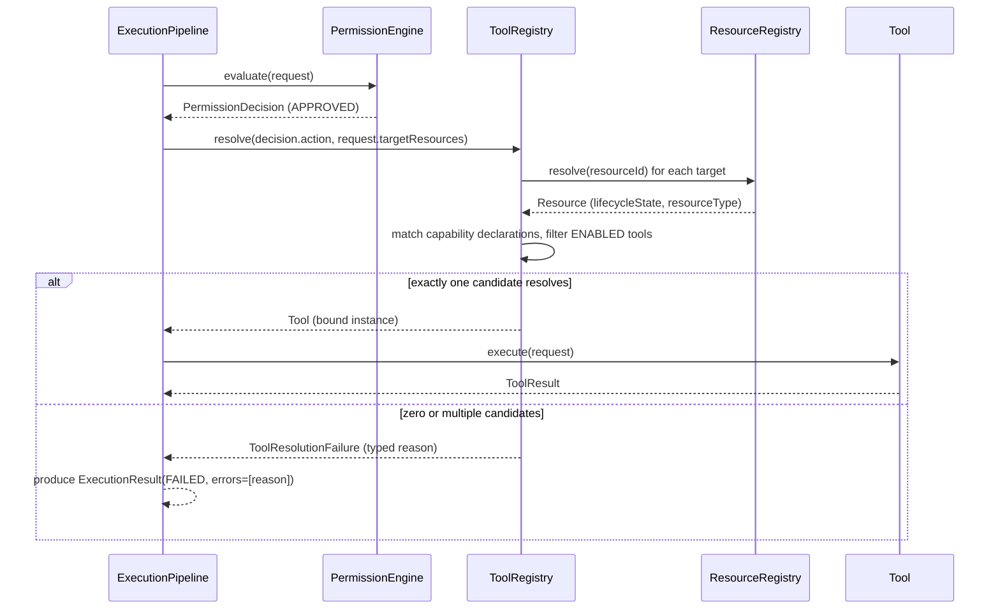
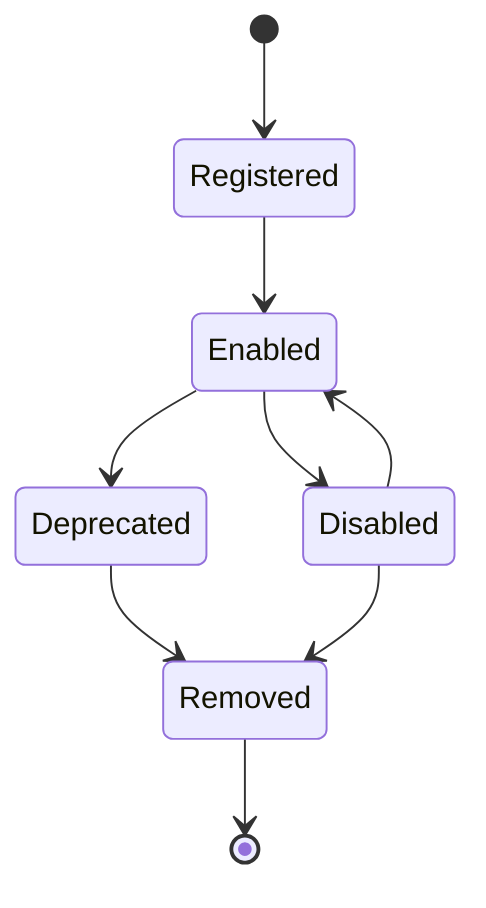
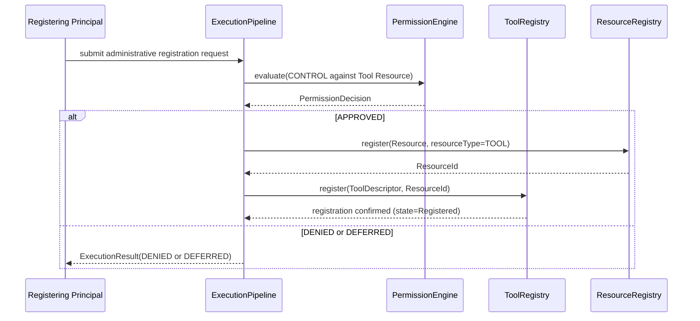

# Tool Registry Architecture

## Status

Version: 0.7-alpha
Status: New architecture specification (Priority 1, v0.7 Architecture
Completion Phase). Written to close the Phase 1/2 blocker recorded in
`docs/reviews/PARKER_V0_6_CONSISTENCY_REVIEW.md` §2.1: no `ToolRegistry`
interface existed anywhere in the repository. This document is
specification only. No Kotlin is implemented here.

## Purpose

The Tool Registry is the authoritative catalogue of every Tool the
Execution Pipeline is permitted to dispatch to. It answers one question:

> Given an approved unit of work, which registered Tool (and which version
> of it) is allowed to perform it?

Chapter 12 (Tool Framework) describes what a Tool *is* — predictable,
narrow, deterministic, auditable — but never describes how the Execution
Pipeline finds one. `Tool.md` (Volume 3) describes the shape of a single
Tool once resolved. Neither describes registration, discovery, or lookup.
The Tool Registry is the missing piece between them.

## Relationship to Existing Architecture

The Tool Registry is not a new independent subsystem. It sits at the
intersection of three already-specified systems and must integrate with
each without duplicating their authority:

- **Resource Registry (Chapter 8).** `ResourceType.TOOL` already exists in
  `src/contracts/Resource.kt`, and Chapter 8 explicitly lists Tools among
  the categories the Resource Registry catalogues. This means every Tool
  registered with the Tool Registry **MUST** also have a corresponding
  `Resource` entry (`resourceType = TOOL`) in the Resource Registry. The
  Tool Registry owns *dispatch* metadata (descriptor, version, capability
  declarations, lifecycle state); the Resource Registry owns *trust*
  metadata (ownership, sensitivity classification, resource lifecycle).
  A Tool that exists in one but not the other is an invariant violation
  (Chapter 4: "if something is not represented within the Resource
  Registry, Parker assumes it is inaccessible").
- **Permission Engine (Chapter 10).** The Tool Registry never decides
  whether a Tool *may* run. It only decides whether a Tool *exists*, is
  *enabled*, and *matches* what an already-approved `PermissionDecision`
  authorised. Registry lookups happen only after `PermissionEngine.evaluate`
  returns `APPROVED` or `APPROVED_WITH_CONFIRMATION` (see Action Mapping
  Architecture, `docs/architecture/action-mapping.md`, for how a decision
  is reached).
  Registering or modifying a Tool is itself an administrative action and
  **MUST** be evaluated by the Permission Engine as a
  `PermissionAction.CONTROL` (or `WRITE`, for descriptor updates) against
  the Tool's Resource Registry entry — the Tool Registry has no privileged
  side channel that bypasses Permission evaluation, including for its own
  administration.
- **Execution Pipeline (Chapter 11, ADR-003).** The Execution Pipeline is
  Parker's only authorised mechanism for performing actions, and it is the
  Tool Registry's only caller for resolution. No other component
  (Conversation Engine, Planner, Agent, Plugin) may query the Tool Registry
  to obtain an executable `Tool` instance directly — consistent with
  ADR-001 ("Models Never Execute Tools"), which this document extends to:
  **nothing except the Execution Pipeline ever holds a live `Tool`
  reference.** Other components may query the Tool Registry's *discovery*
  surface (read-only descriptor listing) for planning purposes, but never
  its *resolution* surface (which yields an invocable `Tool`).

## Responsibilities

- Maintain the authoritative set of registered Tools and their descriptors.
- Resolve a `toolId` (plus version constraint) to an invocable `Tool`,
  exclusively for the Execution Pipeline.
- Provide a read-only discovery surface for planning components (Planner,
  Conversation Engine, future Reasoning Engine) that returns descriptors,
  never executable references.
- Match approved `PermissionAction`/`ResourceType` combinations to
  candidate Tools capable of performing them (capability-based lookup —
  see "Lookup Process" below).
- Track each Tool's runtime lifecycle state and refuse resolution for
  Tools that are not `ENABLED`.
- Enforce that every registered Tool has a corresponding Resource Registry
  entry before it becomes resolvable.
- Reject registration of a `toolId` that is already registered and active,
  unless the operation is an explicit, permitted version supersession.

## Registration Model

Registration is the act of making a Tool's descriptor known to the
registry. It is distinct from, and a prerequisite to, that Tool ever being
dispatched.

1. A registration request supplies a `ToolDescriptor` (see "Capability
   Declaration" below for the extension proposed by this document) and an
   owning `Principal`. Every Tool's owning Principal has
   `PrincipalType.TOOL` (already defined in `src/contracts/Principal.kt`)
   or, for plugin-supplied tools, is scoped under the owning
   `PrincipalType.PLUGIN`'s identity — see "Plugin Integration."
2. Registration requires a corresponding `Resource` to be created (or
   already exist) in the Resource Registry with `resourceType = TOOL`,
   `ownerPrincipalId` matching the Tool's owning Principal, and an explicit
   sensitivity classification. Registration **MUST** fail if this Resource
   entry cannot be created or resolved.
3. Registration is itself submitted as a `PermissionAction.CONTROL`
   evaluation (see "Relationship to Existing Architecture" above), not as
   a `Tool.execute` invocation — registering a Tool is an administrative
   act on the registry, not the Tool performing work. This avoids the
   regress of a Tool needing to be registered before it can register
   itself.
4. Two registration sources exist in v0.7:
   - **Core registration**, performed at platform startup for
     platform-owned Tools, evaluated under an `INTERNAL_AGENT` or `SYSTEM`
     Principal with `PermissionLevel.ADMINISTRATIVE`.
   - **Plugin registration**, performed when a Plugin declares Tools
     through the Plugin SDK boundary (Chapter 15), evaluated under that
     Plugin's own Principal identity, never with elevated privilege beyond
     what the Plugin itself holds.
5. Re-registration of an existing, unchanged `toolId`/`version` pair is
   idempotent (no-op, not an error). Re-registration with the same
   `toolId` and a **different** `version` is version supersession — see
   "Version Handling."

## Discovery Model

Discovery is read-only and answers "what Tools exist that could satisfy
this kind of request," without exposing an executable reference.

- Discovery returns `ToolDescriptor` values only — never `Tool` instances.
  This is the same restraint ADR-001 already imposes on models; this
  document extends it explicitly to the Planner and any future reasoning
  component, since none of them are the Execution Pipeline.
- Discovery is Principal-scoped: a Tool descriptor is only returned to a
  caller whose Principal has *some* plausible Permission path to it (i.e.
  a Tool bound exclusively to `ADMINISTRATIVE`-level actions is not
  surfaced during ordinary planning for a `USER` principal's session).
  This prevents capability enumeration from becoming an information leak,
  consistent with Chapter 45 (Privacy and Data Governance).
- Two discovery queries are supported:
  - `listAll(caller: Principal): List<ToolDescriptor>` — full visible
    catalogue, for administrative/diagnostic use.
  - `findCandidates(actions: Set<PermissionAction>, resourceTypes: Set<ResourceType>, caller: Principal): List<ToolDescriptor>` —
    capability-filtered candidates, the primary planning-time query (used
    by the Planner stage described in `action-mapping.md`).
- Discovery never triggers Permission evaluation for the *target* action —
  it only reflects what a Tool declares itself capable of. The actual
  Permission evaluation happens later, once one candidate is selected and
  an `ExecutionRequest` is submitted.

## Lookup Process (Resolution)

Resolution is the Execution-Pipeline-only operation that yields an
invocable `Tool`. It happens after `PermissionEngine.evaluate` has already
approved the request.

Lookup key is **not** a bare `toolId` supplied by the caller — the Volume
1 `ExecutionRequest` schema has no `toolId` field, and ADR-018 (immutable
after validation) argues against adding a mutable "resolved tool" field to
it later. Instead:

- `ToolDescriptor` gains a **capability declaration** (see below), and the
  Tool Registry matches a `PermissionDecision.action` plus the
  `ExecutionRequest.targetResources`' `ResourceType`(s) against registered
  Tools' declared capabilities.
- If exactly one `ENABLED` Tool matches, resolution succeeds.
- If zero match, resolution fails with `TOOL_NOT_FOUND`.
- If more than one match, resolution fails with `TOOL_AMBIGUOUS` — v0.7
  does not specify a tie-breaking rule (see "Future Extensibility" in
  `action-mapping.md`); this is intentionally left as a human decision
  rather than an invented priority order.

### Capability Declaration (proposed ToolDescriptor extension)

`docs/specifications/volume-03-core-interfaces/ToolDescriptor.md` already
carries an open question: "Whether ToolDescriptor should declare
requiredPermissions/expected Resource categories directly." This document
answers it: **yes**, and proposes two new descriptor fields:

- `supportedActions: Set<PermissionAction>` — the actions this Tool is
  capable of fulfilling once approved.
- `supportedResourceTypes: Set<ResourceType>` — the Resource categories
  this Tool operates against.

This is a data-shape declaration, not new runtime behaviour, and is the
minimal addition needed to make Tool lookup deterministic without
inventing a separate mapping table elsewhere. It is recorded as a proposed
specification amendment to `ToolDescriptor.md`, not silently implemented —
see the completion report's "Updated Specifications" section.

## Version Handling

- Each registered Tool carries `ToolDescriptor.version` (already present,
  string, semver-like, default `"0.1.0"`).
- v0.7 specifies a **single active version per `toolId`** model: at most
  one version of a given `toolId` may be `ENABLED` at a time. Registering
  a new version of an already-`ENABLED` `toolId` moves the prior version
  to `DEPRECATED` (not `REMOVED`) and activates the new one.
- `DEPRECATED` versions remain resolvable **only** for in-flight
  `ExecutionRequest`s that were validated against them before supersession
  (to avoid changing behaviour mid-execution); they are never returned as
  a candidate for new resolutions.
- Concurrent multi-version dispatch (e.g. Tool consumers pinning to a
  specific version) is explicitly out of scope for v0.7 and is recorded as
  a future extensibility item, not invented here.
- Version changes are Resource Registry lifecycle events on the Tool's
  corresponding `Resource` entry (`UPDATED`), keeping version history
  auditable through the existing Resource lifecycle rather than a parallel
  mechanism.

## Plugin Integration

Chapter 15 (Plugin SDK): "Plugins are guests. The platform remains the
owner. Installation does not imply permission." This document extends
that principle one level further: **registration does not imply
invocation.**

- A Plugin declares its Tools through the Plugin SDK boundary at
  installation or activation time. This produces registration requests
  identical in shape to core registration, but evaluated under the
  Plugin's own `PrincipalType.PLUGIN` identity — never under an elevated
  or platform identity.
- A newly registered plugin Tool defaults to lifecycle state `REGISTERED`,
  **not** `ENABLED`. An explicit, separately-audited enablement step
  (itself a `PermissionAction.CONTROL` evaluation) is required to move it
  to `ENABLED` before it becomes resolvable. This creates three distinct
  gates a plugin Tool must pass — installation, registration, enablement —
  matching the three distinct gates chapter 15 already implies for
  plugins generally (installed, permitted, invoked).
- Plugin Tools are subject to the same capability-matching lookup as core
  Tools; the Tool Registry does not distinguish plugin-origin Tools during
  resolution, only during registration and enablement.
- If a Plugin is uninstalled or disabled (Chapter 15 / Chapter 48 Safe
  Mode concerns), all of its registered Tools **MUST** transition to
  `DISABLED` as a cascading effect, not remain independently resolvable.

## Runtime Lifecycle

- **Registered** — descriptor known, Resource Registry entry exists, not
  yet resolvable.
- **Enabled** — resolvable; the only state in which `ToolRegistry.resolve`
  may return this Tool as a candidate.
- **Disabled** — temporarily withdrawn (administrative action, Safe Mode,
  or cascading plugin disablement); reversible back to `Enabled`.
- **Deprecated** — superseded by a newer version of the same `toolId`;
  resolvable only for in-flight requests validated before supersession.
- **Removed** — terminal; descriptor retained for audit history, never
  resolvable again.

This mirrors the state-shape already established for `Principal`
(`Created → Active → Suspended → Revoked → Archived`) and `Resource`
(`Created → Registered → Available → Updated → Archived → Deleted`), for
consistency across the platform's lifecycle vocabulary, while using
Tool-specific state names since "Suspended"/"Revoked" don't carry the
right connotation for a dispatch-table entry. See
`docs/diagrams/tool-lifecycle-state-machine.mmd` for the standalone
diagram file (added by the targeted refinement pass, IMPLEMENTATION_GAPS.md
#28 -- a literal copy of the `stateDiagram-v2` block above, matching the
Principal/Resource/Session/Task/Workflow convention).

## Failure Behaviour

Two categories of failure are distinguished, with different owners:

1. **Registry-level failures** — occur before any `Tool.execute` is ever
   called: `TOOL_NOT_FOUND` (no candidate matched), `TOOL_AMBIGUOUS`
   (multiple candidates matched, no tie-break rule), `TOOL_DISABLED`
   (candidate exists but is not `ENABLED`), `TOOL_REGISTRY_UNAVAILABLE`
   (registry itself failed — e.g. could not reach the Resource Registry to
   verify a Tool's backing Resource). These surface as
   `ExecutionResultStatus.FAILED` with a machine-readable error code (one
   of the four above) in `ExecutionResult.errors`, per the existing
   `init` invariant in `src/contracts/ExecutionResult.kt` requiring
   non-empty `errors` for `FAILED`. No new `ExecutionResultStatus` value
   is proposed — v0.7 treats these as a subtype of `FAILED` distinguished
   by error code, to avoid schema churn; whether a dedicated status is
   warranted is recorded as an open question in the completion report.
2. **Tool-level failures** — occur once `Tool.execute` has been invoked
   and are entirely the Tool's own responsibility to report via
   `ToolResult`/`ExecutionResult`, per `Tool.md`'s existing normative
   requirements. The Tool Registry has no visibility into or
   responsibility for these.

Registration-time failures (e.g. missing Resource Registry entry, denied
`CONTROL` permission) never partially register a Tool — registration is
all-or-nothing; a Tool is either fully registered (descriptor + Resource
entry both exist) or not registered at all.

## Thread Safety Expectations

The Tool Registry is read-heavily and written-rarely (registration and
lifecycle transitions are comparatively infrequent administrative
operations; resolution happens on every execution). v0.7 specifies these
expectations without prescribing a specific Kotlin concurrency mechanism
(that is an implementation-phase decision):

- Resolution (`resolve`) and discovery (`listAll`, `findCandidates`)
  **MUST** be safely callable concurrently from multiple in-flight
  `ExecutionRequest`s without external synchronisation by the caller.
- Registration and lifecycle transitions **MUST** be serialised with
  respect to each other for the same `toolId` (no two concurrent
  registrations of the same `toolId` may both succeed and leave the
  registry in an inconsistent state).
- A resolution that begins while a lifecycle transition for the same Tool
  is in progress **MUST** observe either the pre-transition or
  post-transition state atomically, never a partially-applied one (e.g.
  never a Tool that reports `ENABLED` but whose Resource Registry entry
  has already moved to `ARCHIVED`).
- The Tool Registry does not itself need distributed consistency in v0.7
  (single-runtime-instance assumption, consistent with the rest of the
  Volume 1/3 contracts, which do not address multi-instance deployment).

## Sequence Diagram — Registration

## Related

- Chapter 8 – Resource Registry
- Chapter 10 – Permission Engine
- Chapter 11 – Execution Pipeline
- Chapter 12 – Tool Framework
- Chapter 15 – Plugin SDK
- ADR-001 – Models Never Execute Tools
- ADR-003 – Single Execution Pipeline
- ADR-018 – ExecutionRequests Are Immutable After Validation
- `docs/specifications/volume-03-core-interfaces/Tool.md`
- `docs/specifications/volume-03-core-interfaces/ToolDescriptor.md`
- `docs/architecture/action-mapping.md`
- `docs/reviews/PARKER_V0_6_CONSISTENCY_REVIEW.md` §2.1

## Open Questions (not resolved by this document)

- Tie-breaking rule for `TOOL_AMBIGUOUS` (multiple capability-matching
  Tools) — deliberately left to a future ADR rather than an invented
  priority order.
- Whether a dedicated `ExecutionResultStatus` value is warranted for
  registry-level failures instead of overloading `FAILED` with error
  codes.
- Multi-version concurrent dispatch — out of scope for v0.7.
