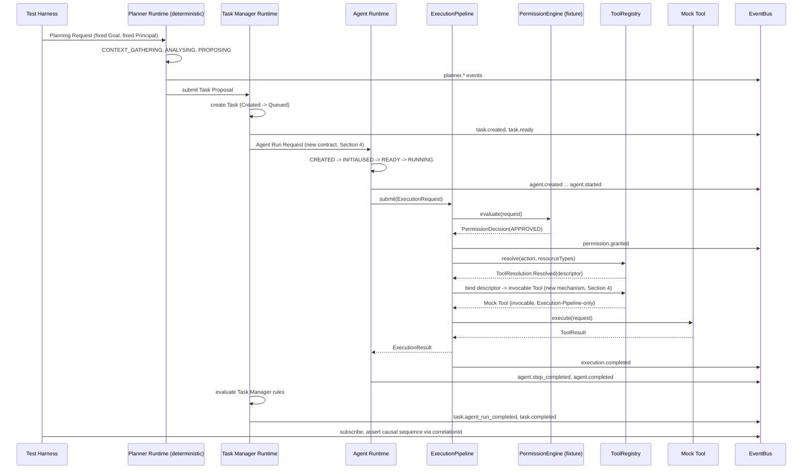

# Sprint 1 Vertical Slice Plan

## Status

This is an **implementation planning document**, not a specification and
not implemented code. It proposes no new architectural principle, alters
no existing specification, and adds no file under `src/` or `tests/`. Its
job is to sequence and scope the first implementation sprint against
architecture that has already been specified and, per
`docs/reviews/RepositoryArchitectureConsistencyAudit.md`, already validated
as internally consistent. Where this document identifies a gap that must
close before coding begins, it names the gap and recommends where it
should be closed — it does not close it here.

Reviewed to produce this plan: `docs/reviews/RepositoryArchitectureConsistencyAudit.md`,
`docs/architecture/ARCHITECTURE_DECISIONS.md`,
`docs/architecture/IMPLEMENTATION_ORDER.md`,
`docs/architecture/INTER_SPECIFICATION_CONTRACTS.md`,
`docs/specifications/volume-06-planner-runtime/PlannerRuntimeSpecification.md`,
`docs/specifications/volume-05-task-manager-runtime/TaskManagerRuntimeSpecification.md`,
`docs/specifications/volume-04-agent-runtime/AgentRuntimeSpecification.md`,
the existing `src/interfaces/`, `src/runtime/`, and `src/contracts/` Kotlin,
and the existing `tests/contracts/` and `tests/runtime/` test suites.

## 1. Sprint Purpose

Sprint 1 exists to answer one question empirically, not architecturally:
**can a request travel the entire specified cognitive control chain — from
a Planning Session's output to an audited Execution Result — without
inventing new architecture, without bypassing any authority boundary, and
without requiring anything not yet built?**

`docs/reviews/RepositoryArchitectureConsistencyAudit.md` already found the
architecture internally consistent at the specification level: no
contradiction, no trust-boundary violation, all sixteen Architecture
Decisions evidenced. What that audit could not establish, because it was a
document review and not an implementation exercise, is whether the chain
*executes* — whether the boundary objects, event shapes, and lifecycle
transitions the specifications describe in prose actually compose into
working Kotlin without a hidden incompatibility surfacing only once code is
written against two specifications at once. Sprint 1 exists to surface
that class of problem now, cheaply, on the smallest possible slice, rather
than after the platform is bigger and a hidden incompatibility is more
expensive to fix.

**What Sprint 1 proves, if it succeeds:**

- A Planning Session can produce a Task Proposal in a deterministic,
  non-LLM way.
- A Task Manager Runtime can receive that proposal and create exactly one
  Task Manager Task from it, using the existing, unmodified Task lifecycle
  (`Task-Schema.md`).
- A Task Manager Task can result in exactly one Agent Run being requested
  and created.
- An Agent Run can construct and submit exactly one `ExecutionRequest`
  through the existing, unmodified Execution Pipeline.
- That `ExecutionRequest` can be evaluated by a Permission Engine, resolved
  against a registered mock Tool by the Tool Registry, invoked, and
  produce an `ExecutionResult`.
- Every meaningful transition along this path emits an event, and those
  events are observable and correlate back to one causal sequence.
- No step in this path required bypassing Identity, Permission, or the
  Execution Pipeline to work.

**What Sprint 1 deliberately does not prove:**

- That the Planner can generate a *good*, *general*, or *model-driven* plan
  — Sprint 1's Planner harness is a fixed, deterministic stand-in, per
  Non-Scope (Section 3), not a step toward Planner intelligence.
- That the platform can handle concurrency, multiple simultaneous Tasks,
  multiple Agent Runs per Task, retries, or failure recovery beyond the one
  happy path and the specific negative cases in the Test Plan (Section 7).
  Multi-Task/multi-Agent-Run coordination is real Task Manager
  Runtime behaviour (`TaskManagerRuntimeSpecification.md` §6) but is not
  this sprint's target.
- That any of the reserved future systems (Memory, World Model, Workflow
  Runtime, Android, real external tools) work, integrate, or are ready —
  Sprint 1 touches none of them, by design (Section 3).
- That the platform is production-ready in any sense. This is a proof of
  the *shape* of the chain working end-to-end in memory, under test, with
  fixed inputs — nothing more.

## 2. Scope

Sprint 1 includes exactly the following, each scoped to the smallest form
that still exercises a real authority boundary:

- **Minimal Planning Session.** One Planning Request, for one fixed Goal,
  producing exactly one Plan Candidate and exactly one Task Proposal.
  Planning Context gathering is trivial (no real Resource/Task/Agent Run
  references needed for the fixed Goal) but the lifecycle states
  (`CREATED -> CONTEXT_GATHERING -> ANALYSING -> PROPOSING -> SUBMITTED`)
  are genuinely exercised, not skipped.
- **Minimal Task Proposal.** Carries only the fields Sprint 1's fixed Goal
  actually needs: proposed owner, Source, Priority, the Goal reference, and
  Context References. Optional fields (Dependencies, Risk notes, Confidence)
  may be omitted or trivially populated, consistent with
  `PlannerRuntimeSpecification.md` §10's own "not required" framing for
  several of them.
- **Task Manager intake of the Task Proposal.** The Task Manager Runtime
  receives the proposal and renders exactly one disposition: accept.
  Sprint 1 does not need to exercise defer/split/merge/reject — those
  remain real Task Manager Runtime behaviour for a later sprint to
  exercise, not something Sprint 1 must prove to demonstrate the chain
  works.
- **Task creation.** Exactly one Task Manager Task is created from the
  accepted proposal, entering `Created` and progressing to `Queued` per the
  unmodified Task lifecycle (`docs/diagrams/task-lifecycle-state-machine.mmd`).
- **Agent Run request.** The Task Manager Runtime requests exactly one
  Agent Run for the Task, per `TaskManagerRuntimeSpecification.md` §6/§7.
- **Agent Run lifecycle.** One Agent Instance progresses
  `CREATED -> INITIALISED -> READY -> RUNNING`, performs exactly one Agent
  Step, and reaches `COMPLETED`.
- **Execution Request.** The Agent Run's one Agent Step constructs and
  submits exactly one `ExecutionRequest` through the existing, unmodified
  `ExecutionPipeline.submit`.
- **Mock Tool invocation.** The Execution Pipeline resolves and invokes one
  registered mock Tool (deterministic, in-memory, no real external effect).
- **Execution Result.** The mock Tool's invocation produces a real
  `ToolResult`/`ExecutionResult`, not merely a successful resolution
  (Section 4 explains why this requires closing a specific existing gap).
- **Lifecycle events.** Every real transition along the path — Planning
  Session, Task, Agent Run, and Execution Request/Result — publishes its
  specified event onto the existing EventBus.
- **Auditability.** A test harness can subscribe to the relevant event
  types and reconstruct the entire causal sequence via `correlationId`,
  confirming the chain is observable end-to-end, not just functionally
  correct.

## 3. Non-Scope

Sprint 1 explicitly excludes:

- **Real LLM planning.** The Planner harness is a fixed, deterministic
  function from one specific Goal to one specific Plan Candidate — no
  model, prompting strategy, or non-deterministic reasoning of any kind,
  consistent with AD-010 (Model Independence) and
  `PlannerRuntimeSpecification.md` §2's own "Model independence" design
  goal.
- **Real tools.** The mock Tool performs no real external effect (no
  email, calendar, filesystem, network, or Home Assistant call). It exists
  solely to prove the Execution Pipeline -> Tool Registry -> Tool path
  completes.
- **Android UI.** Out of scope, per every existing specification's own
  Non-Goals section and `IMPLEMENTATION_ORDER.md` §4's Order 5 placement.
- **Home Assistant.** Out of scope, per `AgentRuntimeSpecification.md` §3's
  "Direct Home Assistant or external system access" exclusion.
- **Memory.** No read or write against a Memory implementation — none
  exists, and none of the three Context models (Task, Agent, Planning)
  implement it.
- **World Model.** No read or write against a World Model implementation
  — none exists.
- **Workflow Runtime.** Sprint 1 produces exactly one Task from exactly one
  Task Proposal; no multi-Task composition, branching, or retry semantics
  (Workflow Runtime territory per ADR-012) is in scope.
- **Plugin marketplace.** No Plugin-supplied Tool, action vocabulary entry,
  or event type. The mock Tool is core-registered, not plugin-registered.
- **Persistence beyond in-memory test fixtures.** Sprint 1 uses the
  existing in-memory reference implementations
  (`InMemoryIdentityService`, `InMemoryResourceRegistry`,
  `InMemoryToolRegistry`, `InMemoryEventBus`, `DefaultExecutionPipeline`)
  exactly as they exist today. No database, file-backed store, or
  cross-process persistence is introduced. Any new store this sprint adds
  (Task store, Agent Run store, Planning Session store) is in-memory only,
  matching the existing pattern.
- **Real authorisation policy.** Per `IMPLEMENTATION_GAPS.md` #25/#30, no
  policy-bearing `PermissionEngine.evaluate` exists yet anywhere in the
  codebase. Sprint 1 does not invent one — see Section 4.
- **Cascading identity revocation, `identity.*` event publishing, or
  `PermissionEngine`-resolves-identity-first wiring** (`IMPLEMENTATION_GAPS.md`
  #35, #37, #39, #40). These remain open, pre-existing gaps unrelated to
  proving the vertical slice; Sprint 1's fixed happy-path Principal is
  never revoked or suspended during the test.

## 4. Required Contract Gaps To Close Before Coding

Each gap below already exists in the repository today, independent of this
plan — this document does not invent any of them. None is resolved here;
each is named, and a recommended closure location is given, consistent
with the task's instruction not to solve these in code.

| Gap | Description | Currently blocks | Recommended closure |
|---|---|---|---|
| **Task Proposal intake contract** | `TaskManagerRuntimeSpecification.md` defines no operation for receiving a Task Proposal (`INTER_SPECIFICATION_CONTRACTS.md` §6, Gap 1; `PlannerRuntimeSpecification.md` §6 Open Questions). | Task Manager cannot accept a Task Proposal in a specified way; any Sprint 1 code would be inventing this shape unilaterally. | **Specification update** to `TaskManagerRuntimeSpecification.md` (or a short addendum document) defining a minimal `submitProposal(proposal: TaskProposal): TaskProposalDisposition`-shaped operation, scoped to accept-only for Sprint 1 (Section 2). |
| **Task Manager disposition/response contract** | No mechanism (operation, event, or otherwise) exists for the Task Manager Runtime to report accept/defer/split/merge/reject back to the Planner Runtime (`INTER_SPECIFICATION_CONTRACTS.md` §6, Gap 2; `PlannerRuntimeSpecification.md` §11 Open Questions). | The Planner Runtime harness cannot legally transition `SUBMITTED -> COMPLETED` (Section 5) without a specified disposition mechanism to trigger it. | **Specification update**, same document as above — a minimal `TaskProposalDisposition` sealed result (Accepted-only needed for Sprint 1, but the type should at least name the other four outcomes as unresolved rather than omit them) is the smallest closure that unblocks `planner.session_completed` firing correctly. |
| **Agent Run Request has no named, shaped object** | The object the Task Manager Runtime passes to the Agent Runtime to actually create an Agent Run is only implied by a sequence diagram (`TaskManagerRuntimeSpecification.md` §7: "create Agent Run"), never named or field-shaped (`INTER_SPECIFICATION_CONTRACTS.md` §6, Gap 7). | Sprint 1 cannot wire Task Manager -> Agent Runtime without inventing this shape ad hoc. | **New contract file** (e.g. `src/contracts/AgentRunRequest.kt`, backed by a short specification note in either existing document) defining the minimal fields Sprint 1 needs: `taskId`, `ownerPrincipalId`, Goal reference. This is additive to both existing specifications, not a change to either's stated rules. |
| **Agent Run Cancellation Request contract** | Same asymmetry as above, for cancellation (`Phase3ArchitecturePositionReview.md` §6, Gap 11; not yet folded into `INTER_SPECIFICATION_CONTRACTS.md`'s own catalogue per `RepositoryArchitectureConsistencyAudit.md` Finding T-2). | **Not required for Sprint 1's scope** (Section 2 excludes cancellation from the minimal happy path). Recorded here because the task instructions ask for it explicitly. | **Defer.** Recommend closing this in the same specification pass that closes the creation-request gap above, so the two are not designed at different times with diverging conventions — but do not let it block Sprint 1's own start, since Sprint 1 does not exercise cancellation. |
| **`ToolRegistry.resolve()` returns a descriptor only, never an invocable `Tool`** | `src/contracts/ToolResolution.kt`'s own doc comment states this is deliberate ("no concrete `Tool` implementations exist yet to resolve to"), and `DefaultExecutionPipeline` (`src/runtime/DefaultExecutionPipeline.kt`) confirms it in its own KDoc: today, a `SUCCESS` result means "found the right Tool," not "the Tool executed" (`IMPLEMENTATION_GAPS.md` #32). | Sprint 1 cannot produce a real `ExecutionResult` from an actual Mock Tool invocation without closing this — it is the single largest concrete blocker to Section 2's "Mock Tool invocation" and "Execution Result" scope items. | **New contract file** adding a minimal, Execution-Pipeline-only binding mechanism from a resolved `ToolDescriptor` to a registered invocable `Tool` instance (e.g. an additional `ToolRegistry` operation or companion lookup, scoped so only the Execution Pipeline can call it, preserving `tool-registry.md`'s existing "nothing except the Execution Pipeline ever holds a live `Tool` reference" rule exactly). This is an **implementation task**, not a specification rewrite — `tool-registry.md` and `Tool.md` already describe what a `Tool` is and that only the Execution Pipeline may hold one; what is missing is the plumbing connecting an already-`Resolved` descriptor to an already-registered instance, not a new architectural rule. |
| **Event payload shapes for Task/Agent/Planner events are field-lists, not schemas** | All three Phase 3 specifications explicitly leave payload schemas as "implementation-phase content" (`AgentRuntimeSpecification.md` §9, Open Questions; identical framing in the other two). | Sprint 1's test harness needs *some* concrete payload shape to assert against for the handful of events it actually needs (`task.created`, `task.agent_run_started`, `agent.created`...`agent.completed`, `execution.*`). | **Test fixture decision**, scoped to only the events Sprint 1 actually emits — pick the minimal concrete `Map<String, String>` payload each needs (already the shape `ParkerEvent.payload` requires), record the choice in the test code's own documentation, and explicitly do not claim this settles the general payload-schema Open Question for any event outside Sprint 1's scope. |
| **No policy-bearing `PermissionEngine` implementation exists** | `IMPLEMENTATION_GAPS.md` #25/#30: only the action-mapping layer is implemented; no real authorisation policy is specified anywhere. | Sprint 1 needs *a* Permission Engine to consult, per Section 8's invariant that the Permission Engine remains the authority — but inventing real policy is out of scope and would itself be an architectural act this plan is not authorised to take. | **Test fixture**, following the exact precedent already in the repository: `tests/runtime/FakePermissionEngine.kt` is a deterministic, test-only `PermissionEngine` implementation that always returns a caller-supplied decision. Sprint 1 should use the same fixture (or a Sprint-1-specific fixture built the same way), living in `tests/`, never `src/runtime/`, so no one mistakes it for real policy. |
| **Identity Service has no gap blocking Sprint 1** | `InMemoryIdentityService` (`src/runtime/InMemoryIdentityService.kt`) already implements `register`/`resolve`/`updateStatus`/`touch`/`listByOwner` fully, per `IMPLEMENTATION_GAPS.md` #1. | Nothing — Sprint 1's fixed Principal(s) can be registered and resolved exactly as the existing tests already do (`tests/runtime/InMemoryIdentityServiceTest.kt`). | **No gap.** Recorded here for completeness, per the task's explicit request to identify "any identity or permission decision gaps needed for the minimal slice" — there is none on the identity side. |

**None of these gaps requires redesigning any accepted Architecture
Decision.** Each is additive (a new, narrowly-scoped operation or type) or
a test-only fixture, consistent with the "Creating contracts without
updating specifications" risk named in Section 10 — the recommended
closures above each name whether a specification update, a new contract
file, a test fixture, or an implementation task is the appropriate vehicle,
and none proposes silently amending an existing specification's stated
rules.

## 5. Proposed Sprint 1 Architecture

```text
Test Harness (fixed Goal, fixed Principal)
  -> Planner Runtime (deterministic stand-in)
       -> Task Proposal
  -> Task Manager Runtime
       -> Task Manager Task (Created -> Queued)
       -> Agent Run Request
  -> Agent Runtime
       -> Agent Run (CREATED -> INITIALISED -> READY -> RUNNING)
       -> Execution Request
  -> Execution Pipeline
       -> Permission Engine (fixture, APPROVED)
       -> Tool Registry
            -> Mock Tool (registered, ENABLED)
       -> Execution Result
  -> EventBus
       -> Test Harness (subscribes, asserts causal sequence)
```



The solid path matches `docs/architecture/INTER_SPECIFICATION_CONTRACTS.md`
§4's existing diagram exactly; Sprint 1 adds no new component and no new
path, only a concrete, minimal instance of each existing step.

## 6. Implementation Units

Each unit is intentionally small. "Dependencies" names other units in this
list, not external packages.

| # | Name | Purpose | Expected files likely affected | Dependencies | Acceptance test |
|---|---|---|---|---|---|
| 1 | **Task Proposal intake contract** | Define the minimal `submitProposal`-shaped operation and `TaskProposalDisposition` type Section 4 identifies. | New: `src/contracts/TaskProposal.kt`, `src/contracts/TaskProposalDisposition.kt`. Possibly `docs/specifications/volume-05-task-manager-runtime/TaskManagerRuntimeSpecification.md` addendum (a follow-on specification task, not this document). | None (foundational). | A unit test constructs a `TaskProposal` and a `TaskProposalDisposition.Accepted` and confirms both are well-typed; no behaviour yet. |
| 2 | **Agent Run Request contract** | Define the minimal object Task Manager passes to Agent Runtime to request an Agent Run (Section 4). | New: `src/contracts/AgentRunRequest.kt`. | None (foundational). | Unit test constructs an `AgentRunRequest` with `taskId`, `ownerPrincipalId`, Goal reference; confirms required-field validation. |
| 3 | **Tool-binding mechanism (resolve -> invocable Tool)** | Close the gap in Section 4 so `DefaultExecutionPipeline` can go from a resolved `ToolDescriptor` to an invocable `Tool`, Execution-Pipeline-only. | `src/interfaces/ToolRegistry.kt` (new operation) or a new companion type; `src/runtime/InMemoryToolRegistry.kt` (implementation). | None (extends existing Tool Registry). | Existing `tests/runtime/InMemoryToolRegistryTest.kt`-style test: register a Mock Tool, resolve it, confirm the Execution Pipeline (and only the Execution Pipeline) can obtain an invocable reference. |
| 4 | **Mock Tool fixture** | A deterministic, in-memory `Tool` implementation with no real external effect. | New: `tests/runtime/MockTool.kt` (test-only, mirroring `tests/runtime/FakePermissionEngine.kt`'s existing "test fixture, not `src/runtime`" precedent, since this Tool exists only to prove the path, not as a real platform Tool). | Unit 3 (needs an invocable-`Tool` binding to be resolved to). | Unit test: `MockTool.execute(request)` returns a deterministic `ToolResult` for a fixed input. |
| 5 | **Deterministic Planner harness** | A fixed, non-LLM function producing exactly one Plan Candidate and one Task Proposal for one fixed Goal, exercising the real Planning Session lifecycle states. | New: `tests/runtime/DeterministicPlannerHarness.kt` (test-only, per AD-010 — this explicitly is not an implementation of the Planner Runtime Specification's general Plan Decision mechanism, only a fixed stand-in for Sprint 1). | Unit 1 (produces a `TaskProposal`). | Test confirms the harness transitions `CREATED -> CONTEXT_GATHERING -> ANALYSING -> PROPOSING -> SUBMITTED` and produces exactly one well-formed `TaskProposal`. |
| 6 | **Minimal Task Manager Runtime** | In-memory Task store; accept-only intake of a `TaskProposal`; Task lifecycle transitions `Created -> Queued`; Agent Run Request construction. | New: `src/runtime/InMemoryTaskManagerRuntime.kt` (or `tests/runtime/` if scoped narrowly enough to remain a fixture — recommend `src/runtime/` since Task Manager Runtime is an accepted design baseline, not a test-only stand-in, per `IMPLEMENTATION_ORDER.md` §3). | Units 1, 2. | Test: submitting a well-formed `TaskProposal` results in exactly one Task in `Queued` state and exactly one `AgentRunRequest` constructed. |
| 7 | **Minimal Agent Runtime** | Agent Instance/Agent Run creation and lifecycle (`CREATED -> INITIALISED -> READY -> RUNNING -> COMPLETED`); one Agent Step constructing and submitting one `ExecutionRequest`. | New: `src/runtime/InMemoryAgentRuntime.kt`, plus new contract types for Agent Instance/Agent Run if not already covered by Units 1–2 (e.g. `src/contracts/AgentRun.kt`). | Unit 2 (consumes `AgentRunRequest`), Identity Service (existing, `InMemoryIdentityService`). | Test: given an `AgentRunRequest`, the runtime resolves the owning Principal, reaches `RUNNING`, constructs exactly one `ExecutionRequest`, and reaches `COMPLETED` once a matching `ExecutionResult` is returned. |
| 8 | **Permission Engine test fixture** | Deterministic, always-`APPROVED` `PermissionEngine` for Sprint 1's fixed happy path, following the existing `FakePermissionEngine` precedent. | New (or reused): `tests/runtime/FakePermissionEngine.kt` (already exists) or a Sprint-1-specific variant if a different decision shape is needed. | None. | Existing pattern already tested (`tests/runtime/DefaultExecutionPipelineTest.kt`); confirm it still applies unmodified. |
| 9 | **Event assertion harness** | Subscribe to every `EventType` Sprint 1 emits (`planner.*`, `task.*`, `agent.*`, `execution.*`, `permission.*`) and collect them for post-hoc causal-sequence assertion. Per `EventType.md`'s own open question, wildcard subscription is not specified — this harness subscribes to each concrete `EventType` it expects individually, not a wildcard. | New: `tests/runtime/EventCollector.kt` (test-only). | `InMemoryEventBus` (existing). | Test: after running the full vertical slice, the collector holds one event per real lifecycle transition Section 2 names, all sharing traceable `correlationId`s across the Planning Session, Task, Agent Run, and Execution Request. |
| 10 | **End-to-end vertical slice test** | Wire Units 1–9 together into the single scripted scenario Section 5 diagrams. | New: `tests/runtime/VerticalSliceEndToEndTest.kt`. | All of the above. | The full acceptance test described in Section 7's "end-to-end" row. |

## 7. Test Plan

All tests below are new unless noted, and all exercise real lifecycle
transitions and real (fixture-backed, non-invented) authority boundaries —
none asserts against a mocked-out architecture boundary.

- **Planner produces Task Proposal.** Unit 5's harness test: given the
  fixed Goal, produces exactly one well-formed `TaskProposal`, and the
  Planning Session reaches `SUBMITTED`.
- **Task Manager accepts proposal and creates Task.** Unit 6's test:
  submitting the `TaskProposal` results in exactly one Task Manager Task
  in `Queued` state, with `ownerPrincipalId` resolved through the Identity
  Service (not a Task-Manager-local store).
- **Task Manager requests Agent Run.** Unit 6's test, extended: confirms
  exactly one `AgentRunRequest` is constructed, referencing the created
  Task's `taskId`.
- **Agent Runtime creates Agent Run.** Unit 7's test: given the
  `AgentRunRequest`, the Agent Instance reaches `INITIALISED` only after
  resolving a `PrincipalId` via the Identity Service, then `READY`, then
  `RUNNING`.
- **Agent Runtime submits Execution Request.** Unit 7's test, extended:
  the one Agent Step in scope constructs exactly one `ExecutionRequest`
  with `origin = RequestOrigin.AGENT`.
- **Execution Pipeline invokes mock Tool.** Unit 10's end-to-end test:
  `DefaultExecutionPipeline.submit` resolves the registered Mock Tool and
  (once Unit 3 closes the binding gap) calls `Tool.execute`, producing a
  `ToolResult` embedded in a `SUCCESS` `ExecutionResult` — not merely a
  successful resolution.
- **Permission Engine is consulted.** Assert `FakePermissionEngine.evaluateCallCount == 1`
  for the one `ExecutionRequest` in the slice, mirroring the existing
  assertion style already used in `tests/runtime/DefaultExecutionPipelineTest.kt`.
- **Identity Service is consulted.** Assert `InMemoryIdentityService.resolve`
  is called (directly or via a spy/counter) for the Task Owner and the
  Agent Identity — confirming no component maintains its own identity
  shortcut.
- **EventBus records lifecycle events.** Unit 9's collector confirms one
  event per real transition listed in Section 2, and that every event
  under the same Planning Session/Task/Agent Run/Execution Request shares
  a resolvable `correlationId` chain.
- **Invalid request is not treated as denied.** A negative test: submit an
  `ExecutionRequest` whose `proposedActions` do not resolve via the action
  mapping vocabulary (or whose `targetResources` do not resolve). Assert
  the result is `ExecutionResultStatus.FAILED` (validation failure, per
  `action-mapping.md`'s "invalid, not denied" rule and the existing
  `CREATED -> FAILED` edge in `ExecutionLifecycleTransitions`), never
  `DENIED` — this exact behaviour is already implemented in
  `DefaultExecutionPipeline` and already covered by
  `tests/runtime/DefaultExecutionPipelineTest.kt`; Sprint 1 should extend,
  not duplicate, that existing coverage for the vertical slice's own
  request shape.
- **Terminal states remain final.** Negative tests at each new lifecycle
  introduced this sprint (Task Manager Task, Agent Run, Planning Session):
  attempt an illegal transition out of a terminal state reached during the
  slice (e.g. `COMPLETED -> RUNNING`) and assert it is rejected, mirroring
  the existing pattern in `tests/contracts/ExecutionLifecycleTransitionsTest.kt`.
- **No direct tool execution bypass exists.** A negative/structural test:
  confirm that nothing outside `DefaultExecutionPipeline` (not the
  Planner harness, not the Task Manager runtime, not the Agent runtime)
  can obtain an invocable `Tool` reference from the Tool Registry — the
  new binding mechanism from Unit 3 must be constructed so this is true by
  construction (e.g. package-private/internal visibility, or an explicit
  caller-identity check), not merely true by convention, and the test
  should attempt the bypass and confirm it is rejected or inaccessible.

## 8. Safety Invariants

These must remain true throughout Sprint 1's implementation, checked
against every unit in Section 6 before it is considered done:

- **Planner never creates Tasks directly** (AD-005). Unit 5's harness has
  no operation that writes a `taskId` or Task `status`; its only output is
  a `TaskProposal` (Unit 1).
- **Task Manager never executes tools directly** (AD-002, AD-003).
  Unit 6's runtime holds no invocable `Tool` reference and never calls
  `ToolRegistry.resolve` itself.
- **Agent Runtime never owns Tasks** (AD-006). Unit 7's runtime never
  writes to the Task created by Unit 6; it holds only a `taskId` reference
  in its own Agent Context.
- **Execution Pipeline remains the sole execution path** (AD-003). No unit
  introduces a second path to `Tool.execute`; Unit 3's binding mechanism is
  deliberately scoped so only `DefaultExecutionPipeline` can use it.
- **Permission Engine remains the authority for permission decisions**
  (AD-007). Unit 8's fixture is consulted exactly once per
  `ExecutionRequest`; no unit substitutes its own judgement for its
  decision.
- **Identity Service remains the authority for Principal state** (AD-001,
  AD-008). No unit introduces a local identity store; Units 6 and 7 both
  resolve Principals through `InMemoryIdentityService`.
- **Everything important emits events** (AD-009). Every real transition
  Section 2 lists has a corresponding event, verified by Unit 9's
  collector.
- **No Memory or World Model mutation** (AD-012). No unit reads or writes
  against either — neither exists in this sprint's dependency graph at
  all.
- **Invalid is not Denied, and terminal states are final** (AD-015,
  AD-016). Both are exercised as explicit negative tests (Section 7), not
  merely assumed.

## 9. Success Criteria

Sprint 1 is complete when:

- One deterministic end-to-end vertical slice (Unit 10) passes its tests,
  covering every step in Section 2's scope.
- No external system is required to run the test suite (no network, no
  real Tool, no Android, no Home Assistant).
- The runtime path is auditable through events: Unit 9's collector can
  reconstruct the full causal sequence for a single run via `correlationId`.
- All core authority boundaries are exercised, not merely present in code:
  Identity Service resolution, Permission Engine evaluation, and
  Tool Registry resolution are each observed to actually occur (Section
  7's positive assertions), not merely capable of occurring.
- All new code is covered by tests — every new file listed in Section 6
  has at least one corresponding test file/test case.
- No Architecture Decision is violated — confirmed by the Section 11, step
  6 review.

## 10. Risks

- **Overbuilding.** The single largest risk to Sprint 1 staying a vertical
  *slice*: it would be easy to notice, while implementing Unit 6 or 7,
  that "real" Task Manager or Agent Runtime behaviour needs more (defer/
  split/merge, concurrent Agent Runs, retry). Mitigation: Section 2's
  scope list is exhaustive for this sprint; anything not on it is a
  candidate for Sprint 2, not a Sprint 1 addition, regardless of how small
  it looks once the surrounding code exists.
- **Accidentally implementing Planner intelligence too early.** Unit 5's
  harness must remain a fixed function of one Goal to one Task Proposal.
  The risk is that making it "slightly more general" (e.g. handling two
  Goal shapes, or adding a rudimentary rule engine) quietly starts building
  the real Planner Runtime before its own independent review-and-correction
  pass exists (`ARCHITECTURE_DECISIONS.md` §1's own transparency note;
  `RepositoryArchitectureConsistencyAudit.md` §15, Implementation
  Readiness). Mitigation: Unit 5
  should be reviewed specifically for whether it generalises beyond the
  one fixed scenario Section 2 describes.
- **Task Manager absorbing Agent Runtime responsibilities.** Because Unit
  6 and Unit 7 are built in the same sprint, by the same effort, there is
  a risk that Task Manager's `InMemoryTaskManagerRuntime` starts directly
  managing Agent Step state or Agent Context "for convenience," instead of
  only holding an `AgentRunReference` (Section 4, Core Concepts already
  specified in `TaskManagerRuntimeSpecification.md` §4). Mitigation: keep
  Units 6 and 7 in separate files with no shared mutable state, mirroring
  the "two distinct, non-overlapping context stores" rule the
  specifications already establish.
- **Agent Runtime bypassing Task Manager.** A risk in the opposite
  direction: it would be easy for Unit 7's Agent Run to be triggered
  directly by the test harness (skipping Unit 6 entirely) to make the
  end-to-end test simpler to write. Mitigation: the end-to-end test (Unit
  10) must construct the Agent Run only via the `AgentRunRequest` Unit 6
  produces, never by calling Unit 7 directly with hand-built inputs.
- **Weakening permission checks for test convenience.** A risk that, to
  make Unit 8's fixture "simpler," the Execution Pipeline wiring is
  changed to skip calling `evaluate` for Sprint-1-only requests, or that
  the fixture is made to always approve without actually being called.
  Mitigation: Section 7's "Permission Engine is consulted" test exists
  specifically to catch this; it must assert a call count, not just a
  final outcome.
- **Creating contracts without updating specifications.** Units 1–3
  introduce genuinely new Kotlin types (`TaskProposal`,
  `TaskProposalDisposition`, `AgentRunRequest`, the Tool-binding
  mechanism). The risk is implementing these directly in `src/` without
  ever closing the corresponding specification-level gap in Section 4,
  leaving the Kotlin as the *de facto* but undocumented contract — exactly
  the anti-pattern AD-013 (Specifications Define Contracts) and AD-014
  (Architecture Before Implementation) exist to prevent. Mitigation:
  Section 11's recommended order places specification/contract closure
  strictly before any of these units are implemented, not concurrently
  with them.

## 11. Recommended Order Of Work

1. **Close required contract gaps in specifications/contracts.** Resolve
   each row in Section 4 that is marked "Specification update" or "New
   contract file" as its own small, reviewable change — not silently
   folded into implementation work. This step produces documents and
   contract-shaped type definitions, not runtime behaviour.
2. **Add tests for expected vertical slice behaviour.** Write the tests in
   Section 7 against the contracts closed in step 1, before implementing
   the runtimes that must satisfy them — these tests are expected to fail
   (or not compile) until step 4 completes; that is the point.
3. **Implement minimal contracts.** Complete Units 1–3 (the new contract
   types and the Tool-binding mechanism) — the smallest layer, with no
   orchestration logic yet.
4. **Implement in-memory vertical slice.** Complete Units 4–10 (Mock Tool,
   Planner harness, Task Manager runtime, Agent runtime, Permission
   fixture, event collector, end-to-end wiring).
5. **Run full test suite.** Every existing test in `tests/contracts/` and
   `tests/runtime/` must continue to pass unmodified, alongside every new
   test from step 2 — a regression in existing coverage is treated as a
   Sprint 1 blocker, not a separate concern.
6. **Review for architecture compliance.** Check the completed sprint
   against Section 8's invariants and Section 10's risks explicitly, the
   same way the Agent Runtime and Task Manager Runtime Specifications each
   received an independent review-and-correction pass before being
   treated as settled (`ARCHITECTURE_DECISIONS.md` AD-014) — this step is
   a review of the implementation against the architecture, not a review
   of the architecture itself.

## 12. Output

**Ready for Sprint 1 coding: No.**

Coding (Section 11, steps 2 onward) should not begin until Section 4's
required contract gaps are closed. This is not a statement that the
architecture is unsound — `docs/reviews/RepositoryArchitectureConsistencyAudit.md`
already found it internally consistent, and this plan found no new
architectural problem while producing it. It is a statement that specific,
named, currently-missing contract definitions (the Task Proposal intake
operation, the Task Manager disposition type, the Agent Run Request object,
and the Tool Registry resolve-to-invocable-Tool binding mechanism) do not
yet exist in a specified form, and writing Kotlin against them today would
mean inventing their shape inside implementation code rather than in a
reviewable specification or contract change — precisely the sequencing
error AD-013 and AD-014 exist to prevent, and precisely the risk Section 10
("Creating contracts without updating specifications") names directly.

**Blockers, in the order they should be closed:**

1. Task Proposal intake contract (Section 4, row 1).
2. Task Manager disposition/response contract (Section 4, row 2).
3. Agent Run Request contract (Section 4, row 3).
4. `ToolRegistry.resolve()`-to-invocable-`Tool` binding mechanism (Section
   4, row 5).

The Agent Run Cancellation Request contract (Section 4, row 4) is **not**
a blocker for Sprint 1 specifically, since Sprint 1's scope excludes
cancellation — but closing it alongside blocker 3, in the same pass, is
recommended to avoid the two request shapes diverging in convention if
designed separately.

Once blockers 1–4 are closed (as specification text and/or new,
non-behavioural contract type definitions — not yet as runtime logic),
Sprint 1 coding may begin. The **first implementation task** at that point
is **Unit 1 (Task Proposal intake contract's Kotlin types)**, since every
other unit in Section 6 depends, directly or transitively, on
`TaskProposal` and `TaskProposalDisposition` existing first.

## Related

- `docs/reviews/RepositoryArchitectureConsistencyAudit.md`
- `docs/architecture/ARCHITECTURE_DECISIONS.md`
- `docs/architecture/IMPLEMENTATION_ORDER.md`
- `docs/architecture/INTER_SPECIFICATION_CONTRACTS.md`
- `docs/reviews/Phase3ArchitecturePositionReview.md`
- `docs/specifications/volume-06-planner-runtime/PlannerRuntimeSpecification.md`
- `docs/specifications/volume-05-task-manager-runtime/TaskManagerRuntimeSpecification.md`
- `docs/specifications/volume-04-agent-runtime/AgentRuntimeSpecification.md`
- `docs/specifications/volume-02-core-schemas/Task-Schema.md`
- `docs/diagrams/task-lifecycle-state-machine.mmd`
- `docs/architecture/tool-registry.md`
- `docs/architecture/action-mapping.md`
- `docs/architecture/IMPLEMENTATION_GAPS.md`
- `src/contracts/ExecutionRequest.kt`
- `src/contracts/ToolResolution.kt`
- `src/contracts/EventContracts.kt`
- `src/interfaces/Tool.kt`
- `src/interfaces/ToolRegistry.kt`
- `src/runtime/DefaultExecutionPipeline.kt`
- `src/runtime/InMemoryToolRegistry.kt`
- `src/runtime/InMemoryIdentityService.kt`
- `tests/runtime/FakePermissionEngine.kt`
- `tests/runtime/DefaultExecutionPipelineTest.kt`
- `tests/contracts/ExecutionLifecycleTransitionsTest.kt`
