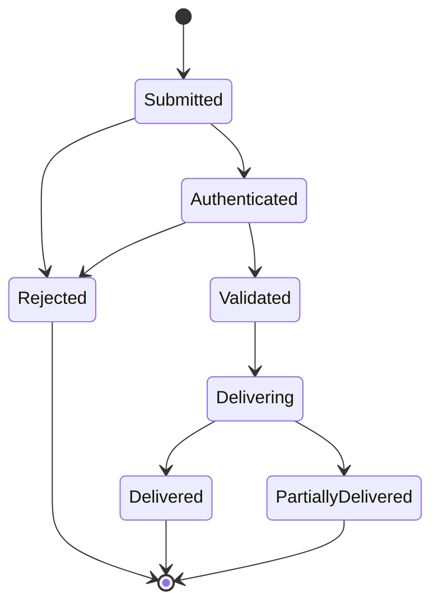

# EventBus Interface

## Status
Version: 0.7-alpha
Status: Normative interface; supporting types completed in this revision
(v0.7 Architecture Completion Phase, Priority 3). Previously carried a
dangling `ADR-005` citation (removed in the Phase 1 follow-up cleanup —
see "Related" below) and unspecified `EventType`/`EventHandler`/
`Subscription`/`PublishResult` types, now defined in their own supporting
documents.

## Purpose

The EventBus provides structured internal communication between Parker
services (Chapter 13). Components publish structured events; interested
services subscribe to categories of them.

## Responsibilities

- Publish authenticated events
- Route events to subscribers
- Preserve correlation IDs
- Reject unauthenticated publishers
- Support diagnostic observability

## Required Operations

```kotlin
interface EventBus {
    suspend fun publish(event: ParkerEvent): PublishResult
    fun subscribe(eventType: EventType, subscriberPrincipalId: PrincipalId, handler: EventHandler): Subscription
}
```

Supporting types: `EventType.md`, `EventHandler.md`, `Subscription.md`,
`PublishResult.md`. `ParkerEvent` is defined by `docs/schemas/Event.schema.json`
/ `Event-Schema.md`, and implemented in `src/contracts/EventContracts.kt`
(Phase 2 runtime implementation).

**`subscribe`'s `subscriberPrincipalId` parameter was added by the
targeted refinement pass** (IMPLEMENTATION_GAPS.md #27): earlier
revisions of this interface had no way for a caller to assert real
subscriber identity, so implementations had to guess or stamp a
placeholder. This parameter only makes identity explicit — it does not
itself authenticate or authorise the subscriber (see "Authentication"
below, which remains a separate, still-open concern).

## Normative Requirements

- Events MUST identify publisher Principal.
- Unauthenticated events MUST NOT influence Memory, World Model, Execution
  or Trust.
- Event payloads SHOULD be schema validated.

## Event Lifecycle



- **Submitted** — `publish(event)` called.
- **Authenticated** — publisher Principal established and (if present)
  `signature` verified. Failure here yields `PublishResult.Rejected` and
  the event goes no further (this is the "Reject unauthenticated
  publishers" responsibility, enforced structurally, not left to each
  subscriber to check independently).
- **Validated** — payload checked against `Event.schema.json` (a SHOULD,
  not MUST, per the existing normative requirement above — schema
  validation failures are logged but do not themselves reject the event
  in v0.7, since payload shapes are subscriber-defined and the Event Bus
  cannot know every subscriber's expectations).
- **Delivering / Delivered / PartiallyDelivered** — see "Delivery
  Guarantees" and "Failure Handling" below.

## Authentication

- Every `ParkerEvent.publisherPrincipalId` MUST resolve to a Principal in
  good standing (not `Revoked` or `Archived` — see
  `principal-lifecycle-state-machine.mmd`). An event from a Principal that
  cannot be resolved, or that resolves to a Revoked/Archived Principal, is
  `Rejected`.
- The optional `signature` field (`Event.schema.json`) is required to be
  present and valid for any event whose `EventType` is namespaced under a
  domain this document designates as **trust-sensitive**: at minimum,
  `permission.*` and `execution.*` events (mirrors the Chapter 13
  requirement: "unauthenticated events MUST NOT influence ... Execution or
  Trust"). Events outside these domains MAY omit `signature`.
- Authentication is the Event Bus's own responsibility — it is never
  delegated to subscribers. A subscriber's `EventHandler` MUST be able to
  assume any event it receives has already passed authentication.

## Authorisation

- Authentication answers "who published this" (Identity, per
  `IdentityService.md`); authorisation answers "may this Principal publish
  *this* `EventType`." Not every Principal may publish every event
  category — e.g. only the Execution Pipeline itself should be able to
  publish `execution.*` events.
- Authorisation to publish a given `EventType` is evaluated as a
  `PermissionAction.NOTIFY` (or `CONTROL`, for trust-sensitive domains)
  check against a Resource representing that event domain, following the
  same Permission Engine path as any other trust-sensitive action —
  the Event Bus does not maintain a separate authorisation mechanism.
- Subscribing is a lighter-weight operation than publishing and is not
  itself gated by the Permission Engine in v0.7 — any valid Principal may
  subscribe to any `EventType` it can discover. Whether subscription
  should itself require `PermissionAction.READ` against the event
  domain's Resource is recorded as an open question below, since it
  affects whether Discovery-style visibility scoping (as specified for
  the Tool Registry) should also apply here.

## Ordering

- The Event Bus provides **no cross-`EventType` ordering guarantee.**
- For a single `EventType`, events from the **same publisher Principal**
  are delivered to any one subscriber in the order they were
  successfully authenticated (FIFO per publisher, per event type, per
  subscriber). Events from different publishers are not ordered relative
  to each other.
- `correlationId` (required on every `ParkerEvent`) is the mechanism for a
  subscriber to reconstruct a causal sequence across multiple events, and
  MUST be preserved unmodified through the Event Bus — never regenerated
  or rewritten.

## Delivery Guarantees

- Delivery is **at-most-once, best-effort** per subscription in v0.7: the
  Event Bus does not persist undelivered events for a subscriber that is
  not currently active, and does not retry a failed handler invocation
  automatically. This is a deliberate, minimal starting point — see
  "Future Extensibility" in `docs/architecture/action-mapping.md` for the
  broader pattern this repository follows of not inventing more guarantee
  than is currently justified.
- `publish()` is fire-and-forget from the publisher's perspective: the
  publisher receives a `PublishResult` describing what happened at the
  moment of publish, but the Event Bus makes no guarantee about
  subscribers added after that moment ever seeing the event.
- A `Subscription` only receives events published **after** it was
  created; there is no replay of historical events.

## Failure Handling

- A subscriber `EventHandler` throwing an exception MUST be caught by the
  Event Bus, MUST NOT propagate to the publisher, and MUST NOT prevent
  delivery to any other subscriber of the same event (see
  `EventHandler.md`). This produces `PublishResult.PartialFailure`,
  listing the failed `Subscription`s.
- An event that fails authentication produces `PublishResult.Rejected` and
  is not delivered to any subscriber — see "Authentication."
- Event Bus internal failure (e.g. the bus itself is unavailable) is a
  platform health condition, not a `PublishResult` variant — per Chapter
  47 (Diagnostics and Telemetry), this MUST surface as a diagnostic event
  such as the existing example `EventBusUnavailable`-class condition, and
  MAY be a Safe Mode trigger (Chapter 48) if sustained, consistent with
  Chapter 47's "critical failures should trigger Safe Mode where
  appropriate."

## Cancellation

- A subscriber cancels its own subscription via `Subscription.cancel()`
  (see `Subscription.md`), which is idempotent and takes effect for all
  future deliveries.
- The Event Bus MUST cancel all Subscriptions owned by a Principal that
  transitions to `Revoked` or `Archived` (cascading cancellation), rather
  than waiting for the subscriber to notice and cancel itself — mirrors
  the Tool Registry's cascading-disable rule for uninstalled Plugins.
- Cancellation does not retroactively affect events already delivered.

## Security Considerations

- Because unauthenticated events must not influence Memory, World Model,
  Execution or Trust (Chapter 13, restated in Normative Requirements
  above), authentication failure MUST fail closed (`Rejected`), never fail
  open (silently delivered without a resolvable publisher).
- Event payloads MAY contain sensitive data; per Chapter 43/Chapter 45,
  subscribers that log or persist received events are subject to the same
  redaction expectations as Audit records — the Event Bus itself does not
  redact payloads (it cannot know what a given payload's sensitive fields
  are), but this document flags it as a security-relevant integration
  point for any subscriber that writes events to durable storage.
- Plugin subscribers (Chapter 15) receive events identically to core
  subscribers once authorised — a Plugin's `EventHandler` MUST NOT be
  granted a privileged view (e.g. seeing `signature` or internal metadata
  a core subscriber wouldn't) solely by virtue of being a Plugin.

## Open Questions (not resolved by this revision)

- Whether `subscribe()` should be gated by the Permission Engine
  (`PermissionAction.READ`) rather than open to any valid Principal.
- Whether delivery guarantees should be strengthened (at-least-once with
  retry, or durable queuing for offline subscribers) in a later revision,
  and if so, whether that becomes a per-`EventType` declaration rather
  than a bus-wide policy.
- Whether `Event.schema.json` validation should be promoted from SHOULD to
  MUST once a critical mass of `EventType`s have stable schemas.

## Related

- Chapter 13 – Event Bus
- Chapter 15 – Plugin SDK
- Chapter 43 – Audit and Observability
- Chapter 47 – Diagnostics and Telemetry
- Chapter 48 – Safe Mode and Recovery
- EventType.md
- EventHandler.md
- Subscription.md
- PublishResult.md
- Event-Schema.md (`docs/schemas/Event.schema.json`)
- `docs/architecture/IdentityService.md`
- No ADR currently exists for event authentication requirements
  specifically; a prior draft of this document cited a nonexistent
  "ADR-005" (`docs/adr/` numbering jumps 003→006). That dangling citation
  was removed rather than backfilled with an invented ADR, per the Phase 1
  follow-up cleanup pass. Whether a dedicated ADR should now be authored
  for the authentication/authorisation rules formalised in this revision
  is recorded as a human decision in
  `docs/architecture/IMPLEMENTATION_GAPS.md`.
