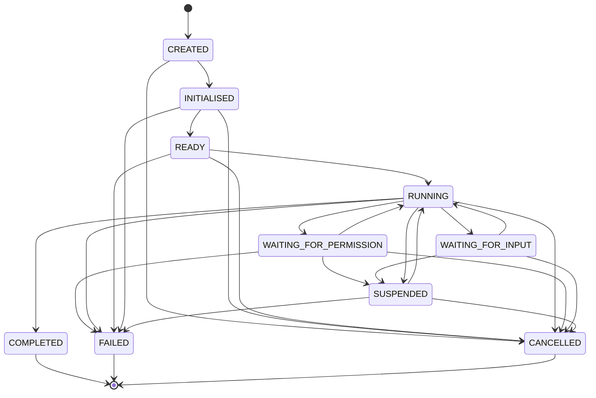

# Agent Runtime Specification

## Status

Version: 0.1-draft
Status: **Pre-publication corrected draft.** This revision applies the
correction pass recorded in `docs/reviews/AgentRuntimeSpecificationReview.md`:
it resolves the Task terminology collision with the existing Task Manager
(Chapter 37/ADR-012), reconciles the Agent Run lifecycle's state names
against the Task Manager Task lifecycle, restates the revocation
requirement as dependent on Identity Service gap closure rather than an
independently-detected guarantee, splits the conflated denied/deferred
permission outcomes into distinct events, adds the three lifecycle-entry
events the review found missing, and specifies the `WAITING_FOR_INPUT`
trust boundary. No issue outside the review's findings was changed. This
is the first Phase 3 document, written on top of the completed v0.8
runtime (Tool Registry, Action Mapping, EventBus, `DefaultExecutionPipeline`)
and the Identity Service foundation (`docs/architecture/IdentityService.md`,
`src/interfaces/IdentityService.kt`, `src/runtime/InMemoryIdentityService.kt`).
**This document is specification only.** No Kotlin is implemented,
proposed as a diff, or changed by it, and neither `src/` nor `tests/` is
touched. Nothing described here is authorised for implementation until an
explicitly-declared implementation phase promotes it — the same pattern
already used for `docs/architecture/IdentityService.md`,
`docs/architecture/tool-registry.md`, and `docs/architecture/action-mapping.md`
before each of their own implementation phases.

**Sprint 1 contract-closure addendum.** Section 5 below (an "explicit
suspend request" and "external cancellation request," each previously
unnamed) is now backed by a named channel: `src/contracts/AgentRunCommand.kt`'s
`AgentRunCommandChannel.submit`, taking an `AgentRunCommand` with
`commandType` one of `START`, `SUSPEND`, `RESUME`, or `CANCEL`, issued by
the Task Manager Runtime (`TaskManagerRuntimeSpecification.md` Section 16,
added by the same addendum; `docs/implementation/SPRINT_1_BLOCKER_CLOSURE.md`
records the full closure rationale). This does not change which
transitions exist, when this document says the Agent Runtime itself
chooses to enter them, or any other part of Section 5 — it only names the
previously-unnamed source of the request. **No implementation of
`AgentRunCommandChannel` exists yet** — this is a contract-preparation
change, not Sprint 1 coding, which remains
`docs/implementation/SPRINT_1_VERTICAL_SLICE_PLAN.md` Unit 7's work.

**Sprint 5 terminology clarification.** `docs/reviews/ARCHITECTURE_V2_BASELINE_REVIEW.md`
found that this document's own Section 1 could be read as implying the
Agent Runtime instantiates or manages `docs/specifications/volume-03-core-interfaces/Agent.md`'s
long-lived, daemon-style `Agent` interface (`start()`/`stop()`/`health()`).
It does not. Everything this Specification calls "Agent," "Agent
Instance," or "Agent Run" refers to the bounded, per-Task execution
model Section 4 defines and Sprint 3, Track C implemented
(`AgentRun`, `AgentRunCommandChannel`, `AgentStep`,
`src/runtime/InMemoryAgentRuntime.kt`) — a repository-wide search
confirms that implementation never references `src/interfaces/Agent.kt`
anywhere. `Agent.md` now carries the reciprocal clarification and has
been retitled "Background Agent Interface" to keep the two concepts
textually distinct going forward. Any future connection between a
background, long-lived Agent and Agent Runtime is not authorised by
this Specification and would require its own Architecture Decision or
Contract Design pass.

This document assumes familiarity with Chapter 9 (Trust Framework),
Chapter 10 (Permission Engine), Chapter 11 (Execution Pipeline), Chapter
12 (Tool Framework), Chapter 13 (Event Bus), Chapter 14 (Agent Framework),
Chapter 37 (Task Manager), Chapter 41 (Identity Service),
`docs/architecture/tool-registry.md`, and `docs/architecture/action-mapping.md`.
It does not restate their content except where necessary to define how
the Agent Runtime sits on top of them.

## 1. Overview

The Agent Runtime is the execution environment in which a bounded Agent
Instance — this document's own Section 4 concept, distinct from
`docs/specifications/volume-03-core-interfaces/Agent.md`'s long-lived
Background Agent interface (see this document's Status section, "Sprint
5 terminology clarification") — actually runs. It is the component
responsible for giving an Agent Instance a bounded lifecycle, an
identity, a scoped set of capabilities, and a controlled channel back into
the platform, without giving it anything the platform's existing Trust
Framework does not already mediate.

Concretely, the Agent Runtime is the layer that:

- creates and tracks Agent Instances through an explicit lifecycle;
- holds each Agent Instance's transient Agent Context while it runs;
- receives an Agent's proposed actions and turns them into
  `ExecutionRequest`s submitted to the Execution Pipeline, exactly as any
  other origin (voice, text, schedule, plugin) already does;
- emits Agent-specific lifecycle and execution events onto the existing
  EventBus; and
- enforces that an Agent can never do anything the Permission Engine has
  not authorised, for a Principal the Identity Service has not vouched
  for.

**What the Agent Runtime is not.** It is not a Planner (Chapter 20 remains
the architectural home for turning a goal into ordered steps — this
document assumes a Planner exists conceptually but does not specify one).
It is not a source of authority — it never grants permission, never
authenticates a Principal, and never resolves a Tool. It is not a Memory
system, a World Model, or a general-purpose code execution sandbox. It is
not the platform's Task Manager, and it does not define a competing unit
of tracked work — see "Relationship Chain" below. It is not artificial
general intelligence, and this document makes no claim that an Agent
running under it exhibits general reasoning; an Agent is a bounded,
auditable worker, not a mind. Every capability an Agent Runtime-hosted
Agent has is a capability the existing Trust Framework (Identity,
Resource Registry, Permission Engine, Execution Pipeline, Tool Registry,
EventBus) already provides to any other Principal — the Agent Runtime's
entire job is to host Agents inside those boundaries, not to create new
ones.

**Relationship Chain.** This document is normative for exactly one part
of a longer, already-partly-specified chain:

```text
Goal --> Task Manager Task --> Agent Run --> Agent Step --> Execution Pipeline
```

A Goal (Section 4) is upstream input. The Task Manager Task (Chapter 37,
`Task-Schema.md`, ADR-012 — already fully specified elsewhere and treated
as canonical here) is the platform's existing mechanism for tracking a
unit of work spanning more than one immediate execution. An Agent Run
(Section 4) is one Agent Instance's own bounded execution toward a Goal,
which MAY take place within a Task Manager Task but is never itself a
second, competing Task abstraction. An Agent Step (Section 4) is one
propose/mediate/result cycle within an Agent Run. The Execution Pipeline
(Chapter 11) is the sole mechanism by which an Agent Step has any effect.
Sections 4 and 5 define each link in this chain precisely; no link is
renamed or reinterpreted elsewhere in this document.

## 2. Design Goals

- **Safe autonomous behaviour.** An Agent may act without a human
  initiating each individual step, but "autonomous" never means
  "unsupervised" — every action still passes through the same Execution
  Pipeline and Permission Engine as a human-initiated request.
- **Bounded execution.** An Agent Instance's Agent Run has an explicit
  start, an explicit set of legal lifecycle states (Section 5), and no
  path to execute indefinitely or outside those states. There is no
  "always-on" Agent mode in this specification.
- **Identity-aware agents.** Every Agent Instance runs under an Agent
  Identity resolvable to a real `Principal` (Section 7). An Agent that
  cannot be identified cannot run, mirroring `Principal.md`'s existing
  rule that Parker MUST NOT execute any request without an identified
  Principal.
- **Permission-mediated actions.** Every action an Agent proposes is
  mediated by the Permission Engine before it can have any effect. There
  is no Agent-specific bypass, fast path, or elevated default.
- **Auditable decisions.** Every lifecycle transition and every proposed,
  approved, denied, deferred, or completed action is observable as an
  Agent Event on the EventBus (Section 9), giving Chapter 43 (Audit and
  Observability) the same visibility into Agent behaviour it already has
  into any other Execution Pipeline activity.
- **Model independence.** Nothing in this specification assumes a
  specific reasoning approach, model, or prompting strategy produces an
  Agent's Goals or proposed actions. Per ADR-001 ("Models Never Execute
  Tools"), whatever produces a Goal or a proposed action is upstream of
  the Agent Runtime and holds no executable reference to anything; the
  Agent Runtime would behave identically regardless of what — or whether
  a model — sits upstream.
- **Deterministic runtime integration.** Given the same Agent Context,
  the same proposed action, and the same Permission Engine/Tool Registry
  state, the Agent Runtime's own behaviour (which lifecycle transition
  occurs, which event is emitted, which `ExecutionRequest` is submitted)
  is deterministic. Non-determinism, if any exists upstream in how a Goal
  becomes a proposed action, is explicitly out of this document's scope
  (see Section 12).
- **No bypass of the Execution Pipeline.** Restating ADR-003 (Single
  Execution Pipeline) for this layer specifically: an Agent Instance holds
  no direct reference to a `Tool`, a `Resource`, or an external system. It
  holds only the ability to construct and submit `ExecutionRequest`s.

## 3. Non-Goals

This specification explicitly does not define, and Phase 3's Agent
Runtime work does not include:

- **Long-term Memory implementation.** Chapter 17 / the Memory
  Architecture is untouched. The Agent Runtime reads and writes no
  long-term memory.
- **World Model implementation.** Chapter 16 is untouched. Agent Context
  (Section 8) is explicitly not a World Model, and an Agent Instance does
  not maintain or update beliefs about reality.
- **Planner implementation.** Chapter 20 is untouched. How a Goal becomes
  an ordered sequence of proposed actions is not specified here — this
  document specifies what happens once a proposed action exists, mirroring
  how `action-mapping.md` specifies what happens once
  `ExecutionRequest.proposedActions` exists without specifying how the
  Planner produced it.
- **A competing Task abstraction.** Chapter 37 (Task Manager) already
  owns the platform's canonical unit of tracked work. This document does
  not define, extend, or reinterpret it — see "Relationship Chain"
  (Section 1) and Section 4.
- **Workflow implementation.** Chapter 38 is untouched. Composing multiple
  Agent Runs, or an Agent Run with non-Agent work, into a larger
  multi-stage process is Workflow Engine territory (Section 12), not
  specified here.
- **Android integration.** Chapter 27 is untouched. This document assumes
  no particular front end.
- **Direct Home Assistant or external system access.** Chapter 26 and
  every other external-system integration chapter are untouched. An Agent
  reaches any external system exactly the way any other Principal does —
  through a registered Tool, resolved by the Tool Registry, after
  Permission Engine approval. No Agent-specific integration surface is
  introduced.
- **Unrestricted autonomous execution.** There is no mode, flag, or
  Agent Policy value in this specification that allows an Agent to skip
  Permission Engine evaluation, act as a different Principal, or persist
  execution beyond what Section 5's lifecycle allows.

Any of the above may become their own specification once explicitly
scoped — this document does not attempt to anticipate their shape beyond
what Section 12 records.

## 4. Core Concepts

- **Agent.** Chapter 14's specialised internal worker: a class of
  behaviour with a defined purpose (e.g. "email triage agent"). An Agent
  is a design-time concept — what Chapter 14 and `Agent.md` (Volume 3)
  already describe. It is not itself a running thing.
- **Agent Instance.** A concrete, running (or runnable) realisation of an
  Agent, holding its own Agent Identity, Agent Context, and lifecycle
  state. Where this document says "an Agent does X," it means an Agent
  Instance, following the same informal convention Chapter 14 already
  uses.
- **Agent Type.** The identifier distinguishing one Agent (e.g. "email
  triage agent") from another (e.g. "calendar summariser agent") at the
  catalogue level. Distinct Agent Instances of the same Agent Type share
  behaviour but not identity, context, or lifecycle state.
- **Agent Identity.** The `PrincipalId` under which an Agent Instance
  runs (Section 7). Every Agent Instance has exactly one Agent Identity
  for its entire lifetime; an Agent Identity is never shared across two
  concurrently running Agent Instances.
- **Principal.** Already defined by `docs/specifications/volume-01-core-contracts/Principal.md`
  and `src/contracts/Principal.kt`. An Agent Instance's Agent Identity
  resolves to a `Principal` of type `PrincipalType.INTERNAL_AGENT`. This
  document does not propose a new `PrincipalType`.
- **Delegated Authority.** The explicit, recorded grant that allows an
  Agent Identity to act on behalf of another Principal (typically a
  `USER`). Modelled using the Identity Service's existing `owner` field
  (`docs/architecture/IdentityService.md`, "Trust Relationships") — an
  Agent Instance's Principal has `owner` set to the Principal it was
  created to act on behalf of. This document invents no new delegation
  mechanism beyond `owner`; see Section 7 for what "explicit" requires.
- **Goal.** A single, upstream-supplied statement of what an Agent
  Instance is meant to accomplish (e.g. "triage today's unread email").
  A Goal is an input to the Agent Runtime, not something the Agent Runtime
  produces — how a Goal is formed (user request, schedule, another
  system) is out of scope, mirroring how `ExecutionRequest.intent` is
  accepted as given by `action-mapping.md` without specifying its origin.
  A Goal is typically realised as one **Task Manager Task** (below),
  within which one or more **Agent Runs** (below) execute.
- **Task Manager Task.** The platform's existing, canonical unit of
  tracked work, already fully specified by Chapter 37 (Task Manager),
  `docs/specifications/volume-02-core-schemas/Task-Schema.md`, and
  ADR-012 ("Tasks track work. Workflows define structured multi-step
  behaviour."), with its own required fields (`taskId`, `ownerPrincipalId`,
  `status`, `createdAt`, `updatedAt`) and its own lifecycle
  (`docs/diagrams/task-lifecycle-state-machine.mmd`: `Created, Queued,
  Running, Paused, Completed`, plus terminal `Cancelled`, `Failed`,
  `Expired`, `Superseded`). **The Agent Runtime does not define a
  separate "Agent Task" abstraction.** An Agent Run (below) MAY execute
  within, contribute to, or be otherwise associated with a Task Manager
  Task — via that Task's own `ownerPrincipalId`/tracking mechanism, never
  a parallel one invented here — but this document introduces no new Task
  concept of its own, and no wording elsewhere in this document should be
  read as defining one. See Section 5 for how the two lifecycles relate.
- **Agent Run.** A single, bounded execution of an Agent Instance against
  a Goal, from `RUNNING` first entered to a terminal lifecycle state
  reached (Section 5). An Agent Run MAY take place within a Task Manager
  Task (above) but is not itself a Task Manager Task, and its lifecycle
  (Section 5) is a distinct state machine from the Task Manager Task
  lifecycle, scoped separately (Section 5, "Relationship to the Task
  Manager Task Lifecycle"). An Agent Instance that is resumed after
  `SUSPENDED` continues the same Agent Run, not a new one.
- **Agent Step.** A single proposed-action-to-result cycle within an
  Agent Run: an Agent Instance proposes one action, the action is
  mediated per Section 6, and a result is produced. An Agent Run consists
  of one or more Agent Steps.
- **Agent Context.** The transient state available to an Agent Instance
  while it runs (Section 8). Explicitly not long-term Memory.
- **Agent Capability.** A declaration of what kinds of `PermissionAction`/
  `ResourceType` combinations an Agent Instance's Goal may require it to
  propose — a planning-time hint, not a grant of permission. Mirrors the
  Tool Registry's capability declaration
  (`docs/architecture/tool-registry.md`, "Capability Declaration") in
  spirit: it makes intent legible and narrows what an Agent Instance is
  expected to attempt, but confers no authority by itself. Authority comes
  only from a `PermissionDecision`.
- **Agent Policy.** The bounded configuration governing an Agent
  Instance's operation — for example, maximum Agent Steps per Agent Run,
  maximum Agent Run duration, or which Agent Capabilities are in scope
  for a given Goal. An Agent Policy narrows what an Agent Instance may
  attempt; like Agent Capability, it is never itself a source of
  permission and cannot expand what the Permission Engine would otherwise
  allow.
- **Agent Event.** A `ParkerEvent` published to the EventBus under the
  `agent.*` `EventType` namespace, per `EventType.md`'s `<domain>.<event>`
  convention. See Section 9 for the required set.
- **Agent Result.** The outcome of an Agent Run, surfaced once a terminal
  lifecycle state (Section 5) is reached: which Goal it corresponds to,
  the terminal state reached, and references to the `ExecutionResult`s
  produced along the way. An Agent Result is a summary view over
  already-existing `ExecutionResult`s and Agent Events, not a new
  execution-outcome type competing with `ExecutionResult`, and not a
  substitute for the Task Manager's own status reporting on any Task
  Manager Task the Agent Run executed within.

## 5. Agent Lifecycle



- **CREATED** — the Agent Instance record exists (an Agent Identity has
  been allocated) but nothing else has been established yet.
- **INITIALISED** — Agent Identity resolved against the Identity Service,
  Delegated Authority (if any) recorded, Agent Context constructed. See
  Section 9 (`agent.initialised`).
- **READY** — Agent Capability/Agent Policy bound and validated against
  the assigned Goal; the Agent Instance is eligible to begin but has not
  yet taken an Agent Step. See Section 9 (`agent.ready`).
- **RUNNING** — the Agent Instance is actively proposing and completing
  Agent Steps within its current Agent Run.
- **WAITING_FOR_PERMISSION** — a proposed action has been submitted as an
  `ExecutionRequest` and the Agent Run is paused on
  `PermissionEngine.evaluate`'s outcome (see Section 6).
- **WAITING_FOR_INPUT** — the Agent Run is paused pending an input the
  Agent Instance cannot supply itself (e.g. a value only a human or
  another system can provide). This is distinct from
  `WAITING_FOR_PERMISSION`: it is about missing information, not pending
  authorisation. See Section 9 (`agent.input_required`) and "WAITING_FOR_INPUT
  Trust Boundary" below for the required handling of this state.
- **SUSPENDED** — a safe, inert pause: no Agent Step is in progress and
  none will begin until the Agent Run is explicitly resumed. Reached from
  a `PermissionDecisionOutcome.DEFERRED` result (Section 9,
  `agent.action_deferred`), from `WAITING_FOR_INPUT` timing out, from an
  explicit suspend request (now named: an `AgentRunCommand` with
  `commandType SUSPEND`, `src/contracts/AgentRunCommand.kt`, per the
  Sprint 1 contract-closure addendum in the Status header), or from the
  failure categories in Section 10 that are recoverable rather than
  terminal.
- **RUNNING** (resumed) — `SUSPENDED --> RUNNING` resumes the same Agent
  Run; no new Agent Run is created (see "Agent Run" in Section 4).
- **COMPLETED** — the Agent Run's Goal was achieved; terminal.
- **FAILED** — the Agent Run ended in an unrecoverable condition (Section
  10); terminal.
- **CANCELLED** — the Agent Run was explicitly cancelled before reaching a
  terminal state on its own; terminal.

### Relationship to the Task Manager Task Lifecycle

The ten states above belong exclusively to the **Agent Run lifecycle**
defined by this document. Several of these names — `CREATED`, `RUNNING`,
`COMPLETED`, `FAILED`, `CANCELLED` — are also used by `Task-Schema.md`'s
independent Task lifecycle (`CREATED, QUEUED, RUNNING, PAUSED, COMPLETED,
FAILED, CANCELLED, EXPIRED, SUPERSEDED`). This is a **naming coincidence
between two deliberately separate state machines, not a shared one.** The
Agent Run lifecycle and the Task Manager Task lifecycle:

- are tracked independently, with independent transition rules (compare
  this section against `docs/diagrams/task-lifecycle-state-machine.mmd`);
- MUST NOT be inferred from one another — an Agent Run entering `RUNNING`,
  `COMPLETED`, `FAILED`, or `CANCELLED` MUST NOT itself be read as, and
  MUST NOT itself trigger, any Task Manager Task status change; and
- are reconciled only through the Task Manager's own sanctioned
  operations. If an Agent Run executes within a Task Manager Task and
  the Agent Run's outcome should be reflected in that Task's `status`
  (e.g. marking the Task `Completed` or `Failed`), that update is the
  Task Manager's own responsibility to perform, through its own
  operations — this document does not grant the Agent Runtime a write
  path to Task Manager Task state, and does not specify when or whether
  such an update happens automatically.

### Valid transitions

The edges in the diagram above are the complete set this document
specifies. In particular:

- `CREATED --> INITIALISED --> READY --> RUNNING` is the only path into
  active execution — identity resolution and context construction cannot
  be skipped, matching the identity-first design goal in Section 2.
- `WAITING_FOR_PERMISSION --> RUNNING` only on
  `PermissionDecisionOutcome.APPROVED` or `APPROVED_WITH_CONFIRMATION`.
- `WAITING_FOR_PERMISSION --> SUSPENDED` on `DEFERRED` — the decision is
  paused pending further permission, confirmation, input, or external
  condition, not resolved one way or the other, so the Agent Run pauses
  rather than fails (Section 9, `agent.action_deferred`).
- `WAITING_FOR_PERMISSION --> FAILED` on `DENIED` is one legitimate
  outcome, not the only one: a `DENIED` decision means the proposed
  action cannot proceed, which always fails the current Agent Step, but
  whether that also ends the whole Agent Run (`--> FAILED`) or the Agent
  Run continues via an alternate proposed action (remaining in `RUNNING`)
  is an Agent Policy/Planner-level decision this document does not
  mandate — mirroring exactly how Section 10 ("Tool failure") already
  treats a failed Agent Step's effect on the containing Agent Run. See
  Section 9 (`agent.action_denied`).
- Cancellation (`--> CANCELLED`) is reachable from every non-terminal
  state, since an external cancellation request (now named: an
  `AgentRunCommand` with `commandType CANCEL` and a required
  `cancellationReason`, `src/contracts/AgentRunCommand.kt`, per the
  Sprint 1 contract-closure addendum) can legitimately arrive at
  any point in an Agent Run, mirroring the general principle behind
  `ExecutionLifecycleState`'s own `Queued --> Cancelled` edge, extended
  here to every pre-terminal Agent lifecycle state because an Agent Run is
  longer-lived than a single `ExecutionRequest`.
- `SUSPENDED --> RUNNING` is the only resume path; an Agent Run never
  resumes directly into `WAITING_FOR_PERMISSION` or `WAITING_FOR_INPUT` —
  it re-enters `RUNNING` and re-derives whether a wait state is
  immediately needed again.

### Invalid transitions

The following are deliberately **not** specified, and an implementation
MUST NOT invent them:

- Any transition out of `COMPLETED`, `FAILED`, or `CANCELLED`. These are
  terminal, matching every other lifecycle state machine in this
  repository (`ExecutionLifecycleState`, `ToolLifecycleTransitions`,
  `PrincipalLifecycleTransitions`, and the Task Manager Task lifecycle
  itself) — none of which permit resurrection out of a terminal state.
- `CREATED --> RUNNING`, `CREATED --> READY`, or any other transition that
  skips `INITIALISED`. Identity resolution and context construction are
  not optional steps.
- `WAITING_FOR_INPUT --> WAITING_FOR_PERMISSION` or
  `WAITING_FOR_PERMISSION --> WAITING_FOR_INPUT` directly. An Agent Run
  always returns to `RUNNING` between the two distinct kinds of wait,
  matching the "resume re-enters RUNNING" rule above.
- `SUSPENDED --> COMPLETED`. An Agent Run cannot complete while paused; it
  must resume to `RUNNING` first.
- Any Agent Run lifecycle transition being treated as, or substituted
  for, a Task Manager Task status change. See "Relationship to the Task
  Manager Task Lifecycle" above.

### WAITING_FOR_INPUT Trust Boundary

Because `WAITING_FOR_INPUT` is a point where something outside the Agent
Runtime's existing Trust Framework path (a human, or another system)
supplies data back into a paused Agent Run, this document specifies its
handling explicitly rather than leaving it implicit:

- **Agent execution is suspended while waiting for input.** No Agent Step
  is in progress, and no new Agent Step begins, for the duration of
  `WAITING_FOR_INPUT` — identically to `SUSPENDED` (Section 4, "Agent
  Run"), except that `WAITING_FOR_INPUT` is specifically pending a piece
  of missing information rather than a general pause.
- **Input must be authenticated, authorised, and validated before
  resumption.** Whatever supplies the input does so as an identified
  Principal (Identity), through whatever channel the Agent Runtime
  exposes for it (never anonymously); if the input's origin is itself a
  protected Resource (e.g. the input is the contents of a sensitive
  document), retrieving it MUST go through the same
  `ExecutionRequest`/Permission Engine path specified in Section 6 — there
  is no exception to Permission Engine mediation for data that happens to
  arrive as "input" rather than as a directly-proposed action. The
  supplied input MUST also be validated against whatever shape the
  waiting Agent Step expects before the Agent Run resumes; malformed
  input is handled as a Section 10 failure category, not silently
  accepted.
- **User input cannot directly mutate Agent state except through
  runtime-approved input handling.** There is no operation by which a
  human or external system writes directly to Agent Context, Agent
  Instance lifecycle state, or any other Agent Runtime-internal record.
  Supplied input is accepted only through the Agent Runtime's own
  input-handling operation, which validates it (above) and then resumes
  the Agent Run (`WAITING_FOR_INPUT --> RUNNING`) — the input becomes part
  of the current Agent Step's inputs, not a direct write to state.
- **No hidden background execution may continue while waiting for
  required input.** This restates Section 11's "No hidden background
  execution" boundary specifically for this state: entering
  `WAITING_FOR_INPUT` means the Agent Run stops doing anything until
  input arrives (or the wait times out into `SUSPENDED`, Section 10) —
  it does not continue speculative work, pre-fetch further Resources, or
  propose further actions in the background during the wait.

## 6. Agent Execution Model

An Agent Instance never executes anything directly. Every effect it has
on the platform passes through the same path any other origin's request
already takes:

```mermaid
sequenceDiagram
    participant AI as Agent Instance
    participant AR as Agent Runtime
    participant EP as ExecutionPipeline
    participant PE as PermissionEngine
    participant TR as ToolRegistry
    participant RR as ResourceRegistry
    participant TIB as ToolInvocationBinding
    participant T as Tool
    participant EB as EventBus

    AI->>AR: propose action (within current Agent Step)
    AR->>EB: publish agent.action_proposed
    AR->>EP: submit(ExecutionRequest)
    EP->>PE: evaluate(request)
    PE-->>EP: PermissionDecision
    alt APPROVED or APPROVED_WITH_CONFIRMATION
        AR->>EB: publish agent.action_approved
        EP->>TR: resolve(decision.action, request.targetResources)
        TR->>RR: resolve(resourceId)
        RR-->>TR: Resource
        TR-->>EP: ToolDescriptor or ToolResolutionFailure
        EP->>TIB: invocableFor(descriptor)
        TIB-->>EP: Tool or nothing bound
        EP->>T: validate(request)
        EP->>T: execute(request)
        T-->>EP: ToolResult
        EP-->>AR: ExecutionResult
        AR->>EB: publish agent.step_completed
    else DENIED
        AR->>EB: publish agent.action_denied
        AR->>AR: current Agent Step fails; transition per Section 5/10
    else DEFERRED
        AR->>EB: publish agent.action_deferred
        AR->>AR: transition to SUSPENDED per Section 5
    end
```

`ToolInvocationBinding.invocableFor`, `Tool.validate()`, and
`Tool.execute()` are internal to `DefaultExecutionPipeline`'s handling of
an approved request (Sprint 1, Unit 11A;
`docs/specifications/volume-03-core-interfaces/ToolInvocationBinding.md`)
— the Agent Runtime observes only the resulting `ExecutionResult`, never
these intermediate steps directly, consistent with AD-003 (Execution
Pipeline Is the Sole Execution Authority).

- **Agents propose actions.** An Agent Instance's only channel for having
  any effect is constructing an `ExecutionRequest` (via the Agent Runtime)
  carrying `proposedActions`, exactly as `action-mapping.md` already
  describes for any other origin. The Agent Runtime does not give an
  Agent Instance a different or richer request shape.
- **The Execution Pipeline evaluates actions.** `ExecutionPipeline.submit`
  is the only entry point (ADR-003); the Agent Runtime is a caller of it,
  never a parallel path around it.
- **The Permission Engine authorises actions.** `PermissionEngine.evaluate`
  is invoked exactly once per `ExecutionRequest`, per the existing
  interface and `action-mapping.md`'s "Multiple Actions" rules — the
  Agent Runtime does not call it more than once per request, and does not
  interpret `proposedActions` itself (that remains the action-mapping
  layer's job, unchanged).
- **The Tool Registry resolves tools.** As already specified in
  `docs/architecture/tool-registry.md`: only the Execution Pipeline ever
  holds a live `Tool` reference. An Agent Instance never queries
  `ToolRegistry.resolve` directly, and the Agent Runtime does not expose
  that surface to it. An Agent Instance (via the Agent Runtime) MAY use
  the Tool Registry's read-only discovery surface
  (`listAll`/`findCandidates`) for planning purposes, identically to how
  a Planner or Conversation Engine already may.
- **The EventBus records lifecycle and execution events.** Every
  transition in Section 5 and every Agent Step outcome publishes an Agent
  Event (Section 9), giving Audit the same visibility into an Agent
  Instance's behaviour as into any other Execution Pipeline activity.
- **The Resource Registry controls resource access.** Any Resource an
  Agent Instance's proposed action targets is resolved and access
  -controlled exactly as it would be for any other Principal — the Agent
  Runtime introduces no Agent-specific Resource Registry path.

## 7. Identity and Permissions

- **Every Agent Instance runs under an Agent Identity.** No Agent
  Instance may reach `INITIALISED` (Section 5) without a resolvable
  `PrincipalId`. This mirrors `Principal.md`'s existing rule and
  `IdentityService.md`'s "Principal Resolution": an unresolvable Principal
  is invalid, not denied, and the Agent Instance cannot proceed past
  `CREATED`.
- **Every Agent Identity is linked to a Principal.** Specifically a
  `Principal` with `principalType = PrincipalType.INTERNAL_AGENT`,
  registered through the Identity Service like any other Principal — the
  Agent Runtime does not maintain its own separate identity store.
- **Delegated authority must be explicit.** An Agent Instance's Principal
  MUST have a non-null `owner` identifying the Principal (typically
  `USER`) it acts on behalf of, established at registration time — an
  Agent Instance with no recorded `owner` has no Delegated Authority and
  cannot be created. This follows `IdentityService.md`'s existing
  "Trust Relationships" model directly; this document introduces no
  additional delegation mechanism.
- **Agents cannot expand their own authority.** Neither Agent Capability
  nor Agent Policy (Section 4) grant permission — they only narrow what
  an Agent Instance is expected to attempt. The only source of authority
  for any proposed action is the `PermissionDecision` returned by
  `PermissionEngine.evaluate`. An Agent Instance has no operation that
  writes to its own `Principal` record, its own permissions, or another
  Principal's permissions; `IdentityService.updateStatus` and any future
  permission-granting operation remain exclusively platform-service
  operations, never Agent-invocable ones.
- **Revoked authority must stop or suspend future execution — as reported
  by the Identity Service, not independently detected.** The Agent
  Runtime does not itself determine that a Principal's status has
  changed; it relies entirely on the Identity Service to report this.
  When the Identity Service resolves an Agent Instance's Principal as
  non-Active (`Suspended` or `Revoked`), or emits an authorised identity
  revocation event, the Agent Runtime MUST stop or suspend that Agent Run
  rather than allowing it to enter or remain in `RUNNING` (Section 10,
  "Identity revocation").

  **This requirement has an explicit, currently-unclosed dependency on
  the Identity Service** (`docs/architecture/IMPLEMENTATION_GAPS.md` #37,
  #39):
  - `IdentityService.resolve()` must reject or flag non-Active Principals
    for the Agent Runtime to detect a status change via a direct check.
    Per gap #37, the current implementation returns a Revoked/Archived
    Principal's record unchanged and leaves the "cannot act" decision to
    callers — this document relies on that caller-side enforcement
    existing in the Agent Runtime, but the Identity Service side of the
    contract (a clearly flagged non-Active result) is not yet settled.
  - `identity.*` audit/revocation events must be published for the Agent
    Runtime to react to a status change asynchronously, without polling.
    Per gap #39, no such events are currently published by
    `InMemoryIdentityService`.

  Until both are available, this document does not claim a stronger
  enforcement guarantee than the platform currently supports: revocation
  -driven stopping/suspension can only be as timely as whatever points
  the Agent Runtime calls `IdentityService.resolve` (for example, before
  each Agent Step). This is recorded as a dependency, not invented around
  — see Section 10 and the Open Questions below.
- **Sensitive actions require permission evaluation.** No exception
  exists for `Resource.sensitivity` classifications higher than the
  default. An Agent Instance proposing an action against a `SECURITY_SENSITIVE`,
  `CREDENTIALS_SECRETS`, or similarly classified Resource goes through the
  identical `PermissionEngine.evaluate` path as any other request against
  that Resource — the Agent Runtime applies no separate sensitivity
  handling of its own.

## 8. Agent Context Model

Agent Context is the transient state available to an Agent Instance for
the duration of an Agent Run. It MAY contain:

- **Agent Run ID** — identifies the current Agent Run (Section 4).
- **Principal ID** — the Agent Instance's own Agent Identity.
- **Agent ID** — identifies the Agent Instance itself, distinct from
  Agent Run ID (an Agent Instance may, over its lifetime, be associated
  with more than one Agent Run if the architecture later permits re-use;
  this document does not resolve whether it does — see Section 12).
- **Goal** — the Goal (Section 4) this Agent Run was created to pursue.
- **Agent Step state** — the current Agent Step's progress within the
  Agent Run, and, where the Agent Run executes within a Task Manager
  Task (Section 4), a reference to that Task's `taskId`. This is a
  reference only: Agent Context does not duplicate or shadow the Task
  Manager's own tracked state for that Task (see Section 5,
  "Relationship to the Task Manager Task Lifecycle").
- **Available capabilities** — the Agent Capability declarations in scope
  for this Agent Run (Section 4); a planning-time hint, not a grant.
- **Permission scope** — a read-only summary of what kinds of
  `PermissionAction`/`ResourceType` combinations recent `PermissionDecision`s
  have approved, denied, or deferred for this Agent Run, useful for the
  Agent Instance (or whatever produces its next proposed action) to avoid
  re-proposing already-denied actions. This is a cache of past decisions
  for planning convenience, not itself a source of authority — every new
  proposed action is still independently evaluated per Section 6.
- **Resource references** — identifiers of Resources already touched or
  referenced during this Agent Run, for continuity across Agent Steps.
- **Event history reference** — a reference (e.g. a `correlationId`) by
  which the Agent Run's own Agent Events and `ExecutionResult`s can be
  retrieved, not a copy of that history duplicated into Context.
- **Temporary working state** — any other Agent-Step-to-Agent-Step
  scratch data the Agent Instance needs only for the duration of the
  current Agent Run.

**Agent Context is not long-term Memory.** Per ADR-002 ("Memory, Context
and World Model Remain Separate"): Context stores immediate state, World
Model stores current reality, Memory stores long-term knowledge. Agent
Context is an Agent-Run-scoped instance of the same "immediate state"
category ADR-002 already describes — it does not persist beyond its
Agent Run, is not consulted by other Agent Runs, and is not a substitute
for, or an early version of, the Memory Architecture (Chapter 17) or
World Model (Chapter 16), neither of which this document implements
(Section 3). It is also not a substitute for the Task Manager's own
tracked state for any Task Manager Task the Agent Run executes within
(Section 4, "Task Manager Task").

## 9. Event Model

Every Agent Event is a `ParkerEvent` (`src/contracts/EventContracts.kt`)
published under the `agent.*` namespace, per `EventType.md`'s
`<domain>.<event>` convention, with `publisherPrincipalId` set to the
Agent Instance's own Agent Identity and `correlationId` set to the Agent
Run ID (so every event in an Agent Run can be reconstructed as a causal
sequence, per `EventBus.md`'s "Ordering" section). This document specifies
the required set of Agent Event types; it does not specify their payload
schemas — that is implementation-phase content, the same scoping choice
`action-mapping.md` makes for its vocabulary table (Section 12).

| Agent Event | `EventType` | Published when |
|---|---|---|
| AgentCreated | `agent.created` | Lifecycle enters `CREATED`. |
| AgentInitialised | `agent.initialised` | Lifecycle enters `INITIALISED`. |
| AgentReady | `agent.ready` | Lifecycle enters `READY`. |
| AgentStarted | `agent.started` | Lifecycle first enters `RUNNING`. |
| AgentStepStarted | `agent.step_started` | A new Agent Step begins within the current Agent Run. |
| AgentActionProposed | `agent.action_proposed` | An Agent Instance proposes an action, before submission to the Execution Pipeline. |
| AgentPermissionRequired | `agent.permission_required` | Lifecycle enters `WAITING_FOR_PERMISSION`. |
| AgentActionApproved | `agent.action_approved` | `PermissionDecisionOutcome.APPROVED` or `APPROVED_WITH_CONFIRMATION` is returned. |
| AgentActionDenied | `agent.action_denied` | `PermissionDecisionOutcome.DENIED` is returned. The proposed action cannot proceed: the current Agent Step fails, and the Agent Run either ends (`--> FAILED`) or continues via an alternate proposed action, per Section 5. |
| AgentActionDeferred | `agent.action_deferred` | `PermissionDecisionOutcome.DEFERRED` is returned. The action is paused pending further permission, confirmation, input, or external condition; the Agent Run transitions to `SUSPENDED` (Section 5). |
| AgentInputRequired | `agent.input_required` | Lifecycle enters `WAITING_FOR_INPUT`. See Section 5, "WAITING_FOR_INPUT Trust Boundary." |
| AgentStepCompleted | `agent.step_completed` | An Agent Step concludes with an `ExecutionResult`. |
| AgentSuspended | `agent.suspended` | Lifecycle enters `SUSPENDED`. |
| AgentResumed | `agent.resumed` | Lifecycle transitions `SUSPENDED --> RUNNING`. |
| AgentCompleted | `agent.completed` | Lifecycle enters `COMPLETED`. |
| AgentFailed | `agent.failed` | Lifecycle enters `FAILED`. |
| AgentCancelled | `agent.cancelled` | Lifecycle enters `CANCELLED`. |

`AgentActionDenied` and `AgentActionDeferred` are deliberately distinct
events, not two labels for one outcome: `DENIED` and `DEFERRED` lead to
different Section 5 transitions (`FAILED`-bound vs. `SUSPENDED`) and mean
different things to an Audit subscriber — a denial is a settled negative
decision, a deferral is not a decision at all yet.

Per `EventBus.md`'s "Authentication" and "Authorisation" sections: every
Agent Event MUST resolve to a Principal in good standing to be accepted
(an Agent Instance whose Principal has just been Revoked cannot itself
successfully publish `agent.failed` — the Agent Runtime, not the Agent
Instance, is responsible for ensuring the terminal event for a
revocation-triggered failure is still recorded, e.g. by publishing under
its own platform-level authority, mirroring how `DefaultExecutionPipeline`
already publishes lifecycle events under a placeholder pipeline authority
per `IMPLEMENTATION_GAPS.md` #34). `agent.*` is a trust-relevant domain in
the same sense `execution.*` and `permission.*` already are (Section
11), so this document recommends — without itself deciding, since
`EventBus.md` leaves the exact trust-sensitive domain list to be extended
as needed — that `agent.*` be added to that list when EventBus
authentication is implemented.

## 10. Failure and Recovery

- **Tool failure.** A `Tool.validate()` failure, a resolved descriptor
  with no `Tool` bound to it via `ToolInvocationBinding`, or a
  `Tool.execute()` failure are each reported via
  `ExecutionResult`/`ToolResult` exactly as they already are for any
  Execution Pipeline caller (`Tool.md`'s existing normative requirements;
  `docs/specifications/volume-03-core-interfaces/ToolInvocationBinding.md`).
  The Agent Runtime does not add a parallel Tool-failure channel; an
  Agent Step whose `ExecutionResult.status` is `FAILED`
  records that outcome and, per Agent Policy (Section 4), either ends the
  Agent Run (`--> FAILED`) or allows the Agent Run to continue with a
  different proposed action — this document does not prescribe which,
  since it depends on Planner-level retry logic out of scope here
  (Section 12).
- **Permission denial.** Per Section 5 and Section 9, `DENIED` fails the
  current Agent Step and publishes `agent.action_denied`; whether the
  Agent Run also ends (`--> FAILED`) or continues via an alternate
  proposed action is the same Agent Policy/Planner-level decision as
  "Tool failure" above — not a platform error either way, but a correct,
  auditable outcome of Section 6's execution model. `DEFERRED` is handled
  separately below.
- **Identity revocation.** Per Section 7, when the Identity Service
  reports — via `resolve()`, or, once available, an `identity.*` event —
  that an Agent Run's Principal is no longer Active, the Agent Run stops
  rather than continuing (`--> FAILED`). This is treated as an integrity
  condition, not a normal Agent Run outcome, since there is no specified
  path for a Revoked Principal to regain authority
  (`PrincipalLifecycleTransitions` has no `Revoked -> Active` edge).
  **Full, timely enforcement of this is dependent on Identity Service gap
  closure** — see Section 7's dependency note
  (`IMPLEMENTATION_GAPS.md` #37, #39).
- **Malformed action.** A proposed action that does not resolve to a
  known action vocabulary entry is, per `action-mapping.md`'s existing
  "Unknown Actions" section, **invalid, not denied** — the underlying
  `ExecutionRequest` never reaches `PermissionPending`. From the Agent
  Runtime's perspective this surfaces the same way a Tool failure does: a
  `FAILED` `ExecutionResult` for that Agent Step, handled per "Tool
  failure" above.
- **Timeout.** Two distinct timeout conditions exist: an `ExecutionRequest`
  reaching its own `expiresAt` (already specified,
  `ExecutionLifecycleState.EXPIRED`) is a Tool/Execution Pipeline-level
  concern unchanged by this document. An Agent Run exceeding an Agent
  Policy-defined maximum duration or Agent Step count is an Agent
  Runtime-level concern; this document specifies that such an Agent Run
  MUST transition to `SUSPENDED` (recoverable) rather than `FAILED`,
  since exceeding a configured bound is not itself evidence of an
  unrecoverable error. A `WAITING_FOR_INPUT` wait timing out is a third,
  narrower case, also resolving to `SUSPENDED` (Section 5).
- **Cancellation.** An explicit cancellation request transitions the
  Agent Run to `CANCELLED` from any non-terminal state (Section 5).
  Cancellation is always available and is not itself a failure.
- **Partial completion.** An Agent Run that has completed some Agent
  Steps toward its Goal but cannot complete all of them (e.g. because a
  later Agent Step was denied or failed) ends at whatever terminal state
  its last Agent Step's outcome dictates (`FAILED` or `CANCELLED`); this
  document does not introduce a distinct "partially completed" terminal
  state, mirroring `ExecutionResultStatus.PARTIAL_SUCCESS`'s existing
  precedent of recording partial completion as a status/result concern
  rather than a distinct lifecycle state. The Agent Result (Section 4)
  for such an Agent Run reports exactly which Agent Steps completed and
  which did not; where the Agent Run executed within a Task Manager
  Task, that Task's own status is reported by the Task Manager, not
  inferred from the Agent Result (Section 5, "Relationship to the Task
  Manager Task Lifecycle").
- **Safe suspension.** `SUSPENDED` (Section 5) is the Agent Runtime's
  general-purpose recoverable pause state: reached from a `DEFERRED`
  permission decision, a `WAITING_FOR_INPUT` timeout, an Agent
  Policy-defined bound being exceeded, or an explicit suspend request (an
  `AgentRunCommand` with `commandType SUSPEND`, per the Status header's
  Sprint 1 contract-closure addendum). A suspended Agent Run holds no
  active Agent Step and consumes no further Execution Pipeline capacity
  until resumed.

## 11. Safety Boundaries

- **No direct external effects.** An Agent Instance has no operation that
  reaches an external system, a Tool, or a Resource other than by
  submitting an `ExecutionRequest` through the Agent Runtime to the
  Execution Pipeline.
- **No self-permissioning.** An Agent Instance cannot approve its own
  proposed action, grant itself a `PermissionDecision`, or otherwise
  substitute for the Permission Engine.
- **No silent privilege escalation.** Agent Capability and Agent Policy
  narrow scope; neither can be used to obtain authority beyond what the
  Agent Instance's Principal would already be granted by the Permission
  Engine for an identical request submitted by any other Principal of the
  same standing.
- **No hidden background execution.** Every Agent Run is explicitly
  tracked through Section 5's lifecycle and is visible via Section 9's
  events; there is no execution mode in this specification that runs
  outside a tracked Agent Run or that omits publishing the corresponding
  Agent Events — including while `WAITING_FOR_INPUT` (Section 5,
  "WAITING_FOR_INPUT Trust Boundary"), where no further Agent Step may
  begin until input arrives or the wait is resolved.
- **No mutation of identity or permission state except through authorised
  runtime services.** An Agent Instance never writes directly to a
  `Principal` record, a `PermissionDecision`, a `Resource` entry, or a
  Tool Registry entry. Every such mutation happens exclusively through
  the Identity Service, Permission Engine, Resource Registry, or Tool
  Registry's own sanctioned operations, called (where applicable) via an
  `ExecutionRequest` like any other administrative action
  (`docs/architecture/tool-registry.md`'s "Registration Model" is the
  precedent this follows). The same applies to Task Manager Task state:
  an Agent Instance never writes a Task's `status` directly (Section 5,
  "Relationship to the Task Manager Task Lifecycle").
- **No unaudited action execution.** Every Agent Step (Section 4) that
  reaches the Execution Pipeline publishes `agent.action_proposed` and
  exactly one of `agent.action_approved`, `agent.action_denied`, or
  `agent.action_deferred`, plus `agent.step_completed` where the Agent
  Step reaches a result (Section 9) — there is no path for a proposed
  action to have an effect without a corresponding Agent Event trail.

## 12. Relationship to Future Systems

The following integrations are **future work, not part of this
specification.** This document intentionally does not define their
shape; it only notes the seam each will eventually attach to, so a future
specification does not have to rediscover it.

- **Planner (Chapter 20).** Will be the component that turns a Goal into
  the ordered proposed actions an Agent Instance's Agent Steps submit
  (Section 6). This document assumes proposed actions arrive already
  formed, the same assumption `action-mapping.md` makes.
- **World Model (Chapter 16).** Will be a read-only input a future
  Planner or Agent Instance may consult when forming a Goal into
  Task Manager Tasks and Agent Runs. Agent Context (Section 8) does not
  reference the World Model, and this document does not specify how or
  whether an Agent Instance ever queries it.
- **Memory (Chapter 17).** Will be where any long-term Agent Result
  history, learned preference, or cross-Agent-Run knowledge would
  eventually be written and read. No such promotion path exists in this
  specification; Agent Context (Section 8) is explicitly Agent-Run-scoped
  only (Section 8's closing paragraph).
- **Android front end (Chapter 27).** Will be one of possibly several
  surfaces that create Goals, supply `WAITING_FOR_INPUT` responses, or
  display Agent Results. This document assumes no particular front end
  and specifies no Android-specific behaviour.
- **Plugins (Chapter 15).** Will be able to register Tools an Agent
  Instance's proposed actions may resolve to, exactly as any other
  Plugin-supplied Tool already can (`docs/architecture/tool-registry.md`,
  "Plugin Integration"). This document does not propose a distinct
  Agent-Plugin integration surface beyond the existing Tool Registry path.
- **Workflows (Chapter 38).** Will likely be the mechanism by which
  multiple Agent Runs, multiple Task Manager Tasks, or an Agent Run and
  non-Agent work, are composed into a larger multi-stage process. This
  document specifies a single Agent Instance's own Agent Run lifecycle
  only, and does not specify cross-Agent-Run or cross-Task orchestration.

## 13. Acceptance Criteria

This specification is complete when, and only to the extent that:

- **Agent lifecycle is explicit.** Section 5 defines every state, every
  valid transition, and enumerates transitions this document deliberately
  does not permit.
- **Terminology is reconciled with existing platform concepts.** Section
  4 treats the Task Manager Task (Chapter 37/ADR-012) as canonical and
  does not define a competing Agent Task abstraction; Section 5 states
  explicitly that the Agent Run lifecycle's overlapping state names are a
  naming coincidence with, not a substitute for, the Task Manager Task
  lifecycle.
- **Trust boundaries are explicit.** Section 11 enumerates the safety
  boundaries an implementation MUST enforce; Section 6 defines the single
  execution path an Agent Instance has; Section 5's "WAITING_FOR_INPUT
  Trust Boundary" specifies the one state where external data enters a
  paused Agent Run.
- **Identity and permission integration is explicit.** Section 7 defines
  how Agent Identity, Delegated Authority, and revocation interact with
  the existing Identity Service and Permission Engine, without inventing
  new mechanisms beyond `owner` and the existing lifecycle operations,
  and states plainly which part of the revocation requirement depends on
  still-open Identity Service gaps.
- **Execution path is defined.** Section 6 defines how a proposed action
  becomes an `ExecutionRequest` and flows through the existing Execution
  Pipeline, Permission Engine, Tool Registry, Resource Registry, and
  EventBus, with no Agent-specific shortcut through any of them.
- **Event emissions are defined.** Section 9 enumerates the required
  Agent Event set — including distinct events for every lifecycle state
  entry and for denied vs. deferred permission outcomes — and their
  `agent.*` namespacing, correlation, and authentication treatment.
- **Non-goals prevent scope creep.** Section 3 explicitly excludes
  Memory, World Model, Planner, a competing Task abstraction, Workflow
  implementation, Android integration, direct external system access,
  and unrestricted autonomy from this document's scope.
- **No implementation code has been changed.** This document adds no file
  under `src/` or `tests/`, and proposes no Kotlin.

## Open Questions (not resolved by this document)

Recorded rather than invented, following the convention already
established by `docs/architecture/tool-registry.md`,
`docs/architecture/action-mapping.md`, and
`docs/architecture/IdentityService.md`. Items resolved by the
pre-publication correction pass (whether a `DENIED` result ends the whole
Agent Run or allows continuation via an alternate action, per Section 5
and Section 9) have been removed from this list; only genuinely
unresolved decisions remain:

- Whether an Agent Instance may be associated with more than one Agent
  Run over its lifetime (Agent ID persisting across Agent Runs) or
  whether each Agent Instance is strictly single-Agent-Run — Section 8
  leaves "Agent ID" distinct from "Agent Run ID" without resolving this.
- The exact Agent Result and Agent Event payload schemas — this document
  specifies the required event set (Section 9) and result contents
  (Section 4) at the field-list level, not as JSON Schemas, mirroring how
  `action-mapping.md`'s vocabulary table is left as "implementation-phase
  content, not an architectural decision."
- Whether `agent.*` should be formally added to `EventBus.md`'s
  trust-sensitive domain list (alongside `execution.*` and `permission.*`)
  now, or only when EventBus authentication is actually implemented.
- The precise mechanism the Agent Runtime should use to detect a
  Principal status change once Identity Service gaps #37/#39 close —
  poll `resolve()` before each Agent Step, subscribe to `identity.*`
  events, or both — is not decided here; Section 7 records the
  dependency but not the eventual detection strategy.
- `Agent.health()`'s return type, `AgentHealth`, remains undefined
  (`docs/architecture/IMPLEMENTATION_GAPS.md` #20). This document does
  not resolve it; an Agent Instance's lifecycle state (Section 5) is a
  distinct concept from Agent health/liveness reporting, and this
  document takes no position on whether the two should eventually be
  related.
- The exact cascading behaviour when an owning Principal (Section 7) is
  Revoked mirrors `IdentityService.md`'s own still-open cascading
  -revocation question (`IMPLEMENTATION_GAPS.md` #35) — this document
  does not settle that question, only restates that whatever rule is
  eventually chosen there applies to Agent Instances as owned Principals
  like any other. This is distinct from the detection-and-response
  dependency in Section 7, which concerns learning that a revocation
  already happened, not whether it should cascade in the first place.

## Related

- Chapter 9 – Trust Framework
- Chapter 10 – Permission Engine
- Chapter 11 – Execution Pipeline
- Chapter 12 – Tool Framework
- Chapter 13 – Event Bus
- Chapter 14 – Agent Framework
- Chapter 15 – Plugin SDK
- Chapter 16 – World Model
- Chapter 17 – Memory Architecture
- Chapter 20 – Planning and Deliberation Framework
- Chapter 27 – Android Platform Services
- Chapter 37 – Task Manager
- Chapter 38 – Workflow Engine
- Chapter 41 – Identity Service
- Chapter 43 – Audit and Observability
- ADR-001 – Models Never Execute Tools
- ADR-002 – Memory, Context and World Model Remain Separate
- ADR-003 – Single Execution Pipeline
- ADR-012 – Task and Workflow Separation
- ADR-013 – Agents and Services Use Principal Identities
- ADR-017 – ExecutionRequest Is Canonical
- ADR-018 – ExecutionRequests Are Immutable After Validation
- `docs/architecture/IdentityService.md`
- `docs/architecture/tool-registry.md`
- `docs/architecture/action-mapping.md`
- `docs/specifications/volume-01-core-contracts/Principal.md`
- `docs/specifications/volume-02-core-schemas/Task-Schema.md`
- `docs/specifications/volume-03-core-interfaces/Agent.md`
- `docs/specifications/volume-03-core-interfaces/EventBus.md`
- `docs/specifications/volume-03-core-interfaces/EventType.md`
- `docs/diagrams/task-lifecycle-state-machine.mmd`
- `docs/architecture/IMPLEMENTATION_GAPS.md`
- `docs/reviews/AgentRuntimeSpecificationReview.md`
- `docs/specifications/volume-05-task-manager-runtime/TaskManagerRuntimeSpecification.md`
- `docs/implementation/SPRINT_1_VERTICAL_SLICE_PLAN.md`
- `docs/implementation/SPRINT_1_BLOCKER_CLOSURE.md`
- `src/contracts/AgentRunCommand.kt`
