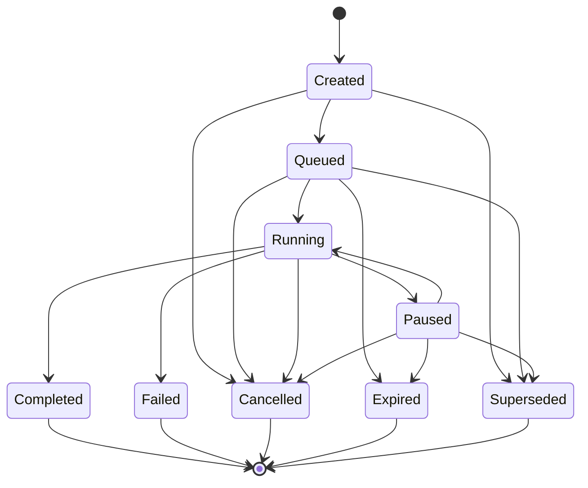

# Task Manager Runtime Specification

## Status

Version: 0.1-draft
Status: **Corrected draft, with a Sprint 1 contract-closure addendum.**
This revision applies the correction pass recorded in
`docs/reviews/TaskManagerRuntimeSpecificationReview.md`: it makes explicit
that cross-Principal Task control actions are not Permission-Engine-gated
by default (Section 8), states that the Task Status resulting from a
revoked/inactive Owner or Assignee is a Task-Manager-rule-governed choice
rather than an automatically prescribed one (Sections 8 and 11), adds the
two Task Events the review found missing for the `Expired` and
`Superseded` terminal transitions (Section 10), and clarifies that Task
Context and Agent Context are distinct, non-overlapping stores (Section
9). No issue outside the review's findings was changed.

**Sprint 1 addendum.** Sections 15 and 16 were added afterward, per
`docs/implementation/SPRINT_1_VERTICAL_SLICE_PLAN.md`'s Blocker 1
(Task Proposal intake) and Blocker 3 (Agent Run command channel), and
`docs/implementation/SPRINT_1_BLOCKER_CLOSURE.md` records the full
closure rationale. They are appended as new sections rather than inserted
in sequence, and no existing section is renumbered, so that every
existing cross-reference to this document from elsewhere in the
repository (`ARCHITECTURE_DECISIONS.md`, `INTER_SPECIFICATION_CONTRACTS.md`,
`PlannerRuntimeSpecification.md`, and the review documents) remains
accurate. Nothing in Sections 1–14 was altered by the addendum.
Originally commissioned as the next Parker architecture specification
after the corrected Agent Runtime Specification
(`docs/specifications/volume-04-agent-runtime/AgentRuntimeSpecification.md`,
"Pre-publication corrected draft"). **This document is specification
only.** No Kotlin is implemented, proposed as a diff, or changed by it,
and neither `src/` nor `tests/` is touched, and no existing runtime
behaviour changes. Nothing described here is authorised for
implementation until an explicitly-declared implementation phase promotes
it — the same pattern already used for `docs/architecture/IdentityService.md`,
`docs/architecture/tool-registry.md`, `docs/architecture/action-mapping.md`,
and the Agent Runtime Specification before each of their own
implementation phases.

This document treats the **Task Manager Task** — already specified by
Chapter 37 (Task Manager), `docs/specifications/volume-02-core-schemas/Task-Schema.md`,
`docs/schemas/Task.schema.json`, and ADR-012 — as the canonical platform
Task concept, unchanged. It does not redefine, extend the required
schema of, or introduce a competing lifecycle for that Task. Where this
document proposes concepts beyond what `Task.schema.json` currently
defines (Section 4), it says so explicitly and records the gap in Open
Questions rather than silently amending the schema — any real schema
change remains subject to ADR-019 (Core Schema Versioning).

This document assumes familiarity with Chapter 8 (Resource Registry),
Chapter 9 (Trust Framework), Chapter 10 (Permission Engine), Chapter 11
(Execution Pipeline), Chapter 12 (Tool Framework), Chapter 13 (Event Bus),
Chapter 14 (Agent Framework), Chapter 37 (Task Manager), Chapter 38
(Workflow Engine), Chapter 41 (Identity Service), ADR-012, the Agent
Runtime Specification, `docs/architecture/tool-registry.md`, and
`docs/architecture/action-mapping.md`. It does not restate their content
except where necessary to define how the Task Manager Runtime sits
alongside them.

## 1. Overview

The Task Manager Runtime is the orchestration layer that gives a Task
Manager Task (Chapter 37's "unit of work that spans more than a single
immediate execution") an explicit owner, an explicit lifecycle, and a
controlled way to acquire execution — whether that execution happens
directly through the Execution Pipeline or through one or more Agent Runs
(Agent Runtime Specification) operating on the Task's behalf.

Concretely, the Task Manager Runtime is the layer that:

- creates and tracks Task Manager Tasks through the lifecycle
  `Task-Schema.md` already defines, without inventing a new one (Section
  5);
- resolves a Task's ownership, source, and (where declared) dependencies
  and constraints before allowing it to proceed;
- coordinates zero, one, or multiple Agent Runs operating within or on
  behalf of a Task, without itself becoming a second Agent Runtime
  (Section 6);
- requests execution — its own, or on behalf of a Task — exclusively
  through the existing Execution Pipeline, never around it (Section 7);
- emits Task-specific lifecycle and coordination events onto the existing
  EventBus (Section 10); and
- enforces that a Task can never acquire execution the Permission Engine
  has not authorised, for a Principal the Identity Service has not
  vouched for (Section 8).

**What the Task Manager Runtime is not.** It is not the Execution
Pipeline, and it holds no ability to invoke a Tool directly — every
action a Task eventually causes still passes through
`ExecutionPipeline.submit` (ADR-003), exactly as it would from any other
origin. It is not the Agent Runtime, and it does not define, own, or
reinterpret Agent Run or Agent Step (Section 6) — those remain exactly as
the Agent Runtime Specification defines them. It is not the Workflow
Engine (Chapter 38): ADR-012's "Tasks track work. Workflows define
structured multi-step behaviour" is the governing boundary this document
respects throughout — a Task Manager Task is a trackable unit of work,
not itself a structured, branching, retryable multi-step process
definition (Section 3, Section 13). It is not a Planner, a Memory system,
or a World Model, and it introduces no competing lifecycle, identity
mechanism, or permission path. Every capability the Task Manager Runtime
has is a capability the existing Trust Framework (Identity, Resource
Registry, Permission Engine, Execution Pipeline, Tool Registry, EventBus)
already provides to any other Principal — this document's job is to
coordinate work inside those boundaries, not to create new ones.

## 2. Design Goals

- **Canonical platform Task model.** Every Task Manager Runtime operation
  acts on the Task Manager Task already specified by `Task-Schema.md` and
  ADR-012. This document does not define a second, parallel Task
  abstraction, mirroring the correction already applied to the Agent
  Runtime Specification.
- **Safe orchestration.** Coordinating zero, one, or multiple Agent Runs,
  or requesting direct execution, never grants the Task Manager Runtime
  an authority path outside the Permission Engine and Execution Pipeline
  (Section 7).
- **Deterministic state transitions.** Every Task lifecycle transition
  this document describes is one of the transitions
  `docs/diagrams/task-lifecycle-state-machine.mmd` already specifies
  (Section 5) — no new edge is invented, and which edge fires for a given
  input is never ambiguous.
- **Auditable lifecycle.** Every Task lifecycle transition and every
  coordination milestone (an Agent Run starting, an execution request
  being made, a permission decision affecting the Task) is observable as
  a Task Event on the EventBus (Section 10), giving Chapter 43 (Audit and
  Observability) the same visibility into Task Manager behaviour it
  already has into any other Execution Pipeline activity.
- **Identity-aware task ownership.** Every Task has an owner Principal
  (`ownerPrincipalId`, already required by `Task.schema.json`) and,
  where declared, an assignee and a source, all resolved through the
  Identity Service (Section 8) — never through a Task Manager-local
  identity store.
- **Permission-mediated execution.** Every execution a Task acquires,
  whether requested directly by the Task Manager or by an Agent Run
  acting on the Task's behalf, is mediated by the Permission Engine
  before it can have any effect. There is no Task-specific bypass, fast
  path, or elevated default.
- **Agent coordination.** The Task Manager Runtime is the natural point
  where Agent Runs are associated with the work they serve, without the
  Task Manager Runtime becoming a second Agent Runtime or the Agent
  Runtime becoming a second Task tracker (Section 6).
- **Future Planner integration.** This document leaves an explicit, named
  seam for a future Planner (Chapter 20) to decompose a Goal into Task
  Manager Tasks, Task Dependencies, and Agent Runs, without specifying
  that decomposition here (Section 13).
- **No execution bypass.** Restating ADR-003 (Single Execution Pipeline)
  for this layer specifically: the Task Manager Runtime holds no direct
  reference to a `Tool`, and no operation that mutates a Resource, a
  Principal, or a permission outside the Identity Service, Permission
  Engine, Resource Registry, and Tool Registry's own sanctioned
  operations.

## 3. Non-Goals

This specification explicitly does not define, and this phase's Task
Manager Runtime work does not include:

- **Agent Runtime implementation.** The Agent Runtime Specification is
  unchanged and unextended by this document. Agent Run, Agent Step, Agent
  Context, and the Agent Event set remain exactly as specified there
  (Section 6).
- **Planner implementation.** Chapter 20 is untouched. How a Goal becomes
  one or more Task Manager Tasks, Task Dependencies, or Agent Runs is not
  specified here (Section 13).
- **Memory implementation.** Chapter 17 / the Memory Architecture is
  untouched. The Task Manager Runtime reads and writes no long-term
  memory (Section 9).
- **World Model implementation.** Chapter 16 is untouched. Task Context
  (Section 9) is explicitly not a World Model.
- **Workflow Engine implementation.** Chapter 38 is untouched. Structured
  multi-step behaviour with conditions, branching, retries, and rollback
  is Workflow Engine territory per ADR-012 — a Task Manager Task tracks a
  unit of work, it does not define or execute a workflow (Section 13).
- **Android integration.** Chapter 27 is untouched. This document assumes
  no particular front end.
- **Direct external system access.** No Task Manager Runtime operation
  reaches Home Assistant, email, calendar, or any other external system
  directly. Every external effect happens through a registered Tool,
  resolved by the Tool Registry, after Permission Engine approval,
  exactly as for any other origin (Section 7).
- **Direct tool execution.** The Task Manager Runtime never holds an
  invocable `Tool` reference and never calls `ToolRegistry.resolve`
  itself — only the Execution Pipeline does (Section 7), consistent with
  `docs/architecture/tool-registry.md`'s existing rule.

Any of the above may become their own specification once explicitly
scoped — this document does not attempt to anticipate their shape beyond
what Section 13 records.

## 4. Core Concepts

Fields marked **(schema)** are already required or optional properties of
`Task.schema.json` today. Fields marked **(proposed)** are concepts this
document introduces to describe Task Manager Runtime behaviour but that
do not yet exist in `Task.schema.json` — carrying them today would mean
placing them inside the schema's existing open `metadata` object, not a
schema change. Promoting any of them to first-class schema fields is a
human decision subject to ADR-019, recorded in Open Questions, not
performed here.

- **Task Manager Task.** The platform's canonical unit of tracked work,
  already fully specified by Chapter 37, `Task-Schema.md`, and ADR-012.
  This document calls it "Task" only where unambiguous; where a sentence
  could otherwise be misread as describing a competing concept, it uses
  the full name, mirroring the Agent Runtime Specification's own
  correction.
- **Task ID** **(schema: `taskId`).** The Task's unique identifier.
  Referenced by Agent Context (Agent Runtime Specification, Section 8,
  "Agent Step state") when an Agent Run executes on the Task's behalf.
- **Task Owner** **(schema: `ownerPrincipalId`).** The Principal
  accountable for the Task — already required by `Task.schema.json`.
  Resolved through the Identity Service like any other `PrincipalId`
  (Section 8).
- **Task Assignee** **(proposed).** The Principal — typically an Agent
  Instance's Agent Identity, but not necessarily — currently responsible
  for progressing the Task. Distinct from Task Owner: ownership is
  accountability (who this Task is ultimately for), assignment is
  operational (who is currently working it). A Task MAY have no
  Assignee (unassigned, e.g. freshly `CREATED`), exactly one Assignee at
  a time, or a changing Assignee over its lifetime; this document does
  not specify multi-Assignee concurrency.
- **Task Source** **(proposed, aligned to the existing `RequestOrigin`
  enum).** Where the Task originated. Rather than inventing a parallel
  vocabulary, this document proposes Task Source reuse
  `src/contracts/ExecutionRequest.kt`'s existing `RequestOrigin` enum
  (`VOICE, TEXT, SCHEDULED_TASK, AGENT, PLUGIN, HOME_ASSISTANT_EVENT,
  ANDROID_EVENT, REMOTE_INTERFACE`) — a Task's source and the origin of
  the `ExecutionRequest`(s) it eventually causes describe the same
  underlying fact, so a second enum would only invite the two to drift.
- **Task Goal.** The upstream statement of what the Task is meant to
  accomplish. Where the Task is created on behalf of an Agent Instance's
  Goal (Agent Runtime Specification, Section 4), Task Goal and that Goal
  are the same thing, referenced rather than copied; a Task Goal MAY also
  exist with no associated Agent Run at all (e.g. a directly-executed
  maintenance Task).
- **Task Status** **(schema: `status`).** `Task.schema.json`'s existing
  nine-value enum (`CREATED, QUEUED, RUNNING, PAUSED, COMPLETED, FAILED,
  CANCELLED, EXPIRED, SUPERSEDED`). Unchanged by this document — see
  Section 5.
- **Task Priority** **(proposed, aligned to the existing `RequestPriority`
  enum).** Rather than inventing a Task-specific priority vocabulary,
  this document proposes Task Priority reuse `RequestPriority`
  (`IMMEDIATE, HIGH, NORMAL, BACKGROUND, DEFERRED, MAINTENANCE`,
  `src/contracts/ExecutionRequest.kt`) for the same reason as Task
  Source: a Task's priority is naturally the priority its resulting
  `ExecutionRequest`s should carry.
- **Task Dependency** **(proposed).** A reference from one Task Manager
  Task to another that must reach a qualifying Task Status (at minimum,
  `COMPLETED`) before this Task may leave `CREATED`. This document does
  not specify qualifying-status rules beyond "at minimum COMPLETED,"
  cross-Task dependency cycles detection, or how a Dependency is declared
  — recorded in Open Questions.
- **Task Constraint.** A bounding condition on when or how a Task may
  proceed — for example, a time window, a resource-availability
  condition, or a policy-derived restriction. Like Agent Policy (Agent
  Runtime Specification, Section 4), a Task Constraint narrows what the
  Task may attempt; it is never itself a source of permission and cannot
  expand what the Permission Engine would otherwise allow (Section 8).
- **Task Result.** The outcome of a Task, surfaced once a terminal Task
  Status (Section 5) is reached: the terminal status reached, and
  references to the `ExecutionResult`s and Agent Results (Agent Runtime
  Specification, Section 4) produced on the Task's behalf. A Task Result
  is a summary view over already-existing results, not a new
  execution-outcome type competing with `ExecutionResult` or Agent
  Result.
- **Task Event.** A `ParkerEvent` published to the EventBus under the
  `task.*` `EventType` namespace, per `EventType.md`'s `<domain>.<event>`
  convention. See Section 10 for the required set.
- **Task Context Reference.** A reference (Section 9) by which the Task
  Manager Runtime's own transient orchestration state for a Task can be
  retrieved — not the state itself copied elsewhere.
- **Agent Run Reference.** An identifier linking a Task to one specific
  Agent Run (Agent Runtime Specification, Section 4) operating within or
  on behalf of it. A Task MAY have zero, one, or many Agent Run
  References over its lifetime (Section 6).
- **Execution Reference.** An identifier linking a Task to one specific
  `ExecutionRequest`/`ExecutionResult` submitted on its behalf — whether
  submitted directly by the Task Manager Runtime or by an Agent Run
  acting for the Task (Section 7).

## 5. Task Lifecycle

This section reproduces `docs/diagrams/task-lifecycle-state-machine.mmd`
exactly, per its own header comment ("a literal, un-embellished
transcription... no invented branching") and per this document's explicit
instruction not to invent a competing lifecycle. No state and no edge
below is new.



### Valid states

`CREATED, QUEUED, RUNNING, PAUSED, COMPLETED, FAILED, CANCELLED, EXPIRED,
SUPERSEDED` — exactly `Task.schema.json`'s `status` enum, in the same
order.

### Valid transitions

Exactly the edges in the diagram above, restated in prose per
`Task-Schema.md`:

- `Created --> Queued | Cancelled | Superseded`
- `Queued --> Running | Cancelled | Expired | Superseded`
- `Running --> Paused | Completed | Failed | Cancelled`
- `Paused --> Running | Cancelled | Expired | Superseded`

### Invalid transitions

Restated from `Task-Schema.md`, unchanged:

- **No transition out of any terminal state** (`Completed`, `Failed`,
  `Cancelled`, `Expired`, `Superseded`).
- **`Superseded` is not reachable from `Running`.** A Task actively
  executing must be `Cancelled` to stop it, not silently replaced out
  from under itself — a deliberate design choice recorded in
  `Task-Schema.md`, not an omission this document revisits.
- **`Failed` is reachable only from `Running`.** A Task cannot fail
  before it has started executing; a Task that cannot even be queued is
  a validation problem upstream (Section 11), not a Task failure.

### Terminal states

`Completed`, `Failed`, `Cancelled`, `Expired`, `Superseded` — five
terminal states, together serving the role Chapter 37 calls "operational
memory for work in progress" rather than long-term archival (that role
belongs to Audit, Chapter 43, per `Task-Schema.md`'s own "Archived
States" note).

### Retryable states

**None, by transition.** No state in the diagram above has an edge that
resurrects a Task from a terminal state — this document does not add
one. "Retry" at the Task Manager Runtime level means creating a **new**
Task Manager Task, optionally referencing the original (e.g. via
`metadata`, pending the Open Question in Section 4 about a formal Task
Dependency/relation field), not transitioning the original Task out of
`Failed`, `Cancelled`, or `Expired`. This mirrors ADR-018's existing
precedent for `ExecutionRequest`: "changes require creation of a new
ExecutionRequest linked by correlation ID," applied here to Tasks instead
of requests.

### Suspended / deferred states

**`Paused` is the only Task Status that represents a suspended Task**,
already specified. `Task.schema.json` has no distinct `DEFERRED` status
value, and this document does not add one. Where an Agent Run associated
with a Task enters `SUSPENDED` (Agent Runtime Specification, Section 5)
— for example because a permission decision came back `DEFERRED` — this
document does not treat that as automatically transitioning the Task to
`Paused`. Per Section 6, whether the Task itself moves `Running -->
Paused` in response is a Task Manager rule, evaluated deliberately, not
an automatic mirror of Agent Run state. See `task.blocked` and
`task.deferred` (Section 10) for the informational events this document
defines for this situation, and Section 6 for why they do not
automatically cause a status transition.

### Cancellation semantics

`Cancelled` is reachable from `Created`, `Queued`, `Running`, and
`Paused` — every non-terminal state — matching the diagram exactly.
Cancelling a Task MUST cause the Task Manager Runtime to request
cancellation of every Agent Run Reference and Execution Reference
(Section 4) still active on the Task's behalf (see
`ExecutionPipeline.cancel`, already specified in
`docs/specifications/volume-03-core-interfaces/ExecutionPipeline.md`, and
the Agent Runtime Specification's own `--> CANCELLED` edge, reachable
from every non-terminal Agent Run state) — a cancelled Task MUST NOT
leave orphaned, still-running work behind it, mirroring Chapter 37's
"Cancelled tasks must not continue in the background."

## 6. Relationship to Agent Runtime

- **The Agent Runtime does not define Tasks.** The Agent Runtime
  Specification (Section 4) explicitly states it does not define a
  competing "Agent Task" abstraction. This document is the other half of
  that boundary: the Task Manager Runtime is the sole owner of Task
  Manager Task state, and the Agent Runtime never writes to it (restated
  in Section 8's Safety Boundaries).
- **Agent Runs operate within or on behalf of Task Manager Tasks.** An
  Agent Instance's Agent Run (Agent Runtime Specification, Section 4)
  MAY be created specifically to progress a Task Manager Task — in which
  case the Agent Run's Agent Context carries a reference to that Task's
  `taskId` (Agent Runtime Specification, Section 8, "Agent Step state"),
  and the Task Manager Runtime records the corresponding Agent Run
  Reference (Section 4).
- **One Task may have zero, one, or multiple Agent Run References.** A
  Task created for direct execution (Section 7) may never acquire an
  Agent Run at all. A Task may have exactly one Agent Run across its
  lifetime, or several — sequential (a first Agent Run fails or is
  cancelled and a second is created to continue the same Task) or, where
  Agent Policy and Task Constraint both allow it, concurrent. This
  document does not mandate a concurrency limit; that is a Task
  Constraint / Agent Policy configuration question, not an architectural
  one.
- **Agent Run state does not directly mutate Task state.** Restating the
  Agent Runtime Specification's own "Relationship to the Task Manager
  Task Lifecycle" (Section 5 there) from this side: an Agent Run
  entering `RUNNING`, `COMPLETED`, `FAILED`, `CANCELLED`, `SUSPENDED`, or
  any other Agent Run lifecycle state (which, per that document, are
  independently tracked and coincidentally named) never writes, and
  never implicitly causes a write to, this Task's `status` field.
- **Task state changes must be mediated by Task Manager rules.** Any
  Task Status transition (Section 5) that occurs because of something an
  Agent Run did is performed by the Task Manager Runtime itself,
  evaluating its own rules against the Agent Run's outcome — not a
  pass-through. This is the "Task Manager's own sanctioned operations"
  the Agent Runtime Specification refers to without defining; this
  document is where that definition lives, at the specification level:
  the Task Manager Runtime subscribes to (or is otherwise informed of)
  relevant Agent Events (`agent.completed`, `agent.failed`,
  `agent.cancelled`, `agent.action_denied`, `agent.action_deferred` —
  Agent Runtime Specification, Section 9) for Agent Runs it has a
  recorded Agent Run Reference for, and decides — deliberately, per its
  own configured rules, not automatically — whether and how to reflect
  that in the Task's own `status` and Task Events (Section 10).
- **Agent Events may inform Task state, but do not automatically control
  it.** For example: an Agent Run reaching `agent.completed` is
  necessary evidence toward transitioning the Task to `Completed`, but
  not sufficient by itself if the Task has other, still-incomplete Agent
  Run References or Task Dependencies (Section 4) — the Task Manager
  Runtime's own rules decide when all necessary conditions for a Task
  transition are met. Symmetrically, a single Agent Run's
  `agent.failed` does not automatically fail the whole Task if an
  alternate Agent Run could still progress it (mirroring the Agent
  Runtime Specification's own non-prescriptive treatment of a denied
  Agent Step's effect on its containing Agent Run).

## 7. Relationship to Execution Pipeline

```mermaid
sequenceDiagram
    participant TM as Task Manager Runtime
    participant AR as Agent Runtime
    participant EP as ExecutionPipeline
    participant PE as PermissionEngine
    participant TR as ToolRegistry
    participant RR as ResourceRegistry
    participant EB as EventBus

    alt Task progressed via an Agent Run
        TM->>AR: create Agent Run (Agent Run Reference recorded)
        AR->>EB: publish agent.* events (Agent Runtime Specification)
        AR->>EP: submit(ExecutionRequest) (per Agent Runtime Specification Section 6)
    else Task progressed directly (no Agent Run)
        TM->>EB: publish task.execution_requested
        TM->>EP: submit(ExecutionRequest)
    end
    EP->>PE: evaluate(request)
    PE-->>EP: PermissionDecision
    alt APPROVED or APPROVED_WITH_CONFIRMATION
        EP->>TR: resolve(decision.action, request.targetResources)
        TR->>RR: resolve(resourceId)
        RR-->>TR: Resource
        TR-->>EP: Tool (bound instance) or ToolResolutionFailure
        EP-->>TM: ExecutionResult (Execution Reference recorded)
    else DENIED
        EP-->>TM: ExecutionResult (DENIED)
        TM->>EB: publish task.permission_denied
    end
    TM->>TM: apply Task Manager rules; transition Task Status per Section 5/6
    TM->>EB: publish corresponding task.* event (Section 10)
```

- **The Task Manager Runtime may request execution through the Execution
  Pipeline.** Exactly like Agent Instances, Plugins, Scheduled Tasks, and
  every other existing origin, the Task Manager Runtime is a caller of
  `ExecutionPipeline.submit` — never a parallel path. A Task's `Task
  Source` (Section 4) being `SCHEDULED_TASK` is the common case for
  direct execution (Chapter 37's own examples — document indexing, email
  review, calendar scan, Home Assistant diagnostics, memory
  consolidation, plugin update — read as exactly this kind of
  Task-Manager-direct work, none of it requiring an Agent Run).
- **All tool actions still go through the Execution Pipeline.** Whether
  a Task's execution is requested directly by the Task Manager Runtime
  or by an Agent Run acting on the Task's behalf, the path from
  `ExecutionRequest` onward is identical and unmodified: `ExecutionPipeline.submit`
  → `PermissionEngine.evaluate` → `ToolRegistry.resolve` → `Tool.execute`.
  The Task Manager Runtime introduces no second path.
- **The Permission Engine still authorises actions.** `PermissionEngine.evaluate`
  is invoked exactly once per `ExecutionRequest` regardless of whether
  the Task Manager Runtime or an Agent Run submitted it, per the existing
  interface and `action-mapping.md`'s "Multiple Actions" rules. The Task
  Manager Runtime does not interpret `proposedActions` itself and does
  not evaluate permission on its own authority.
- **The Tool Registry still resolves tools.** The Task Manager Runtime
  never queries `ToolRegistry.resolve` directly and never holds a `Tool`
  reference, identically to the restriction the Agent Runtime
  Specification already places on Agent Instances. The Task Manager
  Runtime MAY use the Tool Registry's read-only discovery surface
  (`listAll`/`findCandidates`) to check, for planning purposes, whether
  capability exists to satisfy a Task Constraint — never to obtain
  something invocable.
- **EventBus records task and execution events.** Every Task lifecycle
  transition and coordination milestone publishes a Task Event (Section
  10); every `ExecutionRequest` the Task Manager Runtime or an associated
  Agent Run submits continues to publish its own `execution.*` events
  unchanged.
- **The Task Manager Runtime never directly executes tools.** No
  operation described anywhere in this document invokes `Tool.execute`
  or holds a reference capable of doing so — restated in Section 3 and
  Section 12.

## 8. Identity and Permissions

- **Every Task has an owner Principal.** `ownerPrincipalId`
  (`Task.schema.json`) is already required; this document adds no
  exception. An unresolvable Task Owner is invalid, not denied, mirroring
  `Principal.md`'s existing rule and the Agent Runtime Specification's
  identical treatment of an unresolvable Agent Identity.
- **Every Task has a source.** Task Source (Section 4) is recorded at
  creation and is immutable thereafter, mirroring
  `ExecutionRequest.origin`'s own treatment as a fixed fact about how a
  request came to exist.
- **Every Task operation is performed by an authenticated Principal or
  service identity.** Creating a Task, assigning it, changing its Task
  Constraint or Task Dependency set, or requesting its cancellation are
  all themselves actions attributable to a Principal — there is no
  anonymous Task Manager Runtime operation, mirroring
  `docs/architecture/tool-registry.md`'s "Registration Model" precedent
  ("registering a Tool is an administrative act on the registry"
  attributed to a Principal, not a side-channel).
- **Delegated authority must be explicit.** Where a Task Assignee is an
  Agent Instance, that Agent Instance's Delegated Authority (Agent
  Runtime Specification, Section 7 — a non-null `owner` resolving to a
  registered Principal) is unaffected and unextended by the assignment;
  assigning a Task to an Agent Instance does not itself grant that Agent
  Instance any authority it did not already have.
- **Permission checks are required for sensitive transitions and
  execution requests.** Every `ExecutionRequest` the Task Manager Runtime
  or an associated Agent Run submits on a Task's behalf goes through
  `PermissionEngine.evaluate` unconditionally (Section 7). This document
  does not additionally gate pure Task Status transitions (Section 5)
  behind Permission Engine evaluation by default — mirroring how the
  Agent Runtime Specification does not gate its own lifecycle
  transitions behind permission checks either, since a Task Status
  transition by itself has no external effect. Whether specific
  transitions (e.g. cancelling another Principal's Task) should require
  an explicit `PermissionAction.CONTROL` evaluation, the way Tool
  Registry registration already does, is recorded as an Open Question
  rather than decided here.
- **Attribution is not authorisation.** As specified today, this
  document does not restrict *who* may request a given Task Status
  transition beyond requiring that the request be attributable to an
  authenticated Principal (above). Concretely: nothing in this document
  prevents an authenticated Principal from requesting the cancellation,
  reassignment, or Constraint/Dependency change of a Task it does not own
  or is not assigned to — attribution records who made the request; it
  does not, by itself, gate whether they may. This is stated explicitly
  here so it is not left to be inferred only from the Open Question
  above; whether to add such a gate is a decision for that Open Question
  to resolve, not a behaviour this document invents in the meantime.
- **Revoked or inactive Principals affect future task processing.**
  Restating the Agent Runtime Specification's own corrected framing
  (Section 7 there) for Task Owner and Task Assignee: the Task Manager
  Runtime does not itself independently detect a Principal status
  change. It depends on the Identity Service to report it.
- **The Task Manager Runtime depends on the Identity Service for
  active/inactive Principal status**, with the identical, currently
  -unclosed dependency the Agent Runtime Specification already records
  (`docs/architecture/IMPLEMENTATION_GAPS.md` #37, #39):
  - `IdentityService.resolve()` must reject or flag non-Active
    Principals for the Task Manager Runtime to detect, on a direct
    check, that a Task's Owner or Assignee is no longer in good standing.
    Per gap #37, the current implementation does not do this.
  - `identity.*` audit/revocation events must be published for the Task
    Manager Runtime to react asynchronously. Per gap #39, no such events
    are currently published.

  Until both are available, this document does not claim a stronger
  enforcement guarantee than the platform currently supports: if a
  Task's Owner or Assignee is reported non-Active, the Task Manager
  Runtime MUST NOT allow that Task to leave `Created`/`Queued` into
  `Running`, and MUST NOT allow a `Running` Task whose Assignee has just
  been reported non-Active to acquire further execution — but exactly
  when that report arrives is bounded by the same two gaps the Agent
  Runtime Specification already depends on, not a stronger guarantee
  invented here.

  This document does not prescribe which Task Status a `Running` Task
  moves to once its Owner or Assignee is reported non-Active. Which of
  `Paused`, `Failed`, or `Cancelled` (Section 5) applies is a Task
  Manager rule, evaluated deliberately per Section 6 — the same
  "not an automatic mirror" treatment already given to every other
  informational trigger in this document (`task.blocked`,
  `task.deferred`, `task.permission_denied` — Section 10). The
  requirement above is a hard constraint on what the Task Manager
  Runtime MUST NOT do (allow further execution); it is deliberately not
  paired with a prescribed transition, so as not to invent a stronger
  rule than this document has established elsewhere.

## 9. Task Context Model

Task Context is the transient orchestration state the Task Manager
Runtime holds for a Task while it is active (i.e. not yet in a terminal
Task Status). It MAY be linked to:

- **Goal** — the Task Goal (Section 4).
- **Current status** — the Task's live `Task.schema.json` `status` value
  (Section 5), read from the authoritative record, not duplicated.
- **Constraints** — the Task Constraint set currently in force (Section
  4).
- **Owner** — the Task Owner (`ownerPrincipalId`).
- **Assignee** — the current Task Assignee, if any (Section 4).
- **Source** — the Task Source (Section 4), immutable.
- **Agent Run references** — every Agent Run Reference (Section 4)
  associated with this Task, past and present.
- **Execution references** — every Execution Reference (Section 4)
  associated with this Task, past and present.
- **Resource references** — identifiers of Resources this Task's
  execution has touched or targeted, for continuity across Agent Runs
  and direct execution requests.
- **Event history references** — a reference (e.g. a `correlationId`) by
  which this Task's own Task Events, and the Agent Events/execution
  events of anything it caused, can be retrieved — not a copy of that
  history duplicated into Context.
- **Temporary orchestration state** — any other scratch data the Task
  Manager Runtime needs only for as long as the Task remains active
  (e.g. which Task Dependencies have already been checked this cycle).

**Task Context is not long-term Memory.** Per ADR-002 ("Memory, Context
and World Model Remain Separate"), restated identically to the Agent
Runtime Specification's own Agent Context: Task Context does not persist
beyond the Task's active lifetime in any form other than the Task record
itself (`Task.schema.json`) and whatever Audit (Chapter 43) retains of
its event history — it is not a substitute for, or an early version of,
the Memory Architecture (Chapter 17).

**Task Context is not the World Model.** Task Context describes this
Task's own orchestration state, not Parker's current beliefs about
reality (Chapter 16). A Task Constraint may reference a real-world
condition (e.g. "only between 9am and 5pm"), but evaluating whether that
condition currently holds is not something Task Context stores a belief
about — it is, at most, a query Task Context's holder directs elsewhere.

**Task Context is not Agent Context.** Task Context (this section) and
Agent Context (Agent Runtime Specification, Section 8) are two distinct,
non-overlapping stores, neither a copy of the other. Task Context holds
Agent Run References (Section 4) that identify an associated Agent Run by
ID, not that Agent Run's own Agent Context; symmetrically, an Agent Run
executing within a Task holds only a `taskId` reference in its Agent
Context (Agent Runtime Specification, Section 8, "Agent Step state"), not
a copy of this Task's Context. Each side reads the other only by
resolving the reference through its owning component — the Task Manager
Runtime for Task Context, the Agent Runtime for Agent Context — never by
direct access to the other's internal state.

**Task Context may later reference Memory or World Model entries, but
does not implement them.** A future integration (Section 13) may let a
Task Constraint or Task Dependency be expressed in terms of a World Model
belief or a Memory entry; this document reserves that seam by not
foreclosing it, but does not specify how such a reference would work,
mirroring the Agent Runtime Specification's identical restraint about
Agent Context and the World Model.

## 10. Event Model

Every Task Event is a `ParkerEvent` (`src/contracts/EventContracts.kt`)
published under the `task.*` namespace, per `EventType.md`'s
`<domain>.<event>` convention, with `publisherPrincipalId` set to the
identity the Task Manager Runtime itself operates under (a `SYSTEM` or
platform-level Principal, not the Task Owner or Assignee) and
`correlationId` set to the Task ID, so every event concerning a Task can
be reconstructed as a causal sequence. **The Task Manager Runtime is the
sole producer of every Task Event below** — even where an event reports
on Agent Run or execution activity, it is the Task Manager Runtime,
reacting to that activity per Section 6/7, that publishes the
corresponding `task.*` event; the Agent Runtime and Execution Pipeline
continue to publish their own `agent.*`/`execution.*` events unchanged
and do not publish into the `task.*` namespace themselves.

Several of the events below mark orchestration milestones that occur
**within** a single Task Status value, not a status transition —
`Task.schema.json`'s `status` enum (Section 5) is not expanded by this
document. Each row's "Lifecycle relevance" states plainly whether the
event corresponds to a real status transition or is informational only.

| Task Event | `EventType` | Trigger | Required payload (beyond `taskId`/`correlationId`) | Lifecycle relevance |
|---|---|---|---|---|
| TaskCreated | `task.created` | A new Task Manager Task record is created. | `ownerPrincipalId`, Task Source | Real transition: enters `Created`. |
| TaskInitialised | `task.initialised` | Task Owner and Source resolved and validated, Task Context constructed. | — | Informational only; remains `Created`. |
| TaskReady | `task.ready` | All declared Task Dependencies (if any) satisfied and Task Constraints checked; Task enters the execution queue. | — | Real transition: `Created --> Queued`. |
| TaskAssigned | `task.assigned` | A Task Assignee is set or changed. | assignee `PrincipalId` | Informational only; does not itself change status. |
| TaskStarted | `task.started` | The Task begins active progress, directly or via an Agent Run. | Agent Run Reference, if any | Real transition: `Queued --> Running`. |
| TaskBlocked | `task.blocked` | The Task Manager Runtime determines the Task cannot currently progress because of an unmet Task Dependency or Task Constraint. | the unmet Dependency/Constraint reference | Informational only; MAY lead the Task Manager Runtime to apply `Running --> Paused` per its own rules (Section 6), but is not itself that transition. |
| TaskDeferred | `task.deferred` | A permission decision affecting the Task (direct or via an associated Agent Run's `agent.action_deferred`) comes back `DEFERRED`. | `decisionId`, Agent Run Reference if applicable | Informational only; MAY lead to `Running --> Paused` per Task Manager rules, not automatically. |
| TaskExecutionRequested | `task.execution_requested` | The Task Manager Runtime submits an `ExecutionRequest` directly on the Task's behalf (no Agent Run involved). | `requestId` | Informational only. |
| TaskAgentRunStarted | `task.agent_run_started` | An Agent Run is created within or on behalf of this Task. | Agent Run Reference | Informational only; recorded per Section 6. |
| TaskAgentRunCompleted | `task.agent_run_completed` | An Agent Run associated with this Task reaches a terminal Agent Run lifecycle state (`COMPLETED`, `FAILED`, or `CANCELLED` — Agent Runtime Specification, Section 5). | Agent Run Reference, terminal Agent Run state | Informational only; evaluated per Section 6 for whether it warrants a Task Status transition. |
| TaskPermissionRequired | `task.permission_required` | A permission evaluation is pending for a Task-Manager-direct `ExecutionRequest`, or is being surfaced from an associated Agent Run's `WAITING_FOR_PERMISSION`. | `requestId` or Agent Run Reference | Informational only. |
| TaskPermissionDenied | `task.permission_denied` | A `PermissionDecisionOutcome.DENIED` is returned for a request associated with this Task. | `decisionId` | Informational only; MAY lead the Task Manager Runtime to transition to `Failed` per its own rules (Section 6/11), not automatically. |
| TaskCompleted | `task.completed` | The Task Manager Runtime determines the Task's Goal has been achieved. | Task Result summary | Real transition: `Running --> Completed`. |
| TaskFailed | `task.failed` | The Task Manager Runtime determines the Task cannot be completed. | failure reason | Real transition: `Running --> Failed` (the only legal edge into `Failed` — Section 5). |
| TaskCancelled | `task.cancelled` | An explicit cancellation request is processed. | cancelling `PrincipalId` | Real transition: `{Created, Queued, Running, Paused} --> Cancelled`. |
| TaskSuspended | `task.suspended` | The Task is paused. The event name follows the Agent Runtime Specification's `SUSPENDED` vocabulary for cross-specification consistency; `Task.schema.json`'s own `status` value remains `Paused`, unrenamed. | reason | Real transition: `Running --> Paused`. |
| TaskResumed | `task.resumed` | A paused Task resumes active progress. | — | Real transition: `Paused --> Running`. |
| TaskExpired | `task.expired` | The Task Manager Runtime determines the Task has reached `Expired` — an existing `Task.schema.json` terminal status (Section 5). This document does not define the expiry condition itself beyond what `Task-Schema.md` already specifies. | — | Real transition: `{Queued, Paused} --> Expired`. |
| TaskSuperseded | `task.superseded` | The Task Manager Runtime determines the Task has reached `Superseded` — an existing `Task.schema.json` terminal status (Section 5). This document does not define the supersession mechanism itself beyond what `Task-Schema.md` already specifies. | — | Real transition: `{Created, Queued, Paused} --> Superseded`. |

`TaskExpired` and `TaskSuperseded` complete Task Event coverage for all
five terminal states, matching the treatment already given to
`task.completed`/`task.failed`/`task.cancelled`. Consistent with those
three, neither event defines new expiry or supersession *behaviour* —
both terminal statuses, and the edges into them, are already specified
unchanged in Section 5; these two entries only give the already-existing
transitions an observable Task Event, the same gap-closing this document
already performs for the other three terminal transitions.

Per `EventBus.md`'s "Authentication" and "Authorisation" sections: every
Task Event MUST resolve to a Principal in good standing to be accepted.
`task.*` is a trust-relevant domain in the same sense `execution.*`,
`permission.*`, and the Agent Runtime Specification's own `agent.*` are
(Section 12), so this document recommends — without itself deciding,
since `EventBus.md` leaves the exact trust-sensitive domain list to be
extended as needed — that `task.*` be added to that list when EventBus
authentication is implemented.

## 11. Failure and Recovery

- **Failed Agent Run.** Per Section 6, an Agent Run reaching `FAILED`
  (Agent Runtime Specification, Section 5) publishes `task.agent_run_completed`;
  whether the Task itself transitions to `Failed` or continues via
  another Agent Run Reference or direct execution is a Task Manager rule
  evaluated deliberately, not an automatic mirror.
- **Failed Execution Pipeline request.** A directly-submitted
  `ExecutionRequest`'s `FAILED` `ExecutionResult` is handled identically:
  recorded against the Execution Reference, evaluated per Task Manager
  rules, not automatically propagated to Task Status.
- **Permission denial.** Per Section 10, `task.permission_denied` is
  published; per Section 8, this MAY lead to `Running --> Failed`, per
  Task Manager rules — mirroring the Agent Runtime Specification's own
  non-prescriptive treatment of `agent.action_denied`'s effect on its
  Agent Run.
- **Deferred permission.** Per Section 10, `task.deferred` is published;
  per Section 5 ("Suspended / deferred states"), this MAY lead to
  `Running --> Paused`, per Task Manager rules — not automatically.
- **Inactive/revoked Principal.** Per Section 8, a Task whose Owner or
  Assignee is reported non-Active by the Identity Service MUST NOT
  proceed into or remain in `Running`. Full, timely enforcement of this
  is dependent on Identity Service gap closure (`IMPLEMENTATION_GAPS.md`
  #37, #39), identically to the Agent Runtime Specification's own
  dependency. Which Task Status (`Paused`, `Failed`, or `Cancelled` —
  Section 5) the Task moves to instead is not prescribed here; per
  Section 8, that choice is a Task Manager rule, not an automatic
  mirror of the Principal status change.
- **Missing resource.** A Resource Registry resolution failure for a
  Task's declared Resource references surfaces as a `FAILED`
  `ExecutionResult` for whatever `ExecutionRequest` attempted to resolve
  it (`ResourceRegistry.md`'s existing normative requirements,
  unmodified) — handled per "Failed Execution Pipeline request" above.
- **Invalid task transition.** An attempted transition that is not one
  of Section 5's specified edges (for example, `Created --> Running`
  directly) MUST be rejected by whatever component enforces
  `Task.schema.json`'s lifecycle — this document assumes such an
  enforcement point exists or will exist, mirroring
  `PrincipalLifecycleTransitions`/`ToolLifecycleTransitions`'s existing
  pattern, but (per `IMPLEMENTATION_GAPS.md`'s own note that Task
  lifecycle Kotlin is "out of Phase 1 scope, not yet implemented") does
  not itself specify that Kotlin here.
- **Timeout.** A Task exceeding a Task Constraint-defined maximum
  duration is a Task Manager Runtime-level concern; this document
  specifies that such a Task SHOULD transition to `Paused` (recoverable)
  rather than `Failed`, mirroring the Agent Runtime Specification's
  identical treatment of an Agent Run exceeding an Agent Policy-defined
  bound — exceeding a configured bound is not itself evidence of an
  unrecoverable error.
- **Cancellation.** Per Section 5's "Cancellation semantics," always
  available from any non-terminal Task Status, and required to cascade
  to every active Agent Run Reference and Execution Reference.
- **Partial completion.** A Task with multiple Agent Run References or
  Execution References, some successful and some not, is evaluated by
  Task Manager rules exactly as a single Agent Run's partial completion
  is (Agent Runtime Specification, Section 10) — this document does not
  introduce a distinct "partially completed" Task Status, mirroring that
  precedent; the Task Result (Section 4) reports exactly what succeeded
  and what did not.
- **Retry.** Per Section 5's "Retryable states," no Task Status
  transition resurrects a terminal Task. Retry means creating a new Task
  Manager Task.
- **Safe suspension.** `Paused` (Section 5) is the Task Manager Runtime's
  general-purpose recoverable pause state, reached from `Running` for
  any of the reasons above; a paused Task holds no active Agent Run
  Reference or Execution Reference newly initiated until resumed.

## 12. Safety Boundaries

- **No direct tool execution.** The Task Manager Runtime has no operation
  that invokes `Tool.execute` or holds an invocable `Tool` reference
  (Section 3, Section 7).
- **No permission bypass.** Every execution the Task Manager Runtime or
  an associated Agent Run acquires on a Task's behalf passes through
  `PermissionEngine.evaluate` unconditionally (Section 7, Section 8).
- **No identity mutation.** The Task Manager Runtime never writes
  directly to a `Principal` record. `IdentityService.updateStatus` and
  any future permission-granting operation remain exclusively
  platform-service operations, never Task-Manager-invocable ones,
  identically to the restriction the Agent Runtime Specification already
  places on Agent Instances.
- **No hidden background execution.** Every Agent Run Reference and
  Execution Reference a Task acquires is recorded in Task Context
  (Section 9) and observable via Task Events (Section 10); there is no
  Task Manager Runtime execution mode that runs outside a tracked Task
  or that omits publishing the corresponding Task Event.
- **No silent task reassignment.** A Task Assignee change publishes
  `task.assigned` (Section 10) — there is no reassignment path that
  changes Task Context without a corresponding, attributable Task Event.
- **No automatic privilege expansion.** Task Priority and Task Constraint
  (Section 4) narrow or schedule what a Task may attempt; neither can be
  used to obtain authority beyond what the Task Owner's or Assignee's
  Principal would already be granted by the Permission Engine for an
  identical request submitted outside any Task.
- **No unaudited lifecycle transition.** Every real Task Status
  transition in Section 5 has a corresponding Task Event in Section 10 —
  there is no path for a Task Status to change without a Task Event
  trail.
- **No direct mutation of Memory or World Model.** The Task Manager
  Runtime performs no read or write against the Memory Architecture
  (Chapter 17) or the World Model (Chapter 16); Task Context (Section 9)
  is explicitly neither (Section 3, Section 9).

## 13. Relationship to Future Systems

The following integrations are **future work, not part of this
specification.** This document intentionally does not define their
shape; it only notes the seam each will eventually attach to.

- **Planner (Chapter 20).** Will be the component that decomposes a Goal
  into one or more Task Manager Tasks, Task Dependencies, and Agent Runs.
  This document assumes Tasks arrive already formed — created directly,
  or on behalf of an already-formed Goal — the same assumption the Agent
  Runtime Specification makes about proposed actions.
- **Memory (Chapter 17).** Will be where long-term patterns across
  completed Tasks (for example, "this kind of Task usually takes N
  minutes") would eventually be written and read. No such promotion path
  exists in this specification; Task Context (Section 9) is explicitly
  scoped to a Task's active lifetime only.
- **World Model (Chapter 16).** Will be a read-only input a future
  Planner, or Task Constraint evaluation, may consult (e.g. "is it
  currently within the allowed time window"). This document does not
  specify how or whether Task Constraint evaluation ever queries it
  (Section 9).
- **Workflow Runtime (Chapter 38).** Will be the mechanism by which
  multiple Task Manager Tasks — with conditions, branching, retries, and
  rollback — are composed into a structured, multi-step process, per
  ADR-012. This document specifies a single Task's own lifecycle only,
  and does not specify cross-Task orchestration beyond simple Task
  Dependency references (Section 4).
- **Android front end (Chapter 27).** Will be one of possibly several
  surfaces that create Tasks, display Task Status and Task Result, or
  supply Task Assignee changes. This document assumes no particular
  front end.
- **Plugin ecosystem (Chapter 15).** Will be able to create Tasks and
  register Tools a Task's execution may resolve to, exactly as any other
  Plugin-supplied Tool already can (`docs/architecture/tool-registry.md`,
  "Plugin Integration"). This document does not propose a distinct
  Task-Plugin integration surface beyond the existing Tool Registry and
  Task Source (`PLUGIN`, via `RequestOrigin`) paths.

## 14. Acceptance Criteria

This specification is complete when, and only to the extent that:

- **Task Manager Task is the canonical Task abstraction.** Section 4
  treats `Task.schema.json`/Chapter 37/ADR-012 as canonical and marks
  every concept beyond the existing schema as explicitly proposed, not
  silently assumed.
- **Lifecycle is explicitly tied to `Task-Schema.md`/ADR-012.** Section 5
  reproduces the existing state machine exactly, with no invented state
  or edge.
- **Agent Runtime relationship is explicit.** Section 6 states plainly
  that Agent Runs do not mutate Task state directly and that Task
  Manager rules mediate every reflection of Agent Run outcomes into Task
  Status.
- **Execution Pipeline relationship is explicit.** Section 7 defines
  both the direct and Agent-Run-mediated paths by which a Task acquires
  execution, with no Task-specific shortcut through the Execution
  Pipeline, Permission Engine, or Tool Registry.
- **Identity and permission boundaries are explicit.** Section 8 defines
  Task Owner/Assignee resolution through the Identity Service and states
  plainly which part of the revocation-awareness requirement depends on
  still-open Identity Service gaps (`IMPLEMENTATION_GAPS.md` #37, #39).
- **Event model is defined.** Section 10 enumerates the required Task
  Event set, each with trigger, producer, required payload, and explicit
  lifecycle relevance (real transition vs. informational).
- **Failure and recovery behaviours are defined.** Section 11 covers
  every category requested, consistent with Section 5's unmodified
  lifecycle and Section 6's non-automatic Agent Run mediation.
- **Non-goals prevent scope creep.** Section 3 explicitly excludes Agent
  Runtime implementation, Planner, Memory, World Model, Workflow Engine
  implementation, Android integration, direct external system access,
  and direct tool execution.
- **No implementation code has changed.** This document adds no file
  under `src/` or `tests/`, and proposes no Kotlin.

## 15. Task Proposal Intake

**Added by the Sprint 1 contract-closure addendum (see Status header).**
This section closes the dependency `PlannerRuntimeSpecification.md`
Section 6 records against this document: "The Task Manager Runtime
Specification, as it stands today, does not define a Task Proposal
intake operation, nor a Task Event or other mechanism by which the Task
Manager Runtime communicates an accept/defer/split/merge/reject
disposition back to the Planner Runtime."

The intake operation and its five possible outcomes are now named and
shaped in `src/contracts/TaskProposal.kt`
(`TaskProposalIntake.submitProposal`, `TaskProposal`,
`TaskProposalDisposition`). This section states what each outcome means
for *this* document's own model; it does not add a sixth outcome, and it
does not change Section 5's Task lifecycle, Section 6's Agent Run
relationship, or Section 8's identity/permission rules — it only
completes the previously-unnamed connection point between this document
and `PlannerRuntimeSpecification.md`.

| Disposition | Task Manager Task created? | Further Planner input needed? | Agent Runtime may be involved later? | Required event | Terminal for this proposal? |
|---|---|---|---|---|---|
| `Accepted` | Yes — exactly one, per Section 5's existing lifecycle (enters `Created`). | No. | Yes, at the Task Manager Runtime's own discretion (Section 6), via Section 16's Agent Run Command Channel. | `task.created` (Section 10) and, on the Planner side, `planner.session_completed` (`PlannerRuntimeSpecification.md` Section 11), sharing this proposal's `correlationId`. | Yes. |
| `Deferred` | No. | Possibly, if the deferral reason names something only the Planner Runtime can supply (e.g. a revised Constraint) — this document does not decide that; see Open Questions below. | No, until (if ever) a later, separate submission is `Accepted`/`Split`/`Merged`. | No `task.created`. `PlannerRuntimeSpecification.md` Section 11 has no dedicated event for this outcome today — see that document's own Open Questions. | Yes, for this specific submission — reconsideration is a new submission, not a reopening of this one, consistent with AD-016 (Terminal Lifecycle States Are Final) applied to the disposition itself. |
| `Rejected` | No, and none ever will be for this specific proposal. | No. | No. | No dedicated Task Event (no Task exists). On the Planner side, the Planning Session transitions `SUBMITTED --> REJECTED` (`PlannerRuntimeSpecification.md` Section 5), which AD-015 (Invalid Is Not Denied) already distinguishes from `FAILED`: this is a well-formed proposal an external component declined, not an internal Planner failure. | Yes. |
| `Split` | Yes — two or more, per this document's existing Section 5 lifecycle, each independently. | No, for the split itself. | Yes, independently per resulting Task, at the Task Manager Runtime's own discretion. | One `task.created` per resulting Task, all sharing this proposal's `correlationId`, plus `planner.session_completed`. | Yes. |
| `Merged` | Yes — exactly one, combining this proposal with one or more named sibling proposals. | No. | Yes, at the Task Manager Runtime's own discretion, for the merged Task. | One `task.created` (not one per merged proposal), plus `planner.session_completed` for each contributing Planning Session. | Yes. |

**This section does not resolve who may submit a Task Proposal beyond
what Section 8 already requires** (every Task Manager Runtime operation
is performed by an authenticated Principal or service identity) — a
Task Proposal's `initiatingPrincipalId` (`src/contracts/TaskProposal.kt`)
is resolved through the Identity Service exactly as Task Owner and Task
Assignee already are, never through a Planner-local or
Task-Manager-local identity store.

**No implementation of `TaskProposalIntake` exists yet.** This section,
and the contract it names, are preparation for Sprint 1 coding
(`docs/implementation/SPRINT_1_VERTICAL_SLICE_PLAN.md` Unit 6), not an
implementation of it.

## 16. Agent Run Command Channel

**Added by the Sprint 1 contract-closure addendum (see Status header).**
This section closes `INTER_SPECIFICATION_CONTRACTS.md` Section 6's Gap 7
("Agent Run Request has no named, shaped object") from this document's
own side, and the identical asymmetry that document's Gap 11 names for
Agent Run *cancellation* — both are the same underlying need: a named
channel by which this document's own Section 7 sequence diagram
("`TM->>AR: create Agent Run`") and Section 5's cancellation-cascade
requirement ("Cancelling a Task MUST cause the Task Manager Runtime to
request cancellation of every Agent Run Reference... still active")
actually reach the Agent Runtime.

`src/contracts/AgentRunCommand.kt` now names and shapes this channel:
`AgentRunCommandChannel.submit`, taking an `AgentRunCommand` with
`commandType` one of `START`, `SUSPEND`, `RESUME`, or `CANCEL`. This
document's own Section 6 ("Relationship to Agent Runtime") and Section 5
("Cancellation semantics") are otherwise unchanged — this section names
the mechanism those already say must exist; it does not add a new
capability to either.

- **`START`** is how this document's Section 6 ("Agent Runs operate
  within or on behalf of Task Manager Tasks") and Section 7's sequence
  diagram ("create Agent Run") are actually realised — carrying the
  `taskId` (Section 4) the resulting Agent Run will operate within or on
  behalf of, and (where declared) the Task Proposal's own
  `requiredCapabilities` (Section 15) carried forward as a planning-time
  hint, never a grant (Section 8).
- **`SUSPEND`** and **`RESUME`** correspond to
  `AgentRuntimeSpecification.md` Section 5's own, already-specified
  "explicit suspend request" and "`SUSPENDED --> RUNNING`... resume path"
  — that document names the transitions; this contract names who may
  request them and how, from this document's side. This section does not
  change when this document itself chooses to issue either — Section 6's
  existing "not an automatic mirror" rule for Task Status still applies
  identically to whether and when this document sends a `SUSPEND` or
  `RESUME` command.
- **`CANCEL`** is the mechanism Section 5's "Cancellation semantics"
  already requires ("MUST cause the Task Manager Runtime to request
  cancellation of every Agent Run Reference... still active") — the
  `cancellationReason` field is required (non-blank) for this command
  type specifically, per `src/contracts/AgentRunCommand.kt`'s own
  validation.

**Every `AgentRunCommand` is issued by an authenticated Principal or
service identity** (Section 8, restated identically here), resolved
through the Identity Service, never a local store. **No `AgentRunCommand`
grants execution authority by itself** (AD-002, AD-007): a `START`
command accepted by the Agent Runtime means an Agent Run now exists and
will begin its own lifecycle (`AgentRuntimeSpecification.md` Section 5),
not that any action it later proposes is pre-approved — every
`ExecutionRequest` that Agent Run eventually submits is still
independently evaluated by `PermissionEngine.evaluate`, unchanged.

**No implementation of `AgentRunCommandChannel` exists yet.** This
section, and the contract it names, are preparation for Sprint 1 coding
(`docs/implementation/SPRINT_1_VERTICAL_SLICE_PLAN.md` Units 6 and 7), not
an implementation of it.

## Open Questions (not resolved by this document)

Recorded rather than invented, following the convention already
established by `docs/architecture/tool-registry.md`,
`docs/architecture/action-mapping.md`, `docs/architecture/IdentityService.md`,
and the Agent Runtime Specification:

- Whether Task Assignee, Task Dependency, Task Constraint, and a
  structured Task Result should be promoted from this document's
  "proposed" status (Section 4) into real `Task.schema.json` fields, and
  if so, what the exact field shapes and required/optional status should
  be — subject to ADR-019 (Core Schema Versioning), not decided here.
- What qualifying Task Status a Task Dependency requires beyond "at
  minimum `COMPLETED`" (Section 4) — e.g. whether a dependency on a
  `Cancelled` or `Expired` Task should ever be treated as satisfied — and
  how dependency cycles are detected or prevented.
- Whether a concurrency limit on multiple simultaneous Agent Run
  References per Task (Section 6) should be architecturally specified,
  or left entirely to Task Constraint/Agent Policy configuration.
- Whether Task Status transitions that affect another Principal's Task
  (e.g. cancelling a Task owned by someone else) should require an
  explicit `PermissionAction.CONTROL` evaluation, the way Tool Registry
  registration already does (Section 8). Section 8 now states plainly
  that, as specified today, no such gate exists — this question is about
  whether to add one, not about what the current, already-explicit
  behaviour is.
- The precise mechanism the Task Manager Runtime should use to detect a
  Task Owner's or Assignee's Principal status change once Identity
  Service gaps #37/#39 close — poll `resolve()`, subscribe to
  `identity.*` events, or both — mirroring the identical open question
  already recorded in the Agent Runtime Specification.
- Whether `task.*` should be formally added to `EventBus.md`'s
  trust-sensitive domain list now, or only when EventBus authentication
  is actually implemented — mirroring the identical open question already
  recorded for `agent.*`.
- Whether the Task Manager Runtime, once implemented, should be exposed
  as a Volume 3 interface (mirroring how `ToolRegistry.md` was backfilled
  after `docs/architecture/tool-registry.md`), and if so, what its
  minimal operation surface should be — not proposed here, since no
  Kotlin interface sketch was in scope for this pass.
- **(Added by the Sprint 1 addendum.)** Whether a `Deferred`
  `TaskProposalDisposition` (Section 15) should have its own dedicated
  Task Event and Planning Event, rather than none — recorded as still
  open in `docs/implementation/SPRINT_1_BLOCKER_CLOSURE.md`, not decided
  here, since inventing one was outside that closure task's own scope.
- **(Added by the Sprint 1 addendum.)** Whether `TaskProposalIntake`
  (Section 15) and `AgentRunCommandChannel` (Section 16), once
  implemented, should be exposed as Volume 3 interfaces alongside a
  future formal Task Manager Runtime interface — the same open question
  already recorded above for the Task Manager Runtime as a whole, now
  extended to these two additional operation surfaces.

## Related

- Chapter 8 – Resource Registry
- Chapter 9 – Trust Framework
- Chapter 10 – Permission Engine
- Chapter 11 – Execution Pipeline
- Chapter 12 – Tool Framework
- Chapter 13 – Event Bus
- Chapter 14 – Agent Framework
- Chapter 15 – Plugin SDK
- Chapter 16 – World Model
- Chapter 17 – Memory Architecture
- Chapter 20 – Planning and Deliberation Framework
- Chapter 27 – Android Platform Services
- Chapter 37 – Task Manager
- Chapter 38 – Workflow Engine
- Chapter 41 – Identity Service
- Chapter 43 – Audit and Observability
- ADR-001 – Models Never Execute Tools
- ADR-002 – Memory, Context and World Model Remain Separate
- ADR-003 – Single Execution Pipeline
- ADR-011 – Execution Scheduling
- ADR-012 – Task and Workflow Separation
- ADR-013 – Agents and Services Use Principal Identities
- ADR-017 – ExecutionRequest Is Canonical
- ADR-018 – ExecutionRequests Are Immutable After Validation
- ADR-019 – Core Schema Versioning
- `docs/specifications/volume-04-agent-runtime/AgentRuntimeSpecification.md`
- `docs/architecture/IdentityService.md`
- `docs/architecture/tool-registry.md`
- `docs/architecture/action-mapping.md`
- `docs/specifications/volume-01-core-contracts/Principal.md`
- `docs/specifications/volume-02-core-schemas/Task-Schema.md`
- `docs/specifications/volume-03-core-interfaces/ExecutionPipeline.md`
- `docs/specifications/volume-03-core-interfaces/PermissionEngine.md`
- `docs/specifications/volume-03-core-interfaces/ResourceRegistry.md`
- `docs/specifications/volume-03-core-interfaces/ToolRegistry.md`
- `docs/specifications/volume-03-core-interfaces/EventBus.md`
- `docs/specifications/volume-03-core-interfaces/EventType.md`
- `docs/schemas/Task.schema.json`
- `docs/diagrams/task-lifecycle-state-machine.mmd`
- `src/contracts/ExecutionRequest.kt` (`RequestOrigin`, `RequestPriority`)
- `docs/architecture/IMPLEMENTATION_GAPS.md`
- `docs/specifications/volume-06-planner-runtime/PlannerRuntimeSpecification.md`
- `docs/implementation/SPRINT_1_VERTICAL_SLICE_PLAN.md`
- `docs/implementation/SPRINT_1_BLOCKER_CLOSURE.md`
- `src/contracts/TaskProposal.kt`
- `src/contracts/AgentRunCommand.kt`
