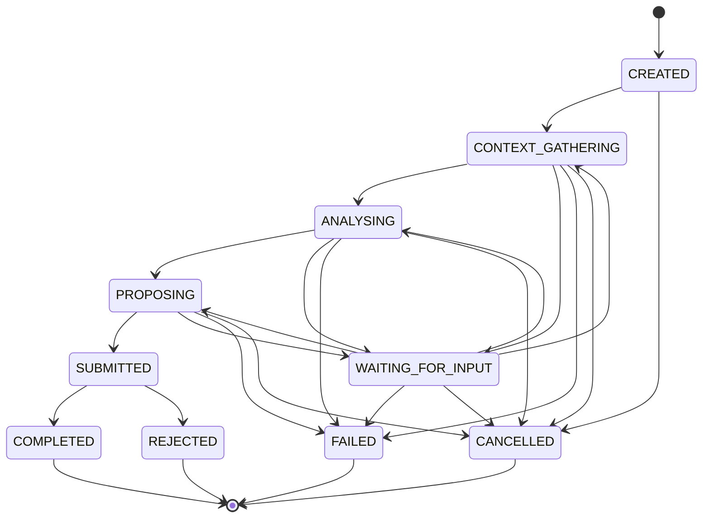

# Planner Runtime Specification

## Status

Version: 0.1-draft
Status: New specification. Commissioned per
`docs/architecture/IMPLEMENTATION_ORDER.md`'s Section 4 (the Planner
Runtime Specification is that document's Order 1 recommendation, the
most direct gap between the completed runtime/identity foundation and
anything resembling autonomous behaviour). Written on top of the
completed v0.8 runtime (Tool Registry, Action Mapping, EventBus,
`DefaultExecutionPipeline`), the Identity Service foundation
(`docs/architecture/IdentityService.md`), and the two corrected Phase 3
design baselines: the Agent Runtime Specification
(`docs/specifications/volume-04-agent-runtime/AgentRuntimeSpecification.md`,
"Pre-publication corrected draft") and the Task Manager Runtime
Specification
(`docs/specifications/volume-05-task-manager-runtime/TaskManagerRuntimeSpecification.md`,
"Corrected draft"). **This document is specification only.** No Kotlin
is implemented, proposed as a diff, or changed by it, and neither `src/`
nor `tests/` is touched, and no existing runtime behaviour changes.
Nothing described here is authorised for implementation until an
explicitly-declared implementation phase promotes it — the same pattern
already used for `docs/architecture/IdentityService.md`,
`docs/architecture/tool-registry.md`, `docs/architecture/action-mapping.md`,
the Agent Runtime Specification, and the Task Manager Runtime
Specification before each of their own implementation phases.

This document introduces one new boundary object — the **Task
Proposal** (Section 4, Section 10) — that, at this document's original
time of writing, the Task Manager Runtime Specification did not yet
define an intake operation or disposition mechanism for.

**Sprint 1 contract-closure addendum.** That dependency is now closed.
`docs/implementation/SPRINT_1_BLOCKER_CLOSURE.md` records the closure;
`src/contracts/TaskProposal.kt` names and shapes the intake operation
(`TaskProposalIntake.submitProposal`, `TaskProposal`,
`TaskProposalDisposition`); and
`TaskManagerRuntimeSpecification.md` Section 15 ("Task Proposal Intake",
added by the same addendum) states what each of the five dispositions
(`Accepted`, `Deferred`, `Rejected`, `Split`, `Merged`) means from that
document's own side. Section 6 below is updated accordingly. This
remains a contract-preparation change only: no `TaskProposalIntake`
implementation exists yet (Section 6, Section 15 there), and nothing in
this document's own lifecycle (Section 5), Event Model (Section 11), or
Non-Goals (Section 3) is altered by the addendum beyond naming the
previously-unnamed mechanism.

This document assumes familiarity with Chapter 9 (Trust Framework),
Chapter 10 (Permission Engine), Chapter 11 (Execution Pipeline), Chapter
12 (Tool Framework), Chapter 13 (Event Bus), Chapter 14 (Agent
Framework), Chapter 20 (Planning and Deliberation Framework), Chapter 37
(Task Manager), Chapter 41 (Identity Service), ADR-012, the Agent Runtime
Specification, the Task Manager Runtime Specification,
`docs/architecture/tool-registry.md`, and
`docs/architecture/action-mapping.md`. It does not restate their content
except where necessary to define how the Planner Runtime sits alongside
them.

## 1. Overview

The Planner Runtime is the layer that turns a Goal — together with
Planning Context, declared Constraints, and the initiating Principal's
identity — into one or more **Task Proposals**: structured, not-yet-
authoritative recommendations for new Task Manager Tasks, submitted to
the Task Manager Runtime for its own acceptance decision (Section 6).

Concretely, the Planner Runtime is the layer that:

- accepts a Planning Request and runs it through an explicit Planning
  Session lifecycle (Section 5);
- gathers Planning Context (Section 9) relevant to the Goal, without
  implementing Memory or the World Model itself;
- generates and compares Plan Candidates (Section 4), selecting among
  them through its own Plan Decision, without that decision itself
  granting any authority;
- produces Task Proposals (Section 10) and submits them to the Task
  Manager Runtime — never creating a Task Manager Task directly;
- emits Planning-specific lifecycle and coordination events onto the
  existing EventBus (Section 11); and
- enforces that a Task Proposal can never itself acquire execution or
  bypass the Permission Engine, for a Principal the Identity Service has
  not vouched for (Section 8).

**What the Planner Runtime is not.** It is not the Task Manager Runtime,
and it does not own a Task Manager Task, mutate one directly, or define
a competing Task lifecycle — see "Relationship Chain" below and Section
6. It is not the Agent Runtime, and it does not perform an Agent Run or
an Agent Step itself — see Section 7. It is not the Execution Pipeline,
the Permission Engine, the Tool Registry, or the Resource Registry, and
it holds no ability to invoke a Tool, evaluate a permission, or resolve a
Resource directly — every effect a Task Proposal eventually causes still
passes through those unchanged, existing components once a Task Manager
Task and (where applicable) an Agent Run exist for it. It is not a
Memory system or a World Model, and it introduces no long-term storage
or belief-representation mechanism of its own (Section 9). It is not the
Workflow Runtime, and composing multiple Task Manager Tasks into a
structured, branching, retryable multi-step process remains out of scope
here (Section 3, Section 14). It is not artificial general intelligence,
and this document makes no claim that a Planning Session exhibits
general reasoning; whatever mechanism generates Plan Candidates is
upstream of this document and interchangeable (Section 2, "Model
independence"). Every capability the Planner Runtime has is a capability
the existing Trust Framework (Identity, Resource Registry, Permission
Engine, Execution Pipeline, Tool Registry, EventBus) already provides to
any other Principal, mediated through the Task Manager Runtime and Agent
Runtime exactly as for any other origin — the Planner Runtime's entire
job is to propose work inside those boundaries, not to create new ones.

**Relationship to Chapter 20's Deliberation Service.** Chapter 20 already
distinguishes "the Planner constructs candidate execution plans" from
"the Deliberation Service compares them ... Trust authorises. Runtime
executes." This document treats Plan Decision (Section 4) — the Planner
Runtime's own internal selection among its Plan Candidates — as covering
that comparison step, since no separate Deliberation Service is specified
anywhere in this repository today. Whether a distinct Deliberation
Service should eventually be split out from the Planner Runtime this
document describes, or whether Plan Decision as defined here is the
complete realisation of Chapter 20's "Deliberation" step, is recorded as
an Open Question, not decided here.

**Relationship Chain.** This document is normative for exactly one part
of a longer, already-partly-specified chain:

```text
User Intent / Goal --> Planning Session --> Task Proposal
  --> Task Manager Task --> Agent Run --> Execution Pipeline
```

A Goal (Agent Runtime Specification, Section 4) is upstream input, formed
however a user request, schedule, or another system produces it — how a
Goal is formed remains out of scope, mirroring the Agent Runtime
Specification's identical treatment. A Planning Session (Section 4,
Section 5) is this document's own bounded unit of work, performed in
response to a Planning Request naming that Goal. A Task Proposal (Section
4, Section 10) is the Planning Session's output: a recommendation, not
yet authoritative. A Task Manager Task (Chapter 37, `Task-Schema.md`,
ADR-012 — already fully specified elsewhere and treated as canonical
here, exactly as both existing baselines already treat it) is what a Task
Proposal becomes only if the Task Manager Runtime accepts it (Section 6).
An Agent Run (Agent Runtime Specification, Section 4) is what the Task
Manager Runtime may, at its own discretion, create to progress that Task
(Task Manager Runtime Specification, Section 6) — the Planner Runtime
never creates one directly (Section 7). The Execution Pipeline (Chapter
11) remains, unchanged, the sole mechanism by which any of this has any
external effect. No link in this chain is renamed or reinterpreted
elsewhere in this document.

## 2. Design Goals

- **Safe goal decomposition.** A Planning Session may decompose a Goal
  into one or more Task Proposals, but decomposition itself has no
  external effect — it produces recommendations, not executable
  instructions, until the Task Manager Runtime accepts them (Section 6).
- **Proposal-before-authority.** The Planner Runtime's only output is a
  Task Proposal. It never itself creates a Task Manager Task, never
  itself creates an Agent Run, and never itself submits an
  `ExecutionRequest`. Authority to act always comes from a later, separate
  decision by the Task Manager Runtime, the Permission Engine, or both —
  never from the act of proposing.
- **Deterministic integration with Task Manager.** A Task Proposal's
  shape (Section 10) and submission path (Section 6) are fixed and
  explicit; the Task Manager Runtime always receives the same kind of
  object through the same channel, regardless of what produced it
  upstream (Section 2, "Model independence").
- **Identity-aware planning.** Every Planning Session runs on behalf of
  an identified, resolvable Principal (Section 8). A Planning Session
  that cannot resolve its initiating Principal cannot proceed, mirroring
  `Principal.md`'s existing rule and both existing baselines' identical
  treatment.
- **Permission-aware planning.** The Planner Runtime never evaluates or
  grants permission itself; it labels a Task Proposal's anticipated
  permission implications (Section 8, Section 10) for whichever
  component later submits the real `ExecutionRequest` to evaluate,
  through the unchanged Permission Engine.
- **Auditable planning decisions.** Every Planning Session lifecycle
  transition, every Plan Candidate generated or rejected, and every Task
  Proposal produced is observable as a Planning Event on the EventBus
  (Section 11), giving Chapter 43 (Audit and Observability) the same
  visibility into planning activity it already has into Task Manager and
  Agent Runtime activity.
- **Model independence.** Nothing in this specification assumes a
  specific reasoning approach, model, or prompting strategy produces a
  Plan Candidate. Per ADR-001 ("Models Never Execute Tools"), whatever
  produces a Plan Candidate is upstream of the Planner Runtime and holds
  no executable reference to anything; the Planner Runtime's own
  behaviour (which lifecycle transition occurs, which event is emitted,
  which Task Proposal is submitted) is deterministic given the same
  Planning Context, Plan Candidates, and Task Manager/Permission Engine
  state, regardless of what — or whether a model — sits upstream of Plan
  Candidate generation.
- **Context-informed reasoning.** A Planning Session MAY consult
  Planning Context (Section 9) — including, in future, Memory and World
  Model references — to inform Plan Candidate generation, but Planning
  Context is transient, bounded, and reference-based; it is not a
  substitute for, or an early implementation of, Memory or the World
  Model (Section 9).
- **No execution bypass.** Restating ADR-003 (Single Execution Pipeline)
  for this layer specifically: the Planner Runtime holds no direct
  reference to a `Tool`, a `Resource`, or an external system, and no
  operation that mutates a Task Manager Task's status, a `Principal`
  record, or a permission outside the Task Manager Runtime, Identity
  Service, and Permission Engine's own sanctioned operations.

## 3. Non-Goals

This specification explicitly does not define, and this phase's Planner
Runtime work does not include:

- **Task Manager implementation.** The Task Manager Runtime Specification
  is unchanged and unextended by this document. Task Manager Task,
  Task Status, and the Task Event set remain exactly as specified there
  (Section 6).
- **Agent Runtime implementation.** The Agent Runtime Specification is
  unchanged and unextended by this document. Agent Run, Agent Step, and
  the Agent Event set remain exactly as specified there (Section 7).
- **Memory implementation.** Chapter 17 / the Memory Architecture is
  untouched. The Planner Runtime reads and writes no long-term memory
  (Section 9).
- **World Model implementation.** Chapter 16 is untouched. Planning
  Context (Section 9) is explicitly not a World Model, and a Planning
  Session does not maintain or update beliefs about reality.
- **Workflow Runtime implementation.** Chapter 38 is untouched. Composing
  multiple Task Proposals or Task Manager Tasks into a structured,
  branching, retryable multi-step process is Workflow Runtime territory
  (Section 14), not specified here — a Planning Session may produce
  multiple related Task Proposals with declared Dependencies (Section 4,
  Section 10), but does not itself define workflow semantics over them.
- **Android integration.** Chapter 27 is untouched. This document assumes
  no particular front end.
- **Direct tool execution.** The Planner Runtime never holds an invocable
  `Tool` reference and never calls `ToolRegistry.resolve` itself — only
  the Execution Pipeline does, consistent with
  `docs/architecture/tool-registry.md`'s existing rule.
- **Direct external system access.** No Planner Runtime operation reaches
  Home Assistant, email, calendar, or any other external system directly.
  Every external effect happens through a registered Tool, resolved by
  the Tool Registry, after Permission Engine approval, exactly as for any
  other origin — reached only once a Task Proposal has become a Task
  Manager Task and (where applicable) an Agent Run has submitted an
  `ExecutionRequest` for it.
- **Autonomous execution without Task Manager mediation.** There is no
  mode, flag, or Planner Policy value in this specification that allows a
  Task Proposal to skip Task Manager acceptance, act as a different
  Principal, or cause execution before a Task Manager Task and (where
  applicable) an Agent Run exist for it.

Any of the above may become their own specification once explicitly
scoped — this document does not attempt to anticipate their shape beyond
what Section 14 records.

## 4. Core Concepts

- **Goal.** Already defined by the Agent Runtime Specification (Section
  4): a single, upstream-supplied statement of what work is meant to
  accomplish. This document does not redefine Goal; a Planning Session
  consumes a Goal as input, exactly as an Agent Run does.
- **Planning Request.** The input to the Planner Runtime: a Goal, an
  initiating Principal (Section 8), and (optionally) declared Constraints
  (below), requesting that the Planner Runtime attempt decomposition. A
  Planning Request is the ask; a Planning Session (below) is the bounded
  unit of work performed in response to it.
- **Planning Session.** The bounded execution unit created in response to
  one Planning Request, with its own explicit lifecycle (Section 5) —
  distinct from the Task Manager Task lifecycle and the Agent Run
  lifecycle, tracked independently of both, in the same spirit as the
  Agent Runtime Specification's "Relationship to the Task Manager Task
  Lifecycle" (Section 5 there) already establishes for Agent Run vs. Task
  Manager Task.
- **Plan Candidate.** One internally-generated candidate decomposition of
  a Goal into zero, one, or more prospective Task Proposals. A Planning
  Session MAY generate one or many Plan Candidates before selecting among
  them (Plan Decision, below); a Plan Candidate that is not selected is a
  Plan Rejection (below), not an error.
- **Task Proposal.** The Planner Runtime's actual output (Section 10): a
  structured, not-yet-authoritative recommendation for a Task Manager
  Task, submitted to the Task Manager Runtime for acceptance (Section 6).
  A Task Proposal is not a Task Manager Task, and this document does not
  treat it as one — it becomes one only if, and only when, the Task
  Manager Runtime accepts it.
- **Constraint.** A bounding condition declared as part of a Planning
  Request, or derived by the Planner Runtime during a Planning Session,
  that narrows what a Plan Candidate or Task Proposal may include. A
  Planning Constraint is distinct from a Task Constraint (Task Manager
  Runtime Specification, Section 4): the former narrows what the Planner
  Runtime may propose; the latter, which a Planning Constraint may become
  part of once a proposal is accepted, narrows what the resulting Task
  may attempt. Like Task Constraint and Agent Policy, a Constraint is
  never itself a source of permission and cannot expand what the
  Permission Engine would otherwise allow (Section 8).
- **Assumption.** A belief the Planner Runtime relies on during a
  Planning Session but has not independently verified — for example,
  "assume the calendar shown by the last available context is current."
  An Assumption is recorded explicitly and surfaced in a Task Proposal's
  rationale (Section 10), not silently treated as verified fact; the
  Planner Runtime does not verify beliefs about reality itself (Section
  9) — it only records what it assumed.
- **Planning Context.** The transient, reference-based state available to
  a Planning Session while it runs (Section 9). Explicitly not long-term
  Memory and not the World Model.
- **Context Reference.** An identifier by which a piece of Planning
  Context can be retrieved without copying it inline — mirrors Task
  Context Reference (Task Manager Runtime Specification, Section 4) and
  the reference-only pattern Agent Context already uses.
- **Risk.** A Planner-Runtime-recorded assessment of a Plan Candidate's or
  Task Proposal's risk-relevant characteristics. Rather than inventing a
  new vocabulary, this document proposes Risk reuse the existing
  `RiskEstimate` enum (`src/contracts/ExecutionRequest.kt`: `LOW, MEDIUM,
  HIGH, CRITICAL`), for the same reason the Task Manager Runtime
  Specification proposes Task Source and Task Priority reuse
  `RequestOrigin` and `RequestPriority` — a proposal's risk and the
  eventual `ExecutionRequest`'s own `riskEstimate` describe the same
  underlying fact.
- **Dependency.** A reference from one Task Proposal to another Task
  Proposal within the same (or a related) Planning Session, or to an
  already-existing Task Manager Task, that the Task Manager Runtime
  should consider when deciding whether and when to accept it. Distinct
  from Task Dependency (Task Manager Runtime Specification, Section 4),
  which references only already-existing Tasks: a proposal-to-proposal
  Dependency references something that does not yet exist as a Task at
  all, and how the Task Manager Runtime should resolve that at
  acceptance time is recorded as an Open Question, not decided here.
- **Plan Decision.** The Planner Runtime's own internal decision, among
  multiple Plan Candidates, of which to advance into a Task Proposal.
  Like Agent Capability and Agent Policy, a Plan Decision is never itself
  a source of permission or Task-creation authority — it determines only
  what the Planner Runtime proposes, not what the Task Manager Runtime
  accepts.
- **Plan Rejection.** A Plan Candidate the Planner Runtime declines to
  advance via Plan Decision. Distinct from the Task Manager Runtime
  declining a submitted Task Proposal (Section 6): a Plan Rejection is
  internal to the Planning Session and happens before submission; a Task
  Manager rejection happens after submission and is the Task Manager
  Runtime's own decision, not the Planner Runtime's.
- **Planning Event.** A `ParkerEvent` published to the EventBus under the
  `planner.*` `EventType` namespace, per `EventType.md`'s
  `<domain>.<event>` convention. See Section 11 for the required set.
- **Planner Policy.** The bounded configuration governing a Planning
  Session's operation — for example, a maximum number of Plan Candidates
  generated, a maximum Planning Session duration, or which Planner
  capabilities are in scope for a given Planning Request. Like Agent
  Policy and Task Constraint, a Planner Policy narrows what a Planning
  Session may attempt; it is never itself a source of permission and
  cannot expand what the Permission Engine would otherwise allow.

## 5. Planner Lifecycle



- **CREATED** — the Planning Session record exists in response to a
  Planning Request, but no Planning Context has yet been gathered.
- **CONTEXT_GATHERING** — the Planner Runtime is resolving Planning
  Context (Section 9) relevant to the Goal.
- **ANALYSING** — the Planner Runtime is generating and comparing Plan
  Candidates (Section 4) via Plan Decision.
- **PROPOSING** — a Plan Candidate has been selected and the Planner
  Runtime is constructing its Task Proposal form (Section 10).
- **WAITING_FOR_INPUT** — the Planning Session is paused pending an input
  it cannot supply itself (e.g. a clarification only a human or another
  system can provide), reached from `CONTEXT_GATHERING`, `ANALYSING`, or
  `PROPOSING`. This is this document's sole general-purpose wait state,
  mirroring the "exactly one suspended state" pattern already established
  by `Paused` (Task Manager Runtime Specification) and `SUSPENDED` (Agent
  Runtime Specification).
- **SUBMITTED** — one or more Task Proposals (possibly an explicit,
  rationale-bearing empty set, if the Planning Session concludes no new
  Task Proposal is warranted) have been submitted to the Task Manager
  Runtime; the Planning Session is now waiting to learn the Task
  Manager Runtime's disposition of them (Section 6).
- **REJECTED** — the Task Manager Runtime declined every Task Proposal
  this Planning Session submitted, with no accepted, deferred, split, or
  merged outcome for any of them (Section 6); terminal.
- **CANCELLED** — the Planning Session was explicitly cancelled before
  reaching a terminal state on its own; terminal.
- **FAILED** — the Planning Session ended without producing a
  submittable Task Proposal, or could not resolve a required condition
  (Section 12); terminal.
- **COMPLETED** — the Planning Session's Task Proposal(s) were submitted
  and at least one was accepted, deferred, split, or merged by the Task
  Manager Runtime (any outcome other than every proposal being rejected
  outright); terminal.

### Valid transitions

The edges in the diagram above are the complete set this document
specifies. In particular:

- `CREATED --> CONTEXT_GATHERING --> ANALYSING --> PROPOSING --> SUBMITTED`
  is the only path into a submitted Task Proposal — Planning Context
  gathering and Plan Candidate analysis cannot be skipped.
- `WAITING_FOR_INPUT` always resumes into one of `CONTEXT_GATHERING`,
  `ANALYSING`, or `PROPOSING` — never directly into `SUBMITTED` — so that
  the Planning Session re-derives whether the newly supplied input
  changes anything about context sufficiency or the current Plan
  Candidate, mirroring the Agent Runtime Specification's identical
  "resume re-enters the general active state, not a wait state" rule for
  its own `WAITING_FOR_INPUT`/`WAITING_FOR_PERMISSION`.
- `SUBMITTED --> COMPLETED` or `SUBMITTED --> REJECTED` are the only
  edges out of `SUBMITTED`, and both depend on a disposition from the
  Task Manager Runtime that this document depends on but does not itself
  define the mechanism for (Section 6, Section 11, Open Questions).
- Cancellation (`--> CANCELLED`) is reachable from every state before
  `SUBMITTED` — `CREATED`, `CONTEXT_GATHERING`, `ANALYSING`, `PROPOSING`,
  and `WAITING_FOR_INPUT` — mirroring the general principle already used
  by both existing baselines that cancellation should be available at any
  point before an irreversible external commitment is made.

### Invalid transitions

The following are deliberately **not** specified, and an implementation
MUST NOT invent them:

- Any transition out of `COMPLETED`, `REJECTED`, `CANCELLED`, or `FAILED`.
  These are terminal, matching every other lifecycle state machine in
  this repository (Task Manager Task, Agent Run, `ExecutionLifecycleState`,
  `ToolLifecycleTransitions`, `PrincipalLifecycleTransitions`) — none of
  which permit resurrection out of a terminal state.
- `CREATED --> ANALYSING`, `CREATED --> PROPOSING`, or any other
  transition that skips `CONTEXT_GATHERING`. Context gathering is not an
  optional step, mirroring the Agent Runtime Specification's identical
  "identity resolution and context construction cannot be skipped" rule.
- `SUBMITTED --> CANCELLED`. Once Task Proposals are submitted, the
  Planning Session's own work is done; cancelling whatever the Task
  Manager Runtime does with those proposals afterward is a Task Manager
  Runtime concern (its own Task cancellation, Task Manager Runtime
  Specification Section 5), not a further Planning Session lifecycle
  transition this document invents.
- `WAITING_FOR_INPUT --> SUBMITTED` directly. An implementation MUST
  route back through `PROPOSING` first, per "Valid transitions" above.

### Terminal states

`COMPLETED`, `REJECTED`, `CANCELLED`, `FAILED` — four terminal states.
`COMPLETED` and `REJECTED` are distinguished the same way
`docs/architecture/action-mapping.md`'s "Unknown Actions" section
distinguishes invalid from denied: `FAILED` means the Planning Session
itself could not produce a well-formed, submittable Task Proposal (an
internal condition); `REJECTED` means a well-formed Task Proposal was
produced and submitted, but the Task Manager Runtime declined all of it
(an external decision by another component, not a Planner Runtime
failure).

### Suspended / waiting states

**`WAITING_FOR_INPUT` is the only state that represents a paused Planning
Session.** No further Plan Candidate generation, Planning Context
gathering, or Task Proposal construction occurs while a Planning Session
is in this state; it resumes only into `CONTEXT_GATHERING`, `ANALYSING`,
or `PROPOSING` per "Valid transitions" above.

### Cancellation semantics

Cancellation is reachable from `CREATED`, `CONTEXT_GATHERING`,
`ANALYSING`, `PROPOSING`, and `WAITING_FOR_INPUT` — every state before
`SUBMITTED`. Cancelling a Planning Session MUST stop any further Plan
Candidate generation and MUST NOT allow any Task Proposal to be submitted
afterward (Section 13, "No hidden background planning after cancellation
or required input") — a cancelled Planning Session MUST NOT leave a
delayed submission behind it, mirroring Chapter 37's identical
"Cancelled tasks must not continue in the background" principle, applied
here to planning instead of execution.

## 6. Relationship to Task Manager

```mermaid
sequenceDiagram
    participant U as User Intent / Goal
    participant PL as Planner Runtime
    participant TM as Task Manager Runtime
    participant AR as Agent Runtime
    participant EP as ExecutionPipeline

    U->>PL: Planning Request (Goal, Principal, Constraints)
    PL->>PL: CONTEXT_GATHERING, ANALYSING, PROPOSING (Sections 5, 9)
    PL->>TM: submit Task Proposal(s) (Section 10)
    alt Task Manager accepts, defers, splits, or merges
        TM->>TM: create/update Task Manager Task(s) (Task Manager Runtime Specification, Section 5)
        TM-->>PL: TaskProposalDisposition (Accepted/Deferred/Split/Merged -- src/contracts/TaskProposal.kt; Task Manager Runtime Specification, Section 15)
        PL->>PL: SUBMITTED --> COMPLETED
        TM->>AR: create Agent Run (Task Manager Runtime Specification, Section 6), where applicable
        AR->>EP: submit(ExecutionRequest) (Agent Runtime Specification, Section 6)
    else Task Manager rejects every proposal
        TM-->>PL: TaskProposalDisposition.Rejected (src/contracts/TaskProposal.kt; Task Manager Runtime Specification, Section 15)
        PL->>PL: SUBMITTED --> REJECTED
    end
```

- **The Planner Runtime does not create Tasks directly.** A Planning
  Session's only channel for having any effect on tracked work is
  producing and submitting a Task Proposal (Section 4, Section 10) to the
  Task Manager Runtime. There is no operation by which the Planner
  Runtime writes a `taskId`, a `status`, or any other Task Manager Task
  field itself.
- **The Planner Runtime produces Task Proposals.** Every Task Proposal
  carries the fields Section 10 defines, marked schema-backed vs.
  proposed exactly as the Task Manager Runtime Specification already
  marks its own Core Concepts.
- **The Task Manager Runtime decides whether Task Proposals become Task
  Manager Tasks.** This is the Task Manager Runtime's own decision,
  governed by its own rules (Task Manager Runtime Specification, Section
  6, "Task state changes must be mediated by Task Manager rules"), not
  something this document specifies or constrains beyond the shape of
  the proposal itself.
- **The Task Manager Runtime owns the resulting Task lifecycle.** Once a
  Task Proposal is accepted, whatever Task Manager Task results is owned,
  tracked, and transitioned exclusively by the Task Manager Runtime, per
  its own specification, unchanged by this document.
- **The Task Manager Runtime may reject, defer, split, merge, or accept a
  Task Proposal.** All five dispositions are the Task Manager Runtime's
  own prerogative. This document does not require a one-to-one mapping
  between a submitted Task Proposal and a resulting Task Manager Task:
  the Task Manager Runtime may realise zero, one, or several Task Manager
  Tasks from a single Task Proposal (split), combine several Task
  Proposals into one Task Manager Task (merge), or decline the proposal
  outright (reject) or for now (defer).
- **The Planner Runtime never mutates Task status directly.** Restated
  from Section 3 and Section 13: there is no Planner-Runtime-invocable
  operation that writes a Task Manager Task's `status` field, mirroring
  the identical restriction the Agent Runtime Specification already
  places on Agent Runs (Agent Runtime Specification, Section 5,
  "Relationship to the Task Manager Task Lifecycle").

**Dependency on the Task Manager Runtime Specification — now closed.**
At this document's original time of writing, the Task Manager Runtime
Specification did not define a Task Proposal intake operation, nor a
mechanism by which the Task Manager Runtime communicates an
accept/defer/split/merge/reject disposition back to the Planner Runtime
that submitted it. The Sprint 1 contract-closure addendum (Status
header) closes this: `src/contracts/TaskProposal.kt` names
`TaskProposalIntake.submitProposal(proposal: TaskProposal):
TaskProposalDisposition`, and `TaskManagerRuntimeSpecification.md`
Section 15 states what each of the five `TaskProposalDisposition` outcomes
(`Accepted`, `Deferred`, `Rejected`, `Split`, `Merged`) means for that
document's own model. Concretely: the disposition is a **direct return
value** of `submitProposal`, not solely an asynchronous Task Event — this
is why `SUBMITTED --> COMPLETED` and `SUBMITTED --> REJECTED` (Section 5)
can now fire deterministically without requiring a new `task.*` event of
their own for every case (see Section 11's note on
`planner.session_rejected`, still open). **No implementation of
`TaskProposalIntake` exists yet** (`TaskManagerRuntimeSpecification.md`
Section 15's own closing statement) — this closure is a named, shaped
contract, not a claim that Task Proposal submission is wired up and
working end-to-end. That remains Sprint 1 coding work
(`docs/implementation/SPRINT_1_VERTICAL_SLICE_PLAN.md` Unit 6).

## 7. Relationship to Agent Runtime

- **The Planner Runtime does not execute Agent Runs.** Creating an Agent
  Run remains exclusively the Task Manager Runtime's prerogative (Task
  Manager Runtime Specification, Section 6); the Planner Runtime has no
  operation that creates, starts, or otherwise directly causes an Agent
  Run to exist.
- **The Planner Runtime may recommend agent capability needs.** A Task
  Proposal's "required capabilities" field (Section 10) MAY reference the
  kinds of Agent Capability (Agent Runtime Specification, Section 4) an
  eventual Agent Run assigned to the resulting Task might need. This is a
  planning-time hint for whichever component (the Task Manager Runtime,
  or whatever assigns Agent Instances to Tasks) later decides whether and
  which Agent Run to create — never a grant, and never a guarantee that
  any particular Agent Instance will be assigned.
- **The Agent Runtime performs Agent Runs only after Task Manager
  orchestration.** Per the Relationship Chain (Section 1) and Section 6,
  an Agent Run only ever comes into existence after a Task Proposal has
  been accepted into a Task Manager Task and the Task Manager Runtime has
  itself decided to create one for it (Task Manager Runtime Specification,
  Section 6) — never directly from a Task Proposal or a Planning Session.
- **The Planner Runtime cannot invoke tools via agents.** There is no
  operation by which the Planner Runtime directs an Agent Instance to
  propose a specific action, submit an `ExecutionRequest`, or otherwise
  act on the Planner Runtime's behalf. An Agent Instance's only channel
  for proposing an action remains exactly what the Agent Runtime
  Specification (Section 6) already defines, unreachable from the Planner
  Runtime.
- **Agent events may inform future planning but do not control Planner
  authority.** A future Planning Session MAY consult the outcome of past
  Agent Runs (via Planning Context's Event history references, Section 9)
  to inform Plan Candidate generation — for example, noticing a similar
  past Task Proposal resulted in a Agent Run reaching `agent.failed`. This
  is informational input to Plan Decision (Section 4) only; it never
  grants the Planner Runtime, or any Planning Session, any authority an
  Agent Event's occurrence would not otherwise carry.

## 8. Identity and Permissions

- **Every Planning Session has an initiating Principal.** No Planning
  Session may leave `CREATED` (Section 5) without a resolvable
  `PrincipalId` for the Principal that issued the Planning Request. This
  mirrors `Principal.md`'s existing rule and both existing baselines'
  identical treatment of an unresolvable Agent Identity / Task Owner: an
  unresolvable Principal is invalid, not denied.
- **Planning authority is scoped to that Principal or explicitly
  delegated authority.** A Planning Session acts only on behalf of its
  initiating Principal, or a Principal that has explicitly delegated
  authority to it, following the same `owner`-based Delegated Authority
  model the Identity Service and Agent Runtime Specification already
  define (`docs/architecture/IdentityService.md`, "Trust Relationships";
  Agent Runtime Specification, Section 7) — this document introduces no
  additional delegation mechanism.
- **The Planner Runtime cannot expand its own authority.** Neither a
  Constraint, a Planner Policy, nor a Plan Decision (Section 4) grants
  permission — they only narrow what a Planning Session may propose. The
  only source of authority for any eventual action remains the
  `PermissionDecision` the Permission Engine returns once a real
  `ExecutionRequest` exists for it, exactly as for any other origin.
- **The Planner Runtime must label proposed actions requiring
  permission.** A Task Proposal's "permission requirements" and "risk
  notes" fields (Section 10) record the Planner Runtime's own anticipated
  `PermissionAction`/`ResourceType`/`RiskEstimate` implications — this is
  advisory labelling for whatever component later constructs the real
  `ExecutionRequest`, not a `PermissionDecision`, and not a claim that
  the action has already been evaluated.
- **Sensitive Task Proposals require Permission Engine evaluation before
  execution.** This document does not invent a new "pre-evaluate" or
  "advisory approval" capability for the Permission Engine: `evaluate`
  (`PermissionEngine.md`) takes a complete `ExecutionRequest`, which does
  not exist at planning time. What this document guarantees is that no
  path exists from a Task Proposal to an actual effect that skips
  `PermissionEngine.evaluate` — every `ExecutionRequest` eventually
  submitted for a Task Proposal's resulting Task, whether directly by the
  Task Manager Runtime or via an Agent Run, is evaluated exactly as any
  other `ExecutionRequest` is (Task Manager Runtime Specification, Section
  7). Whether the Task Manager Runtime should additionally perform a
  speculative or advisory Permission Engine evaluation *at acceptance
  time*, before a Task Proposal becomes a Task Manager Task, is recorded
  as an Open Question, not decided here or invented as new Permission
  Engine behaviour.
- **Revoked or inactive Principals must prevent future planning
  continuation.** Restating both existing baselines' identical corrected
  framing: the Planner Runtime does not itself independently detect a
  Principal status change. It depends on the Identity Service to report
  it, with the identical, currently-unclosed dependency both existing
  baselines already record
  (`docs/architecture/IMPLEMENTATION_GAPS.md` #37, #39):
  - `IdentityService.resolve()` must reject or flag non-Active
    Principals for the Planner Runtime to detect, on a direct check, that
    a Planning Session's initiating Principal is no longer in good
    standing. Per gap #37, the current implementation does not do this.
  - `identity.*` audit/revocation events must be published for the
    Planner Runtime to react asynchronously. Per gap #39, no such events
    are currently published.

  Until both are available, this document does not claim a stronger
  enforcement guarantee than the platform currently supports: if a
  Planning Session's initiating Principal is reported non-Active, the
  Planner Runtime MUST NOT allow that Planning Session to leave
  `WAITING_FOR_INPUT` back into active work, and MUST NOT submit any
  further Task Proposal on its behalf — but exactly when that report
  arrives is bounded by the same two gaps both existing baselines already
  depend on, not a stronger guarantee invented here. Which terminal state
  (`FAILED` or `CANCELLED`) such a Planning Session resolves to is a
  Planner-Runtime-internal rule this document does not prescribe further,
  mirroring the identical restraint the Task Manager Runtime
  Specification's own correction pass applied to its analogous
  revoked-Owner/Assignee scenario.

## 9. Planning Context Model

Planning Context is the transient, reference-based state a Planning
Session holds while it runs (i.e. before reaching a terminal state,
Section 5). It MAY be linked to:

- **Initiating goal** — the Goal (Section 4) this Planning Session was
  created to address.
- **Principal identity** — the initiating Principal (Section 8).
- **Declared constraints** — the Constraint set (Section 4) named in the
  originating Planning Request, plus any the Planner Runtime derives
  during the session.
- **Resource references** — identifiers of Resources a Plan Candidate or
  Task Proposal may target, resolved through the Resource Registry
  exactly as any other Resource reference is.
- **Task references** — identifiers of already-existing Task Manager
  Tasks a Dependency (Section 4) may point to.
- **Agent Run references** — identifiers of already-existing Agent Runs
  whose outcomes (Section 7) may inform Plan Candidate generation.
- **Event history references** — a reference (e.g. a `correlationId`) by
  which relevant past Planning Events, Task Events, and Agent Events can
  be retrieved — not a copy of that history duplicated into Context.
- **Temporary reasoning state** — any other scratch data the Planner
  Runtime needs only for as long as the Planning Session remains active
  (e.g. which Plan Candidates have already been generated and compared
  this session).
- **Available capability references** — a read-only view of what kinds of
  Agent Capability or Tool capability exist to satisfy a prospective Task
  Proposal's "required capabilities" (Section 10), obtained only through
  the Tool Registry's and Agent Runtime's existing read-only discovery
  surfaces, never anything invocable.
- **Future Memory references** — reserved, not implemented by this
  document (below).
- **Future World Model references** — reserved, not implemented by this
  document (below).

**Planning Context is not long-term Memory.** Per ADR-002 ("Memory,
Context and World Model Remain Separate"), restated identically to both
existing baselines' own Context sections: Planning Context does not
persist beyond the Planning Session's active lifetime in any form other
than whatever Task Proposal it produced (which itself only persists as
part of the resulting Task Manager Task, if accepted) and whatever Audit
(Chapter 43) retains of its event history — it is not a substitute for,
or an early version of, the Memory Architecture (Chapter 17).

**Planning Context is not the World Model.** Planning Context describes
this Planning Session's own reasoning state, not Parker's current beliefs
about reality (Chapter 16). A Constraint may reference a real-world
condition, but evaluating whether that condition currently holds is not
something Planning Context stores a belief about — it is, at most, a
query Planning Context's holder directs elsewhere (below, and Section
14).

**Planning Context is not Task Context, and is not Agent Context.**
Three distinct, non-overlapping context stores now exist across this
repository's Phase 3 documents: Task Context (Task Manager Runtime
Specification, Section 9), Agent Context (Agent Runtime Specification,
Section 8), and Planning Context (this section). Each is scoped to, and
owned by, its own runtime — the Task Manager Runtime, the Agent Runtime,
and the Planner Runtime respectively — and each references the others
only by ID (a Task reference, an Agent Run reference, or, once it exists,
a Task Proposal reference), never by direct read or write access to
another's internal state. A Task Proposal (Section 10) carries Context
References (Section 4) forward so that whatever accepts it can trace
back to the Planning Context that produced it, without that Context ever
being copied into the resulting Task Manager Task or Agent Run.

**Planning Context may later reference Memory or World Model entries, but
does not implement them.** A future integration (Section 14) may let a
Constraint or a Plan Candidate be expressed in terms of a World Model
belief or a Memory entry; this document reserves that seam by not
foreclosing it, but does not specify how such a reference would work,
mirroring both existing baselines' identical restraint about their own
Context models and the World Model.

**Planning Context is temporary, bounded, and auditable.** It exists only
for the active lifetime of one Planning Session (temporary); it contains
only the categories listed above, not an open-ended or growing store
(bounded); and every Planning Event (Section 11) referencing it preserves
enough correlation (via Context References) that Chapter 43 can
reconstruct what context a given Task Proposal was produced from
(auditable).

## 10. Proposal Model

Fields marked **(maps to Task-Schema.md)** correspond, once a Task
Proposal is accepted, to a field `Task.schema.json` already defines.
Fields marked **(maps to Task Manager Runtime Specification, proposed)**
correspond to a concept that document already introduces as **(proposed)**
there (Task Assignee, Task Source, Task Priority, Task Dependency, Task
Constraint) — this document does not re-propose them independently, only
uses the same names for the pre-acceptance form of the same idea. Fields
marked **(Planner-only, proposed)** exist only on the Task Proposal itself
and have no `Task.schema.json` or Task Manager Runtime Specification
equivalent; they inform Task Manager's acceptance decision and a Task
Proposal's own auditability, but are not themselves carried onto the
resulting Task Manager Task unless a future revision of that
specification chooses to.

- **Goal** **(maps to Task Manager Runtime Specification, proposed: Task
  Goal).** The Goal (Section 4) this Task Proposal is meant to progress.
- **Proposed owner** **(maps to Task-Schema.md: `ownerPrincipalId`, once
  accepted).** The Principal the Planner Runtime recommends as Task
  Owner. The Task Manager Runtime is not bound to accept this
  recommendation as given; acceptance is its own decision (Section 6).
- **Proposed assignee** **(maps to Task Manager Runtime Specification,
  proposed: Task Assignee).** The Principal, if any, the Planner Runtime
  recommends as Task Assignee.
- **Source** **(maps to Task Manager Runtime Specification, proposed:
  Task Source, itself aligned to the existing `RequestOrigin` enum,
  `src/contracts/ExecutionRequest.kt`).** Rather than inventing a
  Planner-specific origin vocabulary, this document proposes a Task
  Proposal's Source reuse the same `RequestOrigin` enum Task Source
  already reuses — the Planning Request's own origin and the resulting
  Task Proposal's Source describe the same underlying fact.
- **Priority** **(maps to Task Manager Runtime Specification, proposed:
  Task Priority, itself aligned to the existing `RequestPriority` enum).**
  Rather than inventing a Planner-specific priority vocabulary, this
  document proposes reuse of the same `RequestPriority` enum Task
  Priority already reuses.
- **Constraints** **(maps to Task Manager Runtime Specification, proposed:
  Task Constraint).** The Constraint set (Section 4) the Planner Runtime
  recommends carry forward onto the resulting Task, if accepted.
- **Dependencies** **(Planner-only, proposed, pending Open Question).**
  The Dependency set (Section 4) this Task Proposal declares — which may
  reference an already-existing Task Manager Task (in which case it maps
  directly onto Task Dependency once accepted) or another, not-yet-
  existing Task Proposal in the same Planning Session (in which case how
  the Task Manager Runtime should resolve it at acceptance time is an
  Open Question this document does not settle).
- **Required capabilities** **(Planner-only, proposed).** A reference to
  the kinds of Agent Capability (Agent Runtime Specification, Section 4)
  or Tool capability an eventual Agent Run assigned to this Task might
  need (Section 7) — a planning-time hint, not a grant, and not a
  guarantee any particular capability will be available or assigned.
- **Expected outputs** **(Planner-only, proposed).** A description of
  what a successful outcome should produce, for later comparison against
  the resulting Task Result (Task Manager Runtime Specification, Section
  4) — not itself a new execution-outcome type competing with
  `ExecutionResult`, Agent Result, or Task Result.
- **Risk notes** **(Planner-only, proposed, aligned to the existing
  `RiskEstimate` enum).** The Planner Runtime's own Risk assessment
  (Section 4) for this Task Proposal.
- **Permission requirements** **(Planner-only, proposed).** The Planner
  Runtime's own anticipated `PermissionAction`/`ResourceType` implications
  (Section 8) — advisory labelling, not a `PermissionDecision`.
- **Context references** **(maps to Section 4: Context Reference).**
  Pointers into the Planning Context (Section 9) that produced this Task
  Proposal, so that whatever accepts it can trace back to the reasoning
  behind it without that Context being copied forward.
- **Rationale** **(Planner-only, proposed).** A free-text explanation of
  why this Task Proposal's underlying Plan Candidate was selected via
  Plan Decision (Section 4) over any others considered and rejected
  (Plan Rejection, Section 4) — important for Chapter 43 audit and
  explainability, mirroring the precedent `PermissionEngine.explain`/
  `PermissionExplanation` already sets for permission decisions.
- **Confidence** **(Planner-only, proposed, optional).** MAY be included
  as a coarse, qualitative indicator if whatever produced the underlying
  Plan Candidate has one to offer. This document does **not** require
  probabilistic scoring and does not mandate any particular confidence
  representation or scale — mirroring the "Model independence" design
  goal (Section 2): whatever produces Plan Candidates (rule-based logic,
  a model, a human-in-the-loop tool) is free to omit this field entirely,
  and no downstream component in this document's scope is specified to
  require it.

## 11. Event Model

Every Planning Event is a `ParkerEvent` (`src/contracts/EventContracts.kt`)
published under the `planner.*` namespace, per `EventType.md`'s
`<domain>.<event>` convention, with `publisherPrincipalId` set to the
identity the Planner Runtime itself operates under (a `SYSTEM` or
platform-level Principal, not the initiating Principal, mirroring the
Task Manager Runtime's identical treatment of its own Task Events) and
`correlationId` set to the Planning Session ID, so every event concerning
a Planning Session can be reconstructed as a causal sequence. **The
Planner Runtime is the sole producer of every Planning Event below.**

Several of the events below mark milestones that occur **within** a
single lifecycle state, not a state transition. Each row's "Lifecycle
relevance" states plainly whether the event corresponds to a real
transition or is informational only.

| Planning Event | `EventType` | Trigger | Required payload (beyond Planning Session ID/`correlationId`) | Lifecycle relevance |
|---|---|---|---|---|
| planner.session_created | `planner.session_created` | A new Planning Session record is created for a Planning Request. | initiating `PrincipalId`, Goal reference | Real transition: enters `CREATED`. |
| planner.context_requested | `planner.context_requested` | The Planner Runtime begins resolving Planning Context (Section 9) for this Planning Session. | — | Real transition: `CREATED --> CONTEXT_GATHERING`. |
| planner.context_received | `planner.context_received` | A requested piece of Planning Context has been resolved. | Context Reference | Informational only; occurs zero or more times within `CONTEXT_GATHERING`; does not itself transition state. |
| planner.analysis_started | `planner.analysis_started` | Planning Context gathering is sufficient to begin Plan Candidate generation. | — | Real transition: `CONTEXT_GATHERING --> ANALYSING`. |
| planner.candidate_generated | `planner.candidate_generated` | A Plan Candidate (Section 4) is produced. | candidate reference | Informational only; occurs one or more times within `ANALYSING`; does not itself transition state. |
| planner.candidate_rejected | `planner.candidate_rejected` | A Plan Candidate is declined via Plan Decision (Section 4) — a Plan Rejection. | candidate reference, rejection reason | Informational only; occurs zero or more times within `ANALYSING`/`PROPOSING`; does not itself transition state. |
| planner.proposal_created | `planner.proposal_created` | A Plan Candidate is selected via Plan Decision and Task Proposal construction begins. | selected candidate reference | Real transition: `ANALYSING --> PROPOSING`. |
| planner.proposal_submitted | `planner.proposal_submitted` | One or more Task Proposals (Section 10), or an explicit empty determination, are submitted to the Task Manager Runtime. | Task Proposal reference(s) | Real transition: `PROPOSING --> SUBMITTED`. |
| planner.permission_flagged | `planner.permission_flagged` | A Task Proposal's permission requirements (Section 8, Section 10) are labelled. | Task Proposal reference, anticipated `PermissionAction`/`ResourceType` | Informational only; occurs zero or more times within `PROPOSING`; does not itself transition state. |
| planner.input_required | `planner.input_required` | The Planning Session cannot proceed without input it cannot supply itself. | description of the required input | Real transition: `{CONTEXT_GATHERING, ANALYSING, PROPOSING} --> WAITING_FOR_INPUT`. |
| planner.session_completed | `planner.session_completed` | The Task Manager Runtime's disposition of every submitted Task Proposal includes at least one accepted, deferred, split, or merged outcome. | disposition summary | Real transition: `SUBMITTED --> COMPLETED`. |
| planner.session_failed | `planner.session_failed` | The Planning Session cannot produce or complete a submittable Task Proposal (Section 12). | failure reason | Real transition: any active state `--> FAILED`. |
| planner.session_cancelled | `planner.session_cancelled` | An explicit cancellation request is processed. | cancelling `PrincipalId` | Real transition: any non-terminal, pre-`SUBMITTED` state `--> CANCELLED`. |

This document does not define a dedicated Planning Event for the
`SUBMITTED --> REJECTED` transition. That transition is driven by the
Task Manager Runtime's own decision to decline every submitted Task
Proposal — now a named, direct return value
(`TaskProposalDisposition.Rejected`, Section 6) rather than an
undefined mechanism, per the Sprint 1 contract-closure addendum. Whether
to *additionally* publish a dedicated `planner.session_rejected` Planning
Event (as opposed to relying on the direct disposition return value
alone) remains recorded as an Open Question, not decided here.

Per `EventBus.md`'s "Authentication" and "Authorisation" sections: every
Planning Event MUST resolve to a Principal in good standing to be
accepted. `planner.*` is a trust-relevant domain in the same sense
`execution.*`, `permission.*`, `agent.*`, and `task.*` already are, so
this document recommends — without itself deciding, since `EventBus.md`
leaves the exact trust-sensitive domain list to be extended as needed —
that `planner.*` be added to that list when EventBus authentication is
implemented.

## 12. Failure and Recovery

- **Insufficient context.** Where Planning Context (Section 9) cannot be
  sufficiently resolved to proceed to `ANALYSING`, the Planning Session
  transitions to `WAITING_FOR_INPUT` (Section 5); if the missing context
  remains unavailable past whatever Planner Policy bound applies, the
  session transitions to `FAILED`.
- **Conflicting constraints.** Where two or more declared Constraints
  (Section 4) cannot simultaneously be satisfied by any Plan Candidate,
  this is a `FAILED` outcome (an internal condition — no well-formed Task
  Proposal can result), not a `REJECTED` one, per Section 5's "Terminal
  states" distinction.
- **Permission uncertainty.** Where the Planner Runtime cannot confidently
  label a Task Proposal's permission requirements (Section 8, Section
  10), this is recorded in the proposal's rationale and risk notes as an
  explicit Assumption (Section 4) rather than silently guessed at or
  omitted; it does not by itself prevent submission, since actual
  permission evaluation remains the unchanged Permission Engine's
  responsibility at execution time (Section 8), not the Planner Runtime's
  at proposal time.
- **Inactive/revoked Principal.** Per Section 8, a Planning Session whose
  initiating Principal is reported non-Active by the Identity Service
  MUST NOT continue planning. Full, timely enforcement of this is
  dependent on Identity Service gap closure (`IMPLEMENTATION_GAPS.md`
  #37, #39), identically to both existing baselines' own dependency.
- **Malformed goal.** A Goal that does not resolve to anything the
  Planner Runtime can decompose (analogous to `action-mapping.md`'s
  "invalid, not denied" unresolvable-action treatment) is a `FAILED`
  outcome, surfaced during `CONTEXT_GATHERING` or `ANALYSING` before any
  Task Proposal is constructed.
- **Impossible proposal.** Where every generated Plan Candidate is
  rejected via Plan Decision (Section 4) and no viable candidate remains
  to advance to `PROPOSING`, the Planning Session transitions to `FAILED`
  — this is a Planner-Runtime-internal outcome, distinct from a Task
  Manager rejection (below).
- **Task Manager rejection.** Where the Task Manager Runtime declines
  every submitted Task Proposal, the Planning Session transitions
  `SUBMITTED --> REJECTED` (Section 5) — an external decision, not a
  Planner Runtime failure, per Section 5's "Terminal states" distinction.
- **Timeout.** A Planning Session exceeding a Planner-Policy-defined
  maximum duration is a Planner-Runtime-level concern; this document
  specifies that such a session SHOULD transition to `FAILED` rather than
  remain indefinitely active, mirroring both existing baselines'
  treatment of an unresolved condition as a terminal outcome rather than
  silent continuation. A `WAITING_FOR_INPUT` wait timing out is a
  narrower case of the same principle (Section 5).
- **Cancellation.** Per Section 5's "Cancellation semantics," available
  from any state before `SUBMITTED`, and required to stop any further
  Plan Candidate generation.
- **Partial planning result.** A Planning Session that has generated some
  viable Plan Candidates but not enough to address every part of a
  compound Goal ends by submitting whatever well-formed Task Proposals it
  did produce, with its rationale (Section 10) noting what could not be
  addressed — this document does not introduce a distinct "partially
  planned" terminal state, mirroring the identical precedent both
  existing baselines already set for partial completion (Agent Runtime
  Specification, Section 10; Task Manager Runtime Specification, Section
  11) of recording partial results as content, not a distinct lifecycle
  state.
- **Safe suspension.** `WAITING_FOR_INPUT` (Section 5) is this document's
  sole general-purpose recoverable pause state; a suspended Planning
  Session performs no further Plan Candidate generation or Planning
  Context gathering until it resumes.

## 13. Safety Boundaries

- **No direct Task creation.** The Planner Runtime has no operation that
  creates a Task Manager Task record; its only output is a Task Proposal
  submitted to the Task Manager Runtime (Section 6).
- **No direct Task status mutation.** The Planner Runtime never writes a
  Task Manager Task's `status` field, or any other field of an
  already-accepted Task, directly (Section 6).
- **No direct Agent Run execution.** The Planner Runtime has no operation
  that creates or starts an Agent Run (Section 7); creating one remains
  exclusively the Task Manager Runtime's prerogative.
- **No direct tool execution.** The Planner Runtime has no operation that
  invokes `Tool.execute` or holds an invocable `Tool` reference (Section
  3).
- **No Permission Engine bypass.** No Task Proposal, once accepted,
  acquires execution without the resulting `ExecutionRequest` passing
  through `PermissionEngine.evaluate` exactly as any other request does
  (Section 8).
- **No Identity Service bypass.** Every Planning Session's initiating
  Principal, and every proposed owner/assignee a Task Proposal names, is
  resolved through the Identity Service — never through a
  Planner-Runtime-local identity store (Section 8).
- **No direct Memory mutation.** The Planner Runtime performs no read or
  write against the Memory Architecture (Chapter 17); Planning Context
  (Section 9) is explicitly not Memory (Section 3, Section 9).
- **No direct World Model mutation.** The Planner Runtime performs no
  read or write against the World Model (Chapter 16); Planning Context is
  explicitly not the World Model (Section 3, Section 9).
- **No hidden background planning after cancellation or required input.**
  A cancelled Planning Session (Section 5) generates no further Plan
  Candidates and submits no further Task Proposal. A Planning Session in
  `WAITING_FOR_INPUT` performs no further Plan Candidate generation or
  Planning Context gathering until it resumes (Section 12, "Safe
  suspension") — there is no Planner Runtime execution mode that
  continues working outside a tracked, active Planning Session state.
- **No silent privilege expansion.** A Constraint, a Planner Policy, or a
  Plan Decision (Section 4) narrows what a Planning Session may propose;
  none can be used to obtain authority beyond what the initiating
  Principal would already be granted by the Permission Engine for an
  identical request submitted outside any Planning Session.

## 14. Relationship to Future Systems

The following integrations are **future work, not part of this
specification.** This document intentionally does not define their
shape; it only notes the seam each will eventually attach to.

- **Memory (Chapter 17).** Will be a read source a future Planning
  Session may consult (e.g. "this kind of Goal has historically
  decomposed into these Task Proposals") to improve Plan Candidate
  quality over time. Planning Context (Section 9) reserves a "future
  Memory references" category without specifying how such a reference
  would resolve or what Memory's own read interface looks like.
- **World Model (Chapter 16).** Will be a read-only input a Planning
  Session may consult when evaluating whether a Constraint's real-world
  condition currently holds. Planning Context reserves a "future World
  Model references" category without specifying how such a query would
  work.
- **Workflow Runtime (Chapter 38).** Will be the mechanism by which
  multiple Task Proposals or Task Manager Tasks — with conditions,
  branching, retries, and rollback — are composed into a structured,
  multi-step process, per ADR-012. This document specifies a single
  Planning Session's own lifecycle and its Dependency-annotated Task
  Proposals only, and does not specify cross-proposal workflow semantics
  beyond the Dependency references Section 4 and Section 10 already
  describe.
- **Android front end (Chapter 27).** Will be one of possibly several
  surfaces that issue Planning Requests, supply `WAITING_FOR_INPUT`
  responses, or display Task Proposal outcomes. This document assumes no
  particular front end and specifies no Android-specific behaviour.
- **Plugin ecosystem (Chapter 15).** Will be able to register Tools whose
  capabilities a Task Proposal's "required capabilities" (Section 10) may
  reference, exactly as any other Plugin-supplied Tool already can
  (`docs/architecture/tool-registry.md`, "Plugin Integration"). This
  document does not propose a distinct Planner-Plugin integration surface
  beyond the existing Tool Registry discovery path.
- **External models.** Whatever mechanism eventually generates Plan
  Candidates — rule-based logic, a hosted or local model, a
  human-in-the-loop tool, or some combination — is upstream of this
  document and interchangeable, per the "Model independence" design goal
  (Section 2) and ADR-001. This document does not specify, recommend, or
  preclude any particular reasoning approach, and integrating one is
  future, implementation-phase work, not an architectural decision this
  document makes.

## 15. Acceptance Criteria

This specification is complete when, and only to the extent that:

- **The Planner proposes work but does not create Tasks directly.**
  Section 6 states plainly that a Task Proposal is the Planner Runtime's
  only output, and that Task Manager Task creation remains exclusively
  the Task Manager Runtime's decision.
- **The Task Manager remains the canonical owner of Tasks.** Section 6
  restates, without altering, the Task Manager Runtime Specification's
  own ownership of the Task lifecycle.
- **The Agent Runtime remains the execution performer, not the planner.**
  Section 7 states plainly that the Planner Runtime never creates or
  executes an Agent Run, and that Agent Runs exist only after Task
  Manager orchestration.
- **The Execution Pipeline remains the only path to tool execution.**
  Section 3, Section 8, and Section 13 state plainly that no Planner
  Runtime operation invokes a Tool or bypasses `ExecutionPipeline.submit`.
- **Identity and permission boundaries are explicit.** Section 8 defines
  initiating-Principal resolution, Delegated Authority, permission
  labelling (not evaluation), and states plainly which part of the
  revocation-awareness requirement depends on still-open Identity Service
  gaps (`IMPLEMENTATION_GAPS.md` #37, #39).
- **The planning lifecycle is explicit.** Section 5 defines every state,
  every valid transition, and enumerates transitions this document
  deliberately does not permit.
- **The event model is defined.** Section 11 enumerates the required
  Planning Event set, each with trigger, producer, required payload, and
  explicit lifecycle relevance (real transition vs. informational), and
  discloses the one lifecycle transition (`SUBMITTED --> REJECTED`)
  without a dedicated event, pending a dependency on the Task Manager
  Runtime Specification.
- **Failure and recovery behaviours are defined.** Section 12 covers
  every category requested, consistent with Section 5's lifecycle and
  Section 6's dependency on the Task Manager Runtime's own disposition
  mechanism.
- **Non-goals prevent scope creep.** Section 3 explicitly excludes Task
  Manager implementation, Agent Runtime implementation, Memory, World
  Model, Workflow Runtime implementation, Android integration, direct
  tool execution, direct external system access, and autonomous execution
  without Task Manager mediation.
- **No implementation code has changed.** This document adds no file
  under `src/` or `tests/`, and proposes no Kotlin.

## Open Questions (not resolved by this document)

Recorded rather than invented, following the convention already
established by `docs/architecture/tool-registry.md`,
`docs/architecture/action-mapping.md`, `docs/architecture/IdentityService.md`,
the Agent Runtime Specification, and the Task Manager Runtime
Specification:

- Whether Chapter 20's "Deliberation Service" is a distinct component
  from what this document calls Plan Decision (Section 1, Section 4), or
  whether Plan Decision as defined here is the complete realisation of
  Chapter 20's "Deliberation" step.
- **(Resolved by the Sprint 1 contract-closure addendum.)** How the Task
  Manager Runtime Specification should define a Task Proposal intake
  operation and a disposition mechanism communicated back to the Planner
  Runtime — closed via `src/contracts/TaskProposal.kt` and
  `TaskManagerRuntimeSpecification.md` Section 15 (Section 6). Retained
  here, marked resolved, rather than deleted, so the historical record of
  this document's original dependency is not lost.
- Whether a dedicated Planning Event (e.g. `planner.session_rejected`)
  should be added for the `SUBMITTED --> REJECTED` transition, now that
  the disposition itself is a named, direct return value rather than an
  undefined mechanism (Section 11) — still open.
- Whether the Task Manager Runtime should perform a speculative or
  advisory Permission Engine evaluation at Task Proposal acceptance time,
  or whether permission evaluation should continue to occur only once a
  real `ExecutionRequest` exists (Section 8).
- How a proposal-to-proposal Dependency (Section 4, Section 10) — one
  Task Proposal referencing another not-yet-existing one in the same
  Planning Session — should be resolved by the Task Manager Runtime when
  accepting multiple related proposals together (ordering, atomicity, or
  rejection of the whole set if one member is rejected).
- The precise mechanism the Planner Runtime should use to detect an
  initiating Principal's status change once Identity Service gaps #37/#39
  close — poll `resolve()`, subscribe to `identity.*` events, or both —
  mirroring the identical open question already recorded in both existing
  baselines.
- Whether `planner.*` should be formally added to `EventBus.md`'s
  trust-sensitive domain list now, or only when EventBus authentication
  is actually implemented — mirroring the identical open question already
  recorded for `agent.*` and `task.*`.
- Whether Confidence (Section 10) should eventually be standardised into
  a specific scale or representation, or remain permanently optional and
  unstandardised, given this document's explicit refusal to mandate
  probabilistic scoring.

## Related

- `docs/architecture/IMPLEMENTATION_ORDER.md`
- `docs/specifications/volume-04-agent-runtime/AgentRuntimeSpecification.md`
- `docs/specifications/volume-05-task-manager-runtime/TaskManagerRuntimeSpecification.md`
- `docs/reviews/AgentRuntimeSpecificationReview.md`
- `docs/reviews/TaskManagerRuntimeSpecificationReview.md`
- `docs/architecture/20-planning-and-deliberation-framework.md`
- Chapter 8 – Resource Registry
- Chapter 9 – Trust Framework
- Chapter 10 – Permission Engine
- Chapter 11 – Execution Pipeline
- Chapter 12 – Tool Framework
- Chapter 13 – Event Bus
- Chapter 14 – Agent Framework
- Chapter 15 – Plugin SDK
- Chapter 16 – World Model
- Chapter 17 – Memory Architecture
- Chapter 20 – Planning and Deliberation Framework
- Chapter 27 – Android Platform Services
- Chapter 37 – Task Manager
- Chapter 38 – Workflow Engine
- Chapter 41 – Identity Service
- Chapter 43 – Audit and Observability
- ADR-001 – Models Never Execute Tools
- ADR-002 – Memory, Context and World Model Remain Separate
- ADR-003 – Single Execution Pipeline
- ADR-012 – Task and Workflow Separation
- ADR-013 – Agents and Services Use Principal Identities
- ADR-017 – ExecutionRequest Is Canonical
- ADR-018 – ExecutionRequests Are Immutable After Validation
- ADR-019 – Core Schema Versioning
- `docs/architecture/IdentityService.md`
- `docs/architecture/tool-registry.md`
- `docs/architecture/action-mapping.md`
- `docs/specifications/volume-01-core-contracts/Principal.md`
- `docs/specifications/volume-02-core-schemas/Task-Schema.md`
- `docs/specifications/volume-03-core-interfaces/ExecutionPipeline.md`
- `docs/specifications/volume-03-core-interfaces/PermissionEngine.md`
- `docs/specifications/volume-03-core-interfaces/ResourceRegistry.md`
- `docs/specifications/volume-03-core-interfaces/ToolRegistry.md`
- `docs/specifications/volume-03-core-interfaces/EventBus.md`
- `docs/specifications/volume-03-core-interfaces/EventType.md`
- `docs/specifications/volume-03-core-interfaces/Agent.md`
- `docs/schemas/Task.schema.json`
- `docs/diagrams/task-lifecycle-state-machine.mmd`
- `src/contracts/ExecutionRequest.kt` (`RequestOrigin`, `RequestPriority`, `RiskEstimate`)
- `docs/architecture/IMPLEMENTATION_GAPS.md`
- `docs/implementation/SPRINT_1_VERTICAL_SLICE_PLAN.md`
- `docs/implementation/SPRINT_1_BLOCKER_CLOSURE.md`
- `src/contracts/TaskProposal.kt`
- `src/contracts/AgentRunCommand.kt`
